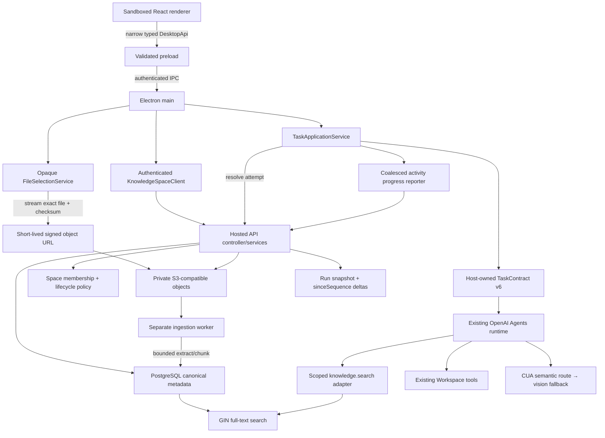

# Plan: Database-Backed Knowledge Spaces, Activities, and Evidence-Based Insights

## Summary

Generalize the proposed course pack into a **Knowledge Space**: a database-canonical, role-aware container for reusable knowledge, versioned activities, groups, live/async/hybrid runs, private participant attempts, and evidence-backed facilitator insights.

The implementation must serve education without hard-coding education. A Space can represent a class, training program, workshop, onboarding track, simulation, field procedure, research program, or team playbook. An **Activity** can represent an assignment, lab, case, drill, exercise, work order, or guided task. A **Group** can represent a class, cohort, team, or workshop. The stable product terms are therefore Space, Activity, Run, Participant, Facilitator, Attempt, and Work Session.

Folders and uploads are inputs to a Space, not the Space itself. PostgreSQL is the source of truth for metadata, permissions, versions, schedules, attempts, and insights. A private S3-compatible object store holds file bytes. Extracted bounded text chunks live in PostgreSQL behind full-text search. There is no `trocode.space.yaml` requirement, no folder-as-database behavior, and no Firebase dependency.

An activity launch combines two independent kinds of context:

1. **Pinned activity context** from the hosted API: the published instructions, guidance policy, rubric criteria, relevant source catalog, and compact prior-attempt progress.
2. **Fresh work context** from TroCode's existing tools: a trusted local Workspace folder or the current browser/editor surface through CUA, with the semantic CUA fast path used when it is available and the existing screenshot path retained as fallback.

Books and uploaded content are never injected wholesale into the model context. The agent receives a small source catalog and a scoped, read-only `search_activity_knowledge` tool. This keeps startup fast, makes citations possible, and prevents a large course library from degrading model performance.

Facilitator insights report observable evidence such as progress state, explicit help requests, validation outcomes, hint depth, and bounded agent-produced evidence candidates. They must not silently conclude that a participant “does not understand” a topic, assign a grade, stream a participant's screen, or upload local work. Every inferred support need remains labeled as a hypothesis with provenance and confidence.

## Metadata

- **Complexity**: XL
- **Source**: Customer discovery call and the follow-up product requirements in this thread
- **Research date**: 2026-08-19
- **Estimated files**: 58-72 files across hosted API, migrations, ingestion worker, Electron main/preload, task contracts/tools, renderer, tests, deployment, and documentation
- **Recommended delivery**: Seven mergeable gates described below, all behind a server capability flag until the end-to-end path passes security and load gates
- **Confidence**: 8/10. The existing hosted API, Electron trust boundaries, task runtime, Workspace selection, CUA observation path, and renderer were traced. The primary remaining uncertainty is extraction quality across real customer PDFs and the operational choice of S3-compatible provider.
- **Database baseline**: The hosted API already uses Railway PostgreSQL and idempotent ordered SQL migrations. Keep that system; do not add Firebase.
- **Search baseline**: PostgreSQL full-text search with the `simple` configuration. Define an interface so hybrid/vector search can be evaluated later without changing the domain model.
- **Object-storage baseline**: Private S3-compatible bucket accessed only by the hosted API. Desktop receives short-lived exact-object signed URLs in trusted main-process memory only.
- **Navigation note**: `docs/CODEX-NAVIGATION-GUIDE.md`, required by the repository supplement, is absent at this baseline. Use the mandatory reading list in this PRP until it is restored.
- **Worktree note**: The worktree already contains user-owned CUA semantic-fast-path edits and an untracked CUA PRP. Preserve them. Do not reset or rewrite `package*.json`, `src/main/agent/agent-contracts.ts`, `src/main/agent/execution-contracts*`, or `src/main/cua/cua-*` without first reconciling their current diff.

---

## Outcome and Release Gates

The feature is complete only when the following outcomes are demonstrated with automated tests and a packaged desktop smoke test.

| Outcome | Release gate |
|---|---|
| General reusable container | A user can create a Space with a neutral type and use it for education or a non-education fixture without branching domain logic on `type` |
| First-class content | An owner/facilitator can select files or a folder, preview eligible files without exposing local paths to the renderer, upload them, and see `ready` or a safe per-file failure |
| Database canonicality | A second signed-in device can open the same Space, activities, and assignments without the original local folder; no feature behavior depends on a manifest |
| Version safety | Publishing Activity v1 and then editing/publishing v2 never changes v1 attempts or runs; every attempt pins one immutable version |
| In-class delivery | A facilitator can open a live run for at least 200 assigned participants, and concurrent starts create exactly one private attempt per participant |
| After-class delivery | A participant can continue the same attempt in a new Work Session after the live phase, retaining bounded prior progress without resuming a stale model or CUA session |
| Fast launch | Excluding model/CUA initialization, `start/continue attempt → compact launch context` has p95 <= 500 ms under the 200-participant load fixture |
| Knowledge retrieval | Ready text/PDF sources are searchable with source title and locator; scoped search p95 <= 400 ms for the release corpus and output is <= 12,000 characters |
| Current-screen grounding | A current-surface activity captures one fresh semantic observation when the CUA fast path is available, otherwise one existing desktop observation; activity code never directly identifies or controls apps |
| Workspace grounding | A workspace activity uses the selected canonical root and the existing root-confined tools; no local file is uploaded unless the user explicitly submits it |
| Useful insights | The run dashboard shows assignment/attempt state, help queue, and evidence-backed concept patterns with provenance; it never emits ungrounded “understands/does not understand” labels |
| Privacy and isolation | Participants cannot read draft activities, other attempts, private artifacts, evidence, or facilitator dashboards; facilitators cannot read unsubmitted local workspace content or screenshots |
| No performance regression | Normal non-activity tasks receive no Space tools or context and pass the existing CUA, policy, lifecycle, budget, and package suites unchanged |

## User Stories

### Space owner or facilitator

As a facilitator, instructor, manager, or program owner, I can create a reusable Space, upload reference material and starter files, write an activity with a guidance policy and optional rubric, publish an immutable version, assign it to a group for a live, async, or hybrid run, and see who needs support without watching every screen.

### Participant

As a participant, learner, employee, or workshop attendee, I can open an assigned activity, understand what I need to do, choose or prepare the relevant work environment, ask TroCode for help grounded in the activity and my current browser/editor, stop, and continue later in a fresh Work Session without exposing unrelated files.

### Independent user

As an individual user, I can create a Space and assign an activity to myself. The workflow does not require a teacher, classroom, or group.

## Product Vocabulary and Stable Hierarchy

| Product term | Meaning | Education example | General example |
|---|---|---|---|
| Knowledge Space | Durable container for people, sources, activities, and history | Python Foundations | Customer Onboarding |
| Source | One logical uploaded or folder-snapshotted file with immutable versions | Lesson PDF | Support playbook |
| Activity | Reusable task definition with instructions and policies | Loop debugging assignment | Incident response drill |
| Activity Version | Immutable published snapshot | Assignment v2 | Drill v4 |
| Group | Named set of participants | Section A | New-hire cohort |
| Run | Scheduled delivery of one Activity Version | Today's lab | August onboarding run |
| Attempt | One participant's private durable work record for a Run | Alice's lab attempt | Sam's drill attempt |
| Work Session | One bounded TroCode task inside an Attempt | In-class session | Follow-up session |
| Facilitator | Owner or delegated operator | Teacher/TA | Manager/coach |
| Participant | Person doing assigned work | Student | Trainee/employee |

The canonical hierarchy is:

```text
Knowledge Space
├── Library (versioned Sources)
├── People
│   └── Groups
└── Activities
    └── Activity Version
        └── Run (live | async | hybrid)
            └── Assignment
                └── Attempt
                    ├── Work Sessions
                    ├── Evidence
                    └── Artifacts / Submission
```

## Explicit Product Decisions

### No manifest in the MVP

Do not create, detect, or require `trocode.space.yaml`.

A local manifest cannot safely be authoritative for multi-user roles, immutable publication, assignment schedules, attempts, consent, insight visibility, concurrent updates, or cross-device uploads. The existing hosted PostgreSQL is already the correct authority. Folder import captures a point-in-time set of eligible files; it does not turn the folder into a hidden database.

A future import/export command may serialize a portable representation generated from PostgreSQL, but it must remain a transfer format with explicit conflict handling—not a second source of truth.

### Guidance policy and rubric are different

- **Guidance policy** controls how TroCode helps: Socratic questions, guided debugging, direct assistance, allowed hint depth, and answer-reveal behavior.
- **Rubric** defines observable completion/evaluation criteria.

Neither grants desktop, filesystem, network, upload, submission, or approval authority. Only the trusted host policy can grant those operations.

### One attempt, multiple Work Sessions

A live class is not one shared model session. Every participant receives a private Attempt. A hybrid run opens during the live phase and remains continuable afterward. Each continuation starts a new bounded Work Session and receives a compact prior-progress summary. Do not persist or restore old CUA handles, raw model sessions, screenshots, or unsaved editor state across Work Sessions.

### Evidence, not mind reading

The system may say:

> Possible support need: loop termination. Evidence: two explicit help requests and three failed criterion-C2 validations across two sessions.

It must not say:

> This participant does not understand loops.

Automatic grading, diagnosis, and psychological profiling are out of scope.

---

## Scope

### In scope

- Create, list, open, rename, archive, and self-own a Knowledge Space.
- Space roles: `owner`, `facilitator`, and `participant`.
- Groups, membership, expiring/revocable join codes, and group snapshots at assignment time.
- Upload regular files or import a folder snapshot through trusted Electron main.
- Virtual folder-style paths in the Space library without coupling to local paths.
- Supported extraction for UTF-8 text, Markdown, common code/config/data formats, and text-bearing PDFs.
- Private S3-compatible object storage, checksum-bound signed upload, verification, and bounded ingestion jobs.
- PostgreSQL full-text indexing and attempt-scoped knowledge search with citations.
- Draft Activity editor, explicit publish, immutable Activity Versions, source roles, guidance policy, rubric criteria, and launch target.
- Live, async, and hybrid Runs with scheduled/open/closed state and explicit assignments.
- Idempotent private Attempts and multiple Work Sessions.
- Existing-folder Workspace launch, current-surface/CUA launch, and an optional explicitly confirmed starter-folder materialization path.
- Explicit help requests, attempt state, submission state, operational evidence, opt-in inferred evidence candidates, and facilitator dashboard polling.
- Participant visibility into the insight policy before starting.
- Feature flags, content-free operational metrics, load fixtures, safe rollback, and updated security/architecture docs.

### Explicitly out of scope

- Required or automatically discovered manifests.
- Firebase or another new database authority.
- URL crawling, LMS integrations, Google Drive/Notion/SharePoint connectors, SCORM, or LTI in the first delivery.
- Vector embeddings or a dedicated vector database in the first delivery.
- OCR for scanned PDFs/images, Office document extraction, audio/video transcription, archives, executable installers, macros, or password-protected files.
- Automatic execution of uploaded starter code.
- Automatic grades, mastery scores, disciplinary recommendations, or mental-state claims.
- Silent capture of participant screens, browser history, local files, unsaved buffers, or task transcripts.
- A shared collaborative coding session or facilitator remote control.
- WebSocket infrastructure. A bounded `sinceSequence` poll is sufficient for the first in-class release.
- Replacing CUA, the Agents SDK harness, Workspace mode, or the exact-approval path.
- Browser or VS Code extension work; those remain independent adapters after the CUA semantic path is measured.

---

## UX: Before and After

### Before

- The main product navigation has Agent, History, Insights, and Settings.
- “Live activity” means the current task event stream, not a facilitator-led class run.
- A user may select one trusted Workspace folder for a task, but the folder is in-memory local authority only.
- Insights summarize the current user's task lifecycle/tool usage and cannot represent a group or an assigned activity.
- There is no hosted reusable content library, publish step, group assignment, attempt, or submission model.

### After: creator/facilitator flow

1. Choose **Spaces → New Space**.
2. Name the Space; optionally label its purpose. Type is display metadata only.
3. In **Library**, choose **Upload files** or **Import folder snapshot**.
4. Review the eligible-file preview, excluded-file reasons, destination virtual folder, total size, and content roles. Confirm once.
5. See per-file `uploading → processing → ready` progress. A failed source does not block other files.
6. In **Activities**, create a draft with objective, instructions, guidance policy, optional criteria, and launch target.
7. Attach ready Source Versions as `reference`, `template`, `supporting_material`, or `rubric_evidence`. Raw uploaded text remains untrusted evidence.
8. Review the publish summary and publish immutable v1.
9. Create a Run: select group/people, mode (`live`, `async`, `hybrid`), opening/due/live-end times, continuation/submission settings, and insight policy.
10. Open the run. The dashboard shows not started, working, needs help, ready for review, submitted, and completed, plus evidence-backed concept patterns.

### After: participant flow

1. Open **Spaces → Assigned** and select an activity.
2. See objective, due state, source list, guidance style, insight policy, and what may be visible to the facilitator.
3. Choose **Use current screen**, **Use existing folder**, or **Create from starter** when allowed.
4. Start or continue. TroCode shows an Activity chip next to the current task.
5. Ask normal questions such as “Why is this test failing?” TroCode searches only the pinned activity sources as needed and grounds current work through Workspace or CUA.
6. Choose **I need help** at any time. The facilitator sees the explicit request without receiving the screen or full conversation.
7. Leave and continue later. A new Work Session is created under the same Attempt.
8. Explicitly upload a submission if the Run requires one. Local files are never submitted automatically.

### Navigation changes

- Add **Spaces** as a first-class view.
- Keep the existing personal **Insights** page for task/runtime analytics.
- Put facilitator insights inside a **Run dashboard**; do not overload personal Insights.
- Rename the existing conditional sidebar label **Live activity** to **Current task** to avoid collision with live Runs.
- Use a discriminated navigation state instead of adding more string branches to the current `ActiveView` union.

---

## Existing-System Evidence and Patterns to Mirror

### Sandboxed renderer and narrow preload

`src/index.ts:1680` already creates a sandboxed, context-isolated main window:

```ts
webPreferences: {
  contextIsolation: true,
  nodeIntegration: false,
  preload: MAIN_WINDOW_PRELOAD_WEBPACK_ENTRY,
  sandbox: true,
  webSecurity: true,
}
```

Keep file paths, checksums, signed URLs, object keys, session tokens, and source bytes in Electron main. Extend the typed `DesktopApi` in `src/shared/desktop-api.ts:40` and parse both IPC request and response in `src/preload.ts:51`. Never expose a generic IPC or API client.

### Opaque local selection pattern

`src/main/workspace/workspace-selection-service.ts:22` is the model for trusted selection:

```ts
const canonicalPath = await this.canonicalDirectory(selectedPath);
const identity: WorkspaceIdentity = {
  selectionId: randomUUID(),
  canonicalPath,
  displayName: path.basename(canonicalPath) || canonicalPath,
  selectedAt: this.now().toISOString(),
};
this.selections.set(identity.selectionId, identity);
```

The renderer-facing `WorkspaceSelectionSchema` deliberately omits `canonicalPath` in `src/shared/contracts.ts:515`. File/folder upload selection must mirror this: opaque selection IDs, safe display metadata, revalidation at use time, and no renderer-visible canonical path.

### Authenticated IPC pattern

`src/main/ipc/register-ipc.ts:284` checks the sender and membership before invoking the selection service:

```ts
ipcMain.handle(IPC_CHANNELS.selectWorkspace, async (event) => {
  await assertMembershipAuthorizedSender(event, mainWindow, services);
  return services.workspaceSelectionService.select();
});
```

Every Space IPC handler must follow the same sender and membership boundary, then parse its exact schema.

### Task compilation point

`src/main/application/task-application-service.ts:22` is the only correct place to convert an untrusted renderer request into trusted task scope:

```ts
const request = SubmitTaskRequestSchema.parse(input);
const workspace = request.workspaceSelectionId
  ? await this.options.workspaceSelectionService?.resolve(
      request.workspaceSelectionId,
    )
  : null;
const submitted = this.runtime.submit(request, {
  autonomyMode: preferences?.autonomyMode ?? 'balanced',
  executionProfile: request.executionProfile,
  runtimeKind: 'openai_agents',
  workspace,
});
```

Add only an `activityAttemptId` to the renderer request. Resolve the complete Activity context from the authenticated hosted API in this service. Never accept instructions, rubric, roles, knowledge scope, or insight scope from the renderer or model.

### Current work context remains independent

`src/main/agent/openai-agents-runtime.ts:121` already adds a trusted initial desktop observation beside the user request. `src/main/agent/execution-coordinator.ts:866` captures initial desktop context only when needed, and Workspace mode prefers direct tools. Extend that input with a separate trusted Activity envelope. Do not collapse current-screen data and course/program data into one source.

The in-progress CUA semantic work extends `DesktopObservationSchema` at `src/main/agent/execution-contracts.ts:83` with route, surface, and opaque elements. If that work lands first, a current-surface Activity should request the semantic route. If it does not, the same Activity must remain correct through the existing `observe_desktop` fallback.

### Hosted API transaction and idempotency pattern

`services/api/src/agent-turn-repository.mjs:32` uses a transaction and advisory lock before checking an idempotency key:

```js
await client.query('BEGIN');
await client.query(
  'SELECT pg_advisory_xact_lock(hashtextextended($1, 0))',
  [input.userId],
);
const existing = await client.query(/* user + clientTurnId */);
```

Mirror this for publish, Run creation, Attempt creation, Work Session attachment, upload completion, submission, and evidence creation. Every consequential desktop request supplies a client UUID so an unknown response can be reconciled by read, not blindly repeated.

### Hosted route and log pattern

`services/api/src/server.mjs:297` is a raw Node HTTP handler. It authenticates fixed routes, bounds bodies, rejects browser origins, returns generic errors, and emits only method/path/status/duration at `services/api/src/server.mjs:868`. Extract reusable HTTP primitives before adding the Space controller; do not grow the current 800-line route chain with every new endpoint.

### Idempotent migration pattern

`services/api/src/migrate.mjs:3` executes every numbered SQL file in filename order on startup. It has no migration ledger. New SQL must therefore be idempotent, and `services/api/test/migrate.test.mjs:6` must be updated from six to nine ordered migrations.

### Existing Insights is not facilitator insight

`src/renderer/InsightsPage.tsx:64` and `src/renderer/insights.ts:88` compute task completion, event counts, tool usage, and streaks from the current user's history. Leave this behavior intact. New cohort/run projections belong in separate pure reducers and pages.

---

## External Research and Decisions

Use only these official references during implementation:

- [AWS SDK for JavaScript v3 S3 presigner](https://docs.aws.amazon.com/AWSJavaScriptSDK/v3/latest/Package/-aws-sdk-s3-request-presigner/) shows `PutObjectCommand` plus `getSignedUrl` and how to sign checksum headers.
- [AWS SDK JavaScript S3 checksum guidance](https://docs.aws.amazon.com/sdk-for-javascript/v3/developer-guide/s3-checksums.html) documents upload integrity checks and precomputed SHA-256 checksums.
- [Amazon S3 HeadObject](https://docs.aws.amazon.com/AmazonS3/latest/API/API_HeadObject.html) requires checksum mode to retrieve stored checksums. Completion must verify exact key, size, and checksum before queuing ingestion.
- [PostgreSQL text-search controls](https://www.postgresql.org/docs/current/textsearch-controls.html) documents `to_tsvector`, ranking, and `websearch_to_tsquery`; the latter accepts user-style input without query-syntax exceptions.
- [PostgreSQL preferred text-search indexes](https://www.postgresql.org/docs/17/textsearch-indexes.html) identifies GIN as the preferred full-text index type.
- [PostgreSQL SELECT locking](https://www.postgresql.org/docs/16/sql-select.html) explicitly supports `SKIP LOCKED` for queue-like tables. Use it only for ingestion claims, not general reads.
- [PDF.js examples](https://mozilla.github.io/pdf.js/examples/) and [PDF.js API](https://mozilla.github.io/pdf.js/api/) document `getDocument` and page text extraction, including Node examples.
- [Electron dialog](https://www.electronjs.org/docs/latest/api/dialog) places file/folder selection in main and supports multi-selection.
- [Electron IPC guidance](https://www.electronjs.org/docs/latest/tutorial/ipc) warns against exposing the full renderer IPC surface; keep narrow preload functions.
- [Node 24 crypto](https://nodejs.org/download/release/v24.16.0/docs/api/crypto.html) includes streaming SHA-256 file hashing; do not buffer a 25 MiB file solely to hash it.

### Why PostgreSQL full-text search first

- It uses the deployed database and avoids a new availability/cost boundary.
- `simple` tokenization retains code identifiers and is language-neutral enough for the initial mixed code/content corpus.
- A GIN-indexed `tsvector` supports the bounded top-k retrieval required for activity help.
- The search service is behind an interface, so later evaluation can add embeddings, reciprocal-rank fusion, or language-specific configurations without changing Spaces, Sources, Activities, or Attempts.

Do not claim semantic equivalence or mastery from lexical search. The UI should say “matching sources,” and agent citations must identify the source and locator.

---

## Target Architecture



### Ownership boundaries

| Component | Owns | Must not own |
|---|---|---|
| PostgreSQL | Canonical metadata, RBAC, published versions, schedules, attempts, evidence, chunk index | Original local paths, screenshots, CUA refs, model sessions |
| Object store | Immutable bytes addressed by opaque keys | Authorization logic, public browsing, database state |
| Ingestion worker | Claim job, download bounded object, sniff/extract/chunk, atomically index, sanitize errors | HTTP auth, facilitator policy, model calls |
| Electron main | Native selection, path revalidation, file hashing/streaming, API token, signed URLs, launch orchestration | Canonical Space state, hidden renderer path authority |
| Renderer | Display typed data and collect explicit user choices | File paths, tokens, object keys, generic network/IPC |
| Activity service | Membership, publish/run/attempt transitions, compact launch context | Desktop actions, local filesystem authority |
| Task runtime | One bounded Work Session with fixed tools, approvals, budgets, and current observation | Group management, grades, cross-attempt persistence |
| Insight service | Evidence projection, thresholds, provenance, suggestions | Psychological diagnosis, automatic grading, raw conversation storage |

---

## Canonical Data Model

Use three new idempotent hosted migrations.

### `007_knowledge_spaces.sql`

Create:

- `knowledge_spaces(id UUID, owner_id TEXT, name, description, purpose_label, status, created_at, updated_at)`
- `knowledge_space_members(space_id, user_id, role, created_at)` with role check `owner|facilitator|participant`
- `knowledge_groups(id, space_id, name, created_by, created_at, updated_at)`
- `knowledge_group_members(group_id, user_id, created_at)`
- `knowledge_group_invites(id, group_id, code_digest BYTEA UNIQUE, max_uses, used_uses, expires_at, revoked_at, created_by, created_at)`

Important constraints:

- Creating a Space transactionally creates the owner's member row.
- A Space must retain exactly one current owner; ownership transfer is a dedicated transaction, not two independent role edits.
- Group membership implies participant membership in the parent Space.
- Join codes are random and shown only on creation. Store only HMAC-SHA256 digest using a server secret, mirroring device/access-code patterns.
- Every list uses keyset pagination and an explicit maximum page size of 100.

### `008_knowledge_sources.sql`

Create:

- `knowledge_sources(id, space_id, created_by, origin_kind, visibility, virtual_path, title, status, created_at, updated_at)`
- `knowledge_source_versions(id, source_id, version_number, object_key UNIQUE, sha256_hex, byte_size, media_type, status, upload_expires_at, error_code, created_at, ready_at)`
- `knowledge_chunks(id BIGSERIAL, source_version_id, ordinal, locator JSONB, content TEXT, search_vector TSVECTOR GENERATED ALWAYS AS (to_tsvector('simple', content)) STORED)`
- `knowledge_ingestion_jobs(id, source_version_id, kind, status, attempt_count, available_at, leased_until, last_error_code, created_at, updated_at)`

Required indexes:

```sql
CREATE UNIQUE INDEX IF NOT EXISTS knowledge_sources_space_path_idx
  ON knowledge_sources(space_id, lower(virtual_path))
  WHERE status = 'active';

CREATE INDEX IF NOT EXISTS knowledge_chunks_search_idx
  ON knowledge_chunks USING GIN(search_vector);

CREATE INDEX IF NOT EXISTS knowledge_jobs_claim_idx
  ON knowledge_ingestion_jobs(status, available_at, leased_until);
```

Status transitions:

```text
awaiting_upload → queued → processing → ready
       │             │          └──────→ failed
       └────────────→ expired
       └────────────→ rejected
```

Use compare-and-set updates with the expected prior state. `complete upload` is idempotent for the same checksum and conflicts for a different object fact. A ready version is immutable.

### `009_activities_and_insights.sql`

Create:

- `activities(id, space_id, title, status, draft_revision, draft_definition JSONB, created_by, created_at, updated_at)`
- `activity_draft_sources(activity_id, source_version_id, role, virtual_path)`
- `activity_versions(id, activity_id, version_number, definition JSONB, published_by, published_at)`
- `activity_version_sources(activity_version_id, source_version_id, role, virtual_path)`
- `activity_runs(id, activity_version_id, group_id NULL, mode, pacing, status, opens_at, live_ends_at, due_at, continuation_policy, submission_policy, insight_policy, created_by, created_at, updated_at)`
- `activity_run_assignments(run_id, user_id, assigned_at, status)`
- `activity_attempts(id, run_id, user_id, activity_version_id, status, insight_policy_acknowledged_at, insight_policy_version, started_at, submitted_at, completed_at, updated_at)`
- `activity_work_sessions(id, attempt_id, task_id UUID UNIQUE, status, started_at, ended_at, progress_summary JSONB, created_at, updated_at)`
- `attempt_artifacts(id, attempt_id, source_version_id, role, visibility, submitted_at, created_at)`
- `activity_evidence(id, attempt_id, work_session_id NULL, client_evidence_id UUID, category, provenance, criterion_id NULL, confidence SMALLINT, details JSONB, created_at)`
- `activity_run_events(sequence BIGSERIAL, run_id, attempt_id NULL, event_type, created_at)`

Required uniqueness:

- `(activity_id, version_number)`
- `(run_id, user_id)` on assignments
- `(run_id, user_id)` on attempts
- `task_id` on Work Sessions
- `(attempt_id, client_evidence_id)` on evidence

Bound every JSONB field with an `octet_length(...::text)` check and parse it before insert. Store only fixed-schema definitions and evidence; do not use JSONB as an unbounded event dump.

The Run creation request must contain exactly one target: a `groupId` or an explicit bounded `userIds` list. A self-owned independent Space creates a Run assigned to its owner through the same explicit-user path; it does not require a synthetic class/group.

### Activity definition contract

The API and desktop response schemas must agree on this bounded semantic shape:

```ts
const ActivityDefinitionSchema = z.object({
  title: z.string().trim().min(1).max(200),
  objective: z.string().trim().min(1).max(2_000),
  instructions: z.string().trim().min(1).max(24_000),
  launchTarget: z.discriminatedUnion('kind', [
    z.object({ kind: z.literal('current_surface') }),
    z.object({
      kind: z.literal('workspace'),
      starter: z.enum(['none', 'template_sources']),
    }),
  ]),
  guidancePolicy: z.object({
    mode: z.enum(['socratic', 'guided_debugging', 'direct_assistance']),
    answerReveal: z.enum(['never', 'after_attempt', 'allowed']),
    maxHintLevel: z.number().int().min(0).max(5),
  }),
  criteria: z.array(z.object({
    id: z.string().regex(/^[a-z][a-z0-9_-]{0,63}$/),
    title: z.string().trim().min(1).max(200),
    description: z.string().trim().min(1).max(2_000),
    conceptTags: z.array(z.string().trim().min(1).max(80)).max(12),
    points: z.number().int().min(0).max(10_000).nullable(),
  })).max(50),
  completionPolicy: z.object({
    requiresSubmission: z.boolean(),
    participantMayMarkReady: z.boolean(),
  }),
});
```

The `points` field is descriptive. TroCode does not calculate or publish a grade in this PRP.

### Source roles

Use role on the Activity/Artifact link, not as a global property of the file:

- `reference`: searchable supporting knowledge
- `supporting_material`: participant-visible attachment
- `template`: immutable starter file available for explicit materialization
- `rubric_evidence`: source that explains a criterion but does not replace the structured rubric
- `working_artifact`: participant-private upload
- `submission`: explicitly submitted artifact visible to facilitator

An uploaded document cannot silently become trusted instructions or rubric. “Use this as instructions/rubric” creates a draft proposal that the facilitator must inspect and publish.

---

## Permissions and Visibility Matrix

| Operation | Owner | Facilitator | Participant |
|---|---:|---:|---:|
| View Space/library ready sources | Yes | Yes | Published/assigned only |
| Edit Space or transfer ownership | Yes | No | No |
| Manage facilitator membership | Yes | No | No |
| Manage groups/participants | Yes | Yes | No |
| Upload Space/Activity sources | Yes | Yes | Attempt-private only |
| Edit/publish Activity | Yes | Yes | No |
| Create/open/close Run | Yes | Yes | No |
| Start Attempt | If assigned | If assigned | If assigned and Run permits |
| Read draft Activity | Yes | Yes | No |
| Read another participant's Attempt | Yes | Yes | No |
| Read unsubmitted working artifacts | No by default | No by default | Own only |
| Read submitted artifacts | Yes | Yes | Own only |
| View individual evidence/help queue | Yes | Yes | Own only |
| View cohort aggregate | Yes | Yes | No |

Every repository query must include both authenticated `user_id` and Space/Attempt scope. Do not fetch a row and authorize it later in renderer code.

---

## Upload and Ingestion Design

### Local selection

Create `FileSelectionService` in Electron main, mirroring `WorkspaceSelectionService`.

- `selectFiles()` uses `dialog.showOpenDialog({ properties: ['openFile', 'multiSelections'] })`.
- `selectFolderSnapshot()` uses a separate `openDirectory` dialog for Windows/Linux compatibility.
- Canonicalize each path with `realpath`, require a regular file, record `size`, `mtimeMs`, and a private canonical path behind an opaque selection ID.
- Folder walk limits: 100 eligible files per batch, 25 MiB per file, 500 MiB configured Space quota, depth 25, no symlinks.
- Exclude `.git`, `node_modules`, OS metadata, hidden files by default, `.env*`, private-key extensions, credential/config vaults, sockets, devices, and archives. Return only display-relative paths and fixed exclusion reasons.
- Before hash/upload, re-run `realpath`/`lstat`/`stat` and compare size/mtime. If changed, invalidate that file and ask the user to review the preview again.

### Exact signed-upload flow

1. Main streams the file through SHA-256 and rechecks its stat.
2. Main calls `POST /v1/knowledge-spaces/:spaceId/source-upload-batches` with `clientBatchId` and bounded metadata. The API rechecks role, quota, path uniqueness, media allowlist, and batch limits.
3. The API creates Source/Version rows in `awaiting_upload`, allocates an opaque unique object key, and returns a short-lived signed PUT that binds content length, media type, and `x-amz-checksum-sha256`.
4. Main streams the exact file directly to the signed URL with maximum concurrency 3. Signed URLs never cross preload.
5. Main calls `POST /v1/knowledge-source-versions/:id/complete` with the same client operation ID.
6. The API executes `HeadObject` with checksum mode, verifies exact object key, size, and checksum, then transactionally transitions to `queued` and inserts one ingestion job.
7. The worker claims jobs with `FOR UPDATE SKIP LOCKED`, downloads only the expected object, sniffs magic bytes, extracts bounded text, chunks it, atomically replaces chunks, and marks the version `ready`.
8. A failed file gets a stable safe error code such as `unsupported_type`, `checksum_mismatch`, `encrypted_pdf`, `extract_timeout`, or `content_limit`. Do not return parser stacks.

Object keys must be immutable UUID-derived paths; never reuse a key. Signed URL overwrite semantics are therefore harmless even if a stale URL is replayed.

### Extractor limits

- UTF-8 text/code/data: at most 2,000,000 extracted characters.
- PDF: at most 500 pages, 2,000,000 extracted characters, 30 seconds of worker time, and the configured byte limit.
- Chunk target: 1,200 characters with 150-character overlap, preserving file path plus page or line locator.
- At most 5,000 chunks per source version.
- Never execute macros, code, HTML scripts, embedded JavaScript, external PDF references, or archive contents.
- Unsupported files may remain participant-visible attachments only if the product has a safe download path; they are not searchable.

### Worker process

Run extraction in `services/api/src/ingestion-main.mjs`, not in the HTTP process. Add `npm run start:worker`. A separate Railway worker service can share the code, Postgres, bucket, and config.

Job claim rules:

- Lease at most two jobs per worker.
- Reclaim only `processing` jobs whose lease expired.
- Three attempts with bounded exponential backoff.
- Chunk replacement and final status transition occur in one transaction.
- A worker crash may repeat pure extraction, but never creates a second Source Version or publishes an Activity.

### Retention and deletion

- Removing a Source immediately hides it from new drafts/search but does not invalidate a published Activity Version, Attempt, or Submission that pins its ready version.
- A removed, unreferenced Source Version enters a recoverable retention window. After the configured window, enqueue a `delete_object` job, delete chunks and object, then retain only a content-free tombstone needed for audit/idempotency.
- A participant may remove an unsubmitted private artifact. A submitted artifact follows the Run's documented retention policy and requires an explicit withdrawal/review path.
- Run creation snapshots the policy version shown to participants. `evidence_candidates` cannot be recorded until the Attempt stores an acknowledgement timestamp for that exact policy version.
- The production rollout must choose and document retention periods for Sources, Runs/Attempts, submissions, evidence, upload failures, expired signed uploads, and sanitized local sync records. Do not ship with “forever” as an undocumented default.
- Object garbage collection is reference-aware and worker-owned. Never issue an object delete directly from an HTTP timeout-prone request.

The chosen S3-compatible provider must pass a conformance fixture for signed checksum headers and checksum-returning HEAD. If it cannot, it is not compatible with this design; do not silently weaken completion verification.

---

## API Contract

Extract `HttpError`, bounded body parsing, and JSON response helpers from `server.mjs` into `http-primitives.mjs`. Add a `KnowledgeSpaceHttpController` that receives the already-authenticated session user and access plan. The root server retains the public/auth/provider routes and delegates known Knowledge/Activity prefixes.

### Space and groups

- `GET /v1/knowledge-spaces?cursor=&limit=`
- `POST /v1/knowledge-spaces` — `{ clientRequestId, name, description, purposeLabel }`
- `GET /v1/knowledge-spaces/:spaceId`
- `PATCH /v1/knowledge-spaces/:spaceId` — owner only, optimistic `expectedUpdatedAt`
- `GET|POST /v1/knowledge-spaces/:spaceId/groups`
- `POST /v1/knowledge-groups/:groupId/invites`
- `POST /v1/knowledge-group-invites/redeem`
- `GET /v1/knowledge-spaces/:spaceId/members`

### Sources

- `GET /v1/knowledge-spaces/:spaceId/sources?cursor=&limit=&pathPrefix=`
- `POST /v1/knowledge-spaces/:spaceId/source-upload-batches`
- `POST /v1/knowledge-source-versions/:versionId/complete`
- `DELETE /v1/knowledge-sources/:sourceId` — soft-remove from new use; return conflict if immutable retention rules prevent purge
- `GET /v1/activity-attempts/:attemptId/knowledge-search?q=&limit=` — server derives pinned versions; the client cannot submit source IDs
- `POST /v1/knowledge-source-versions/:versionId/download-ticket` — main-process use only, authorized and short lived

### Activities and Runs

- `POST /v1/knowledge-spaces/:spaceId/activities`
- `GET|PATCH /v1/activities/:activityId/draft` — PATCH includes `expectedDraftRevision`
- `PUT /v1/activities/:activityId/draft-sources`
- `POST /v1/activities/:activityId/publish` — `{ clientPublishId, expectedDraftRevision }`
- `POST /v1/activity-versions/:activityVersionId/runs`
- `POST /v1/activity-runs/:runId/transitions` — pure allowed transition plus expected status
- `GET /v1/activity-runs/:runId/dashboard?sinceSequence=`

### Attempts and Work Sessions

- `PUT /v1/activity-runs/:runId/my-attempt` — idempotent `(run,user)` creation
- `GET /v1/activity-attempts/:attemptId/launch-context`
- `PUT /v1/activity-attempts/:attemptId/work-sessions/:taskId`
- `PATCH /v1/activity-work-sessions/:workSessionId` — compare-and-set terminal/progress update
- `POST /v1/activity-attempts/:attemptId/help-requests`
- `POST /v1/activity-attempts/:attemptId/evidence`
- `POST /v1/activity-attempts/:attemptId/submissions`

Every mutation has an idempotency key in its exact body or path. After a network-unknown response, the desktop reads by that key before offering retry.

---

## Five End-to-End Repository Traces

### Trace 1 — Create and open a Space

`SpacesPage` → typed preload request → authenticated IPC → `KnowledgeSpaceClient` with opaque device token → `KnowledgeSpaceHttpController` → `KnowledgeSpaceService` role/lifecycle policy → `PostgresKnowledgeSpaceRepository` transaction → parsed renderer response.

### Trace 2 — Import a folder snapshot

Renderer chooses import → main `FileSelectionService` opens native dialog/walks safe files → renderer receives opaque preview → explicit confirm → main hashes each file → API creates immutable Source Versions and signed PUTs → main streams direct to object storage → API HEAD verification → Postgres job → separate worker extraction/chunk/index → renderer polls typed per-file status.

### Trace 3 — Publish and open a group Run

`ActivityEditorPage` draft mutation with expected revision → API parses/authorizes → publish transaction snapshots definition and exact ready Source Versions → facilitator creates Run for group → repository bulk-snapshots assignments → pure transition opens Run → `activity_run_events` emits dashboard delta.

### Trace 4 — Start or continue participant work

`AttemptLaunchPage` acknowledges insight policy and chooses current surface/Workspace → idempotent Attempt API → `TaskApplicationService` resolves compact launch context → host creates TaskContract v6 and Work Session keyed by task ID → existing Agents runtime receives Activity envelope plus fresh Workspace/CUA context → scoped knowledge tool searches only pinned versions → sanitized progress reporter updates the Attempt.

### Trace 5 — Turn work into facilitator insight

Explicit help/host validation/optional bounded agent candidate → authenticated, Attempt-bound evidence endpoint → repository inserts idempotent evidence plus Run sequence event → `InsightService` applies deterministic provenance/threshold rules → `FacilitatorRunPage` fetches initial projection then `sinceSequence` deltas → facilitator sees evidence and an explainable next action, never raw screen/conversation.

### Rate and quota policy

Extend every entry in `services/api/src/plan-catalog.mjs` with server-owned values:

- `spaceCount`
- `spaceStorageBytes`
- `uploadFilesPerBatch`
- `uploadInitiatesPerMinute`
- `knowledgeQueriesPerMinute`
- `groupParticipants`
- `activeRuns`

The client may display remaining capacity but never supplies a limit.

---

## Activity Lifecycle and Pure Policies

Implement and unit-test pure transition functions before repositories/controllers.

### Activity

```text
draft → published
  └──→ archived
published → draft editing continues separately → next published version
published → archived
```

Publishing snapshots definition and draft source links in one transaction. Existing versions are immutable.

### Run

```text
scheduled → open → closed
scheduled ─────────→ cancelled
open ──────────────→ cancelled
```

- `live`: facilitator explicitly opens; close ends new starts unless policy permits continuation.
- `async`: opens by timestamp or explicit transition; self-paced until due/close.
- `hybrid`: live window is presentation metadata; the same Attempt remains continuable until due/close.
- Assignment rows snapshot target membership at Run creation/open. Later group changes do not silently rewrite the cohort.

### Attempt

```text
active ↔ needs_help
active | needs_help → ready_for_review → submitted → completed
active | needs_help | ready_for_review → withdrawn
```

The service enforces Run time/continuation policy. A participant cannot directly mark `completed` unless the definition explicitly permits self-completion; submission and facilitator completion are separate.

### Work Session

```text
starting → active → completed | blocked | failed | cancelled
```

`task_id` is the idempotent bridge to the local TaskRuntime. A new Work Session is required after terminal state.

---

## Task Contract, Knowledge Tool, and CUA Integration

### TaskContract v6

Add `AgentTaskContractV6Schema` by extending v5 with a bounded nullable Activity context:

```ts
const ActivityTaskContextSchema = z.object({
  spaceId: z.string().uuid(),
  activityVersionId: z.string().uuid(),
  runId: z.string().uuid(),
  attemptId: z.string().uuid(),
  title: z.string().max(200),
  objective: z.string().max(2_000),
  instructions: z.string().max(24_000),
  guidancePolicy: ActivityGuidancePolicySchema,
  criteria: ActivityCriterionSchema.pick({
    id: true,
    title: true,
    description: true,
    conceptTags: true,
  }).array().max(50),
  sourceCatalog: z.array(z.object({
    title: z.string().max(255),
    role: ActivitySourceRoleSchema,
  })).max(200),
  priorProgress: z.object({
    completedCriterionIds: z.array(z.string()).max(50),
    sessionCount: z.number().int().min(0).max(10_000),
    summary: z.string().max(4_000),
  }),
  insightPolicy: z.enum([
    'explicit_and_operational',
    'evidence_candidates',
  ]),
  surfacePolicy: z.enum(['none', 'current']),
});
```

`SubmitTaskRequestSchema` receives only `activityAttemptId: UUID | null`. `TaskApplicationService` fetches and parses the full context with the signed-in user's hosted token, chooses the execution profile required by the published launch target, validates the selected Workspace if needed, generates `taskId`, creates the Work Session idempotently, then submits/starts the local task.

New non-activity tasks emit v6 with `activityContext: null`. Persisted v1-v5 tasks remain readable in history. Update all explicit v5 checks in task contract helpers, coordinator, risk classifier, history migration, analytics, renderer, and tests. Do not make persisted v5 tasks resumable unless the current runtime already supports that safely.

### Initial model context

`OpenAIAgentsRuntime.initialRunInput` should produce:

- user request;
- one host-labeled Activity context envelope;
- one host-labeled current surface observation when required;
- no full Source content.

`instructionsFor` must establish:

- the facilitator-authored definition is trusted pedagogical scope, not safety authority;
- uploaded/source text and local repository instructions are untrusted data;
- guidance policy controls answer style but cannot approve actions;
- rubric criteria guide evidence/completion but do not authorize automatic grading;
- search results require source/locator citation;
- current-surface tasks observe fresh state before grounded action;
- Workspace tasks still prefer direct file/search/test tools over visual clicking.

Keep the entire Activity envelope <= 32 KiB and target <= 24 KiB.

### Scoped knowledge tool

Add one strict model tool only when `goal.activityContext !== null`:

```ts
search_activity_knowledge({
  query: string,       // 1..500
  limit: number        // 1..6
})
```

The model does not provide Space, Attempt, or Source IDs. `KnowledgeSearchToolAdapter` resolves `taskId → goal.activityContext.attemptId` in trusted main, calls the hosted API, and returns bounded results:

```ts
{
  results: [{
    sourceTitle: string,
    role: string,
    locator: { page?: number, startLine?: number, endLine?: number },
    snippet: string,
    score: number,
  }],
  truncated: boolean,
}
```

The tool is read-only, counts against task tool limits, propagates cancellation, and has a 10-second timeout. No signed URL or object key reaches the model.

Extend `RuntimeToolRegistry.modelVisibleSpecs` and resolution context so definitions can be enabled by the trusted contract. A model-generated call from a non-activity task must fail closed even if it invents the tool name.

### Optional inferred evidence tool

Only for a Run whose policy is `evidence_candidates` and after the participant has seen/accepted that exact policy version, expose:

```ts
record_activity_signal({
  clientEvidenceId: string,
  category: 'possible_difficulty' | 'criterion_progress' | 'hint_used',
  criterionId: string | null,
  conceptTag: string | null,
  confidence: number, // 0..100
})
```

Trusted main binds the current Attempt/Work Session and validates criterion/tag against the published definition. Limit to 20 candidates per Work Session. Store no quote, prompt, code, screenshot, free-form rationale, or hidden reasoning. Mark provenance `agent_candidate`. This is never a score and never changes Attempt state automatically.

Normalize it as a dedicated `record_activity_signal` proposed action and add a pure policy rule: the operation is available only for the pinned Attempt, matching acknowledged policy version, and exact criterion/tag allowlist. It is not action-free, a sensitive-action bypass, or a general hosted-write capability. Normal tasks and `explicit_and_operational` Runs never receive it.

### CUA and Workspace behavior

- `current_surface`: force one fresh initial computer observation. Prefer `browser_semantic`/`window_accessibility` from the CUA semantic fast path when merged; fall back through window/desktop vision. Activity services never inspect application IDs or CUA tokens.
- `workspace`: require a trusted selected folder or explicit starter materialization. No CUA session starts for pure Workspace activity work.
- Existing folder: reuse `WorkspaceSelectionService.resolve` and all current shell/apply-patch safety.
- Starter: participant explicitly selects an empty parent destination. Main downloads exact pinned template files, verifies each checksum, rejects traversal/symlinks/conflicts, writes into a staging directory, atomically renames to a new activity-named directory, and then trusts that directory as the Workspace. Never overwrite an existing tree and never auto-run contents.
- Submission: a separate explicit user action selects exact files, previews them, and uploads as `submission`; agent completion never triggers submission.

---

## Evidence and Facilitator Insights

### Evidence sources

| Evidence | Provenance | Default visibility | Interpretation |
|---|---|---|---|
| Participant presses “I need help” | `participant` | Facilitator + participant | Explicit support request |
| Attempt/Work Session state | `host` | Facilitator + participant | Operational progress only |
| Bounded test/validation result code | `host` | Facilitator + participant | Evidence for linked criterion, not general mastery |
| Hint level used | `host` | Facilitator + participant | Assistance pattern |
| Agent candidate | `agent_candidate` | Only if participant accepted policy | Hypothesis requiring corroboration |
| Facilitator note/criterion confirmation | `facilitator` | Facilitator; participant-visible if configured | Human review |

### Dashboard projection

The initial dashboard response contains:

- counts by assignment/attempt status;
- help queue ordered by explicit request time, then blocked duration;
- participant rows with last activity, session count, status, submitted state, and evidence counts;
- concept/criterion aggregates with sample size, evidence mix, and confidence band;
- current maximum `activity_run_events.sequence`.

Subsequent 5-second polls send `sinceSequence` and return deltas. Do not poll when the view is hidden. One facilitator poll serves the cohort; participant clients do not broadcast task events.

### Support suggestions

Use deterministic, explainable rules in a pure reducer, for example:

- Recommend a group clarification only when at least five participants and at least 30% of the active cohort have corroborated evidence on the same criterion/concept.
- Recommend individual follow-up for an explicit help request or repeated blocked sessions.
- Never aggregate fewer than five participants into a cohort pattern.
- Display the evidence counts and source types beside every suggestion.
- An `agent_candidate` alone may create “Review evidence,” never “Re-teach” or completion.

The facilitator may acknowledge or resolve help requests. That action is recorded; it does not alter model policy or participant work.

---

## Performance, Reliability, and Observability

### Performance design

- Keyset-pagination on Space, Source, member, Run, and dashboard lists.
- GIN search over ready pinned Source Versions only.
- Search returns top 6 and <= 12,000 characters; no Source body in launch context.
- API pool size becomes configurable. Measure before raising the current `max: 10`.
- Upload streams bypass the API body and use concurrency 3 per desktop.
- Worker process isolates PDF parsing from HTTP latency.
- Assignment creation uses one transaction and bulk insert, not one query per participant.
- Attempt start uses unique `(run_id,user_id)` plus `INSERT ... ON CONFLICT` or an advisory lock.
- Dashboard uses set-based aggregate queries and `activity_run_events` deltas; no participant N+1 queries.
- Coalesce Work Session progress writes to at most once every 10 seconds, but flush explicit help, terminal state, and submission immediately.

### Content-free metrics

Allowlist only:

- endpoint class, status, duration;
- Space/Run role enum and mode enum;
- upload byte bucket, file-count bucket, media-type enum, status/error-code enum;
- ingestion queue/lease duration, extract duration, page/chunk counts;
- search duration, candidate count, returned count, truncated boolean;
- Run assignment-count bucket, attempt-state enum, dashboard delta count;
- activity-context byte count and knowledge-tool call count;
- CUA observation route and Workspace/current-surface launch kind.

Never log or send to analytics:

- Space/activity/source titles or descriptions;
- file names, virtual/local paths, object keys, signed URLs, checksums;
- extracted text, queries, snippets, rubrics, instructions;
- participant identity in operational metrics;
- prompts, model output, code, screenshots, CUA refs, help text, evidence quotes, or submissions.

### Failure and reconciliation rules

- A timed-out signed PUT can be reconciled through `complete`, which HEADs the exact object. Do not automatically PUT again when completion is unknown.
- Publish/Run/submission endpoints use client IDs and GET reconciliation.
- Ingestion extraction is pure/repeatable and may retry after lease expiry; published domain transitions do not retry blindly.
- If hosted activity progress reporting fails, local task execution may continue, but the UI shows “Progress sync delayed.” Queue only sanitized coalesced updates in encrypted local app data with a bounded count and TTL; never queue source text or task messages.
- Search failure returns a tool failure and lets the agent explain that source lookup is unavailable; it must not fabricate a citation.

---

## Implementation Tasks

### Delivery gates and dependencies

| Gate | Tasks | Dependency | Merge/release condition |
|---|---|---|---|
| 1. Domain foundation | 0-2 | Current CUA diff reconciled | Pure policies, migrations, repositories, and real-Postgres smoke pass; feature remains disabled |
| 2. Content pipeline | 3-4 source routes | Gate 1 + selected private object store | Signed upload/HEAD/worker/search fixtures pass; no desktop UI yet |
| 3. Desktop Spaces | 5 + Space/Library subset of 9 | Gate 2 | Two-device Space/upload/read path passes with no local-path leakage |
| 4. Activity delivery | 4 activity routes + 6 + Activity/Run subset of 9 | Gate 3 | Publish/version/Run/Attempt/continue flows and 200-start test pass |
| 5. Grounded assistance | 7-8 | Gate 4 + semantic CUA work reconciled | Search citations, Workspace/CUA routing, prompt-injection eval, and normal-task regressions pass |
| 6. Facilitator insights | Evidence routes + dashboard subset of 9 | Gate 5 | Policy acknowledgement, isolation, evidence semantics, and dashboard load pass |
| 7. Production rollout | 10 | All prior gates | Security/dependency review, retention/deployment docs, `npm run check`, and `npm run package` pass |

Do not implement renderer shells ahead of the authoritative API/domain gate and then backfill permissions. Each gate must remain deployable with the feature disabled or restricted to an internal cohort.

### Task 0 — Reconcile the current worktree and establish feature gates

- **ACTION**: Inspect and preserve all current CUA semantic changes before touching overlapping task/agent files. Add a Knowledge Spaces capability flag at the API and desktop UI boundary.
- **IMPLEMENT**: Record the baseline diff; identify which pieces of `.claude/PRPs/plans/cua-semantic-fast-path.plan.md` have landed; add `TROCODE_KNOWLEDGE_SPACES_ENABLED` to hosted config and a typed capabilities response or existing authenticated status response. Hide all new navigation when disabled.
- **MIRROR**: `services/api/src/config.mjs:33`, `src/index.ts:179`, current CUA plan worktree note.
- **IMPORTS**: No new runtime dependency.
- **GOTCHA**: Do not clean, reset, checkout, or overwrite user-owned modified/untracked files. The Knowledge plan may add v6 checks only after reconciling any concurrent CUA edits.
- **VALIDATE**: `git status --short`; config unit tests for true/false/invalid values; existing app remains unchanged with the flag absent.

### Task 1 — Add pure domain contracts, roles, and lifecycle policy

- **ACTION**: Define bounded API schemas and pure authorization/transition functions before SQL/controller work.
- **IMPLEMENT**: Add `services/api/src/knowledge-space-contracts.mjs`, `knowledge-space-policy.mjs`, and `activity-lifecycle.mjs` using Zod. Define exact enums, Activity definition, upload metadata, idempotency UUIDs, transitions, role matrix, evidence policy, dashboard suggestion thresholds, and safe public errors.
- **MIRROR**: Strict Zod parsing in `src/shared/contracts.ts`; pure lifecycle style in `src/main/agent/goal-machine.ts`; server-owned limits in `services/api/src/plan-catalog.mjs`.
- **IMPORTS**: Add exact `zod` dependency to `services/api/package.json` and lockfile.
- **GOTCHA**: `purposeLabel` is display metadata and must not drive authorization/business branches. Uploaded roles do not promote content to trusted policy. Agent candidates cannot change Attempt state.
- **VALIDATE**: Unit matrices for every role/operation; every legal/illegal Activity, Run, Attempt, and Work Session transition; JSON size/count boundaries; suggestion threshold tests.

### Task 2 — Create the canonical PostgreSQL schema and repositories

- **ACTION**: Add migrations 007-009 and owner-scoped transactional repositories.
- **IMPLEMENT**: Create the tables/indexes/constraints described above. Add `PostgresKnowledgeSpaceRepository`, `PostgresKnowledgeSourceRepository`, and `PostgresActivityRepository`. Keep row normalization explicit. Use transactions/advisory locks/idempotency checks for ownership transfer, join redemption, publish, assignment snapshot, Attempt, Work Session, submission, and evidence. Add keyset pagination.
- **MIRROR**: `services/api/src/agent-turn-repository.mjs:27`, `session-repository.mjs`, `access-code-repository.mjs`, and ordered migration test.
- **IMPORTS**: Existing `pg` only.
- **GOTCHA**: Migrations run on every process start and must be idempotent. Do not use local task-history `migrations/001_task_history.sql`; hosted multi-user data belongs under `services/api/migrations`. Keep foreign-key delete semantics conservative for published versions and submissions.
- **VALIDATE**: Repository fake-pool tests for BEGIN/COMMIT/ROLLBACK, lock/idempotency/conflict paths, owner isolation, pagination, and bulk assignments; optional real-Postgres integration test under `TEST_DATABASE_URL`; update migration count/order to nine.

### Task 3 — Add object storage, signed uploads, and the ingestion worker

- **ACTION**: Implement exact-object storage and asynchronous extraction without proxying file bodies through the API.
- **IMPLEMENT**: Add `S3ObjectStore`, `KnowledgeUploadService`, `KnowledgeIngestionJobRepository`, `KnowledgeIngestionWorker`, text extractor, PDF.js extractor, chunker, and `ingestion-main.mjs`. Bind checksum/size/media headers in presigned PUT; verify with HeadObject checksum mode; use UUID keys; implement worker lease/backoff/atomic chunk replace. Add server config and `start:worker`.
- **MIRROR**: `services/api/src/config.mjs` validation, `main.mjs` composition, repository transaction pattern, content-free request logging.
- **IMPORTS**: Exact compatible versions of `@aws-sdk/client-s3`, `@aws-sdk/s3-request-presigner`, and `pdfjs-dist` in `services/api/package.json`.
- **GOTCHA**: No provider credential or signed URL in renderer/model/logs. Never trust extension/MIME alone. Never execute content. Do not parse PDFs on the HTTP event loop. A checksum mismatch is permanent and never queued.
- **VALIDATE**: Fake object-store tests; presigned-command header assertions; Head mismatch cases; text/PDF fixtures; encrypted/scanned/malformed/oversize PDF failures; job claim/reclaim/backoff tests; two-worker no-double-finalize test; dependency audit.

### Task 4 — Modularize and expose the hosted API

- **ACTION**: Add authenticated Space/Source/Activity/Run/Attempt routes without turning `server.mjs` into a second monolith.
- **IMPLEMENT**: Extract `http-primitives.mjs`; add `knowledge-space-service.mjs`, `activity-service.mjs`, `knowledge-search-service.mjs`, `insight-service.mjs`, and `knowledge-space-http-controller.mjs`; compose them in `main.mjs`. Implement exact endpoints, role checks, shared rate limits, quotas, stable error codes, and `sinceSequence` dashboard responses.
- **MIRROR**: `server.mjs:261` session/access gates, `server.mjs:452` exact body checks/rate limits, and `server.test.mjs:201` real HTTP fixture.
- **IMPORTS**: Repositories/services from Tasks 1-3.
- **GOTCHA**: Reject browser origins as today. The search endpoint derives pinned Source Versions from Attempt authorization. Controllers never accept price/plan/role/status authority from the client. Avoid raw SQL in the controller.
- **VALIDATE**: HTTP tests for auth, inactive membership, each role, cross-Space/cross-Attempt enumeration, bad content type/body/UUID, rate limits, idempotent status codes, `Location`, pagination, upload reconciliation, publish immutability, Run windows, dashboard deltas, and sanitized 500s.

### Task 5 — Add trusted Electron file selection and upload orchestration

- **ACTION**: Let users select files/folders and upload through main without exposing local authority.
- **IMPLEMENT**: Add `src/main/knowledge/file-selection-service.ts`, `knowledge-space-client.ts`, `knowledge-upload-service.ts`, and tests. Extend `src/shared/contracts.ts`, `desktop-api.ts`, `preload.ts`, `register-ipc.ts`, and `src/index.ts` with narrow operations for selection preview, upload start/progress/cancel, Space/activity reads/mutations, and explicit submission. Stream hash and PUT with revalidation and concurrency 3. Keep transient selections in memory and clear on sign-out/shutdown.
- **MIRROR**: `WorkspaceSelectionService`, `UsageBudgetService` authenticated fetch, preload response parsing, and authenticated IPC sender checks.
- **IMPORTS**: Node `crypto`, `fs`, `http`/`https`, `path`; no AWS credentials or SDK in desktop.
- **GOTCHA**: Renderer receives relative display paths only. Reject symlinks and changed files after preview. User cancellation aborts streams and does not mark completion. Never retry a PUT after an unknown result; reconcile with complete/GET.
- **VALIDATE**: Temp-directory tests for exclusions, path hiding, symlink/change detection, hash/stream bounds, concurrency, abort, unknown-result reconciliation, response-schema rejection, IPC sender/membership enforcement, sign-out cleanup.

### Task 6 — Implement Activity launch and TaskContract v6

- **ACTION**: Bind a hosted Attempt to one local bounded Work Session without weakening existing task policy.
- **IMPLEMENT**: Add shared Activity context schemas and `AgentTaskContractV6Schema`; update `SubmitTaskRequest`; extend `createTaskContract`, task history read repair, max-limit helpers, risk classifier, analytics allowlist, coordinator version checks, and renderer display branches. Add `ActivityContextService`. Let `TaskApplicationService` resolve launch context, choose/validate profile, allocate task ID, PUT the Work Session, submit, and start. Report sanitized progress through `ActivityProgressReporter`.
- **MIRROR**: `src/shared/contracts.ts:178`, `task-contract.ts:36`, `task-application-service.ts:22`, `task-runtime.ts:122`, and `task-history-migration.ts:84`.
- **IMPORTS**: Knowledge client from Task 5.
- **GOTCHA**: Renderer supplies only Attempt ID, user prompt, and opaque Workspace selection. If Work Session creation fails, do not start an activity-scoped task. Non-activity tasks must be byte-for-byte behaviorally equivalent except contract version. Do not persist CUA/model resume state in the hosted Attempt.
- **VALIDATE**: Contract parser/version migration tests; hostile renderer context ignored/rejected; wrong-user Attempt rejection; launch-target/profile mismatch; one task ID/Work Session under duplicate request; progress coalescing/terminal flush; normal task regression suite.

### Task 7 — Add scoped knowledge search and evidence adapters

- **ACTION**: Give activity tasks just-in-time knowledge and optional bounded evidence recording.
- **IMPLEMENT**: Add dynamic contract-aware tool visibility to `RuntimeToolRegistry`; define `knowledge.search` and `activity.signal`; add execution adapters to coordinator composition; parse/search responses; inject Activity instructions into `OpenAIAgentsRuntime`; enforce source citations and evidence policy. Add timeouts/cancellation and output truncation.
- **MIRROR**: Strict schemas and one-use call IDs in `runtime-tool-registry.ts:952`, read-only no-action policy in `tool-execution-broker.ts:94`, adapters in `execution-coordinator.ts:523`, and trusted initial observation in `openai-agents-runtime.ts:121`.
- **IMPORTS**: Activity context/client types only.
- **GOTCHA**: Tool availability must be task-specific; a normal task cannot invent it. The model cannot choose Attempt/Source identity. `activity.signal` is a scoped policy-authorized write, not an action-free read; add explicit pure policy and limit tests. Search/source text remains untrusted.
- **VALIDATE**: Strict schema tests, dynamic visibility tests, non-activity denial, cross-attempt denial, output cap/citation shape, timeout/abort, source injection fixtures, evidence criterion/tag allowlist, per-session cap, and no approval/scope bypass.

### Task 8 — Implement starter Workspace preparation and CUA launch routing

- **ACTION**: Make “work on this assignment/activity” seamless in existing folders, prepared starter folders, and the current browser/editor.
- **IMPLEMENT**: Add `ActivityWorkspacePreparationService`; download exact template Source Versions with short-lived tickets, checksum verify, stage, reject traversal/conflicts/symlinks, atomically materialize a new directory, and register it through the Workspace trust service. Extend initial-observation policy so `surfacePolicy=current` forces one current observation and uses the semantic CUA route when present.
- **MIRROR**: Workspace path confinement/tests, CUA observation fallback ladder, and existing exact approval behavior for subsequent writes/commands.
- **IMPORTS**: Existing Workspace and CUA services; no new browser/VS Code extension.
- **GOTCHA**: Never overwrite a destination or auto-run starter code. Template content is untrusted. If semantic CUA is incomplete, use the existing screenshot path rather than failing the Activity. Do not make this task own raw CUA policy.
- **VALIDATE**: Template path traversal/conflict/checksum/abort tests; staging cleanup; opaque Workspace return; current-surface semantic/fallback tests; no CUA for Workspace; existing CUA/package tests.

### Task 9 — Build Space, Activity, participant, and dashboard UI

- **ACTION**: Add a coherent folder-style product surface without placing feature logic in `App.tsx`.
- **IMPLEMENT**: Create `app-navigation.ts`, `SpacesPage`, `SpaceDetailPage`, `SpaceLibrary`, `ActivityEditorPage`, `AssignedActivitiesPage`, `AttemptLaunchPage`, and `FacilitatorRunPage`, with pure view models/reducers. Add Space navigation, Library/Activities/People tabs, upload preview/progress, publish/run review, launch choices, Activity context chip, help control, submission preview, dashboard status lanes, evidence provenance, and empty/error/loading states. Rename sidebar “Live activity” to “Current task.” Add English/Vietnamese strings and responsive CSS.
- **MIRROR**: `HistoryPage`, `InsightsPage`, `translate`, current nav styles at `src/index.css:2088`, and renderer server-side markup tests.
- **IMPORTS**: React hooks and shared contracts only; no Node/API imports in renderer.
- **GOTCHA**: The participant must see insight policy and facilitator-visible fields before start. Do not expose local paths, object keys, signed URLs, parser errors, raw evidence text, or other participants' private state. Avoid a large string-union branch expansion in `App.tsx`.
- **VALIDATE**: Pure navigation/reducer tests, SSR markup/accessibility tests for each role/state, translation coverage, keyboard/focus behavior, upload cancellation, publish confirmation, help queue, empty/partial failure, 200-row dashboard rendering fixture, and packaged manual smoke.

### Task 10 — Add load/eval fixtures, security review, deployment, and documentation

- **ACTION**: Prove large-group behavior, retrieval quality, isolation, and operability before enabling the feature.
- **IMPLEMENT**: Add seed/load scripts for 200 and 500 participants, a mixed code/text/PDF search corpus, API latency report, dashboard projection report, and an Activity agent eval set. Update `README.md`, `.env.example`, `docs/architecture.md`, `docs/security.md`, and a new `docs/knowledge-spaces.md`. Document private bucket/IAM, separate Railway worker, retention, feature-flag rollout, backup/restore, and no-manifest decision.
- **MIRROR**: Existing content-free cost/CUA reports and architecture/security documentation style.
- **IMPORTS**: No production dependency beyond previous tasks.
- **GOTCHA**: Security docs currently say the hosted API never stores task text/document content. Update them precisely: intentional uploaded Source content and structured Activity/evidence data are stored, while screenshots, local workspace content, unsaved buffers, and ordinary task conversations remain excluded. Do not silently broaden analytics.
- **VALIDATE**: Load gates in Outcome table, authorization fuzz matrix, dependency audit, object-store policy review, backup/restore drill for metadata plus objects, feature-disable rollback, `npm run check`, `npm run package`, API worker smoke, and packaged end-to-end scenarios.

---

## Test Strategy

### Unit tests

- All Zod boundaries and maximum sizes/counts.
- Role matrix and ownership transfer.
- Activity/Run/Attempt/Work Session state machines.
- Guidance vs rubric vs host-approval separation.
- Folder eligibility/exclusion and virtual-path normalization.
- Chunking/locators and lexical result bounding.
- Dashboard evidence reducer and suggestion thresholds.
- TaskContract v6 construction/migration and dynamic tool visibility.
- Progress coalescing and retry reconciliation.

### Repository and API integration tests

- Real PostgreSQL migration and foreign-key/index smoke when `TEST_DATABASE_URL` exists; CI should provide it.
- Concurrent publish with one winner and immutable snapshots.
- Concurrent group invite redemption at max uses.
- Concurrent Attempt start for the same user returns one Attempt.
- 200 distinct participants create 200 private attempts without N+1 behavior.
- Cross-owner UUID enumeration returns 404/403 consistently without data leakage.
- Upload completion verifies Head facts and queues exactly one job.
- Worker lease recovery and exactly one ready chunk set.
- Search includes only ready Source Versions pinned to the caller's Activity Version.
- Dashboard initial snapshot plus ordered deltas.

### Desktop/main/preload tests

- No local canonical path in any renderer schema.
- IPC rejects untrusted frames and inactive membership.
- Signed URLs remain main-only.
- File selection invalidates mutations/symlinks.
- Activity launch cannot accept renderer-authored policy/context.
- Existing Workspace/CUA/approval behavior remains intact.
- Sign-out clears selections, pending upload state, and sanitized sync queue.

### Agent eval scenarios

1. Current LeetCode/browser activity: uses pinned instructions, searches one reference, cites it, observes current surface, gives guided debugging without dumping the answer.
2. VS Code Workspace activity: reads actual files/tests directly, searches rubric/source only as needed, never clicks the editor for filesystem work.
3. Large PDF reference: launch context remains small; targeted question retrieves the correct page locator.
4. Prompt injection in an uploaded source: cannot alter safety policy, select another Attempt, approve upload/submission, or hide citations.
5. Guidance `answerReveal=never`: agent gives bounded hints but does not reveal the full solution.
6. Direct-assistance non-education Space: no student/teacher terminology leaks into agent/UI behavior.
7. Evidence disabled: no evidence tool appears and no inferred candidate is stored.
8. Evidence enabled: only allowlisted criterion/tag candidate is accepted; dashboard labels it as a hypothesis.
9. CUA semantic unavailable: current-surface Activity succeeds through existing vision fallback.
10. Search unavailable: agent states the limitation and does not invent source content.

### Manual packaged acceptance

- macOS and Windows file/folder dialogs.
- Upload progress/cancel and app restart during processing.
- Create/open/close live and hybrid Runs on two accounts.
- Start on one device, continue the same Attempt on another.
- Existing folder and starter materialization.
- CUA browser/editor and Workspace launch.
- Screen-reader labels, keyboard navigation, focus after dialogs, and narrow window layout.

---

## Validation Commands

Run focused tests during each gate, then the full required suite:

```bash
npm --prefix services/api test
npm run typecheck
npm run lint
npm run test
npm run check
npm run package
```

With a disposable integration database and fake/local S3-compatible service configured:

```bash
npm --prefix services/api run test:integration
npm --prefix services/api run knowledge:load-report
npm --prefix services/api run knowledge:worker-smoke
```

Add these scripts in Task 10; do not add commands to the root required `check` path that need live credentials.

---

## Acceptance Criteria

- [ ] The UI and schema use neutral Space/Activity/Run/Participant/Facilitator terminology.
- [ ] No manifest or Firebase is required or introduced.
- [ ] PostgreSQL is authoritative and source bytes live in a private object store.
- [ ] Renderer never sees local paths, hosted tokens, object keys, signed URLs, or source bytes.
- [ ] Folder import is a reviewed snapshot with exclusions and no symlink traversal.
- [ ] Upload completion is checksum/size verified and idempotent.
- [ ] Extraction is bounded, isolated from HTTP, and cannot execute uploaded content.
- [ ] Activity publish creates an immutable version and pins exact Source Versions.
- [ ] Live, async, and hybrid Runs use explicit assignment snapshots.
- [ ] Each participant receives one private Attempt and multiple bounded Work Sessions.
- [ ] Activity launch receives compact DB context plus fresh Workspace/CUA context.
- [ ] Normal tasks receive no activity context/tools and do not regress.
- [ ] Knowledge search is attempt scoped, bounded, cited, and has no object URLs.
- [ ] Local work is never uploaded or submitted automatically.
- [ ] Guidance/rubric/source text cannot grant approvals or capabilities.
- [ ] Inferred evidence is opt-in, bounded, provenance-labeled, and cannot grade/change state.
- [ ] Facilitator dashboard uses observable evidence and explainable thresholds.
- [ ] Cross-Space/Attempt/role authorization tests pass.
- [ ] 200-participant start and dashboard performance gates pass.
- [ ] CUA semantic route is preferred when available and the current fallback remains correct.
- [ ] Architecture, security, deployment, retention, and rollback docs are current.
- [ ] `npm run check` and `npm run package` pass.

---

## Rollout and Rollback

### Rollout

1. Deploy additive migrations with the feature disabled.
2. Deploy object-store/API code and worker; run upload/extraction canary fixtures.
3. Enable internal owner-only Space creation.
4. Enable Activity authoring/publishing for a small facilitator cohort.
5. Enable participant Runs with `explicit_and_operational` insights only.
6. Validate 200-participant live/hybrid behavior and support load.
7. Offer `evidence_candidates` only as an explicit Run policy with participant disclosure/acceptance.
8. Expand after latency, isolation, ingestion-error, and support metrics remain within gates.

### Rollback

- Disable the capability flag to hide creation/launch while retaining read-safe metadata.
- Stop the ingestion worker; queued jobs remain reclaimable.
- Do not drop migrations/tables during rollback.
- Do not delete objects referenced by published versions, attempts, or submissions.
- Existing non-activity tasks, CUA, Workspace, auth, usage, and history continue independently.
- Re-enable after forward fix; never downgrade or reinterpret published Activity Versions.

---

## Risks and Mitigations

| Risk | Mitigation |
|---|---|
| Feature becomes education-specific | Neutral domain terms and non-education acceptance fixture; `purposeLabel` never drives core logic |
| Large books inflate prompts/latency | Compact catalog plus top-k search; no whole-document injection |
| Prompt injection in uploaded material | Source text remains untrusted data; host policy/approvals separate; explicit publish promotion for instructions/rubric |
| Uploaded malware or parser exploit | Private bucket, strict allowlist/magic sniff, limits/timeouts, separate worker, no execution/macros/archives, dependency audit |
| Cross-participant data leak | Owner-scoped SQL, exact membership queries, visibility matrix, enumeration tests, no renderer-side auth |
| Facilitator over-trusts AI insight | Observable evidence, provenance/confidence, threshold rules, hypothesis language, no automatic grades/state changes |
| Live class overload | Bulk assignments, unique idempotent attempts, set-based dashboard, sequence deltas, load tests |
| Object/database drift | Immutable keys, checksum-bound initiate/complete, HEAD verification, reconciliation jobs, retention-aware GC |
| Local folder changes after preview | Realpath/stat revalidation and invalidation before hash/upload |
| Starter overwrites local work | Empty/new destination, staging + atomic rename, no overwrite, checksum verification |
| Contract v6 breaks CUA work | Reconcile current dirty CUA diff first; activity context is orthogonal to observation/adapter contracts |
| Polling feels stale | Five-second visible-view poll and sequence deltas; measure before adding WebSockets |
| Search quality is insufficient | Retrieval eval corpus and interface boundary for later hybrid/vector search |

---

## Mandatory Reading Before Implementation

Read these files completely before changing their owned surfaces:

- `AGENTS.md`
- `.claude/PRPs/plans/cua-semantic-fast-path.plan.md`
- `docs/architecture.md`
- `docs/security.md`
- `src/shared/contracts.ts`
- `src/shared/desktop-api.ts`
- `src/preload.ts`
- `src/main/ipc/register-ipc.ts`
- `src/main/application/task-application-service.ts`
- `src/main/agent/task-contract.ts`
- `src/main/agent/task-runtime.ts`
- `src/main/agent/execution-coordinator.ts`
- `src/main/agent/runtime-tool-registry.ts`
- `src/main/agent/tool-execution-broker.ts`
- `src/main/agent/openai-agents-runtime.ts`
- `src/main/workspace/workspace-selection-service.ts`
- `src/main/agent/workspace-agent-tools.ts`
- `src/main/cua/cua-service.ts` plus current untracked CUA semantic files
- `src/renderer/App.tsx`
- `src/renderer/InsightsPage.tsx`
- `src/renderer/insights.ts`
- `src/index.css`
- `services/api/src/server.mjs`
- `services/api/src/main.mjs`
- `services/api/src/config.mjs`
- `services/api/src/migrate.mjs`
- `services/api/src/agent-turn-repository.mjs`
- `services/api/src/session-repository.mjs`
- `services/api/src/plan-catalog.mjs`
- all `services/api/migrations/*.sql`
- the closest tests for every changed file

## Final Design Rule

The Space tells TroCode **what this activity means**. Workspace/CUA tells TroCode **what the participant is working on now**. The trusted host policy tells TroCode **what it may do**. Keep those three responsibilities separate in every contract, service, UI, and test.
