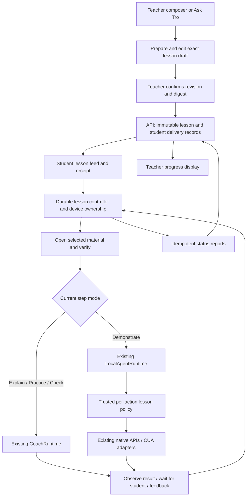

# Plan: Classroom Lesson Execution

## Summary

Add a complete teacher-led lesson flow: prepare and review one shared lesson, broadcast it, open its selected material on each student machine, demonstrate an example, hand control to the student, answer questions, and check observed work. A durable student lesson controller owns progress and runs one bounded coaching or computer-use task at a time. Reuse the existing local runtimes and native execution adapters; the teacher supplies learning intent, while each student adapts the current step to their own screen.

This is an implementation plan only. No application code, database, deployment, or running classroom was changed while creating it.

## User Story

As a teacher, I want to broadcast a reviewed lesson that opens the right material and starts appropriate guidance or demonstration on each student's computer, so students can follow the example, practice independently, and ask for help while I can see their progress.

As a student, I want to see what Tro is doing, stop or pause it, do the practice myself, and get help based on my current work.

## Problem → Solution

The current class panel sends an exercise announcement or URL. An exercise does not start an agent. Assignment explanations exist through a separate Ask Tro broadcast path and run a read-only coach; they do not navigate to arbitrary lesson material or demonstrate clicks and typing. Replace this ambiguity with an explicit lesson composer and a versioned lesson protocol, while preserving old announcements and guidance compatibility.

## Metadata

- **Complexity:** XL; implement in the ordered milestones below, with the full flow required for completion.
- **Source PRD:** N/A — the preceding teacher/student architecture discussion.
- **PRD Phase:** Standalone.
- **Baseline:** `origin/main` commit `cea50adf0ec0da5d5e618529097416b88f164a4f` (PR #73). The planning worktree at `94eb9ab` has the same tree.
- **Planning date:** 2026-09-07, Asia/Ho_Chi_Minh.
- **Ambiguity assessment:** The requested objective and success criteria are established in the conversation. The scope decisions below make the first release implementable without choosing new frameworks or a new runtime.
- **Estimated files:** 95 (58 create, 37 update); 17 ordered implementation tasks. See the exact production/support/test manifest below.

## Decisions and Scope

1. A teacher prepares an immutable semantic lesson. The model can suggest objectives and steps, but the teacher reviews the actual content, selected material, modes, and audience before sending.
2. The student adapts only the current step. Never transmit teacher pixel coordinates, executable shell commands, or a cloned teacher task with teacher credentials.
3. One lesson controller owns one student's lesson. It serializes independently bounded child tasks, using CoachRuntime for explain/practice/check and LocalAgentRuntime for demonstrations. It does not implement another LLM tool loop.
4. Add `classroomLessons.contractVersion: 1` and separate lesson endpoints/tables. Do not add an unknown variant to the existing strict broadcast feed or reuse its `manual_only` envelope to mean automatic execution.
5. V1 materials: published assignment instructions, pinned ready source text rendered inside Tro, and explicit public HTTPS URLs on the published Activity's allowed origins. Parsed PDF text is supported as source text; original PDF/slide layout playback is not.
6. V1 demonstrations: browser exercise surfaces with a verified URL and application identity, initially Chrome on macOS and Windows. Explain/practice/check can use an already-open surface, or text fallback. No claim that arbitrary native applications can be launched: the current explicit application launcher supports only Chrome.
7. V1 lesson Activities use `launchTarget: none | current_surface`. Workspace Activities remain on their existing user-selected workspace flow. Do not weaken the workspace authority refinements to make lessons fit.
8. Preserve the user's default-on preference: new joins disclose automatic material opening and classroom demonstrations, with session controls to turn them off. Respect an explicit opt-out. Existing/restored sessions must not silently gain broader demonstration permission; show a one-click class control or use a fresh leave/rejoin.
9. Lesson progress is distinct from assignment submission, numerical grading, and facilitator completion. A check produces evidence-based feedback; it does not submit or mark the assignment complete.
10. Keep the current transport pattern: authenticated polling with cursor, jitter, cancellation, and bounded pages. WebSockets, cloud computer control, and a fleet of server-side student agents are unnecessary for this release.

## UX Design

### Before

```text
Teacher class panel                 Student
Exercise / Open a link              "New exercise from your teacher"
Instruction → Preview → Broadcast → Text notice; no running task

Ask Tro → separate explanation preview → Separate guidance path
```

### After

```text
Teacher: Session 1
  Message | Open link | Teach a lesson
  Assignment: Python greeting
  Material: [approved editor URL] [assignment / pinned source]
  Goal: Ask for a name, then practice with a hobby
  Steps: Explain → Demonstrate example → Practice → Check
  [Prepare plan] → editable exact preview → [Broadcast lesson]
  1 received · 1 opening · 0 blocked       [Stop lesson]

Student: "Teacher lesson — Python greeting"
  Opening the exercise… → Demonstrating the name example…
  Your turn: add a hobby → [Ask for help] [Check my work]
  [Pause] [Stop] always visible
  Feedback: observed / needs revision / not enough evidence
```

### Interaction Changes

| Touchpoint | Before | After | Notes |
|---|---|---|---|
| Class panel | Exercise text looks like a command | Message clearly says it displays text; Teach a lesson is a separate explicit action | Never classify textarea text by matching “explain” |
| Ask Tro | Separate prepared assignment preview | Can prepare the same lesson draft as the composer | Both enter one draft/confirm service |
| Plan preview | Text and broadcast button | Selected resource, step mode, example scope, practice objective, audience and expiry | Editing invalidates the previous revision/digest |
| Student receipt | Notification only | Immediate visible receipt plus readiness/starting status | Show a reason when not starting |
| Opening material | Student must find it | Direct open and verify, or main-to-renderer material request with acknowledgement | OS accepting an open request is not proof the right page loaded |
| Demonstration | Missing from classroom flow | Bounded browser actions with narration and Stop | Show the work; do not write into an unrelated existing document |
| Practice/help | Independent task launch can collide | Controller routes help within the current lesson | Student work remains the primary interaction |
| Check | Existing “Check my work” entry point | Lesson uses the same published criteria with structured feedback | No grade or submission side effect |
| Teacher status | Broadcast saved | Received/starting/running/waiting/blocked/finished counts and roster details | No receipt is “not connected or needs update,” never “finished” |
| Restart/reconnect | Silent or unclear | Visible interrupted/unknown status and explicit continuation | Never replay an uncertain input action |

## Architecture



### Ownership and execution

- **Teacher plan:** what to teach, selected materials, intended order, what is demonstration versus practice, and observable success criteria.
- **Server:** authority, immutable content, eligibility, delivery/claim identity, expiry/revocation, monotonic reports, and teacher summaries. It does not plan pixel actions.
- **Student controller:** session consent, device admission, current step, material selection, child task ownership, pause/help/check transitions, resource cleanup, and durable recovery.
- **CoachRuntime:** one explanation/visual cue at a time, responding to Next/question. Extend it with an explicit lesson context rather than manufacturing a legacy guidance broadcast ID.
- **LocalAgentRuntime:** adaptive demonstration within one step, with a narrowed frozen catalog and a trusted host policy before every tool effect.
- **TaskExecutionCoordinator/CUA:** execute admitted native operations and report evidence. They do not interpret teacher authority or choose lesson modes.

Keep one parent lesson record and new child task IDs per step/retry. A child retains its existing immutable v11 route/authority. Do not change a running task from coach to agent or mutate a frozen tool catalog. Await terminal completion and native cleanup before creating the next child. Aggregate lifecycle and limits at the parent. Extract a device-admission helper from TaskApplicationService so ordinary tasks, legacy guidance, and lessons use the same busy gate. There must not be two independent reservations that both think they own the screen.

### Shared contracts to add

Create `src/shared/classroom-lesson-contracts.ts` and re-export it from `contracts.ts`. Use strict Zod schemas and matching Rust serde contracts. All IDs UUID; all revisions safe nonnegative integers; timestamps ISO UTC. Use these names and fields as the implementation specification:

```ts
type LessonMode = 'explain' | 'demonstrate' | 'practice' | 'check';
type LessonResource =
  | { id: string; kind: 'assignment'; title: string }
  | { id: string; kind: 'source_text'; sourceVersionId: string; title: string }
  | { id: string; kind: 'web'; url: string; origin: string; title: string };
type LessonStep = {
  id: string; mode: LessonMode; objective: string; instruction: string;
  resourceId: string; criterionIds: string[];
  demonstration: null | { exampleDescription: string; expectedResult: string };
};
type ClassroomLessonPlan = {
  schemaVersion: 1; targetRunId: string; activityVersionId: string;
  title: string; objective: string; language: 'en' | 'vi';
  resources: LessonResource[]; steps: LessonStep[];
};
```

Schema constraints: title ≤240 chars; objective ≤4,000; each instruction ≤4,000; 1–8 resources and 1–8 steps; unique resource/step IDs; at most 40 criterion IDs per step, all belonging to the published version. Demonstration details are required only for demonstrate, absent otherwise. A demonstration resource must be a verified web target. Match URL/origin using existing classroom URL policy and intersect with published `allowedOrigins`; no model-supplied origin expands authority. Source IDs must be pinned to the selected published Activity, ready, and belong to the same accessible space. Source display initially allows reference/instructions roles; starter/workspace and private rubric behavior stay in their existing flows.

The plan does not contain tool calls, filesystem paths, selectors, screen coordinates, device IDs, auth, launch commands, or arbitrary capability lists. Enforce a 64 KiB UTF-8 serialized plan limit consistently in TS/Rust/SQL in addition to per-field limits. Maintain actual TS UTF-16 string-length parity in Rust validation where existing contracts use JavaScript length.

Additional schemas:

- `LessonDraft`: draftId, revision, owner-bound TeacherClassroomBinding, plan, digest, createdAt, expiresAt, state. State pattern mirrors prepared/sending/sent/stale/expired/cancelled/failed/unknown. Drafts from UI have their own draft ID and do not invent a parent agent task.
- `LessonEnvelope`: lessonId, sessionId, sequence, contractVersion=1, plan, planDigest, createdAt, expiresAt, state=`active|stopped`, serverTime. Server-assigned expiry is 30 minutes from commit, capped by class/run closure. Teacher Stop ends it sooner.
- `LessonDevicePresence`: session/anchor, clientInstanceId, build identifier, lessonsVersion=1, supportedModes/resourceKinds, local readiness reason, lastSeenAt. Absence of a heartbeat is unknown/offline, not proof of an old version.
- `LessonDelivery`: lessonId, student user/anchor, status, stepId, revision, reasonCode, receivedAt, updatedAt; nullable execution claim. Receipt and readiness must be reportable before a running task exists.
- `LessonExecutionClaim`: executionId, lessonId, planDigest, userId, anchorAttemptId, targetAttemptId, clientStartId, clientInstanceId, ownedByThisRequest. Unique per lesson/user. One device can run a given student's lesson; no automatic takeover after a disconnect.
- `LessonStepClaim`: executionId, stepId, attemptNumber, taskId, workSessionId, purpose, ownedByThisRequest. A server-authorized claim maps each child to the correct target attempt and purpose: demo/explain/practice=`work`, check=`check`; help uses a `help` child. Stable IDs are persisted before requests.
- `LessonProgressReport`: executionId or receipt identity, reportId, revision, stepId, status, reasonCode, actionCount, modelRequestCount, observed outcome. No raw screenshots, transcripts, code, or free-form screen text in teacher summaries.
- `LessonLocalState`: schemaVersion=1, ownerId, envelope/digest, claim, step index, per-step attempts/child IDs, current state, local generation, cumulative limits, observation/effect receipts, queued reports, last error, session consent. Store separately from legacy guidance journals; validate on every read.
- `LessonContinueRequest`: lessonId, expectedRevision, action=`next|question|check|pause|resume|stop|start`, optional bounded text. Revision prevents double Next and stale question/stop events from controlling a different step.
- `LessonCheckResult`: criterionId, outcome=`observed|needs_revision|insufficient_evidence`, explanation and evidence locator. “Shown in demo” is not student success. Persist feedback in the encrypted student journal; only report structured per-criterion outcomes to the teacher under the existing insight policy.

Local states: `received → preparing → running → waiting_for_student → preparing(next step) → finished`, with `paused`, `blocked`, `stopped`, `failed`, `unknown`, and `expired`. Display `opening`, `explaining`, `demonstrating`, `checking` as explicit subphases. Define transitions in a pure reducer. Terminal states cannot return to running. A retry creates a new step attempt only after an explicit continuation and a known no-effect failure; uncertain effects remain unknown until observed/reconciled.

### API and persistence

Append `037_classroom_lessons.sql` (037 is unused at this baseline; preserve all 001–036 bytes). Register it in `services/api/src/db.rs`. Four tables:

1. `knowledge_classroom_lessons`: id, session_id, client_id, sequence, target_run_id, activity_version_id, plan JSONB, plan_digest, created_by, state, created_at, expires_at, stopped_at. Unique(session_id, client_id), unique(session_id, sequence), existing composite session/run/version FK, ≤64 KiB plan. Add a separate `lesson_sequence` counter to sessions; do not share cursor space with v1 broadcasts.
2. `knowledge_classroom_lesson_deliveries`: lesson_id/user_id primary key; anchor/target attempt IDs; received/status/revision/reason/timestamps; client_instance_id; nullable execution_id/client_start_id. Unique(user_id, client_start_id) where present, execution_id unique. Constrain status/reason vocabulary and revision range.
3. `knowledge_classroom_lesson_steps`: execution_id/step_id/attempt_number primary key, task_id unique, work_session_id unique, status/revision/reason. Link delivery/execution and work session; no new meaning silently assigned to old guidance rows.
4. `knowledge_classroom_lesson_devices`: session_id/user_id/client_instance_id primary key, capabilities JSONB, last_seen_at. Small bounded JSON, index for current class/status queries; update at most every 10 seconds and consider stale after 30 seconds.

Mirror broadcast transaction locking: teacher space access → session `FOR UPDATE` → sorted runs locks → target/version checks. Claims serialize on the lesson/delivery identity with session/run/attempt revalidation. Reuse role, membership, blocked-account, access-code, participation, run window and insight acknowledgement checks from guidance. Never authorize based only on possession of a UUID. One class's teacher cannot view another class's student progress.

| Endpoint | Semantics |
|---|---|
| `GET /v1/spaces/:space/sessions/:session/lesson-context?runId=…` | Authorized teacher catalogue: published assignment, pinned ready source IDs/titles, resource and mode eligibility |
| `POST /v1/spaces/:space/sessions/:session/lessons` | `{clientId, plan}`; validate exact content, lock sequence, commit immutable envelope; same ID/digest returns original; mismatch 409 |
| `GET /v1/spaces/:space/sessions/:session/lessons/by-client/:clientId` | Resolve uncertain commit without resending |
| `POST /v1/spaces/:space/sessions/:session/lessons/:id/stop` | Idempotent teacher Stop, owned class; retain history |
| `GET /v1/attempts/:anchor/session-lessons?afterSequence=…` | Authenticated new lesson feed, ≤100 entries, maxSequence, serverTime, session state; include current active/stopped IDs so Stop is visible even with no new sequence |
| `POST /v1/attempts/:anchor/lesson-device` | Session device presence and supported version/readiness; idempotent upsert |
| `POST /v1/attempts/:anchor/session-lessons/:id/receipt` | Idempotent received/blocked readiness report; register eligible late participant here |
| `POST /v1/attempts/:anchor/session-lessons/:id/starts` | Stable clientStartId and device; returns existing ownership or new execution claim |
| `GET /v1/attempts/:anchor/session-lessons/:id/start` | Read back an uncertain claim; never resend blindly |
| `POST /v1/lesson-executions/:execution/steps/:step/starts` | Claim a bounded child task/work session with stable taskId and attemptNumber |
| `GET /v1/lesson-executions/:execution/steps/:step/start?attemptNumber=…` | Read back uncertain step creation |
| `POST /v1/lesson-executions/:execution/progress` | Monotonic idempotent progress; equal revision/same content succeeds, conflict rejects, old revisions do not regress state |
| `GET /v1/lesson-executions/:execution/status` | Refresh serverTime, class/run/lesson authority and cancellation before an effect; no renewable multi-device takeover |
| `GET /v1/attempts/:anchor/session-lessons/:id/resources/:resource` | Return server-validated resource descriptor and bounded, paginated source chunks or assignment text; no teacher paths or raw object-store keys |
| `GET /v1/spaces/:space/sessions/:session/lessons/:id/progress?cursor=…` | Authorized teacher counts plus bounded roster rows; derive eligible participants even if they never reported |

Use `KnowledgeSpaceRequestError` codes for `lesson_unsupported`, `lesson_expired`, `lesson_stopped`, `lesson_version_changed`, `lesson_busy`, `lesson_permission_required`, `lesson_resource_unavailable`, `lesson_surface_unverified`, `lesson_outcome_unknown`, and authorization failures. New code must not silently convert any of these into a plain exercise.

Keep lesson endpoints isolated in new HTTP/classroom modules. Client transport should be shared with KnowledgeSpaceClient by extracting its authenticated request/json helpers into a small internal module; instantiate a separate ClassroomLessonClient to avoid growing the already ratcheted client file. Client methods parse all responses.

### Reliability, resources, and task authority

- Poll approximately every 3–5 seconds with existing jitter/backoff conventions; send receipt before attempting execution. Receipt ≠ started, browser-open accepted ≠ material ready, model response ≠ verified success.
- Initial snapshots/restarts show Start for existing lessons. Fresh live deltas auto-start only with session preference, verified supported version, available device, and unexpired lesson. Derive timing from server time plus elapsed monotonic time; do not compare server creation against an unsynchronized wall clock to decide whether a lesson is new.
- While busy, display `Waiting for this device` immediately. Do not preempt an unrelated task. V1 resumes blocked/busy work through the student's Start/Resume control; there is no invisible later takeover. A new lesson is shown separately and never silently cancels the current one. Pending display is bounded to five with older entries available from history; active/unknown journals are never evicted.
- Hold device ownership across step transitions. During practice, release physical CUA/pointer resources but retain lesson ownership; the student can work normally. A request for another Tro task must pause/stop the lesson through the same arbiter.
- Before each effect and each new model round: validate owner, generation, lesson/step revision, local consent, expiry, and latest server authority. Cache authority for at most 5 seconds; loss of connectivity pauses new effects. A revocation race with an already-dispatched OS action cannot be undone; report it honestly and stop the next action. Never claim exactly-once physical execution across a crash.
- Write a parent/step effect journal before direct material navigation, renderer material-open requests, and SDK child dispatch. Use existing durable SDK invocation records for computer-use calls. Resume only after reconciling known receipts; unknown effects cannot be replayed under a new call ID as a “retry.”
- Opening known URLs uses `browser.navigate`/native open, followed by observation verifying URL and foreground surface. Already-open matching material skips navigation. Redirects must remain within the allowed set. Use only observed surface identity, never model output, to establish where controls will execute.
- `source_text` material uses authorized pinned chunks (`knowledge_source_chunks.body`, ordinal, locator) in a sandboxed React reader. Paginate ≤20 chunks and ≤64 KiB response; preserve locator labels and mark extraction as text. Render text, not raw HTML. Main requests the selected reader resource and waits for a matching resource/revision acknowledgement before presenting guidance. Code examples are text, not executable page scripts.
- Browser demonstrations must bind to the selected exercise surface and revalidate that binding for every control call. Missing URL/application evidence blocks demonstration with a visible reason. Prefer semantic element refs. Desktop-coordinate fallback requires fresh foreground identity and matching observation/geometry; otherwise guide the student manually.
- Frozen catalog for demo: bounded observe, navigate to reviewed resources, browser preparation, semantic/desktop control within the verified surface, and a new `classroom.lesson-step` completion tool. Exclude workspace filesystem/terminal, arbitrary dynamic `cua.*`, connectors, credentials, uploads/submission tools, and teacher broadcast tools. Host pre-dispatch checks enforce this even for forged child messages.
- Explain/practice/check have no mutation tools. Student free-form questions do not change the plan mode or widen capabilities. If a student asks Tro to take over during practice, explain that the current step is practice; teacher must prepare a demonstration step to change class behavior.
- Demo example text must be explicit in the reviewed step. Do not overwrite non-empty unrelated work. If the current editor contents conflict, show `Existing work needs your choice` and let the student open a scratch/example area. The controller cannot prove generic app semantics from an allowlisted origin alone; uncertain targets must block rather than claim strong isolation.
- Every mutation must be followed by a fresh observation before another mutation or a completion assertion. `classroom.lesson-step` reports `verified|blocked` with observation ID/fingerprint and a bounded reason; the host checks freshness/step binding. A model's final text without the required report is not automatic step success. Semantic correctness is evaluated by the local decision/verification pass and acceptance tests, not guaranteed by a URL check.
- Parent limits: 30-minute lifetime, ≤8 steps, ≤8 model requests and ≤16 observations per coaching step, ≤8 SDK turns and ≤20 control calls per demo, ≤64 total model requests and ≤160 total control calls per lesson. Charge normal existing user budget services; track parent consumption durably so retries/step changes do not reset it. Pause with actionable feedback on budget/limit exhaustion.
- Question during demo: pause/cancel the child, await cleanup, reconcile in-flight outcome, then run a read-only help child against the same assignment and step. Resume requires the student to continue explicitly and starts from fresh observation, never repeated coordinates.
- Check only after the student explicitly requests it or finishes a practice step with Next. Publish factual per-criterion feedback with `insufficient_evidence` when the screen cannot establish it. Do not infer that practice succeeded merely because an earlier demonstration succeeded.

## Current Codebase Evidence and Mandatory Reading

The source reference appendix below supplies actual excerpts and a discovery table for all eight requested search categories. Key integration locations:

| Priority | File | Lines / symbols | Why |
|---|---|---|---|
| P0 | `src/renderer/FacilitatorRunPage.tsx` | 198–228, `broadcast` | Current exercise/link-only handler |
| P0 | `src/renderer/features/classroom/DirectiveComposer.tsx` | whole file | Existing panel controls to keep clearly labeled |
| P0 | `src/main/knowledge/classroom-agent-tools.ts` | 38–96 | Teacher tools prepare previews, never send |
| P0 | `src/main/knowledge/classroom-broadcast-draft-service.ts` | 76–207; remainder of commit/reconcile | Reviewed content, owner binding, durable uncertainty |
| P0 | `src/shared/classroom-broadcast-contracts.ts` | 35–115, 140–272 | Strict legacy protocol, guidance state and journals |
| P0 | `src/main/knowledge/classroom-guidance-coordinator.ts` | 69–119, 170–389 | Existing automatic admission and coach dispatch |
| P0 | `src/main/application/task-application-service.ts` | 70–91, 137–225, 276–395 | Busy gate, authority creation, separate task runtimes |
| P0 | `src/main/agent-runtime/agent-runtime-adapter.ts` | 169–211, 599–736 | Frozen tool catalog, durable invocation and lifecycle |
| P0 | `src/main/agent/execution-coordinator.ts` | 60–65, 188–290 | Native tool execution and cleanup |
| P0 | `src/main/agent/runtime-tool-registry.ts` | 38–65, 976–1025 | Trusted context, allowlisting, catalog digest and resolution |
| P0 | `src/main/agent/execution-contracts.ts` | 67–140 | Observed surface identity and element commands |
| P0 | `src/main/coach/coach-runtime.ts` | 230–448, 654–735 | Observation/pointing/continuation and model instructions |
| P0 | `src/main/coach/coach-contracts.ts` | 25–78 | Strict coaching decisions and context |
| P0 | `services/api/src/classroom/broadcasts.rs` | 175–280 and participant helpers | Serialized commit, authority and idempotency |
| P0 | `services/api/src/classroom/guidance.rs` | 38–124, 137–261 | Claim/work-session/report patterns |
| P0 | `services/api/src/http/classroom.rs` | 35–181 | Current API router and authentication conventions |
| P1 | `src/main/knowledge/teacher-classroom-context-service.ts` | whole file | Selected class verification and compatibility |
| P1 | `src/main/knowledge/activity-context-service.ts` | 14–61 | Correct attempt/version/work-session binding |
| P1 | `src/main/knowledge/classroom-broadcast-service.ts` | 94–106, 132–250 | Assignment resolution is not navigation; polling generations |
| P1 | `src/main/knowledge/knowledge-space-client.ts` | 105–132, 616–653 | Typed errors, authenticated fetch and parsing |
| P1 | `src/main/agent-runtime/encrypted-agent-state-store.ts` | 81–108, 238–310, 366–411 | Encryption, serialized writes and effect journals |
| P1 | `src/main/agent-runtime/local-agent-state.ts` | 43–75 | Existing persisted thread format must remain compatible |
| P1 | `src/main/ipc/register-classroom-broadcast-ipc.ts` | 19–46, 99–125 | Authorize IPC sender before calling narrow methods |
| P1 | `src/classroom-preload.ts`, `src/shared/classroom-desktop-api.ts` | whole files | Typed invoke/events and unsubscribe patterns |
| P1 | `src/renderer/app/AppWorkspace.tsx` | 200–224 | Current class-bound previews and student panel mount |
| P1 | `src/renderer/ClassroomSessionBar.tsx` | 62–90 | Existing help/check intent; avoid competing child tasks |
| P1 | `src/index.ts` | 638–654, 1644, 1803–1810, 2428–2456 | Composition, restore, shutdown, sign-out cleanup |
| P1 | `services/api/migrations/009_knowledge_sources.sql` | 15–46 | Immutable source versions and parsed chunks |
| P1 | `services/api/migrations/010_knowledge_activities.sql` | 20–85 | Pinned versions, sources, attempts |
| P1 | `services/api/migrations/035_class_session_broadcasts.sql`, `036_student_classroom_guidance.sql` | whole files | Published history remains unchanged |
| P1 | `services/api/tests/postgres_compat.rs` | 78–138, 227–343 | Fresh/legacy upgrade tests and pinned checksums |
| P1 | `services/api/tests/classroom_e2e.rs`, `classroom_access.rs` | fixture and ignored integration tests | HTTP authority and test database isolation |
| P2 | `src/main/knowledge/activity-workspace-preparation-service.ts` | 44–107 | Existing workspace requires student-selected parent, out of lesson v1 scope |
| P2 | `src/main/application/desktop-application-launcher.ts` | 1–65 | Explicit native launcher currently only supports Chrome |
| P2 | `services/agent-runtime/src/agent-graph.ts` | 35–91 | Existing sole Agents SDK harness; no new runner needed |
| P2 | `src/main/knowledge/classroom-guidance-coordinator.test.ts` | 190–267 | Mocked boundary tests for duplicate/unknown/busy starts |
| P2 | `src/renderer/ClassroomExplanationPanel.test.tsx` | whole file | Renderer state and exact revision continuation tests |
| P2 | `src/renderer/i18n/translations-preservation.test.ts` | whole file | New translation keys require count and reviewed digest update |

### Five end-to-end traces

1. **Entry:** FacilitatorRunPage currently calls `createClassroomDirective` with only exercise/open_url. Add Teach a lesson → main draft service → authenticated lesson commit. Ask Tro's new prepare tool calls that same service. No renderer-to-CUA path.
2. **Data:** API stores exact canonical plan → student polling parses versioned envelope → resolves its own target attempt → receipt → claim → child work session → trusted local context. Never reuse the anchor attempt as the target when the plan selects another assignment.
3. **State:** parent encrypted journal and pure reducer own step progress; server delivery rows mirror bounded status. Child SDK/coach task state remains owned by existing task runtime; terminal event/cleanup feeds the parent through a narrow adapter.
4. **Contracts:** new versioned lesson contracts, authenticated API and IPC; preserve strict old broadcast/guidance types, v11 route refinements, and SDK protocol v6 unless an actual wire shape changes.
5. **Effects:** main-only lesson admission → frozen step catalog → host check before dispatch → existing native adapter → fresh observation → verified result → parent transition. Pause/Stop/sign-out/class closure invalidate generations and cancel pending effects.

## External Documentation and Dependencies

No new external APIs or packages are required. External API behavior was checked against the existing repository integration, not inferred from a newer SDK release. Keep `@openai/agents` 0.17.0, `openai` 7.8.0, Zod 4.4.3, and the existing Electron/CUA dependencies pinned as-is. Existing internal dependencies: CoachRuntime, LocalAgentRuntime, TaskApplicationService, TaskExecutionCoordinator, RuntimeToolRegistry, EncryptedAgentStateStore, ClassroomSessionService, KnowledgeSpaceClient, the Rust ClassroomService/SQLx abstractions, React and Vitest/Bazel.

| Topic | Source | Key Takeaway |
|---|---|---|
| Workflow versus adaptive agent | [Building effective agents](https://www.anthropic.com/engineering/building-effective-agents) | Keep deterministic orchestration around the parts that need adaptive decisions; this informs the design, not an assertion that it is optimal |
| Pinned SDK implementation | `services/agent-runtime/package.json`, `services/agent-runtime/src/agent-graph.ts`, `services/agent-runtime/src/tool-adapter.ts`, `services/agent-runtime/src/protocol.ts` | Existing tool catalog and runner integration are authoritative for implementation |
| Repo verification | `docs/testing/ci-workflow.md`, `.github/workflows/ci.yml` | CI owns full checks, migration history and native packaging |

KEY_INSIGHT: A frozen catalog is established at LocalAgentRuntime.start and participates in graphVersion. APPLIES_TO: demo-to-practice transitions. GOTCHA: do not widen tools in-place or resume a task with a different catalog; start a new bounded child.

KEY_INSIGHT: Legacy lesson-like broadcasts are strict and currently separate from plain exercise directives. APPLIES_TO: compatibility and teacher UX. GOTCHA: adding one enum value to the server can break old student polling entirely.

KEY_INSIGHT: Existing sourceCatalog contains titles/roles, not source IDs or openable material handles. APPLIES_TO: lesson material selection. GOTCHA: add the authorized lesson-context/resource endpoints instead of matching a source by title or treating sourceCatalog as a navigation API.

## Alternatives Considered

| Alternative | Decision |
|---|---|
| Send every teacher prompt directly into each student's general agent | Reject: ambiguous mode, unrelated tool access, repeated lesson planning and poor recovery |
| Replay teacher cursor coordinates | Reject: student screens and progress differ |
| Add model planning/remote CUA per student on the server | Reject: unnecessary new runtime and device transport; existing desktop runtime already owns tools |
| Put all modes into the old coach prompt | Reject: coach deliberately has no input effects; prompt wording cannot supply native capability or enforce modes |
| Rewrite both local runtimes into one new harness first | Reject: large unrelated migration; a single parent can sequence existing implementations |
| Extend old strict broadcast payloads immediately | Reject: version skew can break existing classes. Use a parallel versioned protocol with a unified user-facing entry point |
| Automatic retries for failed-looking clicks | Reject: failure may mean the receipt was lost; use durable uncertainty and observe/reconcile |

## NOT Building

- Teacher screen streaming, remote cursor mirroring, lesson recording/replay, arbitrary whole-desktop remote control.
- General native-app launch/install support beyond existing Chrome availability; shell automation and workspace provisioning through lesson broadcasts.
- Pixel-perfect PDF/PPT playback; pinned extracted source text is the V1 material reader.
- Automatic graded submission, final grades, facilitator decisions, or marks for student work based on teacher demonstrations.
- Automatic adoption of an unrecognized old client, silent device takeover, or rerunning old broadcasts after restart.
- A new LLM framework, model provider, transport fleet, agent marketplace, or dependency upgrade.

## Step-by-Step Tasks

### Task 1: Establish baseline and acceptance prerequisites
- **ACTION:** Start implementation from `cea50ad` or its descendant; preserve uncommitted work in other checkouts.
- **IMPLEMENT:** Record source commit, backend capabilities, API URL, migration head, teacher and student account roles, separate local profiles, Chrome and OS permission readiness. Create a deterministic Python editor fixture page for browser acceptance, served by the staging API at `/classroom-test/python-editor` only in the test deployment. Include editor, Run, name/hobby prompts, output and a deliberately pre-filled variant. Gate the route with the new non-secret boolean `TROCODE_CLASSROOM_TEST_FIXTURE_ENABLED` (default false, parsed through Config); no query parameter can enable it. Store static HTML in `services/api/tests/fixtures/classroom-python-editor.html` and include it in the API Bazel compile_data. Label its output as simulated: it is a deterministic interaction fixture, not a Python interpreter, and cannot validate Python execution correctness. Publish its exact staging origin in the test Activity. The final acceptance report must distinguish fixture interaction results from a repeat against the teacher-selected real Python editor.
- **MIRROR:** Shared test runbook and classroom HTTP fixture authentication.
- **IMPORTS:** Existing test config helpers and API routing; no provider credentials in fixtures.
- **GOTCHA:** The earlier live diagnosis showed `/Users/ducng/Desktop/workspace/TroCode` at `a16bd40` even after main merged PR #73. Merely merging does not update either running client.
- **VALIDATE:** Both client build IDs appear in the new readiness surface by Task 13; staged API returns the new capability after backend deployment. Fixture cannot be enabled by a request parameter in production.

### Task 2: Add contracts and pure policies
- **ACTION:** Implement the schemas above, canonical serialization/digest helper and state reducer.
- **IMPLEMENT:** Add lesson contracts as a new shared module and re-export; separate local state and teacher draft schemas. Add pure plan validation, auto-start admission, mode/tool policy, and lifecycle transition functions. Define numeric limits in one shared TS policy module with mirrored Rust constants/contract tests. Add optional lesson capability to existing capabilities schema without changing old literal versions.
- **MIRROR:** Strict Zod unions, classroom URL policy, assertBroadcastTransition.
- **IMPORTS:** `zod`; `../../shared/contracts`; `../../shared/classroom-url-policy`; Node crypto only in main, not shared renderer imports.
- **GOTCHA:** Canonical digest includes normalized material/step order and exact text; never include server timestamps in the plan digest. Do not add lesson state to strict v11 task authority unnecessarily.
- **VALIDATE:** Contract corpus tests, cross-language digest vectors including Vietnamese/astral Unicode, invalid mode/resource references, bounds and all transition edges.

### Task 3: Add append-only schema and backend lesson service
- **ACTION:** Add migration 037 and split Rust lesson modules for contracts, service, claims/progress, resources and policy.
- **IMPLEMENT:** Tables and endpoints as specified. Reuse authenticated class membership and target-version logic. Derive recipients from current session participation, list pending recipients with no client reports, and permit receipt registration for eligible late joiners. Enforce one active execution per lesson/student and stable child work-session claims. Teacher Stop and class/assignment closure revoke further step actions.
- **MIRROR:** `broadcasts.rs` transactional idempotency and `guidance.rs` work-session ownership.
- **IMPORTS:** `serde::{Deserialize,Serialize}`, `serde_json`, `uuid::Uuid`, `super::ClassroomService`, `crate::{query,query_scalar,Row}`, `crate::error::ApiError`, `sha2`.
- **GOTCHA:** Server lock order must be consistent across commit, claim, progress and stop. Never rely solely on clientInstanceId or planDigest for authorization. A repeated request with a different digest is a conflict, not an overwrite.
- **VALIDATE:** PostgreSQL integration for fresh database and both historic migration histories; duplicate commit/start/report, two devices, unauthorized class access, class closure and pinned source isolation.

### Task 4: Add typed HTTP client and narrow IPC/preload bridge
- **ACTION:** Extract authenticated request helpers without changing old behavior; add ClassroomLessonClient and lesson IPC modules.
- **IMPLEMENT:** Add methods for the endpoint matrix with strict response parsing. Main exposes prepare/edit/confirm/reconcile/get draft, get lesson state, continue/pause/stop, material acknowledgement, and teacher progress. Authorize IPC sender and account first; derive trusted selection/context in main. Add typed get+subscribe APIs and remove listeners during teardown.
- **MIRROR:** KnowledgeSpaceClient.request, registerClassroomBroadcastIpc.handle and classroom-preload helpers.
- **IMPORTS:** `../knowledge/classroom-lesson-client`; `../../shared/classroom-lesson-contracts`; `electron` only in main/preload.
- **GOTCHA:** Do not expose raw lesson execution scope, CUA, paths, tokens, or arbitrary fetch through DesktopApi. A renderer resource acknowledgement is only UI display evidence, not permission for desktop effects.
- **VALIDATE:** Typed HTTP fixtures, server error-code propagation, unauthorized renderer rejection, stale revision acknowledgements, subscription cleanup and legacy client tests.

### Task 5: Build one teacher lesson preparation service
- **ACTION:** Add owner-bound draft persistence and deterministic plan normalization shared by manual UI and Ask Tro.
- **IMPLEMENT:** Teacher UI can create/edit the default sequence without an LLM. Ask Tro gets a new strict `prepare_classroom_lesson` tool accepting assignment reference, resource references and semantic steps. Main resolves references from the authorized catalogue, validates policy/answerReveal, binds owner/session/version, persists an exact preview, and sends only on explicit confirmation. Persist `sending` before commit; on an ambiguous response, expose Reconcile and only read the by-client receipt. Editing makes old confirmation IDs/revisions stale.
- **MIRROR:** ClassroomBroadcastDraftService and teacherClassroomContext verification, with separate UI-capable draft storage.
- **IMPORTS:** `TeacherClassroomContextService`, `ClassroomLessonClient`, `ClassroomLessonStateStore`, shared plan schemas, `objectSchema`.
- **GOTCHA:** Source/screen text is content, not authority. The tool cannot broadcast, change class scope, select unrelated students, or silently replace the target assignment.
- **VALIDATE:** Identical UI/Ask Tro plan normalization, multi-click single send, cancelled/changed selection, digest conflict, unknown receipt, edit-after-preview and incompatible server tests.

### Task 6: Add the teacher composer and exact preview
- **ACTION:** Add Teach a lesson beside existing Message/Open link controls.
- **IMPLEMENT:** Assignment/material selectors, four step modes, editable instructions and explicit demo example/result, plan validation, resource readiness, exact preview, and Broadcast lesson. Default template is Explain → Demonstrate → Practice → Check, with unsupported steps visibly disabled rather than silently removed. Manual lesson editing should not require starting a general agent task. Integrate Ask Tro draft cards into this same review UI.
- **MIRROR:** DirectiveComposer and ClassroomBroadcastPreview layout/state patterns.
- **IMPORTS:** React hooks, `window.tro` typed API, existing language hooks, new lesson contracts/types.
- **GOTCHA:** Preserve the existing plain Message and approved-link flows. A plain instruction must clearly say it will only be displayed. Do not bury Teach a lesson inside the voice path again.
- **VALIDATE:** Renderer tests for actual click path, selected target, mode semantics, actionable validation, stale preview and send receipt; English/Vietnamese strings and preserved dictionary digest.

### Task 7: Add lesson feed, readiness and receipts
- **ACTION:** Add ClassroomLessonFeedService driven by current ClassroomSessionService.
- **IMPLEMENT:** Session-scoped polling/cancellation with initial/live provenance, independent cursor, stopped-plan refresh, presence heartbeat, deduplicated receipts and local pending state. Report received/busy/permission/unavailable status before attempting a run. Capability/version mismatch shows a clear update requirement. Persist the receipt cursor and initial-snapshot handling; use serverTime/elapsed time for freshness.
- **MIRROR:** ClassroomBroadcastService generation/cursor handling and default guidance policy.
- **IMPORTS:** `EventEmitter`; `ClassroomSessionService`; `ClassroomLessonClient`; lesson state store/policy.
- **GOTCHA:** Feed Stop updates must arrive even when no new sequence exists. An old pending lesson must not start because its preference was toggled. A latest notice cannot overwrite the identity of an active/unknown lesson.
- **VALIDATE:** Feed pages, reconnect/cursor ordering, late join, no duplicate receipt, class changes mid-fetch, busy device, unsupported build and clock-skew tests.

### Task 8: Implement durable parent state and shared device ownership
- **ACTION:** Add ClassroomLessonController and encrypted lesson state store; extract shared admission from TaskApplicationService.
- **IMPLEMENT:** Reducer-driven states, serial event processing, stable pre-request IDs, one active child, cumulative budgets, report outbox, pause/resume/stop and account/class invalidation. Restore interrupted/unknown state without auto effects. Add explicit child lifecycle adapter from existing runtimes; do not invoke `submitOrdinary` as a shortcut with untrusted renderer fields. Hold ownership while changing children and release physical handles during student practice.
- **MIRROR:** EncryptedAgentStateStore serial encryption and guidance journal-before-dispatch; TaskApplicationService busy/reservation checks.
- **IMPORTS:** `node:crypto`, `node:events`, new lesson state/policy, narrow injected task/coach/agent adapters; existing OS cipher through extracted shared persistence helper.
- **GOTCHA:** Existing SDK LocalAgentRuntime.start returns after dispatching to its child process; it is not completion. Use terminal events and awaited cleanup, with durable parent-child linkage. Recheck generation after every await.
- **VALIDATE:** Exactly one local owner across ordinary/legacy/lesson paths, pause during claim/write/launch, crash during child dispatch, no automatic resume, sign-out cleanup and duplicate Next tests.

### Task 9: Open selected material and verify it
- **ACTION:** Add ClassroomLessonMaterialService and sandboxed ClassroomLessonMaterialPanel.
- **IMPLEMENT:** Resolve authenticated resource IDs. Assignment/pinned text requests show the reader and await matching resource/revision acknowledgement. Web resources use direct navigation, then observe/verify the target before proceeding. Existing matching surface skips open. Journal uncertain navigation rather than replaying it. Preserve the previous student task and surface state if a material is unavailable.
- **MIRROR:** Native browser.navigate adapter, SurfaceDescriptorSchema, pinned source SQL and AppWorkspace selection patterns.
- **IMPORTS:** `ClassroomLessonClient`, existing native navigation/observation abstractions, lesson resource contracts; React for reader only.
- **GOTCHA:** `ClassroomBroadcastService.openAssignment` only resolves an attempt. It cannot be reused as evidence that a document/editor opened. Signed object-store URLs must not be broadcast or logged.
- **VALIDATE:** Already open, redirect to disallowed site, missing app, no screen permission, resource revoked, huge/paginated source text, stale renderer ACK, navigation outcome unknown and source text injection tests.

### Task 10: Add bounded explanation/practice/help/check execution
- **ACTION:** Add a lesson-specific CoachRuntime context and an adapter owned by the lesson controller.
- **IMPLEMENT:** Reuse grounded observation, presentation/narration and Next/question handling. Extract reusable explanation-round code into a module to stay within source-size limits; legacy guidance retains its existing contract. Pin current step and lesson material context, create correct child work-session purpose, and use structured check results. Practice waits for student action; Help is read-only and preserves the current step. Return feedback and parent continuation events without claiming assignment completion.
- **MIRROR:** Existing CoachRuntime explanation loop and ClassroomSessionBar help/check intents.
- **IMPORTS:** `CoachRuntime`, `CoachRuntimeStartSchema`, `ActivityContextService`, `LessonCheckResultSchema`, current presenter/observation callbacks.
- **GOTCHA:** Workspace Activities cannot be injected into an everyday coach contract. Without screen evidence, say what cannot be checked; never invent a visual pointer or passing result.
- **VALIDATE:** Fresh screen target, changed geometry, text fallback, no mutation capability, question preserves lesson, criterion evidence uncertainty, and demo output not counted as student practice.

### Task 11: Add bounded browser demonstrations through the existing executor
- **ACTION:** Add the main-only lesson step runner, trusted lesson tool policy and completion tool.
- **IMPLEMENT:** Start a fresh v11 agent child for each demo attempt using LocalAgentRuntime and the reviewed step. Pass a trusted lesson scope only from the controller, freeze a filtered tool catalog, and enforce the same scope again before every native dispatch. Gate both normal tool execution and prefetched initial calls; deny unknown dynamic CUA tools. Persist effect intent before dispatch. Run deterministic catalog/scope rejection before the checkpointed→executing transition, persist a failed/not-executed result for a pre-dispatch denial, and run live target/revocation checks again at the effect adapter. The current catch at `agent-runtime-adapter.ts:689-690` maps every exception to unknown; do not funnel a proven pre-effect denial through that catch. Any uncertainty after dispatch stays unknown. Require observation before acting and after each mutation; use a typed completion report with evidence. Extract helpers from ratcheted runtime/registry files rather than growing them.
- **MIRROR:** LocalAgentRuntime.toolExecute durable states, RuntimeToolRegistry.freeze/resolve, TaskExecutionCoordinator adapters.
- **IMPORTS:** `TrustedToolExecutionContext`, `ResolvedToolInvocation`, `ToolExecutionResult`, `DesktopObservation`, `SurfaceDescriptorSchema`, lesson scope policy and controller callback.
- **GOTCHA:** A prompt that says “do not submit” is not a tool boundary. Filter submission/terminal/connector capabilities and check the live target/step at dispatch. An allowlisted origin does not prove an arbitrary UI control matches the lesson; block ambiguous actions. Do not rewrite the entire SDK harness.
- **VALIDATE:** Real adapter boundary tests for allowed click/type, forged tool request, missing scope, wrong origin, unverified desktop fallback, permission revoke, Stop during effect, no repeated unknown action, no demo permission in the next practice child, and completion without evidence rejection.

### Task 12: Student controls, defaults and task visibility
- **ACTION:** Add a persistent ClassroomLessonPanel and integrate companion status/Stop.
- **IMPLEMENT:** Show received/start reason, material opening, current mode, narration/text, progress, Pause/Resume/Stop, Next, Ask for help and Check my work. Route questions and existing classroom bar help/check into the active lesson instead of launching a competing task. New join disclosure and session controls cover lesson navigation/demo; preserve explicit opt-outs and restored-session semantics. Show blocked status with the exact next action, including Update app or Open permissions.
- **MIRROR:** ClassroomExplanationPanel get+subscribe state projection and revision-checked continuation.
- **IMPORTS:** New typed lesson preload API; existing classroom hooks, language support and companion presenter.
- **GOTCHA:** Student can be looking at another app; a tiny notice in an inactive main window is insufficient. Use the existing companion/presentation channel for a visible Starting/Stop indicator without taking focus from the exercise on every progress update.
- **VALIDATE:** Full receipt→opening→demo→practice→check DOM tests, pause/stop always reachable, accessibility labels, progress event races, English/Vietnamese and old-client messaging.

### Task 13: Teacher progress and operational diagnostics
- **ACTION:** Add roster-based progress UI and structured lesson lifecycle logging.
- **IMPLEMENT:** Show not received/received/opening/running/waiting/blocked/finished/stopped rows and counts, last seen, build compatibility and reason codes; expose teacher Stop. Query a bounded roster page and aggregate counts from the server. Log identifiers, status, reason, durations and bounded counts in main/API; connect child task IDs to lesson/step IDs. Add a small debug view with API origin, app build, capability, last feed receipt, admission reason and active mode.
- **MIRROR:** GuidanceSummary ownership, existing tool_started/tool_completed/tool_unknown events, voice logger metadata pattern.
- **IMPORTS:** Lesson progress schemas, existing logger injection, React components, existing API error types.
- **GOTCHA:** Never infer “started” from successful delivery or “old client” from missing heartbeat. Do not transmit screenshots/code/student question text through operational progress reports.
- **VALIDATE:** Zero receipts remain visible, stale/duplicate report ordering, correct class-only visibility, redacted diagnostics, API/UI distinction between saved/received/started and late join counts.

### Task 14: Composition, cleanup and compatibility
- **ACTION:** Wire services through a new small classroom lesson composition module.
- **IMPLEMENT:** Index initializes lesson dependencies after task services, connects lifecycle callbacks, registers IPC, restores after sign-in and shuts down before CUA termination. In particular, `src/index.ts:525-550` currently routes all coach explanation callbacks/status to ClassroomGuidanceCoordinator. Add an owner-aware callback router for beforeRound/consume/awaitContinuation/status/terminal/cancellation, using the trusted task-to-parent map; route lesson children to their controller and legacy guidance children to the old coordinator. Wire LocalAgentRuntime.onTerminal to the same lesson owner and await asynchronous CUA release before advancing; today the coach release callback is fire-and-forget. Never dispatch by instruction text. Extract existing oversized blocks to pay for integration lines under the source-size ratchet. Keep v1 broadcast/guidance APIs and ordinary task behavior intact. Capabilities advertised by backend and local build must agree before teacher send and student execution; manual announcements still work across versions.
- **MIRROR:** index.ts current classroom composition/sign-in/sign-out/shutdown and register-ipc teardown.
- **IMPORTS:** New `createClassroomLessonFeatures` factory with narrow injected dependencies.
- **GOTCHA:** API capability alone does not prove a student has the new code. No silent conversion of a lesson into a text exercise when either side is unsupported.
- **VALIDATE:** Startup without auth, account switch, window recreation, shutdown while demo active, old state parsing and old/new server/client matrix. Baseline limits must not increase.

### Task 15: Cross-boundary regression and migration tests
- **ACTION:** Complete unit, renderer, protocol and PostgreSQL HTTP tests before the first implementation CI push.
- **IMPLEMENT:** Add lesson HTTP integration target to Bazel and CI's explicit PostgreSQL test invocation. Cover actual teacher POST→student feed→receipt→claim→step→status→teacher GET. Include two devices for one user and two distinct students. Append migration upgrade coverage from current 036 and existing legacy histories. Update expected fresh counts by the four new tables (62→66 at this baseline) and migration count (36→37), while keeping historical checksum pins untouched.
- **MIRROR:** classroom_e2e.rs, classroom_access.rs per-process reset, postgres_compat.rs, renderer lifecycle fixtures.
- **IMPORTS:** Existing Vitest, React act helpers, tokio/axum/tower test tooling and fixture HMAC account helpers.
- **GOTCHA:** A new Rust test target is not run against PostgreSQL merely because it is listed in a generic test suite: the CI command enumerates ignored integration targets explicitly. Isolate disposable test database setup from intentionally corrupted migration suites.
- **VALIDATE:** All applicable final revision CI checks pass; targeted tests exercise production services/adapters rather than only matching mocks to the new implementation.

### Task 16: Two-machine stage acceptance and failure exercises
- **ACTION:** Deploy backend first to test and run current clients with different signed-in roles.
- **IMPLEMENT:** Use the acceptance script below. Record build IDs, lessonId/stepId/childTaskIds, observable UI outcomes and timestamps. A real browser demonstration must visibly type/run the name example. Practice must leave the hobby exercise to the student. Exercise stale screen, reconnect, opt-out and existing-work cases.
- **MIRROR:** `docs/testing/shared-test-environment.md` and test profile launcher.
- **IMPORTS:** Existing test launch scripts, no production credentials or data mutations.
- **GOTCHA:** Successful CI and teacher send receipt are insufficient for the user's reported failure. Verify student effects and teacher progress together. Physical two-machine acceptance cannot be claimed from renderer mocks.
- **VALIDATE:** Every manual acceptance item below has an observed result; preserve any unavailable hardware validation as pending.

### Task 17: Documentation, rollout and final review
- **ACTION:** Document supported materials/modes, startup/update procedure, statuses and recovery; review the complete diff.
- **IMPLEMENT:** Update classroom runbook and add lesson execution architecture/diagnostics document. Update main API deploy first; enable compatible test clients, then normal distribution. Rollback disables the advertised lesson capability and stops active lessons while preserving stored history/old broadcasts; it does not roll back SQL. Stage rollout separately from production and use existing authorization rules for pushes/deploys/merge.
- **MIRROR:** Existing CI-first contributor guidance and shared test environment documentation.
- **IMPORTS:** None.
- **GOTCHA:** No new secret or default production environment change is necessary. No automatic reset/rotation of Doppler keys or database endpoints is part of this feature.
- **VALIDATE:** Final revision required CI gates passed, two-machine report attached, no claims of unsupported automatic material/app behavior, and teacher/student instructions match actual UI labels.

## Testing Strategy

| Test | Input | Expected Output | Edge case? |
|---|---|---|---|
| Plan parsing | Valid four-step plan and pinned web resource | Strict normalized plan | No |
| Wrong resource | Source from another version/class | Rejected before commit | Yes |
| Invalid mode | Demo without example or non-web resource | Actionable validation | Yes |
| Oversize/Unicode | 64 KiB boundary, Vietnamese and astral text | TS/Rust agree; digest stable | Yes |
| Duplicate send | Same client ID and content; different content | Original receipt; then 409 | Yes |
| Lost commit response | Server committed, client timed out | Unknown draft then receipt reconciliation; one lesson | Yes |
| Receipt versus start | Busy/unsupported student | Received with reason, zero effects | Yes |
| Initial snapshot | Existing plan after restart | Start control, no automatic effects | Yes |
| Fresh eligible delta | Idle joined supported student | Visible starting and one claim | No |
| Clock skew | Student clock ±10 minutes | Server-time policy yields same result | Yes |
| Multiple devices | Same student claims twice | Only one execution owner | Yes |
| Two students | Different screens and progress | Same objective, independent next actions | No |
| Material open | Already open / wrong URL / redirect | Skip / navigate+verify / block | Yes |
| Source reader | Missing source, script-like body, oversized page | Error / escaped text / bounded pages | Yes |
| Mode boundary | Demo finishes then Practice | Prior child cleaned; zero mutation tools available | Yes |
| Forged tool | Child invokes excluded tool or stale step | Host rejection before native effect | Yes |
| Pause / Stop | During model, navigation, input, presentation | Cancel and cleanup; no next action | Yes |
| Unknown input outcome | Crash between dispatch and receipt | Durable unknown; no duplicate typing | Yes |
| Existing student work | Non-empty conflicting editor | Block with explicit student choice | Yes |
| Help interrupt | Question during demo | Pause/reconcile then read-only answer | Yes |
| Check evidence | Student work missing from screen | Insufficient evidence, no grade/submission | Yes |
| Revocation | Class ends/account changes mid-await | Generation invalidation and effects stop | Yes |
| API loss | Authority cache expired | Pause rather than continue mutating | Yes |
| Out-of-order progress | Higher, duplicate and stale revisions | Monotonic teacher display | Yes |
| Budget reset attempt | Restart/new child | Parent totals retained, limits enforced | Yes |
| Legacy compatibility | Old client and server combinations | Old messages work; new lessons explicitly unsupported | Yes |
| Migration history | Current 036 and both deployed histories | Upgrade to 037; no historical checksum changes | Yes |

### Edge Cases Checklist
- [ ] Empty input, invalid types and maximum payload.
- [ ] Unpublished/renamed/removed assignment and duplicate material titles.
- [ ] Concurrent commit/start/step-start and two devices for one account.
- [ ] Student opt-out, missing permissions, unsupported surface or build.
- [ ] Network failure before/after commit or effect; stale clock.
- [ ] Pause/Stop/class closure/sign-out during every await boundary.
- [ ] Unknown effect, app restart, lost progress ACK and duplicate Next.
- [ ] Existing work, changing foreground app, moved windows and different screen sizes.
- [ ] Mixed language and stale UI subscription callbacks.

## Validation Commands

**CI owns full verification.** The commands below specify the gates to run in CI after an authorized implementation push. Do not run the complete local suite merely because this plan lists it. Focused local checks are for reproducing specific failures or explicit user requests. Plan creation itself does not require a build or test run.

### Static analysis and shared tests (CI)
```bash
npm run check:source
npm run check:renderer
npm run check:source-size
```
EXPECT: SDK checks, lint, root typecheck, TypeScript coverage tests and renderer bundle pass; no ratcheted file grows above its baseline. If extracting module wiring, preserve behavior and lower the baseline where required by its ratchet.

### Focused diagnostics only
```bash
npx vitest run src/main/knowledge/classroom-lesson-controller.test.ts src/main/knowledge/classroom-lesson-tool-policy.test.ts src/renderer/features/classroom/ClassroomLessonPanel.test.tsx
npm --prefix services/agent-runtime test
```
EXPECT: First command tests relevant local boundaries; SDK tests only if a reported SDK regression requires it. Use installed pinned dependencies; do not let npx fetch an unrelated Vitest version in a worktree with no node_modules.

### Full backend and native verification (CI)
```bash
npm run bazel:check
bazel test --config=ci --local_test_jobs=1 --test_env=TEST_DATABASE_URL --test_arg=--ignored --test_arg=--test-threads=1 //services/api:postgres_compat_test //services/api:provider_budget_compat_test //services/api:classroom_e2e_test //services/api:classroom_access_test //services/api:classroom_lesson_test
npm run package:ci
```
EXPECT: Fresh/upgrade PostgreSQL tests pass and actual macOS/Windows packaging succeeds. The test database is disposable localhost with `_test` suffix; never point these reset tests at staging. CI provides package credentials through its existing mechanism.

### Checks and review
```bash
git diff --check
npm audit
gh pr checks <PR_NUMBER> --watch --interval 30
```
EXPECT: Diff reviewed, audit findings assessed without unrelated dependency churn, one watcher per active revision, final checks `preflight`, `source`, `rust-backend`, `verify (macos-latest)`, `verify (windows-latest)` and applicable CodeQL checks pass. A previous revision is not sufficient for merge.

### Manual / browser acceptance
```bash
npm run start:test
```
Run from each machine's updated repository on main or the same implementation revision. This uses Doppler `tro-app/stg`, the shared API `https://api-test-test-d2da.up.railway.app`, and the Tro Test profile. The staging public PostgreSQL endpoint is for authorized read-only diagnostics, not classroom test resets. Keep Railway services on their existing internal DB configuration.

1. Verify teacher and student build IDs include this feature; capability/readiness both report lesson v1. Sign in with separate teacher/student accounts. On one machine, distinct profiles are mandatory.
2. Publish a current-surface Python Activity with two observable criteria: ask for name; add hobby to greeting. Allow the exact test-editor origin and choose the fixture URL. Use practice/demonstration examples permitted by the Activity's answerReveal policy.
3. Start class, join student, and show the default classroom automation controls. Keep student idle with a different page initially.
4. Teacher prepares Explain → Demonstrate name → Practice hobby → Check. Review actual example and resource; click Broadcast lesson once.
5. Within 10 seconds on a healthy network, student shows a received/starting or explicit blocked status and teacher sees receipt. This is a UI status target, not a guarantee that model generation finishes in 10 seconds.
6. Student automatically opens the selected editor; status changes from opening only after verified ready. Tro visibly demonstrates the name example, observes output, and moves to Your turn.
7. Confirm Tro does not type the hobby answer during Practice. Student adds it, asks where to place the variable, receives relevant screen guidance, then requests Check.
8. Check reports actual per-criterion feedback or insufficient evidence. Teacher sees waiting/checking/finished accurately; no automatic submit or grade appears.
9. Repeat with editor already open, non-empty unrelated work, a second screen size, and an initially busy task. Each yields the specified skip/block/wait behavior.
10. Disconnect/reconnect during a demo, restart the student after an input dispatch, and send duplicate receipts. No repeated typing or silent restart; unknown outcome is visible.
11. Revoke screen permission, stop the class, and press student Stop. No subsequent input occurs; show actionable permission/status feedback. Verify text-only explanations still work.
12. Test old student/new teacher and new student/old server. Teacher sees unavailable/unknown readiness; no lesson payload breaks old broadcast polling.
13. Repeat the core open/demonstrate/practice/help/check flow on the teacher-selected real Python editor before claiming that editor is supported. The simulated fixture only proves interaction/lifecycle behavior; record the real editor URL/origin, version if available, actual execution output and any unsupported controls.
14. Record IDs, commits, timestamps and observations. If the second machine is unavailable, mark physical acceptance pending rather than claiming it from mocks.

## Acceptance Criteria
- [ ] Teacher can use the class panel, without voice, to prepare/review/send a complete lesson.
- [ ] Ask Tro prepares the same typed draft and cannot bypass confirmation.
- [ ] Plain Message, Open link and Teach a lesson have distinct behavior and truthful labels.
- [ ] Fresh compatible idle student automatically receives visible status, opens verified material and starts the first step.
- [ ] Demonstration uses actual bounded native input through the existing executor; Practice never inherits those tools.
- [ ] Student Next, Help, Check, Pause, Resume and Stop work within the same parent lesson with no competing task.
- [ ] Each student adapts to their own screen and maintains independent progress.
- [ ] Teacher sees non-receipt, block reasons and progress; save receipt is not counted as execution.
- [ ] No duplicate effect after uncertain dispatch/reconnect; no silent device takeover.
- [ ] Published source/version/access/insight policies are enforced at API and execution boundaries.
- [ ] New SQL is append-only and all legacy histories upgrade successfully.
- [ ] All applicable final-revision CI gates pass and two-machine acceptance is recorded.

## Completion Checklist
- [ ] All 17 tasks complete, including documentation and real acceptance.
- [ ] Naming, services, errors, logging, IPC and tests match the patterns below.
- [ ] No new secrets, runtime framework, unneeded dependency upgrades or production environment changes.
- [ ] New production modules ≤500 lines; existing source-size ceilings do not increase.
- [ ] Existing message/link/guidance and ordinary task paths remain covered.
- [ ] Resource and runtime support limits are explicit in UI and docs.
- [ ] Plan claims distinguished from tested outcomes; completion does not imply graded assignment success.

## Risks

| Risk | Likelihood | Impact | Mitigation |
|---|---|---|---|
| Runtime handoff lets two controllers own the desktop | Medium | High | Shared admission, serial child tasks, await cleanup, cross-path concurrency tests |
| A browser origin is treated as sufficient action authorization | Medium | High | Step/mode filtering, live verified targets, bounded tools, ambiguous actions block; adversarial tests |
| Wrong assignment/material opens | Medium | High | Pinned IDs, per-student target attempt resolution, resource verification and visible selected title |
| Lost receipts cause repeated typing | Medium | High | Journal before effect, existing SDK invocation ledger, unknown terminal handling |
| Old build appears connected but lacks lesson capability | High | Medium | Presence/build diagnostics and explicit compatibility; preserve v1 protocols |
| Whole-class simultaneous model requests hit budget/rate limits | Medium | Medium | Existing jitter/user budgets, per-lesson limits, visible waiting/limited status; no automatic repeated model loops |
| Source reader misrepresents a slide/PDF | Medium | Medium | Label extracted text and preserve source locators; do not promise original layout |
| Student task or edit is overwritten by a demo | Medium | High | Busy gate, verified exercise scope, existing-work block and student choice |
| Live stage setup masks a stale client/backend | High | High | Record both build IDs and capabilities before acceptance; shared API/profile checks |
| XL scope exceeds a single PR | High | Medium | Milestones below, while keeping full completion criteria; no new feature declared done at the notification-only stage |

## Implementation Milestones

1. **Protocol and delivery:** Tasks 1–4, 7 and schema tests. Observable received/blocked states; no input capability exposed yet.
2. **Open and guide:** Tasks 5–10, 12–14 for explain/practice/check. End-to-end material opening and guidance on two clients.
3. **Demonstrate and recover:** Task 11 plus cross-boundary regression work. Verified browser actions, handoff, help interruption and unknown-effect recovery.
4. **Acceptance and rollout:** Tasks 15–17. Complete two-machine flow and final CI before declaring the requested feature delivered.

These are implementation boundaries, not permission to silently drop later phases. Push/deploy/merge still follow the user's explicit authorization when implementation is requested.

## Notes

- The existing codebase navigation guide named in the Codex supplement is absent at this baseline. The concrete source map above replaces that missing reference for this plan.
- Prior staging diagnosis (2026-09-07 10:44 local) found an `exercise/manual_only` directive with the requested teaching text and zero session broadcasts/guidance starts. Successful polling showed transport worked; the teacher UI path never requested an explanation. This feature must fix the visible entry point and execution path together.
- PR #73 only changed auto-start defaults. It did not implement material navigation or demonstration.
- Do not combine this work with the untracked `agents-sdk-skill-architecture.plan.md` observed in the user's desktop checkout or any separate Tauri migration worktree.

## Source Reference Appendix

References and excerpts below are taken from the inspected baseline. New paths are an implementation allocation, not files already implemented. The manifest may be split into smaller modules to meet the source-size gate; it must not be used to omit an integration boundary.


### Unified Discovery Table

| Category | File:Lines | Pattern | Key snippet / consequence |
|---|---|---|---|
| Similar implementations | `src/main/knowledge/classroom-broadcast-draft-service.ts:76-103`; `src/main/knowledge/classroom-guidance-coordinator.ts:170-389` | Prepare/confirm/reconcile; student claim before child task | `startExplanation` is an existing guidance path, not full lesson execution |
| Naming | `src/renderer/features/classroom/DirectiveComposer.tsx:8-40`; `src/main/knowledge/classroom-broadcast-policy.ts:1-20` | PascalCase components/types, camelCase functions, kebab-case main/shared files | `DirectiveComposerProps`, `assertBroadcastTransition` |
| Error handling | `src/main/knowledge/knowledge-space-client.ts:105-115`; `src/main/agent/runtime-tool-dispatcher.ts:38-53` | Typed HTTP status/code; cancellation checked before dispatch | `KnowledgeSpaceRequestError` |
| Logging | `src/main/voice/companion-narration-service.ts:181-186`; `src/main/agent-runtime/agent-runtime-adapter.ts:715-736` | Named lifecycle event + bounded structured IDs/counts | `logger.info('[voice:tts] stream.requested', ...)` |
| Type definitions | `src/shared/classroom-broadcast-contracts.ts:35-66`; `src/shared/contracts.ts:622-629`; `src/main/agent/execution-contracts.ts:67-140` | Strict schemas, versioned capabilities, observed surface references | Old broadcast payload variants and literal `manual_only` must keep their meaning |
| Tests | `src/main/knowledge/classroom-guidance-coordinator.test.ts:210-231`; `services/api/tests/postgres_compat.rs:78-101` | Vitest colocated fixtures; ignored PostgreSQL integration tests | Assert no second claim/task after unknown response; migration/table counts are explicit |
| Configuration | `services/api/src/config.rs:8-24`; `.github/workflows/ci.yml:104-122`; `scripts/source-size.mts` | Typed API config, explicit PostgreSQL targets, source-size ratchet | Fixture switch defaults false; adding a test target alone does not run its ignored PostgreSQL cases |
| Dependencies | `services/agent-runtime/package.json`; `services/agent-runtime/src/agent-graph.ts:35-91`; `services/agent-runtime/src/protocol.ts:6` | Existing local SDK runner and frozen tools | Reuse pinned `@openai/agents` 0.17.0, `openai` 7.8.0 and SDK protocol 6; no new harness |

## Patterns to Mirror

These excerpts are copied from the baseline. Mirror their naming and dependency injection; adapt authority and state transitions to the lesson specification rather than copying legacy broadcast semantics.

### NAMING_CONVENTION

SOURCE: `src/renderer/features/classroom/DirectiveComposer.tsx:8-23` (excerpt).

```tsx
interface DirectiveComposerProps {
  runState: KnowledgeDashboard['runState'];
  t: (
    message: string,
    values?: Readonly<Record<string, string | number>>,
  ) => string;
  directiveKind: 'exercise' | 'open_url';
  setDirectiveKind: React.Dispatch<
    React.SetStateAction<'exercise' | 'open_url'>
  >;
  setShowPreview: React.Dispatch<React.SetStateAction<boolean>>;
  setInstruction: React.Dispatch<React.SetStateAction<string>>;
  instruction: string;
  setUrl: React.Dispatch<React.SetStateAction<string>>;
  url: string;
  previewOrigin: string | null;
```

### ERROR_HANDLING

SOURCE: `src/main/knowledge/knowledge-space-client.ts:105-115` (excerpt).

```ts
export class KnowledgeSpaceRequestError extends Error {
  constructor(
    message: string,
    readonly status: number,
    readonly code: string,
  ) {
    super(message);
    this.name = 'KnowledgeSpaceRequestError';
  }
}

```

### LOGGING_PATTERN

SOURCE: `src/main/voice/companion-narration-service.ts:181-186` (excerpt).

```ts
    this.logger.info('[voice:tts] stream.requested', {
      characterCount: text.length,
      mode: configured ? 'elevenlabs' : 'system',
      speechId: id,
      ...(taskId ? { taskId } : {}),
    });
```

### REPOSITORY_PATTERN

SOURCE: `services/api/src/classroom/broadcasts.rs:186-207` (excerpt).

```rust
        let context=query("SELECT state,broadcast_sequence FROM knowledge_class_sessions WHERE id=$1 AND space_id=$2 FOR UPDATE")
            .bind(session).bind(space).fetch_optional(&mut *tx).await?.ok_or_else(session_missing)?;
        let payload = serde_json::to_value(&input.payload).map_err(ApiError::internal)?;
        let digest = broadcast_digest(&payload)?;
        if let Some(existing) = query(
            "SELECT * FROM knowledge_class_session_broadcasts WHERE session_id=$1 AND client_id=$2",
        )
        .bind(session)
        .bind(input.client_id)
        .fetch_optional(&mut *tx)
        .await?
        {
            if existing.get::<String, _>("created_by") != user
                || existing.get::<String, _>("payload_digest") != digest
            {
                return Err(ApiError::conflict(
                    "broadcast_idempotency_conflict",
                    "This broadcast key already belongs to different content.",
                ));
            }
            tx.commit().await?;
            return Ok(receipt(&existing, false));
```

### SERVICE_PATTERN

SOURCE: `src/main/knowledge/classroom-broadcast-draft-service.ts:33-44` (excerpt).

```ts
  constructor(
    private readonly options: {
      state: EncryptedAgentStateStore;
      context: TeacherClassroomContextService;
      client: Pick<
        KnowledgeSpaceClient,
        'commitClassroomBroadcast' | 'lookupClassroomBroadcast'
      >;
      owner: () => Promise<string>;
      now?: () => number;
    },
  ) {
```

### TEST_STRUCTURE

SOURCE: `src/main/knowledge/classroom-guidance-coordinator.test.ts:210-231` (excerpt).

```ts
  it('keeps an unknown claim durable and does not retry it', async () => {
    const f = fixture();
    f.client.claimClassroomGuidance.mockRejectedValueOnce(
      new Error('connection lost'),
    );
    await expect(
      f.coordinator.startExplanation({
        broadcastId: f.broadcast.id,
        contextMode: 'text_only',
      }),
    ).rejects.toThrow('connection lost');
    expect(f.journals.get(f.broadcast.id)?.phase).toBe('unknown');
    await f.coordinator.startExplanation({
      broadcastId: f.broadcast.id,
      contextMode: 'text_only',
    });
    expect(f.client.claimClassroomGuidance).toHaveBeenCalledOnce();
    expect(f.tasks.submitClassroomExplanation).not.toHaveBeenCalled();
    expect(f.tasks.releaseReservation).toHaveBeenCalled();
  });
  it('does not start on a second device or preempt a busy student', async () => {
    const f = fixture();
```


### Integration and extraction details

- `knowledge-http-client.ts` retains KnowledgeSpaceRequestError identity and status/code semantics; re-export the error from knowledge-space-client.ts so existing imports do not break. Both clients inject accessTokenProvider/fetchImpl and parse each response with its own schema.
- `agent-state-cipher.ts` extracts safeStorage/atomic-file operations currently private to encrypted-agent-state-store.ts. Keep legacy bytes/paths unchanged. Store lesson journals in a separate owner-scoped namespace, versioned with explicit migration/default handling. Do not add unrelated optional fields to every persisted SDK thread.
- `task-device-admission.ts` owns the one active device lease. Child completion does not implicitly release a parent lease; callback router/controller releases or advances it after cleanup. Ordinary tasks may proceed only after explicit lesson pause/stop has quiesced the active child. Practice may release native CUA resources while retaining lesson identity, as specified above.
- `classroom-task-callback-router.ts` receives a trusted child-task owner map from composition. It routes beforeRound, consume, awaitContinuation, status, terminal and cancellation without a circular import between controllers. Register the owner before runtime start; remove it only after terminal cleanup and persisted parent transition.
- `lesson-tool-dispatch-policy.ts` is a host-side helper. No new wire messages or SDK Agent graph are required: the existing frozen catalog supplies allowed tool definitions. Add optional trusted lesson scope to main's TrustedToolExecutionContext only; the renderer/model cannot manufacture it. The real coordinator adapter must check live targets immediately before effects.
- Compiler/fixture changes need no dependency upgrade. Use the existing static HTML response pattern and Config environment parser for the optional stage fixture. Unit-test the disabled route and enabled fixture with an injected config, without changing developer or production environment files.
- Keep inline Rust unit tests in the new policy/contracts modules. Keep the shared JSON corpus in the listed test fixture file; Rust and TS read the same bytes and compare canonical digests, not independent self-consistent serializers.
- Existing ratcheted files must shrink through the named extractions. `scripts/source-size-baseline.json` may be updated only to lower affected ceilings if the source-size workflow requires it; never increase a ceiling. This conditional generated baseline update is excluded from the file estimate.

## Files to Change

Estimated implementation scope: **95 files (58 CREATE, 37 UPDATE), 17 tasks**. This is an explicit boundary allocation, not a requirement to maximize file count. Tests are separate because cross-client state/authority changes require regression coverage. This plan artifact is not counted. No application files have been changed by this planning task.

| File | Action | Justification |
|---|---|---|
| `src/shared/classroom-lesson-contracts.ts` | CREATE | Strict lesson schemas and narrow typed IPC/get+subscribe surface. |
| `src/shared/classroom-lesson-desktop-api.ts` | CREATE | Strict lesson schemas and narrow typed IPC/get+subscribe surface. |
| `src/main/knowledge/classroom-lesson-policy.ts` | CREATE | Pure normalization/lifecycle/admission rules and per-mode action authorization. |
| `src/main/knowledge/classroom-lesson-tool-policy.ts` | CREATE | Pure normalization/lifecycle/admission rules and per-mode action authorization. |
| `src/main/knowledge/knowledge-http-client.ts` | CREATE | Extract authenticated HTTP transport/error handling; implement the lesson endpoint matrix. |
| `src/main/knowledge/classroom-lesson-client.ts` | CREATE | Extract authenticated HTTP transport/error handling; implement the lesson endpoint matrix. |
| `src/main/knowledge/classroom-lesson-state-store.ts` | CREATE | Owner-scoped encrypted lesson/draft/effect journals; extract shared OS-encryption and atomic-write utilities without changing old stored formats. |
| `src/main/agent-runtime/agent-state-cipher.ts` | CREATE | Owner-scoped encrypted lesson/draft/effect journals; extract shared OS-encryption and atomic-write utilities without changing old stored formats. |
| `src/main/knowledge/classroom-lesson-draft-service.ts` | CREATE | Reviewed draft commit/reconciliation, feed/readiness and single durable student parent controller. |
| `src/main/knowledge/classroom-lesson-feed-service.ts` | CREATE | Reviewed draft commit/reconciliation, feed/readiness and single durable student parent controller. |
| `src/main/knowledge/classroom-lesson-controller.ts` | CREATE | Reviewed draft commit/reconciliation, feed/readiness and single durable student parent controller. |
| `src/main/knowledge/classroom-lesson-material-service.ts` | CREATE | Verified opening, sequential immutable demo child tasks, and read-only coaching/help/check adapter. |
| `src/main/knowledge/classroom-lesson-step-runner.ts` | CREATE | Verified opening, sequential immutable demo child tasks, and read-only coaching/help/check adapter. |
| `src/main/knowledge/classroom-lesson-coach-runner.ts` | CREATE | Verified opening, sequential immutable demo child tasks, and read-only coaching/help/check adapter. |
| `src/main/knowledge/classroom-lesson-agent-tools.ts` | CREATE | Teacher prepare and scoped student completion tools; dependency wiring factory. |
| `src/main/knowledge/classroom-lesson-composition.ts` | CREATE | Teacher prepare and scoped student completion tools; dependency wiring factory. |
| `src/main/application/task-device-admission.ts` | CREATE | Shared ordinary/guidance/lesson admission and trusted task-owner callback routing. |
| `src/main/application/classroom-task-callback-router.ts` | CREATE | Shared ordinary/guidance/lesson admission and trusted task-owner callback routing. |
| `src/main/coach/coach-explanation-runtime.ts` | CREATE | Extract reusable explanation loop; lesson pre-effect authorization/journal-result adaptation without adding an SDK harness. |
| `src/main/agent-runtime/lesson-tool-dispatch-policy.ts` | CREATE | Extract reusable explanation loop; lesson pre-effect authorization/journal-result adaptation without adding an SDK harness. |
| `src/main/ipc/register-classroom-lesson-ipc.ts` | CREATE | Authorized lesson IPC handlers and preload facade. |
| `src/classroom-lesson-preload.ts` | CREATE | Authorized lesson IPC handlers and preload facade. |
| `src/renderer/features/classroom/ClassroomLessonComposer.tsx` | CREATE | Teacher prepare/review/progress, student control/material reader and subscription lifecycle; import scoped stylesheet from these components. |
| `src/renderer/features/classroom/ClassroomLessonPreview.tsx` | CREATE | Teacher prepare/review/progress, student control/material reader and subscription lifecycle; import scoped stylesheet from these components. |
| `src/renderer/features/classroom/ClassroomLessonPanel.tsx` | CREATE | Teacher prepare/review/progress, student control/material reader and subscription lifecycle; import scoped stylesheet from these components. |
| `src/renderer/features/classroom/ClassroomLessonMaterialPanel.tsx` | CREATE | Teacher prepare/review/progress, student control/material reader and subscription lifecycle; import scoped stylesheet from these components. |
| `src/renderer/features/classroom/ClassroomLessonProgress.tsx` | CREATE | Teacher prepare/review/progress, student control/material reader and subscription lifecycle; import scoped stylesheet from these components. |
| `src/renderer/features/classroom/use-classroom-lesson.ts` | CREATE | Teacher prepare/review/progress, student control/material reader and subscription lifecycle; import scoped stylesheet from these components. |
| `src/renderer/classroom-lesson.css` | CREATE | Teacher prepare/review/progress, student control/material reader and subscription lifecycle; import scoped stylesheet from these components. |
| `services/api/src/classroom/lesson_contracts.rs` | CREATE | Strict Rust contracts, transaction/policy modules, delivery/step claims, authorized resources and authenticated HTTP routing. |
| `services/api/src/classroom/lesson_policy.rs` | CREATE | Strict Rust contracts, transaction/policy modules, delivery/step claims, authorized resources and authenticated HTTP routing. |
| `services/api/src/classroom/lessons.rs` | CREATE | Strict Rust contracts, transaction/policy modules, delivery/step claims, authorized resources and authenticated HTTP routing. |
| `services/api/src/classroom/lesson_delivery.rs` | CREATE | Strict Rust contracts, transaction/policy modules, delivery/step claims, authorized resources and authenticated HTTP routing. |
| `services/api/src/classroom/lesson_resources.rs` | CREATE | Strict Rust contracts, transaction/policy modules, delivery/step claims, authorized resources and authenticated HTTP routing. |
| `services/api/src/http/classroom_lessons.rs` | CREATE | Strict Rust contracts, transaction/policy modules, delivery/step claims, authorized resources and authenticated HTTP routing. |
| `services/api/migrations/037_classroom_lessons.sql` | CREATE | Append four lesson tables and session sequence; register next unused number at implementation baseline. |
| `services/api/src/http/classroom_test_fixture.rs` | CREATE | Default-disabled stage interaction fixture, clearly labeled simulated; no interpreter dependency or production credentials. |
| `services/api/tests/fixtures/classroom-python-editor.html` | CREATE | Default-disabled stage interaction fixture, clearly labeled simulated; no interpreter dependency or production credentials. |
| `docs/testing/classroom-lesson-execution.md` | CREATE | Architecture, teacher/student test walkthrough, supported surfaces, diagnostics, recovery and actual two-machine results. |
| `src/shared/contracts.ts` | UPDATE | Re-export lesson schemas/capability, expose typed bridge and register/tear down handlers. |
| `src/preload.ts` | UPDATE | Re-export lesson schemas/capability, expose typed bridge and register/tear down handlers. |
| `src/main/ipc/register-ipc.ts` | UPDATE | Re-export lesson schemas/capability, expose typed bridge and register/tear down handlers. |
| `src/main/knowledge/knowledge-space-client.ts` | UPDATE | Use extracted transport/encryption helpers; preserve old errors and serialized state compatibility. |
| `src/main/agent-runtime/encrypted-agent-state-store.ts` | UPDATE | Use extracted transport/encryption helpers; preserve old errors and serialized state compatibility. |
| `src/main/application/task-application-service.ts` | UPDATE | Submit trusted lesson children with correct attempt/work-session purpose; share device admission and cleanup. |
| `src/main/knowledge/activity-context-service.ts` | UPDATE | Submit trusted lesson children with correct attempt/work-session purpose; share device admission and cleanup. |
| `src/main/agent/runtime-tool-registry.ts` | UPDATE | Register/filter tools, inject trusted lesson scope, integrate pre-dispatch gate and await native cleanup at lifecycle boundaries. |
| `src/main/agent-runtime/agent-runtime-adapter.ts` | UPDATE | Register/filter tools, inject trusted lesson scope, integrate pre-dispatch gate and await native cleanup at lifecycle boundaries. |
| `src/main/agent/execution-coordinator.ts` | UPDATE | Register/filter tools, inject trusted lesson scope, integrate pre-dispatch gate and await native cleanup at lifecycle boundaries. |
| `src/main/coach/coach-contracts.ts` | UPDATE | Explicit lesson context and structured check output; extracted reusable read-only loop with awaited cleanup. |
| `src/main/coach/coach-runtime.ts` | UPDATE | Explicit lesson context and structured check output; extracted reusable read-only loop with awaited cleanup. |
| `src/index.ts` | UPDATE | Compose lesson services, owner-aware coach/agent events, account lifecycle, restoration, IPC and shutdown while reducing oversized blocks. |
| `src/renderer/FacilitatorRunPage.tsx` | UPDATE | Visible teacher lesson entry point; mount student/material/preview panels and route help/check through active parent. |
| `src/renderer/features/classroom/DirectiveComposer.tsx` | UPDATE | Visible teacher lesson entry point; mount student/material/preview panels and route help/check through active parent. |
| `src/renderer/app/AppWorkspace.tsx` | UPDATE | Visible teacher lesson entry point; mount student/material/preview panels and route help/check through active parent. |
| `src/renderer/ClassroomSessionBar.tsx` | UPDATE | Visible teacher lesson entry point; mount student/material/preview panels and route help/check through active parent. |
| `src/main/companion/companion-response-controller.ts` | UPDATE | Show lesson Starting/running/waiting and dispatch Pause/Stop through existing companion presentation callbacks; do not steal exercise focus. |
| `src/main/companion/cursor-buddy-controller.ts` | UPDATE | Show lesson Starting/running/waiting and dispatch Pause/Stop through existing companion presentation callbacks; do not steal exercise focus. |
| `src/renderer/i18n/vi/classroom-2.ts` | UPDATE | Add Vietnamese lesson UI strings and verify all old dictionary entries before updating expected count/digest. |
| `src/renderer/i18n/translations-preservation.test.ts` | UPDATE | Add Vietnamese lesson UI strings and verify all old dictionary entries before updating expected count/digest. |
| `services/api/src/classroom/mod.rs` | UPDATE | Register lesson modules/routes/capability/migration and default-false fixture switch; keep existing broadcast semantics. |
| `services/api/src/http/classroom.rs` | UPDATE | Register lesson modules/routes/capability/migration and default-false fixture switch; keep existing broadcast semantics. |
| `services/api/src/http/knowledge.rs` | UPDATE | Register lesson modules/routes/capability/migration and default-false fixture switch; keep existing broadcast semantics. |
| `services/api/src/db.rs` | UPDATE | Register lesson modules/routes/capability/migration and default-false fixture switch; keep existing broadcast semantics. |
| `services/api/src/config.rs` | UPDATE | Register lesson modules/routes/capability/migration and default-false fixture switch; keep existing broadcast semantics. |
| `services/api/BUILD.bazel` | UPDATE | Add lesson PostgreSQL integration target and explicit CI invocation, plus fixture compile_data. |
| `.github/workflows/ci.yml` | UPDATE | Add lesson PostgreSQL integration target and explicit CI invocation, plus fixture compile_data. |
| `docs/testing/shared-test-environment.md` | UPDATE | Document required client revision, stage fixture switch, distinct profiles and shared backend acceptance prerequisites. |
| `src/shared/classroom-lesson-contracts.test.ts` | CREATE | Boundary corpus, normalization/digest, lifecycle and mode/action authority coverage. |
| `src/main/knowledge/classroom-lesson-policy.test.ts` | CREATE | Boundary corpus, normalization/digest, lifecycle and mode/action authority coverage. |
| `src/main/knowledge/classroom-lesson-tool-policy.test.ts` | CREATE | Boundary corpus, normalization/digest, lifecycle and mode/action authority coverage. |
| `src/main/knowledge/classroom-lesson-client.test.ts` | CREATE | HTTP errors, durable identity/recovery, draft reconciliation and initial/live feed races. |
| `src/main/knowledge/classroom-lesson-state-store.test.ts` | CREATE | HTTP errors, durable identity/recovery, draft reconciliation and initial/live feed races. |
| `src/main/knowledge/classroom-lesson-draft-service.test.ts` | CREATE | HTTP errors, durable identity/recovery, draft reconciliation and initial/live feed races. |
| `src/main/knowledge/classroom-lesson-feed-service.test.ts` | CREATE | HTTP errors, durable identity/recovery, draft reconciliation and initial/live feed races. |
| `src/main/knowledge/classroom-lesson-controller.test.ts` | CREATE | Production service integration with controlled adapters; step handoff, resources, demo limits, help/check and unknown outcomes. |
| `src/main/knowledge/classroom-lesson-material-service.test.ts` | CREATE | Production service integration with controlled adapters; step handoff, resources, demo limits, help/check and unknown outcomes. |
| `src/main/knowledge/classroom-lesson-step-runner.test.ts` | CREATE | Production service integration with controlled adapters; step handoff, resources, demo limits, help/check and unknown outcomes. |
| `src/main/knowledge/classroom-lesson-coach-runner.test.ts` | CREATE | Production service integration with controlled adapters; step handoff, resources, demo limits, help/check and unknown outcomes. |
| `src/main/application/task-device-admission.test.ts` | CREATE | Cross-path busy gate, correct owner dispatch/cleanup and IPC authorization/teardown. |
| `src/main/application/classroom-task-callback-router.test.ts` | CREATE | Cross-path busy gate, correct owner dispatch/cleanup and IPC authorization/teardown. |
| `src/main/ipc/register-classroom-lesson-ipc.test.ts` | CREATE | Cross-path busy gate, correct owner dispatch/cleanup and IPC authorization/teardown. |
| `src/renderer/features/classroom/ClassroomLessonComposer.test.tsx` | CREATE | Actual teacher click path plus student/material/preview/status controls and teacher non-receipt/blocked presentation. |
| `src/renderer/features/classroom/ClassroomLessonPanel.test.tsx` | CREATE | Actual teacher click path plus student/material/preview/status controls and teacher non-receipt/blocked presentation. |
| `src/renderer/features/classroom/ClassroomLessonProgress.test.tsx` | CREATE | Actual teacher click path plus student/material/preview/status controls and teacher non-receipt/blocked presentation. |
| `services/api/tests/classroom_lesson.rs` | CREATE | Authenticated PostgreSQL teacher→student→teacher flow and shared TS/Rust valid/invalid/digest vectors. |
| `services/api/tests/fixtures/classroom-lesson-contracts.json` | CREATE | Authenticated PostgreSQL teacher→student→teacher flow and shared TS/Rust valid/invalid/digest vectors. |
| `services/api/tests/postgres_compat.rs` | UPDATE | Append current/legacy upgrade tests, update fresh counts only and include shared contract corpus. |
| `services/api/tests/contract_corpus.rs` | UPDATE | Append current/legacy upgrade tests, update fresh counts only and include shared contract corpus. |
| `src/main/knowledge/classroom-guidance-coordinator.test.ts` | UPDATE | Protect legacy guidance, read-only coach, ordinary tool catalogs and old encrypted-state format during extraction. |
| `src/main/coach/coach-runtime.test.ts` | UPDATE | Protect legacy guidance, read-only coach, ordinary tool catalogs and old encrypted-state format during extraction. |
| `src/main/agent/runtime-tool-registry.test.ts` | UPDATE | Protect legacy guidance, read-only coach, ordinary tool catalogs and old encrypted-state format during extraction. |
| `src/main/agent-runtime/encrypted-agent-state-store.test.ts` | UPDATE | Protect legacy guidance, read-only coach, ordinary tool catalogs and old encrypted-state format during extraction. |
| `src/main/agent-runtime/agent-runtime-adapter.test.ts` | UPDATE | Exercise actual task/runtime dispatch and terminal hooks with lesson scope, including pre-dispatch denial versus unknown effect. |
| `src/main/application/task-application-service.test.ts` | UPDATE | Exercise actual task/runtime dispatch and terminal hooks with lesson scope, including pre-dispatch denial versus unknown effect. |


## Plan Readiness Audit

- [x] Scope and success criteria come from the teacher/student conversation; no PRD phase needs updating.
- [x] All eight discovery categories and the five execution traces are recorded with concrete existing paths.
- [x] Six code patterns above were copied from real source ranges, not invented examples.
- [x] Every task specifies ACTION, IMPLEMENT, MIRROR, IMPORTS, GOTCHA and VALIDATE.
- [x] CREATE paths were verified absent and UPDATE paths present at the planning baseline; ordered tasks identify API, migration, native runtime, IPC, UI and operational boundaries.
- [x] Plan distinguishes teacher intent, student adaptation, CUA execution authority, observation evidence and assignment assessment.
- [x] CI commands, PostgreSQL test registration, source-size constraints and real two-machine acceptance are specified.
- [x] Before/after UX, failure states, compatibility and recovery behavior are explicit.
- [x] No implementation, tests, deploys or live student actions are claimed as completed.

**Confidence: 7/10 for a single implementation pass.** The existing runtime and durable invocation patterns support the design. The largest remaining empirical risk is reliable target verification and cleanup on two real student desktops, followed by the breadth of this XL change. Implement the milestones in order; use the explicit unsupported/blocked behavior when a surface cannot be verified. A source-grounded plan cannot prove runtime behavior before implementation and acceptance.

**Handoff:** Execute this standalone plan with `/prp-implement .claude/PRPs/plans/classroom-lesson-execution.plan.md`. Do not treat the checked planning audit as completed implementation acceptance; all implementation checkboxes above intentionally remain unchecked.
