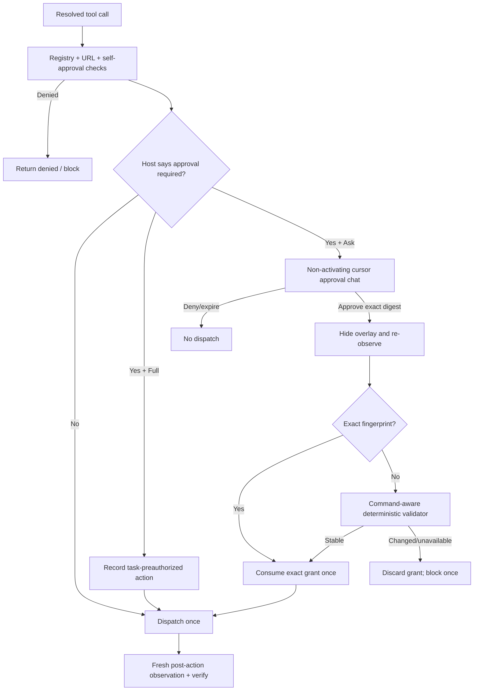

# Plan: Approval Modes and Stable Desktop Resume

## Summary

Add two explicit, host-owned action-approval modes and fix the false stale-screen failure that currently prevents an approved desktop action from running. `ask_every_time` remains the safe default and keeps TroCode's existing exact, expiring, one-use approval boundary for click, drag, typing, and keypress operations. `fully_approved` is an explicit persistent user preference that pre-authorizes those prompts for newly created tasks without weakening tool availability, public-target checks, self-approval denial, budgets, observation grounding, unknown-outcome handling, or post-action verification.

The current failure is deterministic: `CuaService.observe()` SHA-256 hashes every screenshot byte, while `TaskExecutionCoordinator.resumeHeldApproval()` requires the second full-screen hash to be identical. Moving the pointer to the cursor approval card, focus/compositor changes, clocks, and other unrelated pixels therefore invalidate the grant even when the intended target did not move. Replace that byte-identical full-screen gate with a command-aware, deterministic `DesktopStateValidator` that compares the approved target evidence, keep exact hash equality as a fast path, and keep the cursor approval window non-activating. This requires no additional LLM call and therefore does not add inference spend.

## User Story

As a TroCode user, I want to choose between host-confirmed actions and fully pre-approved actions, and I want an exact approval from the cursor card to execute against the unchanged target without opening TroCode or failing because the approval UI itself changed the screen.

## Problem → Solution

The approval card temporarily changes cursor/focus/screen pixels, then the coordinator compares two whole-screen cryptographic hashes and blocks the task before dispatch → Keep exact grants and fail-closed validation, but snapshot the trusted approval mode in each task, keep the cursor card non-activating, and validate the command's relevant visual anchor with a bounded deterministic image comparison instead of requiring every desktop pixel to remain byte-identical.

## Metadata

- **Complexity**: Large
- **Source PRD**: N/A
- **PRD Phase**: Standalone
- **Estimated Files**: 27-31 files, including tests and documentation
- **Database Migration**: None; task snapshots are JSONB and preferences are a version-tolerant local JSON file
- **Runtime Dependency**: None; Electron 43.4.0 already provides `nativeImage.crop()`, `resize()`, and `toBitmap()`
- **Cost Effect**: No new LLM call. The deterministic validator adds local image work only; avoiding false blocks/restarted tasks prevents repeated paid model sessions.
- **Existing Work to Preserve**: The dirty cursor-card/presentation edits in `src/index.css`, `src/index.ts`, `src/main/presentation/electron-presentation-presenter.ts`, its test, `src/renderer/GuidanceCallout.tsx`, and the new `src/renderer/CursorApprovalChat.tsx` are the UX foundation for this plan and must not be reverted.

---

## Decisions Locked by This Plan

### Mode semantics

| Mode | User-visible meaning | Policy behavior |
|---|---|---|
| `ask_every_time` | Ask before every operation the trusted host marks as approval-required | Preserve the current rule: click, drag, type, and keypress require an exact grant; scroll and read-only operations do not. Sensitive declared consequences can escalate but never downgrade this minimum. |
| `fully_approved` | Run approval-required actions without per-action prompts | Convert only the policy's `needs_approval` result to host pre-authorization. All hard denials and all execution/budget/freshness/verification invariants remain active. |

“Fully approved” suppresses action-approval prompts; it does not suppress clarification when information is missing, OS permission onboarding, membership/authentication, budget attention, CAPTCHA, provider errors, or an actual target-state mismatch.

### Preference and task lifetime

- Persist the selected default in `AppPreferences`; default old/missing records to `ask_every_time`.
- Require an explicit acknowledgement before saving `fully_approved` in Settings.
- Read the preference inside the trusted main-process application service, never from a renderer-supplied task request.
- Copy the selected mode into a new immutable host-owned Task Contract v5 when a task is submitted.
- A settings change applies to future tasks only. An already running or persisted task keeps the mode captured in its contract.
- Persisted v2/v3/v4 tasks parse as `ask_every_time`; do not rewrite historical JSONB rows.

### Safety boundary

`fully_approved` does **not** bypass:

- unsupported or unavailable runtime tools/operations;
- non-public, credential-bearing, non-HTTPS, localhost, or private-network URL denial;
- the terminal denial that prevents the model from operating TroCode's own approval controls;
- task model/tool/image/time/micro-USD limits and hosted daily/monthly budgets;
- current observation-ID grounding and normalized coordinate mapping;
- cancellation and membership/authentication checks;
- post-action observation and verification;
- the do-not-repeat rule after an unknown action outcome;
- blocking after an unknown consequential/pre-authorized action.

### Stable-state validation

1. The held approval stores the exact in-memory `DesktopObservation` used to resolve the action, in addition to the exact normalized invocation/digest.
2. A second observation still occurs before dispatch in `ask_every_time`.
3. Exact fingerprint equality is the zero-cost fast path.
4. If full fingerprints differ, compare deterministic visual evidence selected from the trusted command:
   - click/scroll: a bounded crop centered on the screenshot-coordinate target;
   - drag: the expanded bounding rectangle covering both endpoints;
   - type/keypress: a downsampled whole-screen structural comparison because there is no trusted coordinate anchor.
5. Require identical screenshot/coordinate dimensions. Missing/degraded/undecodable evidence fails closed unless the original and current exact fingerprints match.
6. Normalize each selected region to a fixed-size grayscale/edge signature and compare named conservative thresholds. Ignore only a small changed-cell ratio so cursor pixels, antialiasing, clock ticks, and focus shimmer do not invalidate the target.
7. A moved window, changed target row/button, obscuring overlay, changed dimensions, or material structural difference remains `changed`; discard the grant and block once as today.
8. Never call an LLM to decide whether the image changed.

Initial named constants should live beside the validator and be covered by fixtures, not scattered in the coordinator:

```ts
const TARGET_REGION_MIN_WIDTH = 160;
const TARGET_REGION_MAX_WIDTH = 320;
const TARGET_REGION_MIN_HEIGHT = 120;
const TARGET_REGION_MAX_HEIGHT = 240;
const TARGET_SIGNATURE_SIZE = { width: 64, height: 64 } as const;
const GLOBAL_SIGNATURE_SIZE = { width: 96, height: 54 } as const;
const MATERIAL_LUMA_DELTA = 24;
const MAX_CHANGED_CELL_RATIO = 0.025;
const MAX_MEAN_LUMA_DELTA = 6;
```

Treat these as conservative starting values. The implementation must keep them named/injected for tests and tune only from synthetic fixtures plus packaged manual validation; a permissive threshold must not be chosen merely to make the current screenshot pass.

---

## UX Design

### Before

```text
Target app visible
   → model proposes click/type
   → cursor approval chat appears
   → user clicks Approve
   → cursor/focus pixels change
   → full-screen SHA-256 differs
   → task blocks and TroCode main window opens
   → user must retry, causing more model work
```

Settings have no action-approval mode.

### After

```text
Settings → Action approvals

  (●) Ask every time (recommended)
      Exact cursor-card approval at host-required actions.

  (○) Fully approved
      No per-action approval prompts for new tasks.
      [ ] I understand consequential actions may run automatically.
```

Ask flow:

```text
Target app stays active
   → non-activating cursor chat appears beside cursor
   → user clicks Approve in place; main app stays closed
   → card clears, host re-observes
   → exact hash OR target-aware validator says stable
   → consume exact grant once → dispatch → re-observe/verify
```

Fully approved flow:

```text
Model proposes action
   → hard host checks run
   → approval-required action is marked task-preauthorized
   → dispatch once → re-observe/verify
   → no approval card and no approval-resume model sample
```

### Interaction Changes

| Touchpoint | Before | After | Notes |
|---|---|---|---|
| Settings | No approval preference | Two radio-card options with warning acknowledgement | Default is `ask_every_time`; applies to new tasks |
| Task creation | Runtime creates v4 with a fixed policy | Application service reads trusted preference and runtime creates v5 | Renderer cannot choose mode in `SubmitTaskRequest` |
| Policy | Every desktop mutation reaches `needs_approval` | Ask stays identical; Full returns `allowed/task_preapproved` | Hard denials run first in both modes |
| Cursor card | Temporarily becomes focusable | Receives mouse input while remaining non-focusable/non-activating | Preserve inline chat and Approve/Deny buttons |
| Approval resume | Full-screen hash equality | Exact fast path, then command-aware visual validation | No model call |
| Failure | Any pixel difference blocks | Only material target evidence change blocks | A real mismatch still reveals the task record |
| Running task after setting change | Undefined | Contract snapshot wins | Prevents mid-task authority changes |
| Audit | Exact grant only | Exact grant or explicit task-preauthorized policy reason | No fake `ActionApprovalGrant` in Full mode |

---

## Mandatory Reading

| Priority | File | Lines | Why |
|---|---|---:|---|
| P0 | `src/main/agent/execution-coordinator.ts` | 90-119, 781-917, 919-1021, 1063-1079 | Held approval, policy branch, stale-state check, unknown-consequence flag, dispatch, and observation lifecycle |
| P0 | `src/main/agent/policy.ts` | 17-69, 126-175 | Pure host decision ordering and blanket desktop-mutation approval rule |
| P0 | `src/main/agent/task-runtime.ts` | 121-152, 217-231, 359-463, 530-590 | Contract creation, direct action, exact approval creation/decision/consumption |
| P0 | `src/main/cua/cua-service.ts` | 263-319 | Current observation capture and exact full-screenshot SHA-256 fingerprint |
| P0 | `src/main/agent/execution-contracts.ts` | 18-42, 44-105, 107-152 | Observation/image/coordinate and command schemas |
| P0 | `src/main/agent/task-contract.ts` | 1-59 | Host-owned v4 creation and legacy limit helpers |
| P0 | `src/shared/contracts.ts` | 44-94, 101-189, 229-269, 311-403, 480-492, inferred types at end | Sensitive actions, contract versions, approvals, task snapshots, preferences, and IPC schemas |
| P0 | `src/index.ts` | 201-243, 461-521, 1323-1359 | Coordinator composition, capture preparation, interaction focus/mouse behavior, and guidance-window construction |
| P0 | `src/renderer/GuidanceCallout.tsx` | approval rendering branch | Existing inline cursor approval interaction to preserve |
| P0 | `src/renderer/CursorApprovalChat.tsx` | all | Current dirty inline chat, exact buttons, details disclosure, and no-open-app behavior |
| P1 | `src/main/application/task-application-service.ts` | 1-40 | Main-process use-case owner that should read the trusted preference before submit |
| P1 | `src/main/preferences/app-preferences-service.ts` | 1-73 | Existing port + file adapter + service pattern and 0600 local persistence |
| P1 | `src/renderer/SettingsPage.tsx` | 1-35, 63-235 | Controlled settings form and save pattern |
| P1 | `src/renderer/App.tsx` | 697-742, 930-950, 1131-1168, 1804-1840 | Preference loading/drafts/save/hasChanges/settings props |
| P1 | `src/shared/desktop-api.ts` | 35-141 | Narrow API; existing preferences IPC should be reused rather than adding an authority channel |
| P1 | `src/preload.ts` | preference and task methods | Parse requests and results at both sides of IPC |
| P1 | `src/main/ipc/register-ipc.ts` | 257-327 | Authenticated preferences/task/approval handlers and async task submission |
| P1 | `src/main/presentation/electron-presentation-presenter.ts` | 20-43 | Existing dirty fix that suppresses main-window reveal while an interaction is pending |
| P1 | `src/main/inference/image-evidence.ts` | all | Existing injected Electron image-adapter pattern to mirror |
| P1 | `src/renderer/app-language.ts` | translation map and `translate` | English/Vietnamese settings copy must use existing localization |
| P1 | `docs/testing/approval-loop-prevention.tdd.md` | all | Regression evidence proving model-declared benign consequences must not downgrade Ask mode |
| P1 | `docs/security.md` | 37-47, 109-122 | Existing authority and release guarantees to update precisely |
| P1 | `docs/computer-use-lifecycle.md` | 7-63 | Current exact-fingerprint and all-mutations-approval documentation |
| P2 | `.claude/PRPs/plans/completed/codex-style-unified-agent-loop.plan.md` | approval/lifecycle sections | Unified assistant-or-tool and exact-grant predecessor decisions |
| P2 | `.claude/PRPs/plans/completed/cost-aware-inference-and-presentation-architecture.plan.md` | architecture, application, presentation, cost invariants | OOP shell + functional core and no-extra-model-call constraints |
| P2 | `.claude/PRPs/plans/completed/fully-wired-guidance-narration.plan.md` | auxiliary-window/presentation sections | Non-focusable overlay, trusted sender, cleanup, and dirty-worktree preservation patterns |
| P2 | `.claude/PRPs/plans/general-purpose-gpt-led-agent.plan.md` | concrete policy and risks | Host authority must not depend on model labels |
| P2 | `.claude/PRPs/reports/codex-style-unified-agent-loop-report.md` | all | Actual unified loop and stale-approval implementation |
| P2 | `.claude/PRPs/reports/cost-aware-inference-and-presentation-architecture-report.md` | all | Actual class boundaries, v4, and cost controls |
| P2 | `.claude/PRPs/reports/fully-wired-guidance-narration-report.md` | all | Actual interaction-window integration and verification baseline |

`docs/CODEX-NAVIGATION-GUIDE.md`, referenced by `AGENTS.md`, is absent in this worktree. Do not block on it; use the checked-in files above.

## External Documentation

| Topic | Source | Key Takeaway |
|---|---|---|
| Non-activating Electron window | [Electron BrowserWindow](https://www.electronjs.org/docs/latest/api/browser-window) | `showInactive()` shows without focusing; `setFocusable(false)` prevents focus on macOS/Windows; `setIgnoreMouseEvents(false)` restores mouse delivery. `showInactive()` is not supported on Wayland, so retain fail-closed validation and include platform QA. |
| First click into inactive window | [Electron BaseWindow options](https://www.electronjs.org/docs/latest/api/base-window) | `acceptFirstMouse: true` on macOS lets the first click reach web content. The guidance window already sets it and should remain non-focusable. |
| Deterministic image regions | [Electron nativeImage](https://www.electronjs.org/docs/latest/api/native-image) | Electron 43 supports `crop`, `resize`, and sRGB-normalized `toBitmap()`; use these through an injected adapter. `toBitmap()` format is platform-dependent, so comparison fixtures must be same-platform and the implementation should compare corresponding byte groups rather than persist raw bitmaps. |

### Research Findings

`KEY_INSIGHT`: `showInactive()` alone is insufficient if TroCode later calls `setFocusable(true)` on the approval window. `APPLIES_TO`: `setGuidanceWindowInteractive`. `GOTCHA`: keep focusability false and toggle mouse ignoring independently; verify actual button clicks in packaged macOS/Windows and fail closed on unsupported window managers.

`KEY_INSIGHT`: Electron 43 normalizes `NativeImage.toBitmap()` to sRGB. `APPLIES_TO`: deterministic grayscale signature generation. `GOTCHA`: do not store or log bitmap/screenshot content, and do not assume persisted fingerprints are portable across OSes.

---

## Unified Discovery Table

| Category | File:Lines | Existing Pattern | Plan Use |
|---|---|---|---|
| Similar implementation | `src/main/inference/image-evidence.ts:3-40` | Small injected adapter around `nativeImage` with fail-closed degradation | Mirror for desktop-state comparison |
| Naming | `TaskExecutionCoordinator`, `AppPreferencesService`, `ElectronPresentationPresenter` | Noun-oriented stateful classes; verb methods | Add `TargetAwareDesktopStateValidator`; avoid a new manager/god object |
| Error handling | `execution-coordinator.ts:880-906` | Discard grant, return `not_executed`, block, cleanup | Preserve for a material validation mismatch only |
| Logging | `cua-service.ts:110-133, 284-292` | Namespaced status/shape metadata without screenshot contents | Log validator reason/region kind/score only, never pixels or target text |
| Types | `shared/contracts.ts` | Zod schema first, inferred TypeScript types | Add approval enum, v5, and preference fields |
| Tests | `execution-coordinator.test.ts:302-452, 639-721` | FakeAgent/Fake CUA integration with exact approval | Extend with focus/cursor-only stable fixtures and real target-change fixture |
| Configuration | `AppPreferencesService` | Validated local JSON defaults and atomic service update | Approval mode is a user preference, not an environment variable or Doppler secret |
| Dependencies | `package.json:74` | Electron 43.4.0 already installed | No package change |
| Entry | `App → preload → IPC → TaskApplicationService` | Narrow authenticated use case | Read mode in main application service before runtime submit |
| Data flow | `registry → policy → held grant → re-observe → dispatch` | Serialized exact action | Add policy authorization metadata and validator result |
| State | `TaskRuntime` + goal machine | Immutable snapshots/events; coordinator owns effects | Snapshot mode in contract; do not add a second lifecycle |
| Persistence | task JSONB + local preference JSON | Schema-version compatibility/defaults | v5 for new tasks, legacy as Ask, no SQL migration |
| Security | `policy.ts` hard denials before approval branch | Model cannot grant itself authority | Full mode changes only the approval branch |

### Five Traces

1. **Entry trace**: `App.sendInput` → `DesktopApi.submitTask` → preload parse → authenticated IPC → `TaskApplicationService.submitAndStart` → preference read → `TaskRuntime.submit(input, mode)` → v5 task starts.
2. **Ask data trace**: model tool call → registry normalizes against latest observation → policy returns `needs_approval` → cursor interaction → exact decision/grant → second observation → target-aware validator → consume once → dispatch → post-observation.
3. **Full data trace**: model tool call → registry/hard policy checks → policy returns `allowed/task_preapproved` → runtime audit event → dispatch once → post-observation.
4. **State trace**: Ask uses `planning → awaiting_approval → planning → observing → verifying → acting`; Full uses `planning → acting`; both return to verification/planning and preserve terminal/blocked transitions.
5. **Error trace**: invalid/unavailable/hard-denied calls never create approval; invalid approval/digest/expiry fails as today; material target mismatch discards and blocks; local validator failure is bounded, content-free, and fail-closed.

---

## Patterns to Mirror

### SCHEMA_FIRST_VERSIONED_CONTRACT

SOURCE: `src/shared/contracts.ts:148-189`

```ts
export const AgentTaskContractV4Schema = z.object({
  schemaVersion: z.literal(4),
  id: z.string().uuid(),
  originalRequest: z.string().min(2).max(8_000),
  approvalPolicy: z.object({
    alwaysConfirm: z.array(SensitiveActionSchema),
  }),
  limits: z.object({ /* bounded host limits */ }),
});
```

Add v5 instead of mutating historical semantics. Keep v2/v3/v4 in the union and use a helper that returns Ask for legacy contracts.

### PORT_ADAPTER_SERVICE

SOURCE: `src/main/preferences/app-preferences-service.ts:17-64`

```ts
export interface AppPreferencesStore {
  read(): Promise<unknown | null>;
  write(preferences: AppPreferences): Promise<void>;
}

export class AppPreferencesService {
  constructor(private readonly store: AppPreferencesStore) {}
}
```

Use an injected `DesktopImageAdapter` and a small `TargetAwareDesktopStateValidator` class. Keep region selection/signature comparison pure and separately testable.

### PURE_POLICY_ORDERING

SOURCE: `src/main/agent/policy.ts:126-175`

```ts
if (!toolRegistry.supports(action)) return denied;
if (!isTargetAdmissible(action)) return denied;
if (isTroCodeApprovalUiAction(action)) return terminalDenied;
if (requiresApproval(action)) return needsApproval;
return allowed;
```

Do not move the mode check above these denials. Only after `requiresApproval` is known may v5 Full convert it to `allowed` with `authorization: 'task_preapproved'`.

### EXACT_ONE_USE_GRANT

SOURCE: `src/main/agent/task-runtime.ts:401-463, 530-590`

The action digest, expiry, pending interaction ID, and consumption stay unchanged for Ask. Full creates no pending interaction and no synthetic approval grant.

### INJECTED_IMAGE_ADAPTER

SOURCE: `src/main/inference/image-evidence.ts:3-40`

```ts
export interface ImageEvidenceAdapter {
  create(data: Buffer): {
    getSize(): { height: number; width: number };
    resize(options: { width: number }): { toJPEG(quality: number): Buffer };
  };
}
```

Extend this style with only the methods needed by validation (`crop`, `resize`, `toBitmap`, `getSize`). Compose it in `src/index.ts` with `nativeImage.createFromBuffer`.

### NON_ACTIVATING_AUXILIARY_WINDOW

SOURCE: `src/index.ts:1327-1349`

```ts
guidanceWindow = new BrowserWindow({
  acceptFirstMouse: true,
  alwaysOnTop: true,
  focusable: false,
  // sandboxed webPreferences
});
guidanceWindow.setIgnoreMouseEvents(true, { forward: true });
```

Do not call `setFocusable(true)` for the approval card. Interactive means accepting mouse input, not taking application focus.

### CONTENT_FREE_LOGGING

SOURCE: `src/main/cua/cua-service.ts:284-292`

```ts
console.info('[cua] observation.captured', JSON.stringify({
  taskId,
  degraded: result.degraded,
  hasScreenshot: Boolean(image),
  coordinateSpace: coordinateSpace ?? null,
}));
```

New validation logs may contain `{ taskId, commandKind, result, reason, changedCellRatio, meanDelta }`; never screenshot bytes, task text, target description, OCR, or raw structured state.

### TEST_STRUCTURE

SOURCE: `src/main/agent/execution-coordinator.test.ts:81-145`

Use deterministic fake observations/FakeAgent/Fake CUA and assert phases, dispatch count, held grant consumption, and model sample count. Pixel comparator unit tests use generated byte buffers through a fake adapter; no live screen or paid provider.

---

## Strategic Architecture

### Core approval policy result

Make authorization explicit without creating a second policy layer:

```ts
export type PolicyDecision =
  | {
      status: 'allowed';
      authorization: 'not_required' | 'task_preapproved';
      summary: string;
      nextActions: string[];
    }
  | {
      status: 'needs_approval' | 'denied';
      terminal?: boolean;
      summary: string;
      nextActions: string[];
    };
```

`requiresApproval` remains host-owned and conservative. `taskApprovalMode(goal)` chooses Ask/Full only after hard checks. The coordinator passes `authorization === 'task_preapproved'` into the same consequential unknown-outcome branch currently used after exact approval.

### Desktop validator contract

```ts
export type DesktopStateValidation = {
  status: 'stable' | 'changed' | 'unavailable';
  reason:
    | 'exact_match'
    | 'target_region_stable'
    | 'target_region_changed'
    | 'global_structure_stable'
    | 'global_structure_changed'
    | 'dimensions_changed'
    | 'evidence_missing'
    | 'decode_failed';
  changedCellRatio?: number;
  meanLumaDelta?: number;
};

export interface DesktopStateValidator {
  validate(
    reference: DesktopObservation,
    current: DesktopObservation,
    command: DesktopCommand,
  ): DesktopStateValidation;
}

export class TargetAwareDesktopStateValidator
  implements DesktopStateValidator {
  constructor(
    private readonly images: DesktopImageAdapter,
    private readonly thresholds: DesktopStateThresholds = DEFAULT_THRESHOLDS,
  ) {}
}
```

The class owns decoding/cropping. Pure helpers own region selection, grayscale signature construction, and comparison. The coordinator consumes only the typed result.

### Approval lifecycle



### Cost behavior

- No extra Responses request is introduced for mode selection, risk classification, or image comparison.
- Ask already resumes the held invocation without asking the model to repeat it; preserve that.
- Full eliminates the approval pause and pre-dispatch CUA recapture for that action, but does not skip the required post-action observation.
- Avoiding false `blocked` states prevents the user from restarting the entire task and repaying its model/context cost.
- Do not add screenshots, visual signatures, approval mode, or target descriptions to hosted usage events. Fixed mode IDs may be used in local task/audit state if needed; analytics changes are out of scope unless privacy-reviewed.

---

## Files to Change

| File | Action | Justification |
|---|---|---|
| `src/shared/contracts.ts` | UPDATE | Add `ApprovalModeSchema`, v5 task contract, preference fields/defaults, and inferred types |
| `src/shared/contracts.test.ts` | UPDATE | v2/v3/v4 legacy Ask fallback, v5 mode parsing, preference defaults/rejections |
| `src/main/agent/task-contract.ts` | UPDATE | Create v5 with trusted mode and extend limit/mode helpers |
| `src/main/agent/task-contract.test.ts` | UPDATE | Host ownership, default legacy Ask, v5 limits and mode |
| `src/main/preferences/app-preferences-service.ts` | UPDATE | Default/persist mode and expose `getApprovalMode()` |
| `src/main/preferences/app-preferences-service.test.ts` | UPDATE | Old file fallback, Full round trip, invalid mode rejection, 0600 persistence |
| `src/main/application/task-application-service.ts` | UPDATE | Read mode through injected preferences service and make submit/start async |
| `src/main/application/task-application-service.test.ts` | UPDATE | Preference-before-submit ordering and immutable per-task mode |
| `src/index.ts` | UPDATE | Inject preferences and validator; keep approval window non-focusable; preserve dirty cursor-card sizing |
| `src/main/ipc/register-ipc.test.ts` | UPDATE | Async submit returns v5 while renderer cannot forge mode; existing cursor decision remains trusted |
| `src/preload.ts` | VERIFY/UPDATE | Existing preference channel parses new schema; no new action-authority IPC |
| `src/shared/desktop-api.ts` | VERIFY/UPDATE | Type expansion only; keep API narrow |
| `src/main/agent/policy.ts` | UPDATE | Mode-aware result after hard checks; explicit authorization metadata |
| `src/main/agent/policy.test.ts` | UPDATE | Ask parity, Full preauthorization, hard denials in both modes |
| `src/main/agent/task-runtime.ts` | UPDATE | Submit v5 mode, audit preauthorized action, preserve exact-grant validation |
| `src/main/agent/task-runtime.test.ts` | UPDATE | No grant in Full, exact grant in Ask, legacy behavior |
| `src/main/agent/desktop-state-validator.ts` | CREATE | Interface, injected target-aware validator, pure region/signature comparison |
| `src/main/agent/desktop-state-validator.test.ts` | CREATE | Pixel/crop/dimension/missing-evidence matrix |
| `src/main/agent/execution-coordinator.ts` | UPDATE | Hold reference observation, call validator, propagate preauthorized consequence flag |
| `src/main/agent/execution-coordinator.test.ts` | UPDATE | Root regression, two modes, actual target change, unknown preauthorized action |
| `src/main/presentation/electron-presentation-presenter.ts` | PRESERVE/UPDATE | Keep no-main-window behavior while interaction pending |
| `src/main/presentation/electron-presentation-presenter.test.ts` | PRESERVE/UPDATE | Assert pending approval never reveals main window |
| `src/renderer/SettingsPage.tsx` | UPDATE | Approval radio cards, warning, acknowledgement, controlled props |
| `src/renderer/SettingsPage.test.ts` | UPDATE | Static settings markup/default/warning/disabled-save coverage |
| `src/renderer/App.tsx` | UPDATE | Approval draft load/save/hasChanges/acknowledgement and settings props |
| `src/renderer/app-language.ts` | UPDATE | English/Vietnamese approval-mode copy |
| `src/index.css` | UPDATE | Preserve cursor chat CSS and add accessible mode-card/warning styles |
| `src/renderer/GuidanceCallout.tsx` | PRESERVE | Existing cursor-chat approval surface; no open-main path |
| `src/renderer/CursorApprovalChat.tsx` | PRESERVE/TEST | Inline Approve/Deny/details remains the Ask UI |
| `README.md` | UPDATE | Explain both modes, defaults, safety, and no-extra-LLM validation |
| `docs/architecture.md` | UPDATE | v5 contract, application ownership, policy authorization, validator port |
| `docs/security.md` | UPDATE | Explicit preauthorization boundary and invariants that Full cannot bypass |
| `docs/computer-use-lifecycle.md` | UPDATE | Command-aware resume validation replacing whole-screen byte identity |
| `docs/conversational-task-execution.md` | UPDATE | Ask/Full lifecycle diagrams and exact-grant behavior |
| `docs/testing/approval-mode-and-stable-resume.tdd.md` | CREATE | RED/GREEN evidence and packaged manual matrix |

## NOT Building

- No LLM-based risk classifier or screenshot-comparison call.
- No change to monthly/daily/task pricing, quotas, reservation tables, or Doppler variables.
- No relaxation of Ask mode based on the model's declared benign consequence.
- No per-action “remember forever” button inside the cursor card; mode changes live in Settings.
- No mid-task mode upgrade/downgrade.
- No automatic retry or continuation after a real target mismatch or unknown consequential outcome.
- No OS accessibility-element semantic detector or active-window restoration API in this delivery.
- No persistence of screenshots, visual signatures, raw structured state, or approval payloads beyond existing task state.
- No redesign of clarification, budget, permission, membership, or CAPTCHA interactions.
- No unrelated Realtime voice connection/cost changes.

---

## Step-by-Step Tasks

### Task 1: Lock the regression and mode boundary with failing tests

- **ACTION**: Add RED tests before production changes.
- **IMPLEMENT**:
  - Add a coordinator fixture whose original and post-approval screenshots differ only outside the command target and assert the approved command dispatches once.
  - Add a fixture whose target crop materially changes and assert no dispatch, grant discard, one block, no new model sample, and cleanup.
  - Add policy table cases for Ask/Full across click, drag, type, keypress, scroll, public URL, private URL, unsupported tool, and TroCode self-approval.
  - Add task-runtime/application tests proving Full produces no pending approval/grant and the renderer cannot submit a mode.
  - Add a presenter test asserting a pending cursor interaction never reveals the main window.
- **MIRROR**: `execution-coordinator.test.ts` FakeAgent/fake CUA setup at lines 81-145 and approval cases at 302-452/639-721.
- **IMPORTS**: Vitest, `randomUUID`, existing fake observation helpers, future `ApprovalMode` and validator result types.
- **GOTCHA**: The stable fixture must have different full SHA-256 fingerprints or it does not reproduce the bug. Keep test pixels synthetic/content-free.
- **VALIDATE**: Focused tests fail because mode fields/authorization/validator do not exist and current full-screen comparison blocks the stable fixture.

### Task 2: Add v5 approval contracts and legacy-safe preferences

- **ACTION**: Establish the schema and persistence contract.
- **IMPLEMENT**:
  - Add `ApprovalModeSchema = z.enum(['ask_every_time', 'fully_approved'])`.
  - Add `approvalMode` to `AppPreferencesSchema` with `.default('ask_every_time')` and require it in `UpdateAppPreferencesRequestSchema`.
  - Add `AgentTaskContractV5Schema` with the v4 limits, fixed `approvalPolicy`, and `approvalMode`; include it in `TaskContractSchema`.
  - Export `AgentTaskContract` as v5 for newly created tasks while `GoalSpec` remains the v2-v5 union.
  - Add `taskApprovalMode(goal)` returning v5 mode and Ask for v2-v4.
  - Extend `taskMaxToolCalls`/`taskMaxModelSamples` conditionals to v5 without changing numeric defaults.
  - Change `createTaskContract(originalRequest, approvalMode)` to emit v5; never accept mode in `SubmitTaskRequestSchema`.
- **MIRROR**: Existing v4 schema, `normalizeLegacyGoal`, preference defaults, and task-limit helpers.
- **IMPORTS**: Zod and existing sensitive-action/contract types only.
- **GOTCHA**: `UpdateAppPreferencesRequestSchema` currently uses non-null `primaryLanguage`; preserve onboarding behavior. Existing preference JSON without mode must parse via the default.
- **VALIDATE**: Shared/task-contract tests parse mixed v2-v5 snapshots, reject unknown modes, and show old tasks/preferences as Ask.

### Task 3: Persist the mode and snapshot it at trusted task creation

- **ACTION**: Keep renderer preference UX separate from execution authority.
- **IMPLEMENT**:
  - Add `approvalMode: 'ask_every_time'` to `EMPTY_PREFERENCES` and `getApprovalMode()` to `AppPreferencesService`.
  - Inject `Pick<AppPreferencesService, 'getApprovalMode'>` into `TaskApplicationService`.
  - Make `submitAndStart` async: parse/read trusted preference, call `runtime.submit(input, approvalMode)`, then `execution.start`.
  - Update `src/index.ts` construction and await-compatible IPC tests. `register-ipc.ts` already awaits an async handler, so do not create another channel.
  - Ensure a failed preference read fails task submission before model/CUA work rather than silently choosing Full.
- **MIRROR**: Existing `getPrimaryLanguage()` service method and application service submit-before-start ordering.
- **IMPORTS**: `ApprovalMode` type and `AppPreferencesService` type.
- **GOTCHA**: Never read the renderer draft or a `SubmitTaskRequest` field. The persisted main-process preference is the authority.
- **VALIDATE**: Tests prove order `get_mode → submit(mode) → start`, failure produces zero starts, and changing the store after submission does not change the task contract.

### Task 4: Make policy mode-aware without weakening hard checks

- **ACTION**: Express Ask versus Full in the existing pure policy.
- **IMPLEMENT**:
  - Convert `PolicyDecision` to the discriminated form in Strategic Architecture.
  - Keep registry, URL, and self-approval denials before any mode branch.
  - Keep `requiresApproval(action)` unchanged so model labels cannot lower Ask mode.
  - If approval is required and `taskApprovalMode(goal) === 'ask_every_time'`, return `needs_approval` unchanged.
  - If approval is required and mode is Full, return `allowed`, `authorization: 'task_preapproved'`, and an audit-safe summary.
  - Ordinary allowed actions return `authorization: 'not_required'`.
  - Update all callers/tests to use the authorization field; do not infer consequence from status text.
- **MIRROR**: Current pure ordered early returns in `evaluateAction`.
- **IMPORTS**: `taskApprovalMode` only; do not import preferences into policy.
- **GOTCHA**: `consumeApprovalGrant()` deliberately expects Ask policy to still return `needs_approval`. Full must never create/consume a grant.
- **VALIDATE**: Policy tests show identical denials in both modes and only approval-required allowed results differ.

### Task 5: Preserve audit and unknown-outcome safety for preauthorized actions

- **ACTION**: Route Full through the safe execution path without pretending the user clicked an exact grant.
- **IMPLEMENT**:
  - Let `TaskRuntime.beginAllowedAction()` recompute policy and record an acting event whose summary distinguishes ordinary versus task-preauthorized action without storing raw parameters.
  - In coordinator `handleAction`, pass `policy.authorization === 'task_preapproved'` as the consequential/preauthorized flag to `dispatchAction`.
  - Rename `approvedConsequentialAction` to `consequentiallyAuthorizedAction` (or equivalent) so it covers exact grants and task preauthorization.
  - Preserve the current block/cleanup when that action returns `unknown`.
  - Keep `unknownActionDigests` identical and do not retry.
- **MIRROR**: `beginAllowedAction` and `dispatchAction` unknown branch at lines 1011-1018.
- **IMPORTS**: Policy decision type only.
- **GOTCHA**: Full is authorization, not evidence of success. Post-action observation and completion review remain required.
- **VALIDATE**: Coordinator tests prove Full skips `requestApproval`, dispatches once, captures a post-action observation, and blocks an unknown preauthorized action.

### Task 6: Implement the target-aware desktop state validator

- **ACTION**: Replace false whole-screen invalidation with a deterministic, fail-closed validation port.
- **IMPLEMENT**:
  - Create `DesktopStateValidator`, `DesktopStateValidation`, `DesktopImageAdapter`, threshold types/defaults, and `TargetAwareDesktopStateValidator`.
  - Fast-path exact fingerprint equality before decoding.
  - Validate both screenshots, coordinate spaces, and dimensions.
  - Select/clamp the command region using screenshot coordinates:
    - click/scroll: proportional bounded crop centered on `(x, y)`;
    - drag: endpoint rectangle plus proportional padding, clamped to image;
    - type/keypress: whole image.
  - Resize selected regions to the fixed signature size, call sRGB `toBitmap()`, group corresponding pixel bytes, derive grayscale plus simple adjacent-edge magnitude, and calculate mean delta/material-cell ratio.
  - Return typed reasons/scores, never throw raw decoder/provider details to the user. Decode/shape errors return `unavailable`.
  - Keep functions deterministic and no I/O beyond the injected adapter.
- **MIRROR**: `resizeObservationForModel` adapter/catch behavior and execution-contract coordinate helpers.
- **IMPORTS**: `DesktopCommand`, `DesktopObservation`, `Buffer`; no package.
- **GOTCHA**: `open_url`, `direct_tool`, and `point` are not held mutating desktop approvals. If encountered, return `unavailable` rather than inventing a region. Do not use model description/target text to choose pixels.
- **VALIDATE**: Unit matrix covers exact, cursor-sized noise, unrelated-region change, target-region change, drag endpoint/path change, type global change, dimension mismatch, missing screenshot, degraded evidence, invalid bitmap length, and threshold boundaries.

### Task 7: Integrate reference evidence into held-approval resume

- **ACTION**: Use the validator at the exact pre-dispatch boundary.
- **IMPLEMENT**:
  - Extend `HeldApproval` with `referenceObservation?: DesktopObservation` captured from `context.latestObservation` when the desktop invocation is held.
  - Assert the held input observation ID/fingerprint matches that reference before presenting approval; malformed state returns `not_executed` and does not create an approval.
  - Make `desktopStateValidator` a required `TaskExecutionCoordinator` dependency. Production injects `TargetAwareDesktopStateValidator`; tests inject that class or an explicit fake result. Do not provide an implicit fallback that can accidentally preserve the broken production behavior.
  - After approval, capture current observation and call validator with reference/current/command.
  - Stable → finish verification transition, consume exact grant, clear held state, dispatch once.
  - Changed/unavailable → discard grant, append bounded `not_executed`, clear held state, block/cleanup once with a reason that distinguishes “target changed” from internal unavailable evidence without revealing pixels.
  - Log content-free validation metadata.
- **MIRROR**: Existing resume ordering at lines 849-917 and one-block loop prevention test.
- **IMPORTS**: Validator interface/result and `DesktopControlToolInput`/command types.
- **GOTCHA**: Do not overwrite `context.latestObservation` reference before saving it. The new current observation may become tool evidence for the blocked result, but it cannot silently mutate the held action/digest.
- **VALIDATE**: Original failing regression goes green; exact-match and real-change tests remain green; no second model sample or duplicate approval occurs during resume.

### Task 8: Keep the cursor approval chat clickable without activating TroCode

- **ACTION**: Remove focus theft while preserving inline Approve/Deny.
- **IMPLEMENT**:
  - Change `setGuidanceWindowInteractive` to keep `setFocusable(false)` and toggle only `setIgnoreMouseEvents`.
  - Preserve `acceptFirstMouse: true`, `showInactive()`, sandbox/context isolation, trusted auxiliary IPC sender checks, and the dirty `CursorApprovalChat` UI.
  - Clear/hide the interaction before re-observation and keep the existing 120 ms compositor-settle boundary.
  - Preserve the dirty presenter condition that does not reveal main while a pending interaction exists.
  - If an actual mismatch blocks after the interaction clears, allow the normal `needs_attention` policy to reveal main so the failure is visible.
- **MIRROR**: Existing non-focusable companion/voice windows and current guidance constructor.
- **IMPORTS**: No new imports.
- **GOTCHA**: Electron documents `showInactive` limitations on Wayland. Do not “fix” platform behavior by making the window focusable; target validation must fail closed and manual QA must cover supported platforms.
- **VALIDATE**: Fake window/source tests assert no `setFocusable(true)`; packaged macOS manual test clicks both buttons while the target app stays active and executes the correct action.

### Task 9: Add the Settings UX and explicit Full acknowledgement

- **ACTION**: Let the user choose the persistent default safely and clearly.
- **IMPLEMENT**:
  - Add controlled `approvalMode`, `onApprovalModeChange`, and Full acknowledgement props/state to `SettingsPage`/`App`.
  - Add an “Action approvals” section before voice settings with two radio cards and descriptions from Decisions Locked.
  - Selecting Full reveals a warning and unchecked acknowledgement. Disable Save while Full is selected without acknowledgement.
  - A previously saved Full preference may render as selected, but changing away/back requires acknowledgement again before save.
  - Include mode in load, update, `hasChanges`, success copy, and error fallback.
  - Add English/Vietnamese translation entries and accessible fieldset/legend/radio labels/status text.
  - Do not expose a mode selector in the cursor card or task submission payload.
- **MIRROR**: Controlled app/voice language settings and `.settings-toggle` visual/accessibility conventions.
- **IMPORTS**: `ApprovalMode` from shared contracts.
- **GOTCHA**: The acknowledgement is a one-time Settings safety confirmation, not an exact action grant and not part of the task contract. Avoid language that promises TroCode can bypass OS/provider restrictions.
- **VALIDATE**: Settings tests cover default Ask, Full warning, acknowledgement/save enablement, Vietnamese copy, saved Full load, mode-only `hasChanges`, and invalid update rejection.

### Task 10: Documentation, regression report, and release validation

- **ACTION**: Align architecture/security/lifecycle docs and capture evidence.
- **IMPLEMENT**:
  - Update README and architecture diagrams with trusted preference → v5 contract → pure policy → Ask/Full paths.
  - Update security wording from unconditional approval to “Ask requires exact approval; Full is explicit host preauthorization,” followed by the invariant list.
  - Replace “any fingerprint change invalidates” in computer-use docs with exact fast path + target-aware fail-closed validation.
  - Document that validation is local/deterministic and adds no LLM spend.
  - Add `docs/testing/approval-mode-and-stable-resume.tdd.md` with RED/GREEN commands, test matrix, manual cross-app evidence, and any platform limitations.
  - Review the final diff against the existing dirty cursor-card work; do not reset or duplicate it.
- **MIRROR**: Existing approval-loop TDD report and completed PRP reports.
- **IMPORTS**: N/A.
- **GOTCHA**: Do not claim target-aware comparison is semantic understanding. It is a conservative structural stability check.
- **VALIDATE**: Focused tests, full checks, package, diff review, and manual matrix below pass.

---

## Testing Strategy

### Unit Tests

| Test | Input | Expected Output | Edge Case? |
|---|---|---|---|
| Legacy task mode | v2/v3/v4 contract | `ask_every_time` | Yes |
| New Ask task | persisted Ask preference | v5 Ask contract | No |
| New Full task | persisted Full preference | v5 Full contract | No |
| Forged mode | renderer task request with extra/invalid mode | rejected/stripped by strict schema; main preference wins | Yes |
| Ask mutation | click/drag/type/keypress | `needs_approval` | No |
| Full mutation | same actions | `allowed/task_preapproved` | No |
| Hard denial in Full | private URL/unavailable/self-approval | denied, no dispatch | Yes |
| Exact stable state | equal fingerprints | stable fast path | No |
| Cursor noise | a few changed cells outside/inside tolerance | stable | Yes |
| Unrelated animation | full hash changes outside click crop | stable | Yes |
| Target changed | button/row pixels change in crop | changed, no dispatch | Yes |
| Drag target changed | pixels near endpoint/path change | changed | Yes |
| Type focus/global change | material whole-screen change | changed | Yes |
| Evidence missing | no screenshot/decode failure/dimension mismatch | unavailable, no dispatch | Yes |
| Exact Ask consumption | approved digest + stable state | consume once and dispatch once | No |
| Full unknown | preauthorized action returns unknown | block and cleanup, no retry | Yes |
| Mode changes mid-task | preference changed after v5 creation | existing contract unchanged | Yes |
| Cursor presentation | pending approval | no main reveal; window remains non-focusable | Yes |

### Integration/Eval Cases

| Request | Ask | Fully approved |
|---|---|---|
| “Read the newest Gmail message” | Cursor approval for the mutation under current conservative policy; approving executes without false screen-change block | Opens/reads without approval card, then verifies |
| “Type this draft but do not send” | Exact type approval; no send | Types without prompt; still does not send unless model proposes it |
| “Send this email” | Exact send approval with payload | Sends without per-action prompt, then verifies; unknown result blocks |
| “Delete that email” | Exact delete approval | Deletes without per-action prompt, then verifies; unknown result blocks |
| Model tries to click “Approve exact action” | Terminal host denial | Same terminal denial |
| Screen target truly changes while card is open | Grant discarded, no action | N/A because no wait; action remains grounded in latest observation and post-verified |

### Edge Cases Checklist

- [ ] Missing/old/corrupt preference file.
- [ ] Invalid mode sent through preference IPC.
- [ ] Preference read failure before task start.
- [ ] Active v5 task while setting changes.
- [ ] Persisted mixed v2/v3/v4/v5 history.
- [ ] Approval deny and expiry.
- [ ] Approval decision from untrusted renderer/frame.
- [ ] Card clicked while target is on another display/high-DPI display.
- [ ] Crops at every screen edge and drag across edges.
- [ ] Same dimensions but target window moved.
- [ ] Different screenshot dimensions/display layout.
- [ ] Cursor/clock/spinner-only differences.
- [ ] Actual target content/button/row changed.
- [ ] Screenshot missing/degraded/invalid bitmap.
- [ ] App cancelled during validation.
- [ ] Consequential Full action returns unknown.
- [ ] Wayland/non-supported inactive-window behavior.
- [ ] No screenshot/signature/pixel data in logs, analytics, history, or renderer contracts.
- [ ] Existing dirty cursor-card CSS/component/presenter changes preserved.

---

## Validation Commands

### Focused Tests

```bash
npx vitest run \
  src/shared/contracts.test.ts \
  src/main/preferences/app-preferences-service.test.ts \
  src/main/application/task-application-service.test.ts \
  src/main/agent/task-contract.test.ts \
  src/main/agent/policy.test.ts \
  src/main/agent/task-runtime.test.ts \
  src/main/agent/desktop-state-validator.test.ts \
  src/main/agent/execution-coordinator.test.ts \
  src/main/presentation/electron-presentation-presenter.test.ts \
  src/main/ipc/register-ipc.test.ts \
  src/renderer/SettingsPage.test.ts \
  src/renderer/companion-interaction.test.ts
```

EXPECT: Both modes and the stable/changed validator matrix pass without network/native CUA/provider calls.

### Required Repository Checks

```bash
npm run check
npm run package
```

EXPECT: Lint, TypeScript, all Vitest/script/API tests, and Electron Forge package pass, as required by `AGENTS.md`.

### Diff and Dependency Review

```bash
git diff --check
git status --short
git diff -- package.json package-lock.json
rg -n "setFocusable\(true\)|current\.fingerprint !== input\.observationFingerprint" src
rg -n "approvalMode|task_preapproved|DesktopStateValidator" src docs README.md
```

EXPECT:

- no new dependency;
- no focusable approval window;
- no direct whole-screen fingerprint inequality as the sole resume decision;
- mode and validator references appear only at intended boundaries;
- unrelated dirty files remain preserved.

### Manual Packaged Validation

- [ ] Save Ask mode, restart app, confirm it persists and a new task contract is Ask.
- [ ] In Gmail or another target app, request a click/type action; cursor chat appears without opening main.
- [ ] Click Approve; target app remains active, card clears, action executes once, and task continues.
- [ ] Repeat with cursor movement, clock tick, hover change, and harmless animation; no false block.
- [ ] Change/obscure/move the actual target while card is open; approval is discarded and nothing executes.
- [ ] Deny; nothing executes and model continues safely.
- [ ] Save Full with acknowledgement, restart, and confirm a new task executes click/type without a card.
- [ ] Under Full, verify private URL, self-approval, unsupported tool, task budget, Stop/Escape, and unknown outcome safeguards still work.
- [ ] Change mode while a task is active; confirm it affects only the next task.
- [ ] Test high-DPI and multi-display target coordinates.
- [ ] Inspect logs/history/analytics for absence of screenshots, bitmaps, target text, and approval payloads.
- [ ] On Windows and supported Linux display systems, validate non-activating button behavior; record Wayland limitations rather than weakening focus safety.

---

## Acceptance Criteria

- [ ] Settings exposes `Ask every time` and `Fully approved`, with Ask as the default and an explicit acknowledgement to save Full.
- [ ] The preference persists locally and applies only to newly created tasks.
- [ ] New tasks use host-owned contract v5 with an immutable approval mode; v2-v4 remain readable as Ask.
- [ ] Renderer task input cannot grant Full mode.
- [ ] Ask preserves exact, expiring, one-use approval for every current host-required desktop mutation.
- [ ] Full suppresses those prompts but cannot bypass hard policy denials or any budget/freshness/verification/unknown-outcome invariant.
- [ ] Full preauthorization is audited without manufacturing an `ActionApprovalGrant`.
- [ ] Unknown preauthorized consequential actions block and are never retried.
- [ ] Clicking cursor-card Approve/Deny does not reveal or focus the main TroCode window.
- [ ] An approved action executes once when its target evidence remains materially stable, even if unrelated full-screen pixels changed.
- [ ] A materially changed/moved/obscured target or unavailable evidence discards the grant and executes nothing.
- [ ] The validator is deterministic/local and makes no LLM/provider call.
- [ ] Post-action observation/verification remains mandatory.
- [ ] No screenshot/signature/pixel content is persisted or logged.
- [ ] Existing cursor-chat/presentation dirty work is preserved.
- [ ] `npm run check` and `npm run package` pass.

## Completion Checklist

- [ ] RED tests recorded before behavior change.
- [ ] v5/legacy/preference schemas complete.
- [ ] Trusted task creation snapshots mode.
- [ ] Pure policy returns explicit authorization metadata.
- [ ] Full unknown-outcome safety retained.
- [ ] Target-aware validator and fixtures complete.
- [ ] Held approval stores exact reference observation.
- [ ] Cursor card stays non-activating and inline.
- [ ] Settings acknowledgement/localization/accessibility complete.
- [ ] Architecture/security/lifecycle/testing docs updated.
- [ ] No new runtime dependency or env variable.
- [ ] Focused/full/package/manual validation complete.
- [ ] Diff contains no reverted user changes.
- [ ] Self-contained: implementation requires no additional architecture decision.

## Risks

| Risk | Likelihood | Impact | Mitigation |
|---|---|---|---|
| Visual threshold accepts a changed target | Low-Medium | High | Conservative target crop, structural+mean metrics, dimension checks, fail closed, real-change fixtures, packaged manual matrix |
| Visual threshold rejects harmless compositor differences | Medium | Medium | Exact fast path, command-aware crop, normalized signature, named tunable thresholds, cursor/clock/focus fixtures |
| Non-focusable window does not receive clicks on a platform/window manager | Medium | Medium | Keep `acceptFirstMouse`, platform manual QA, keyboard exact shortcut/fallback, fail closed; never make focus theft the silent fallback |
| Full mode is enabled accidentally | Low | High | Ask default, explicit Settings warning/acknowledgement, applies to future tasks only, visible selected state |
| Full is mistaken for removal of all safeguards | Medium | High | Explicit policy authorization type, hard checks first, tests for every denial/budget/unknown path, precise UI/docs copy |
| Mode change mutates active authority | Low | High | Immutable v5 task snapshot and application-service provider test |
| Legacy history/preferences fail parsing | Medium | Medium | v2-v5 union, preference defaults, mixed fixtures, no in-place migration |
| Full bypass loses consequential unknown block | Medium | High | Propagate `task_preapproved` into renamed consequential authorization flag and dedicated integration test |
| Screenshot comparison leaks private data | Low | High | In-memory only, typed score logs only, no renderer/persistence/analytics fields |
| Dirty cursor-card work is overwritten | Medium | Medium | Treat listed modifications as baseline, patch incrementally, review per-file diff, never reset |

## Notes

- The observed failed task `25f72796-72e4-45de-8275-9213d8d1bdc0` moved from approval to re-observation and blocked about 300 ms later. The main window reveal happened after the block; it was a symptom, not the cause. The root cause is the exact full-screen hash gate combined with cursor/focus/UI changes.
- Ask retains the current conservative host boundary because prior RED/GREEN evidence showed that trusting the model's benign consequence label would allow approval bypass. This plan does not reopen that risk.
- The approval mode is a local user preference, not a quota or secret; it does not belong in Doppler.
- The validator intentionally does not understand semantics. It answers only whether the trusted command's visual evidence remained structurally stable enough to execute the exact held action.
- If target-aware validation cannot be made conservative on a platform, fail closed in Ask mode and document the platform limitation. Do not silently fall back to unconditional execution.

## Confidence

**9/10.** The root cause, call sequence, policy boundary, preference flow, presentation behavior, and test surfaces are all traced. The remaining implementation risk is calibrating deterministic pixel thresholds across supported displays/window managers; the design contains that risk behind an injected class, fails closed, and requires packaged cross-application validation.

## Completion

Implemented and validated on 2026-08-18. See
`.claude/PRPs/reports/approval-modes-and-stable-desktop-resume-report.md`.
