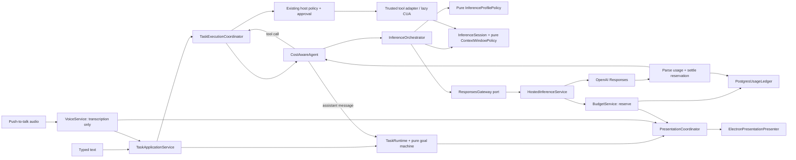
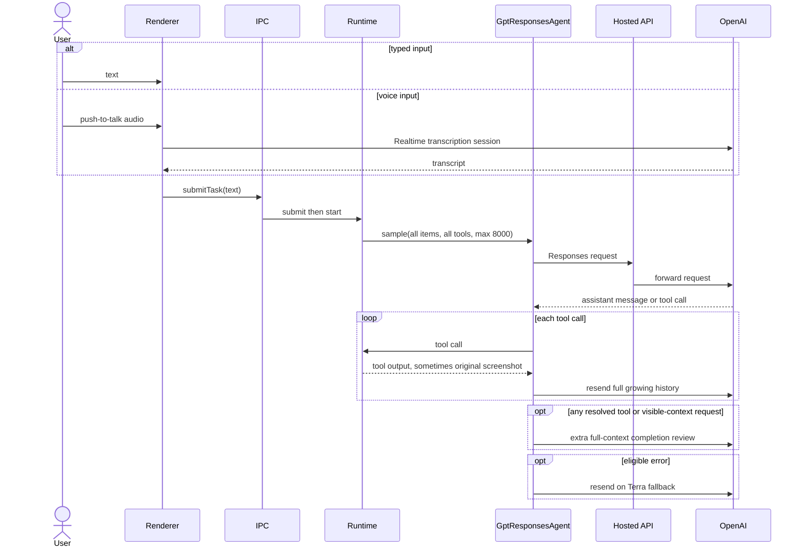

# Plan: Cost-Aware Inference and Presentation Architecture

## Summary

Refactor TroCode's paid-model path into a cost-governed inference subsystem while preserving the existing one-session assistant-or-tool behavior, 15-phase task lifecycle, host policy, approval rules, lazy computer use, voice input, and user-visible results. The recommended design is a hexagonal architecture with an object-oriented shell and a functional core:

- Small stateful classes own orchestration, provider transport, persistence, and Electron windows.
- Interfaces define provider, budget, usage-ledger, and presentation ports.
- Pure functions decide model profile, context retention, retry/fallback eligibility, completion review, and presentation state.
- Zod schemas validate every provider, IPC, persistence, and configuration boundary.
- Composition replaces inheritance; no new god object owns voice, model calls, tools, and UI together.

The first production gate measures actual usage and enforces a server-side per-user budget. Later gates reduce cost by sending at most one current screenshot per sample, shrinking screenshots before `detail: original`, compacting long conversations, making output caps profile-specific, preventing ambiguous duplicate calls, using GPT-5.6 Luna by default, and making completion review selective only after quality evals pass. A main-process `PresentationCoordinator` then centralizes the visible lifecycle without replacing TroCode's rigorous task lifecycle.

This plan incorporates the supplied Clicky/OpenClicky comparison. It adopts OpenClicky's coherent companion presentation and lane separation, but not its monolithic `CompanionManager`, direct Realtime answer path, or lack of authoritative spend enforcement.

## User Story

As the operator of TroCode, I want every paid inference call to have a known purpose, bounded context, measured cost, and enforceable budget, while users still get the same text, voice-input, screen-aware, tool-using, approval-safe functionality and the code remains easy to extend with new models and providers.

## Problem -> Solution

TroCode currently counts model samples but does not parse token usage or enforce dollar budgets. Each tool turn resends the complete manual Responses history, including prior `detail: original` screenshots; every tool-using task may receive another full-context completion-review sample; and a recoverable error may resend the same request to the roughly 10x-more-expensive Terra tier. The hosted API limits requests, not spend -> Introduce a typed inference pipeline, immutable usage records, versioned server-side pricing, transactional budget reservation/settlement, bounded context and image policies, and a fallback rule that never duplicates a call whose billing outcome is unknown.

Presentation state is separately derived in the renderer while main-window reveal rules live inside analytics handling. Awaiting input, approval, and blocked tasks can appear idle -> Add a main-process `PresentationCoordinator` and pure `PresentationPolicy` that consume task, voice, and budget events while leaving the 15-phase task state machine authoritative.

## Metadata

- **Complexity**: XL
- **Source PRD**: N/A
- **PRD Phase**: Standalone architecture and cost-control migration
- **Repository baseline**: `9e9b68459dc66ac395afde1d2e4c83cb8f3e46ef`
- **Research date**: 2026-08-17
- **Comparison baselines**:
  - OpenClicky `257fc11120b92a18455d541fa8a6285dceecc9a0`
  - original Clicky `a80fa80721a8aebe51a170a7780705024ebc6e46`
- **Estimated files**: 42-52 files across desktop, hosted API, tests, migration, and docs
- **Recommended delivery**: Nine independently reversible gates; ship usage measurement and hosted hard caps before context/model optimizations
- **Plan supersedes**: Only the transport/session internals in `.claude/PRPs/plans/completed/codex-style-unified-agent-loop.plan.md`; its unified assistant-or-tool loop and trust boundaries remain correct
- **Navigation note**: `docs/CODEX-NAVIGATION-GUIDE.md`, referenced by the workspace instructions, is absent at this baseline. This plan uses the checked-in architecture, security, lifecycle, prior PRP, and test files instead.

---

## Architecture Decision

### Follow this architecture

Use a ports-and-adapters architecture with an OOP application shell and pure policy core.



### Class and policy responsibilities

| Component | Kind | Owns | Must not own |
|---|---|---|---|
| `TaskApplicationService` | Application class | Submit/start/resume/cancel use cases and one authoritative task-start path | Model transport, window choreography, policy decisions |
| `TaskRuntime` | Existing stateful class | Task snapshots/events and calls into the pure goal machine | Network calls, provider usage, windows |
| `TaskExecutionCoordinator` | Existing application class | Serialized assistant/tool loop, approvals, tool dispatch, cleanup | HTTP details, pricing math, presentation rules |
| `CostAwareAgent` | `AgentModel` facade class | Per-task inference sessions and conversion between agent and inference contracts | Provider-specific JSON, server budget persistence, CUA |
| `InferenceSession` | Aggregate/value owner | Ordered response items, pending call ID, latest visual evidence, sample count, task spend | Global/user budget, HTTP, Electron |
| `InferenceOrchestrator` | Application class | Profile -> context -> gateway -> usage event sequence | Task lifecycle transitions or tool execution |
| `ResponsesGateway` | Port | Typed provider request/response contract | Fetch implementation or pricing |
| `OpenAIResponsesGateway` | Adapter class | Bounded HTTP, headers, timeout, provider parsing | Model choice, retry choice, budget decisions |
| `ModelCatalog` | Immutable service/value | Model IDs, capabilities, versioned input/cache-write/cache-read/output prices | Secrets or renderer configuration |
| `BudgetService` | Hosted application class | Atomic reserve, settle, release/uncertain, daily/monthly checks | Prompt/output storage, model routing |
| `UsageLedger` / `BudgetRepository` | Ports | Append-only usage and reservation operations | Pricing rules or HTTP |
| `PostgresUsageLedger` | Adapter class | Transactional durable implementation | Business policy |
| `PresentationCoordinator` | Main-process application class | Subscribe to validated task/voice/budget events and issue surface commands | Task transitions, inference, analytics |
| `PresentationPresenter` | Port | `show`, `hide`, `focus`, compact state, guidance commands | State derivation |
| `ElectronPresentationPresenter` | Adapter class | Existing BrowserWindow choreography | Analytics, task or model logic |
| `selectInferenceProfile` | Pure policy | Model tier, reasoning, verbosity, output cap, tool exposure from trusted facts | Provider call or mutable counters |
| `prepareContextWindow` | Pure policy | Image demotion, context thresholds, stable ordering | Screenshot capture or network compaction |
| `decideFallback` | Pure policy | Retry/fallback eligibility from typed disposition and reserved budget | Sleeping, fetching, logging |
| `shouldRequestCompletionReview` | Pure policy | Evidence-based review decision | Starting a model sample |
| `derivePresentationState` | Pure policy | Map task/voice/budget facts to a compact visible state | Window commands |

### Why this is object-oriented without becoming over-engineered

- Use classes where identity, lifecycle, resources, or injected dependencies matter.
- Use interfaces at infrastructure seams, enabling fake gateways and in-memory ledgers in tests.
- Keep deterministic decisions as functions/value objects so all branches are cheap to test.
- Do not create base provider classes, abstract coordinators, service locators, or inheritance trees. A second provider should implement `ResponsesGateway` and add a catalog entry, not subclass OpenAI code.
- Keep construction in the main/API composition roots. Domain and application modules do not read `process.env` directly.

---

## Current and Target Call Lifecycles

### Current TroCode text/voice call



Voice is already transcription-only. It does **not** create a separate TroCode reasoning response; the transcript enters the same task loop as typed text. The primary current risks are repeated context/images, unmeasured output, broad review calls, and fallback duplication.

### Target call and budget transaction

```mermaid
sequenceDiagram
    actor User
    participant Task as TaskApplicationService
    participant Agent as CostAwareAgent
    participant Session as InferenceSession
    participant API as HostedInferenceService
    participant Budget as BudgetService
    participant DB as PostgresUsageLedger
    participant OpenAI

    User->>Task: typed text or validated transcript
    Task->>Agent: sample(task facts)
    Agent->>Session: prepare stable prefix + bounded context
    Session-->>Agent: one current image max, profile, requestId
    Agent->>API: typed Responses request
    API->>Budget: reserve(user, task, request, worst-case microUSD)
    Budget->>DB: atomic limit check + reservation
    DB-->>Budget: allowed / denied
    alt denied
        API-->>Agent: budget_exceeded + budget snapshot
        Agent-->>Task: needs user attention, no provider call
    else allowed
        API->>OpenAI: one request
        OpenAI-->>API: response + usage or typed failure
        API->>Budget: settle actual usage or mark uncertain
        Budget->>DB: append immutable usage + close reservation
        API-->>Agent: response + sanitized budget snapshot
        Agent->>Session: append response; demote consumed images
    end
```

### Cost shape

Current tool-task cost trends toward:

```text
sum over samples(
  stable instructions + all tools + full growing transcript + every retained screenshot
  + generated/reasoning output
)
+ optional full completion-review sample
+ optional Terra duplicate
+ voice transcription
+ optional TTS
```

Target cost trends toward:

```text
sum over samples(
  reusable stable prefix
  + bounded/compacted text and reasoning items
  + at most one resized current screenshot
  + profile-bounded output
)
+ selective review only when evidence policy requires it
+ fallback only after explicit pre-inference rejection
+ separately metered voice/TTS lanes
```

`previous_response_id` is not treated as a cost optimization: OpenAI documents that all prior input tokens in the chain are still billed.

---

## Clicky and OpenClicky Comparison

| System | Voice/text lane | Screen lane | Lifecycle | Cost characteristic | Decision for TroCode |
|---|---|---|---|---|---|
| Original Clicky | Push-to-talk transcription -> Claude response -> ElevenLabs TTS | Captures all screens and sends them on every voice turn | One `idle/listening/processing/responding` companion manager | Simple but every utterance can pay STT + multi-screen vision + LLM + TTS; history is capped to ten exchanges, but no dollar budget is enforced | Do not copy the always-screenshot pipeline or central god object |
| OpenClicky | Direct Realtime voice for ordinary speech; separate agent lanes for larger work | Realtime routes screen questions to a fresh screenshot-aware analysis path only on demand | Coherent companion states and strong cancellation/de-duplication | Better lane separation and lazy screen use; still lacks an authoritative per-user usage ledger/hard quota and can optionally pre-fire speculative work | Copy the product lane idea and visible lifecycle, not the implementation |
| Current TroCode | Typed text or Realtime transcription -> one Responses agent loop | Lazy `observe_desktop`, then full screenshots live in the replayed Responses history | Strong 15-phase task lifecycle, but fragmented visible surfaces | Cheap Luna default, but no usage/cost tracking; full history and images replay; blanket tool-task review; Terra fallback can duplicate | Preserve execution lifecycle and host safety; refactor inference/presentation boundaries |
| Target TroCode | Typed/transcribed text -> one cost-aware Responses loop | Lazy capture, resized once, at most one current image per sample, then textual evidence/compaction | 15 task phases + 7 derived presentation states | Every paid lane metered; transactional request/task/day/month budgets; narrow fallback; eval-gated routing/review | Recommended architecture |

### Lessons adopted from the supplied comparison chat

- Preserve TroCode's explicit task states and safety transitions; do not reduce the execution engine to four companion states.
- Add a separate, derived presentation state: `ready | listening | thinking | working | needs_attention | done | error`.
- Awaiting input, awaiting approval, blocked, and budget-exceeded all map to `needs_attention`, never idle.
- Main-process presentation code owns reveal/hide/focus rules. Analytics observes events and never controls windows.
- Main-process task submission/start is one application use case; the renderer does not coordinate two owners.
- The cursor remains guidance/presence, not a second independent assistant body.
- First centralize ownership over existing windows. Consolidating the voice island into an interactive compact shell is a later presentation-only change after parity, not part of the cost-critical inference rollout.

---

## UX Design

### Before

The input experience works, but cost and attention state are invisible or fragmented:

```text
Clicky cursor / voice island: Working...

Main window:
  task timeline and Stop

Provider dashboard elsewhere:
  $11 spent

No answer inside TroCode for:
  - which task/lane spent it
  - whether screenshots or fallback caused it
  - how much monthly quota remains
```

An approval, clarification, blocked task, or quota problem can collapse to an idle companion until `trackTaskAnalytics` reveals the full main window.

### After

The normal text/voice interaction remains unchanged, but one presentation policy keeps the compact surface honest and the main window opens only for meaningful attention:

```text
Compact companion
  Thinking...        while the model is sampling
  Working...         while a tool/CUA action is active
  Needs attention    for approval, input, blocked, or budget choice
  Done               after a terminal result

Task budget
  Used about $0.18 of this task's $0.50 tranche
  [Continue with another $0.50] [Stop]

Insights
  This month  $11.00 / $20.00
  Responses   $9.84 actual
  Voice       $0.31 estimated
  Speech      $0.85 actual/estimated by provider capability
```

Dollar values appear only when backed by the authenticated ledger. Local-key development and duration-estimated voice usage are labeled, and a reservation is not presented as a final invoice.

### Interaction changes

| Touchpoint | Before | After |
|---|---|---|
| Typed input | Submit directly into the task loop | Same visible behavior through one `TaskApplicationService` use case |
| Voice input | Realtime transcript then renderer submits text | Same behavior; transcription gets its own request ID/budget record |
| Screen use | Lazy capture, but images remain in replay history | Lazy capture; one resized current image, then bounded textual evidence |
| Model progress | Generic working/sending states | `thinking` for paid sampling and `working` for tool execution |
| Approval/input/blocked | Can appear idle until main-window reveal | Always `needs_attention`; coordinator reveals the correct surface |
| Near task budget | No in-product signal | Warning with actual used, remaining, and exact next tranche |
| Monthly cap | Request-count quota or provider dashboard surprise | Hosted hard stop before upstream dispatch plus visible remaining quota |
| Completion | Extra review after every tool task | Same quality contract; review becomes evidence-selective only after shadow eval |
| Cost investigation | No usage fields | Per-lane, prompt-free token/cost/cache/review/fallback metrics |

---

## Product Boundary

### In scope

- Exact Responses usage parsing: input, cached input, cache writes, output, reasoning detail, model, response ID, and status.
- Versioned micro-USD price calculation without floating-point money.
- Per-request reservation plus per-task, per-user daily, and per-user monthly budgets.
- Default hosted monthly quota of `$20.00` per user, configurable server-side.
- Initial configurable safety defaults: `$0.50` task tranche, `$2.00` daily cap, 80% warning; product owners can change them without a desktop release.
- Authenticated budget snapshot endpoint and a small renderer/Insights display.
- Immutable, prompt-free, screenshot-free usage events.
- Context/image lifecycle, cache telemetry, compaction support, output profiles, narrow fallback, and selective completion review.
- Voice transcription duration/usage estimates and ElevenLabs character accounting so non-Responses spend is not invisible.
- Main-process `TaskApplicationService`, `PresentationCoordinator`, and pure presentation mapping.
- Offline cost regression harness plus bounded live canary procedure.

### Preserve exactly

- Electron renderer sandbox and narrow `DesktopApi`.
- `store: false` for Responses.
- One assistant-or-tool loop and one tool call at a time.
- All response output items required for reasoning continuity.
- The 15-phase task state machine and terminal-state behavior.
- Host-owned tool registry, argument parsing, policy, approvals, action digests, freshness, and unknown-outcome rules.
- Lazy CUA start and task-scoped cleanup.
- Cancellation propagation; cancellation is never a fallback trigger.
- No raw prompts, outputs, screenshots, secrets, or tool arguments in analytics or usage tables.

### Not building

- No second LLM call to classify task complexity.
- No speculative/pre-fired model requests.
- No Realtime voice model that answers independently of the task loop.
- No transplant of OpenClicky's `CompanionManager` or original Clicky's screenshot-every-turn path.
- No removal or simplification of task phases, approvals, or CUA policy.
- No provider-managed conversation persistence or switch to `store: true`.
- No claim that prompt caching alone eliminates replay billing.
- No new provider SDK dependency unless direct HTTP cannot represent a verified required feature.
- No automatic provider reconciliation through a paid Admin API in the first release; uncertain calls reserve their worst-case amount and are visible operationally.
- No full compact-shell visual redesign in the cost-control PRP.

---

## Cost and Safety Invariants

1. The hosted service is the authoritative budget boundary because it owns the provider key. Desktop-only counters are advisory for local-key development.
2. Every hosted paid request has a caller-generated UUID `requestId`, task ID, user ID, lane, selected model, price-catalog version, and reservation before provider dispatch.
3. A unique `(user_id, request_id)` constraint makes settlement idempotent.
4. Budget reservation and aggregate-limit checks execute in one PostgreSQL transaction with a per-user lock; in-memory rate limits remain only as abuse protection.
5. If usage is present, settle from actual usage. Reasoning tokens are recorded as a detail of output and never charged twice.
6. If the provider explicitly rejects before inference, release the reservation. If dispatch/billing is ambiguous, mark it `uncertain`, retain the reservation, and do not retry or fall back automatically.
7. The client cannot supply model price, budget limit, usage, or settlement status.
8. Model price values are versioned server configuration. As of research, Luna is `$0.20 / $0.02 / $1.20` and Terra is `$2.00 / $0.20 / $12.00` per million uncached input / cached input / output tokens; cache writes are charged at 1.25x uncached input. Tests use fixtures, not assumptions that prices never change.
9. `input_tokens` includes cached/cache-write categories. Cost calculation subtracts those categories before charging ordinary input.
10. At most one image data URL may appear in a rendered model request. Consumed historical images become bounded textual evidence, not repeated base64.
11. A coordinate-sensitive desktop screenshot is resized before sending, includes the transmitted pixel dimensions, uses `detail: original` only after resizing, and preserves mapping tests.
12. A model tier escalation is selected before dispatch by a pure, eval-backed profile. It is not an automatic quality guess after a paid response.
13. The task hard limit includes model samples and micro-USD spend in addition to tool calls and minutes.
14. Budget exhaustion becomes a typed `needs_attention` interaction with the amount used/remaining; it never silently fails or continues spending.
15. Analytics never controls presentation, and presentation never grants execution authority.

### Initial inference profiles

These are configurable starting points, not permanent product constants:

| Profile | Model | Reasoning | Verbosity | Output cap | Intended use |
|---|---|---:|---:|---:|---|
| `standard` | Luna | low | low | 2,000 | Default assistant/tool turn |
| `long_form` | Luna | low | medium | 4,000 | Explicit long code/document response |
| `visual_control` | Luna | low | low | 2,000 | Screen observation/action turn with one resized image |
| `high_capability` | Terra | low | low/medium | 4,000 | Only an eval-backed trusted route or explicit quality override |
| `completion_review` | Luna | low | low | 800 | Evidence-required review only |

Do not infer complexity with another model. The policy may use only trusted facts such as explicit user length requirements, active tool lane, image presence, accumulated tool count, and a server/operator override. Default to Luna when uncertain.

---

## Mandatory Reading

| Priority | File | Lines | Why |
|---|---|---:|---|
| P0 | `src/main/agent/responses-agent.ts` | 18-24, 61-66, 94-113, 115-185, 212-289, 303-367 | Current session ownership, full-history bounds, fallback, request construction, 8k output cap, and missing usage parsing |
| P0 | `src/main/agent/agent-contracts.ts` | 5-53, 69-113 | Provider envelope, response items, `detail: original`, turns, and `AgentModel` seam |
| P0 | `src/main/agent/execution-coordinator.ts` | 31-92, 160-185, 534-603, 623-683 | DI pattern, image tool output, sampling loop, review call, and observation lifecycle |
| P0 | `src/main/agent/completion-policy.ts` | all | Current blanket review rule for every resolved tool call/visible context |
| P0 | `src/main/agent/task-contract.ts` | 15-42 | Existing tool/minute limits and host-owned contract pattern |
| P0 | `services/api/src/server.mjs` | 19-37, 106-155, 264-339 | Body bounds, request-count rate limits, raw Responses forwarding, and Realtime lane |
| P0 | `services/api/src/config.mjs` | 1-54 | Current environment parsing and model allowlist |
| P0 | `services/api/src/session-repository.mjs` | all | PostgreSQL repository/transaction/error conventions |
| P0 | `services/api/migrations/001_hosted_sessions.sql` | all | Migration naming and ownership constraints |
| P0 | `src/shared/contracts.ts` | 135-190, 268-410, 503-519 | Task contract, 15 phases, snapshots/updates, voice and companion state boundaries |
| P1 | `src/main/agent/goal-machine.ts` | 9-130 | Pure transition table to preserve unchanged except typed budget pause integration if required |
| P1 | `src/main/agent/policy.ts` | all | Host security policy that inference must not absorb |
| P1 | `src/main/agent/runtime-tool-registry.ts` | all | Model-visible specs and future tool-exposure boundary |
| P1 | `src/main/voice/voice-service.ts` | 16-26, 86-110, 157-end | Realtime transcription-only behavior and adapter conventions |
| P1 | `src/main/preferences/app-preferences-service.ts` | 17-73 | Preferred port + file adapter + service class pattern |
| P1 | `src/main/history/task-history-service.ts` | 18-end | Queued persistence and error isolation pattern |
| P1 | `src/main/history/task-history-store.ts` | all | PostgreSQL store and validation pattern |
| P1 | `src/main/ipc/register-ipc.ts` | 191-235 | Current task submission/start ownership and IPC validation |
| P1 | `src/shared/desktop-api.ts` | all | Narrow renderer API surface |
| P1 | `src/preload.ts` | Desktop API implementation | IPC parsing boundary |
| P1 | `src/renderer/App.tsx` | 1251-1314 | Typed and voice transcript convergence into `submitTask` |
| P1 | `src/renderer/companion-state.ts` | all | Current derived state that collapses attention states to idle |
| P1 | `src/index.ts` | 120-191, 661-683, window creation sections | Composition root, split window ownership, and analytics-triggered reveal |
| P1 | `src/main/analytics/analytics-service.ts` | model/task tracking methods | Count-only telemetry constraints and extension point |
| P1 | `services/api/test/server.test.mjs` | model proxy and auth tests | Node test/fake upstream patterns |
| P1 | `src/main/agent/responses-agent.test.ts` | all | Injected fetch, response fixtures, continuation, fallback, and privacy tests |
| P1 | `src/main/agent/execution-coordinator.test.ts` | all | Serialized loop, review, approval, screenshot, cancellation patterns |
| P2 | `docs/architecture.md` | all | Checked-in architecture and trust boundaries |
| P2 | `docs/conversational-task-execution.md` | all | User-to-model and completion-review lifecycle |
| P2 | `docs/computer-use-lifecycle.md` | all | Screenshot freshness, action evidence, and no-retry invariants |
| P2 | `docs/security.md` | all | Privacy, provider-key, renderer, and policy invariants |
| P2 | `.claude/PRPs/plans/completed/codex-style-unified-agent-loop.plan.md` | 31-61, 163-220, implementation tasks | Predecessor decisions that remain valid |
| P2 | User comparison attachment | all | Product lifecycle and presentation-ownership findings |

---

## External Documentation and Source Repositories

All provider API sources are official OpenAI documentation. Repository comparisons are pinned to inspected commits.

1. [OpenAI conversation state](https://developers.openai.com/api/docs/guides/conversation-state) documents `store: false` manual history and states that `previous_response_id` still bills prior input tokens. **Decision**: retain privacy-preserving manual state, but explicitly bound/demote/compact it; do not sell continuation IDs as a cost fix.
2. [OpenAI prompt caching](https://developers.openai.com/api/docs/guides/prompt-caching) documents exact-prefix requirements and `usage.input_tokens_details.cached_tokens` / `cache_write_tokens`. **Decision**: stable instructions and deterministic tool order first, variable history/images last; measure writes/reads before enabling explicit caching because writes cost more.
3. [OpenAI compaction](https://developers.openai.com/api/docs/guides/compaction) documents ZDR-friendly server-side compaction with `store: false` and `context_management.compact_threshold`. **Decision**: support compaction behind a context-policy flag after image demotion; preserve the returned encrypted compaction item and prune only according to the documented protocol.
4. [OpenAI image and vision guide](https://developers.openai.com/api/docs/guides/images-vision) says GPT-5.6 `auto`/omitted detail behaves like `original`, and original dimensions can produce many patches. **Decision**: resize screen evidence first and never rely on omitted detail; one current image per sample.
5. [OpenAI GPT-5.6 Luna](https://developers.openai.com/api/docs/models/gpt-5.6-luna) and [GPT-5.6 Terra](https://developers.openai.com/api/docs/models/gpt-5.6-terra) provide current model capabilities/prices. **Decision**: version prices server-side; Luna is default and Terra requires an explicit profile plus budget reservation.
6. [OpenAI GPT-5.6 guidance](https://developers.openai.com/api/docs/guides/latest-model) recommends lean prompts, relevant tools, intentional reasoning, and tracking cache writes/reads. **Decision**: no repeated policy prose, no unmeasured reasoning escalation, and tool/profile changes require evals.
7. [OpenAI cost optimization](https://developers.openai.com/api/docs/guides/cost-optimization) prioritizes fewer requests, fewer tokens, and smaller models. **Decision**: optimize request count/context before introducing more routing calls.
8. [OpenAI production best practices](https://developers.openai.com/api/docs/guides/production-best-practices) recommends project spend limits and usage monitoring. **Decision**: configure provider project limits as a final backstop, but still enforce per-user/task budgets in TroCode.
9. [Original Clicky voice state and central manager](https://github.com/farzaa/clicky/blob/a80fa80721a8aebe51a170a7780705024ebc6e46/leanring-buddy/CompanionManager.swift#L17-L26) and [its screenshot-every-turn pipeline](https://github.com/farzaa/clicky/blob/a80fa80721a8aebe51a170a7780705024ebc6e46/leanring-buddy/CompanionManager.swift#L581-L617) show the simple lifecycle and expensive multi-screen path. **Decision**: copy neither the god object nor always-on vision.
10. [OpenClicky companion states](https://github.com/jasonkneen/openclicky/blob/257fc11120b92a18455d541fa8a6285dceecc9a0/cursor-buddy/CompanionManager.swift#L25-L30), [screen-context routing tool](https://github.com/jasonkneen/openclicky/blob/257fc11120b92a18455d541fa8a6285dceecc9a0/cursor-buddy/OpenAIRealtimeSpeechClient.swift#L53-L79), and [screen-aware response pipeline](https://github.com/jasonkneen/openclicky/blob/257fc11120b92a18455d541fa8a6285dceecc9a0/cursor-buddy/CompanionManager%2BAIResponsePipeline.swift#L21-L41) show coherent visible state and on-demand lane separation. **Decision**: adopt the product boundary through small coordinators/adapters.
11. [OpenClicky routing overview](https://github.com/jasonkneen/openclicky#routing) prefers direct/integration routes and uses computer control last. **Decision**: retain TroCode's trusted tool adapters and lazy CUA rather than defaulting to screenshots.

### Provider details that must be re-verified during implementation

- Exact Responses create schema for `prompt_cache_key`, explicit cache options, `context_management`, and any usage fields at implementation time.
- Whether the configured Realtime transcription model exposes final usage events through the current WebRTC/data-channel path; otherwise use duration-based estimated settlement with an explicit `estimated` flag.
- Current prices and supported model aliases before catalog deployment.
- Whether upstream responses include a reliable header/body signal for pre-inference rejection; absent that signal, network/timeouts/malformed success bodies remain `ambiguous` and are not retried.

---

## Current Code Evidence

### Full manual history, all tools, 8k output, no usage parsing

From `src/main/agent/responses-agent.ts:316-356`:

```ts
const response = await this.fetchImpl(session.responsesUrl, {
  method: 'POST',
  // ...
  body: JSON.stringify({
    model,
    instructions: SYSTEM_INSTRUCTIONS,
    input: session.items,
    tools,
    tool_choice: 'auto',
    parallel_tool_calls: false,
    reasoning: { effort: 'low' },
    max_output_tokens: 8_000,
    store: false,
  }),
});
// ...
return parseAgentTurn(JSON.parse(responseText));
```

The response envelope parses `output` but not `usage`, so current logs cannot explain an `$11` day.

### Fallback may duplicate a large request on Terra

From `src/main/agent/responses-agent.ts:104-113, 222-285`:

```ts
function canFallbackAfter(error: unknown): boolean {
  if (!(error instanceof AgentHttpError)) return true;
  return error.status === 404 || error.status === 408 ||
    error.status === 409 || error.status === 429 || error.status >= 500;
}

const models = [this.model];
if (this.fallbackModel !== this.model) models.push(this.fallbackModel);
```

A timeout, malformed response, or generic error is currently fallback-eligible even when provider acceptance/billing is unknown.

### Historical screenshots are provider input items

From `src/main/agent/agent-contracts.ts:83-94`:

```ts
export type AgentToolOutputContent =
  | { type: 'input_text'; text: string }
  | {
      type: 'input_image';
      image_url: string;
      detail: 'original';
    };
```

`observationOutput` appends this to the same `session.items` later replayed in every sample.

### Every tool task can receive an extra full-context review

From `src/main/agent/completion-policy.ts:29-36` and `execution-coordinator.ts:552-572`:

```ts
return input.resolvedToolCalls > 0 ||
  requestReferencesVisibleContext(input.request);
```

The coordinator appends a developer review message and immediately loops to another model sample.

### Hosted quota is request-count based, not spend based

From `services/api/src/server.mjs:264-294`:

```js
enforceRateLimit(limitModel(session.user.id));
enforceRateLimit(limitModelDaily(`daily:${session.user.id}`));
// validate shape/model/output cap
const upstream = await proxyOpenAiJson({ body, config, fetchImpl, ... });
sendBuffer(response, upstream.status, upstream.body, upstream.contentType);
```

There is no usage parse, price catalog, reservation, task/user cost aggregate, or persistent quota.

### Strong pure task lifecycle already exists

`src/main/agent/goal-machine.ts:15-84` explicitly enumerates all legal transitions and `transitionTask` returns a new snapshot. Preserve this pattern.

### Preferred OOP seam already exists

`src/main/preferences/app-preferences-service.ts:17-64` defines a store interface, file adapter class, and small service class with constructor injection. New gateways, ledgers, repositories, and coordinators should mirror that composition style.

### Presentation is mixed with analytics

`src/index.ts:661-683` validates a task update, records analytics, and reveals the main window in one function. `src/renderer/companion-state.ts:16-48` maps only active phases to working and otherwise returns idle, causing attention states to disappear. These responsibilities move to presentation policy/coordinator tests.

---

## Unified Discovery Table

| Category | File:Lines | Existing pattern | Plan use |
|---|---|---|---|
| Similar implementation | `app-preferences-service.ts:17-73` | Port + adapter + injected service | Mirror for gateway, ledger, presenter |
| Naming | `TaskExecutionCoordinator`, `TaskHistoryService`, `RuntimeToolRegistry` | Noun-oriented services and coordinators | Use `InferenceOrchestrator`, `BudgetService`, `PresentationCoordinator`; avoid `Manager` |
| Error handling | `responses-agent.ts:256-286` | Abort/auth fail fast, typed HTTP status | Replace broad fallback with typed dispatch disposition |
| Logging | `responses-agent.ts:227-254`; analytics service | Count/status/duration, no content | Add tokens, microUSD, lane, cache ratio, response/request IDs only |
| Type definitions | `shared/contracts.ts`; `agent-contracts.ts` | Zod first at external boundaries | Add shared budget/presentation schemas and internal provider usage schema |
| Test pattern | `responses-agent.test.ts`; API server tests | Injected fetch/fake upstream, exact body assertions | Use fake gateway, fake clock, in-memory ledger, concurrency tests |
| Configuration | `services/api/src/config.mjs` | Central validation with server-owned model allowlist | Add validated budgets, catalog version, flags; no direct env reads elsewhere |
| Dependencies | root/API `package.json` | Zod, Vitest, Node test, PostgreSQL already present | No runtime dependency required |
| Entry point | `App.sendInput -> DesktopApi -> IPC -> TaskRuntime -> coordinator` | Typed narrow boundary | Insert `TaskApplicationService`; text/voice remain one route |
| Data flow | `AgentModel -> Responses -> tool call -> host -> tool output` | Unified assistant-or-tool loop | Keep behavior; replace transport/session internals only |
| State changes | `goal-machine.ts`; task runtime events | Pure transition + EventEmitter | Derive inference/presentation state without replacing task state |
| Persistence | `TaskHistoryService/Store`; API session repository | Validated records and transactions | Append-only usage events + reservations, no model content |
| Security | `policy.ts`, `action-approval.ts`, `docs/security.md` | Host-owned authority | Inference/presentation services cannot grant tools/approvals |

### Five traces

1. **Entry trace**: `App.sendInput` -> `DesktopApi.submitTask` -> preload schema -> IPC -> proposed `TaskApplicationService.submitAndStart` -> runtime/coordinator.
2. **Data trace**: request -> `InferenceSession` -> profile/context policies -> gateway -> hosted reservation -> OpenAI -> usage settlement -> agent turn -> tool registry -> policy -> adapter -> bounded tool output -> next sample.
3. **State trace**: existing task phases remain authoritative; inference call state is `created -> reserved -> dispatched -> settled | rejected | uncertain | cancelled`; presentation is a pure projection of task + voice + budget.
4. **Error trace**: validation/auth fails before reservation; budget denial performs no provider call; explicit provider rejection releases; ambiguous dispatch retains reservation and stops; invalid tool call returns bounded `not_executed`; task cleanup erases the session.
5. **Persistence trace**: provider usage -> validated immutable usage record -> PostgreSQL event/reservation tables -> authenticated aggregate snapshot -> main IPC -> renderer; no prompt/output/image bytes enter the path.

---

## Proposed Files

### Create

| File | Purpose |
|---|---|
| `src/main/inference/inference-contracts.ts` | Internal Zod schemas/types for request IDs, profiles, provider usage, call disposition, usage record, and budget errors |
| `src/main/inference/model-catalog.ts` | Immutable desktop-side capability/catalog view without secrets or authoritative prices |
| `src/main/inference/inference-profile-policy.ts` | Pure model/reasoning/verbosity/output/tool profile selection |
| `src/main/inference/context-window-policy.ts` | Pure stable ordering, screenshot demotion, and compaction threshold decisions |
| `src/main/inference/fallback-policy.ts` | Pure retry/fallback decision from typed disposition and budget |
| `src/main/inference/inference-session.ts` | Per-task response items, pending call, visual-evidence lifecycle, and sample counters |
| `src/main/inference/responses-gateway.ts` | Provider-neutral port |
| `src/main/inference/openai-responses-gateway.ts` | Bounded direct/hosted HTTP adapter and response usage parser |
| `src/main/inference/inference-orchestrator.ts` | Compose profile, context, gateway, and call telemetry |
| `src/main/inference/cost-aware-agent.ts` | `AgentModel` facade over inference modules |
| `src/main/inference/*.test.ts` | Focused unit/adapter tests for every module |
| `src/main/application/task-application-service.ts` | One submit/start/resume/cancel use-case owner |
| `src/main/application/task-application-service.test.ts` | Ordering, idempotency, and error tests |
| `src/main/presentation/presentation-policy.ts` | Pure 15-phase/voice/budget -> 7-state projection |
| `src/main/presentation/presentation-coordinator.ts` | Main-process event subscription and surface commands |
| `src/main/presentation/electron-presentation-presenter.ts` | Existing BrowserWindow choreography adapter |
| `src/main/presentation/*.test.ts` | Projection and window-command sequence tests |
| `services/api/src/model-catalog.mjs` | Versioned authoritative model pricing and cost calculation |
| `services/api/src/usage-repository.mjs` | Usage/reservation port + PostgreSQL implementation, or split port/adapter if clearer |
| `services/api/src/budget-service.mjs` | Atomic reserve/settle/release/uncertain and aggregate snapshot |
| `services/api/src/openai-responses-service.mjs` | Hosted Responses validation, dispatch, usage settlement, sanitized result |
| `services/api/migrations/002_model_usage_budgets.sql` | Usage events, reservations, unique request ID, aggregate indexes |
| `services/api/test/model-catalog.test.mjs` | Money math and catalog version tests |
| `services/api/test/budget-service.test.mjs` | Concurrency, idempotency, caps, and failure-disposition tests |
| `scripts/inference-cost-report.mjs` | Offline report from sanitized usage fixtures/export; never calls a provider |
| `test/fixtures/inference-cost/*.json` | Content-free token/call/image/review/fallback baseline fixtures |
| `docs/inference-cost-lifecycle.md` | Operational call, reservation, settlement, privacy, and rollout documentation |

### Modify

| File | Change |
|---|---|
| `src/main/agent/agent-contracts.ts` | Keep provider-neutral turn/tool types; add sanitized usage/call metadata only if coordinator needs it |
| `src/main/agent/execution-coordinator.ts` | Depend on `CostAwareAgent`, enforce sample/task spend limits, pass evidence facts to review policy |
| `src/main/agent/completion-policy.ts` | Replace blanket boolean with typed pure decision and reason |
| `src/main/agent/task-contract.ts` | Add host-owned sample/spend/image limits in contract v4 while preserving persisted v2/v3 reads |
| `src/main/agent/runtime-tool-registry.ts` | Deterministic tool ordering/profile exposure without semantic denial |
| `src/main/voice/voice-service.ts` | Emit validated duration/usage estimate events and request IDs; remain transcription-only |
| `src/main/ipc/register-ipc.ts` | Route task use cases through `TaskApplicationService`; add authenticated budget get and validated voice-activity report |
| `src/shared/contracts.ts` | Contract v4 limits, budget snapshot, budget attention, presentation state, voice activity schemas |
| `src/shared/desktop-api.ts` | Narrow `getUsageBudget` and ephemeral `reportVoiceActivity` functions |
| `src/preload.ts` | Parse new IPC requests/results |
| `src/index.ts` | Composition root wiring; remove window rules from analytics; instantiate application/inference/presentation services |
| `src/renderer/App.tsx` | Display budget attention/remaining amount and consume main-owned presentation state |
| `src/renderer/companion-state.ts` | Delete after migration or reduce to a compatibility mapper with no independent policy |
| `src/renderer/insights.ts` and relevant components | Show sanitized current task/day/month spend and remaining quota |
| `src/main/analytics/analytics-service.ts` | Add count-only cost bucket/cache-hit/fallback-disposition events; never model content |
| `services/api/src/config.mjs` | Parse budgets, catalog version, enforcement/optimization flags, and task tranche |
| `services/api/src/server.mjs` | Delegate Responses route; add authenticated budget snapshot route; keep request rate limits |
| `services/api/src/main.mjs` | Construct repository, budget, and Responses services |
| `services/api/src/migrate.mjs` | Discover/apply migration 002 through existing mechanism if required |
| `services/api/test/server.test.mjs` | Route/auth/schema/budget response and privacy integration tests |
| `.env.example` and service deployment docs | Document safe caps/flags without secrets |
| `README.md` | Update model, budget, architecture, and lifecycle descriptions |
| `docs/architecture.md` | Add inference/presentation ports and authority boundaries |
| `docs/conversational-task-execution.md` | Add budget/context/review lifecycle |
| `docs/computer-use-lifecycle.md` | Document one-current-image rule and resize/mapping |
| `docs/security.md` | Usage-record privacy, server authority, and ambiguous-call behavior |
| `package.json` | Add offline cost-report command only if useful; no runtime dependency |

### Delete after parity

| File | Condition |
|---|---|
| `src/main/agent/responses-agent.ts` | Remove only after `CostAwareAgent` + `OpenAIResponsesGateway` pass all existing and new session tests |
| `src/renderer/companion-state.ts` | Remove only after all renderer consumers use main-owned `PresentationState`; otherwise leave a deprecated compatibility shim for one release |

---

## Implementation Tasks

### Task 1: Add provider-usage and budget contracts without changing behavior

**ACTION**: Establish the measurable contracts and a baseline mode before optimization.

**IMPLEMENT**:

- In `src/main/inference/inference-contracts.ts`, define Zod schemas for:
  - `InferenceLane = responses | realtime_transcription | speech`
  - `InferenceProfileId`
  - `ProviderUsage` with nonnegative `inputTokens`, `cachedInputTokens`, `cacheWriteTokens`, `outputTokens`, optional `reasoningTokens`, model, response ID, and `actual | estimated`
  - `DispatchDisposition = rejected_before_inference | completed | ambiguous | cancelled`
  - request UUID, task UUID, sample ordinal, duration, and sanitized failure code
- Extend the current Responses parser to accept/validate `usage` when present and mark missing usage explicitly; do not silently substitute zero.
- Add structured logs for model, lane, sample ordinal, input/output/cache token counts, image count, duration, response/request ID, and usage source. Never log request text, response text, tool arguments, or image bytes.
- Add shared `UsageBudgetSnapshotSchema` with integer micro-USD fields and ISO period timestamps, but keep pricing and raw usage authoritative on the server.
- Add `TROCODE_COST_GUARD_MODE=observe|enforce`, default `observe` for first deployment. Even observe mode persists usage and computes what would have been denied.

**MIRROR**: `AgentResponsesEnvelopeSchema`, analytics privacy conventions, `AppPreferencesSchema` boundary validation.

**IMPORTS**: Zod, UUID/date schemas already used in shared contracts; no new library.

**GOTCHA**:

- OpenAI usage details may add fields; parse required known fields with `.passthrough()` at the provider boundary, then map to a closed internal type.
- Reasoning tokens are a subset/detail of output usage and must not be charged twice.
- A missing usage object is not free; it becomes an operational warning and later an uncertain settlement.

**VALIDATE**:

- Fixtures for cached input, cache writes, reasoning output, zero-token rejection, unknown extra fields, malformed/negative counts, and missing usage.
- Existing assistant/tool/reasoning continuity tests remain green.

### Task 2: Build the authoritative price catalog and immutable cost math

**ACTION**: Centralize prices/capabilities and make money arithmetic deterministic.

**IMPLEMENT**:

- Create `services/api/src/model-catalog.mjs` with immutable catalog entries keyed by model ID and a `catalogVersion` date/string.
- Calculate in integer micro-USD using integer/rational arithmetic; no binary floating-point accumulation.
- Formula for text usage:
  - ordinary input = `input - cached - cacheWrite`
  - charge ordinary input at input rate
  - charge cached input at cached rate
  - charge cache writes at configured write rate (currently 1.25x input)
  - charge output once; record reasoning detail separately
- Validate `cached + cacheWrite <= input`, supported model, and bounded counters.
- Desktop `model-catalog.ts` contains model IDs/capabilities/profile compatibility only; it does not decide billing.
- `config.mjs` selects enabled catalog entries and verifies primary/fallback/profile models exist.

**MIRROR**: `config.mjs` central validation and model allowlist.

**IMPORTS**: Node built-ins only.

**GOTCHA**:

- Prices can change while aliases remain stable. Store the catalog version and computed cost on each usage event so historical records never change when config changes.
- Reject an unpriced model before provider dispatch.

**VALIDATE**:

- Exact micro-USD fixture calculations for Luna/Terra, cache write/read combinations, large counts, and invalid details.
- A catalog update changes only new events.

### Task 3: Add PostgreSQL usage ledger, reservations, and hosted hard caps

**ACTION**: Prevent spend before it happens, including concurrent requests and process restarts.

**IMPLEMENT**:

- Migration `002_model_usage_budgets.sql` creates:
  - append-only `model_usage_events`
  - `model_budget_reservations` with `reserved | settled | released | uncertain`
  - unique user/request key, task/user/time indexes, check constraints for nonnegative money/tokens, and foreign key to hosted users if compatible with migration 001
- Persist only IDs, lane/model/catalog version, token/duration/character counts, micro-USD, status/disposition, and timestamps. No prompt/output/screenshot/tool argument columns.
- `BudgetService.reserve` obtains a transaction-scoped per-user lock, expires only never-dispatched stale reservations, calculates task/day/month committed spend (`settled + reserved + uncertain`), and either inserts a reservation or returns typed budget denial.
- Reserve the conservative worst-case request amount derived from profile output cap plus validated/estimated input. This is a guard amount, not displayed as actual spend.
- `settle` is idempotent and replaces the reservation with actual cost; `release` is allowed only for `rejected_before_inference`; `markUncertain` retains the reserved amount.
- Add `$20` monthly, `$2` daily, `$0.50` task-tranche defaults as server config, warning at 80%, and an operator kill switch.
- Add `GET /v1/usage/budget` authenticated endpoint returning only the caller's aggregates/snapshot.
- Keep the existing per-minute/per-day request rate limits as abuse protection; document that they are not cost quotas.

**MIRROR**: Session repository transactions/rollback, task history store schema validation, server auth route pattern.

**IMPORTS**: Existing PostgreSQL client and Node test modules.

**GOTCHA**:

- Do not release a reservation merely because the desktop disconnected after dispatch.
- Do not let a crashed worker leave ordinary `reserved` rows forever: record a `dispatched_at` marker. Only rows known never dispatched can expire automatically; dispatched stale rows become `uncertain`.
- Multi-instance correctness must not depend on module-level Maps.

**VALIDATE**:

- Two concurrent reservations just below a cap: only the combination within the cap succeeds.
- Duplicate `requestId` does not dispatch or settle twice.
- Restart/repository reload preserves spend.
- User A cannot read or consume user B's budget.
- Denied request never reaches fake upstream.
- Ambiguous call consumes the reservation and no automatic retry occurs.

### Task 4: Extract provider transport and compose `CostAwareAgent`

**ACTION**: Split current `GptResponsesAgent` responsibilities into focused objects while preserving the `AgentModel` seam.

**IMPLEMENT**:

- `OpenAIResponsesGateway` owns URL/auth headers, safety identifier, timeout, bounded body, HTTP/provider schema parsing, and mapping to typed provider result.
- `InferenceSession` owns ordered input/output items, exact pending call IDs, sample ordinals, latest visual evidence lifecycle, and history invariants.
- `InferenceOrchestrator` accepts a prepared request from the session, calls the gateway once, emits sanitized call telemetry, and returns a typed result. It never executes tools or transitions tasks.
- `CostAwareAgent implements AgentModel` translates `start`, `sample`, `appendToolOutput`, `appendUserMessage`, completion review, and `end` into the new session/orchestrator API.
- Preserve `store: false`, `parallel_tool_calls: false`, all required response output/reasoning items, exact call IDs, access-token/local-key behavior, bounded response bytes, and abort cleanup.
- Hosted requests send request/task IDs in trusted headers or a server-validated metadata field that the proxy removes/replaces before OpenAI if necessary.
- Keep direct local-key development working with an advisory in-memory/file usage view, clearly labeled `not server enforced`.
- After all existing tests are ported, remove `responses-agent.ts` instead of leaving two paid code paths.

**MIRROR**: Existing `ResponsesAgentOptions` constructor injection, `VoiceService` adapter structure, and preferences port/adapter pattern.

**IMPORTS**: Existing `fetch`, Zod, crypto; no SDK required.

**GOTCHA**:

- Do not put provider response JSON in shared renderer contracts.
- Do not let `InferenceSession` know user monthly budget or provider key.
- Preserve encrypted reasoning/compaction items exactly; never summarize or deserialize opaque content.

**VALIDATE**:

- Port every existing `responses-agent.test.ts` case before deleting the old class.
- Add fake gateway tests proving one call per sample, end removes session, wrong call ID fails, abort never invokes fallback, hosted token does not read local provider key, and logs contain no content.

### Task 5: Bound context, images, tools, and output profiles

**ACTION**: Remove the largest multiplicative cost drivers without adding a classifier call.

**IMPLEMENT**:

- `prepareContextWindow` renders deterministic order: stable instructions, deterministic tool specs, then variable conversation/tool/image items.
- Add a stable prompt/tool schema fingerprint and cache key. Start with implicit caching plus telemetry. Explicit cache breakpoints remain disabled until observed `cached_tokens` exceeds `cache_write_tokens` by the configured break-even ratio.
- Add `ImageInputPolicy` behavior inside context policy/session:
  - Only the newest unconsumed desktop image is included.
  - Resize long edge to a configurable initial 1600 px (or lower if eval proves safe), encode JPEG with bounded quality/bytes, and update transmitted dimensions.
  - Use `detail: original` only on this resized coordinate-sensitive image.
  - After one model response consumes it, replace the historical image content with bounded text containing observation ID, timestamp, dimensions, structured state digest, and outcome; never replay base64.
  - Preserve the latest host-side `DesktopObservation` separately for freshness/policy; context cleanup cannot alter action identity.
- Configure `context_management` compaction behind `TROCODE_CONTEXT_COMPACTION_MODE=off|observe|on`, initially observe at a rendered threshold around 32k tokens/validated provider minimum. Preserve returned compaction items and drop only documented pre-compaction items.
- Use initial profiles from this plan for output cap, reasoning, and verbosity. A deterministic explicit-long-output rule may select `long_form`; otherwise use `standard`.
- Keep a small stable core tool set. Only reduce tool exposure using trusted runtime facts and a discovery-capable path; never hide a needed capability because of a semantic keyword guess.

**MIRROR**: Current observation UUID/dimension coordinate mapping and `assertHistoryBounded` fail-closed behavior.

**IMPORTS**: Reuse existing screenshot/image facilities. If no safe existing resize primitive is available in main, use Electron/nativeImage; do not add a large image dependency without profiling/package review.

**GOTCHA**:

- OpenAI exact-prefix caching includes tools/images; changing tool order or placing timestamps before stable content destroys hits.
- The model needs the current image to propose coordinate action; demote only after its response is safely appended.
- Compaction is not a substitute for immediate historical-image demotion.
- Base64 byte limits are not token limits; measure provider usage after each policy change.

**VALIDATE**:

- A three-observation session's second/third rendered requests contain exactly one image data URL, never all historical images.
- Resize/mapping round trips corners, center, multi-display offsets, and high-DPI screenshots within existing tolerances.
- Stable prompt/tool fingerprints do not change across identical requests.
- Compaction output is passed through untouched and pre-compaction pruning follows provider docs.
- Existing computer-use freshness/approval/unknown-outcome tests remain green.

### Task 6: Make routing, retry, and completion review cost-aware

**ACTION**: Prevent hidden duplicate work and remove unnecessary review calls only when quality evidence supports it.

**IMPLEMENT**:

- `selectInferenceProfile` defaults to Luna. Terra is chosen only before dispatch for a named, eval-backed route or explicit operator/user quality override and only if the combined reservation fits budget.
- Remove generic primary->Terra fallback from transport code.
- `decideFallback` receives a typed disposition:
  - no fallback for abort/cancel, auth, validation, malformed 2xx, timeout, connection loss after dispatch, missing usage, or any `ambiguous`
  - at most one retry/fallback for explicit `rejected_before_inference` such as verified no-capacity/model-unavailable response, respecting `Retry-After` and a combined reservation
  - never retry a completed/partially completed response
- Replace completion policy boolean with `{ required, reason, profile }` based on trusted evidence:
  - require for unknown/failed/ambiguous effects, visible-context read/find/fill workflows, navigation-only evidence, consequential actions, multi-step outcomes whose success criteria are unproven, and policy-configured tools
  - permit skip for a confirmed, self-verifying direct adapter result only after shadow eval shows parity
  - preserve one-review maximum
- Add model sample and task micro-USD limits to Task Contract v4. Parse persisted v2/v3 unchanged and create only v4 for new tasks.
- When the task tranche is exhausted, request a typed budget continuation interaction showing actual used/remaining and the next tranche ceiling; never exceed the monthly cap.

**MIRROR**: Pure `goal-machine`, existing completion policy tests, unknown action digest protections, contract backward compatibility.

**IMPORTS**: No new dependencies.

**GOTCHA**:

- A fallback model is not a reliability freebie: Terra's current rates are roughly 10x Luna's.
- HTTP status alone may not prove zero billing. The hosted service must supply the typed disposition; otherwise classify as ambiguous.
- Selective review ships in `observe`/shadow mode first, recording the decision while retaining current review behavior.

**VALIDATE**:

- Table-driven fallback tests cover every status/disposition/cancel/budget combination.
- Review corpus includes open-only vs read-complete, confirmed URL open, screenshot guidance, failed tool, unknown consequential action, and direct text.
- No test can trigger more than one review or more than one eligible fallback.
- Contract v2/v3 history loads and v4 limits validate.

### Task 7: Meter voice transcription and speech lanes without duplicating reasoning

**ACTION**: Make every paid lane visible while preserving current voice behavior.

**IMPLEMENT**:

- Keep `VoiceService` session type `transcription`; the transcript still calls `submitAndStart` exactly like text.
- Generate one request ID per transcription session and record start/end/duration/model/language.
- If the Realtime final event includes provider usage, parse it through a lane-specific schema and settle actual usage. Otherwise calculate a documented duration/audio-token estimate and store `usageSource=estimated`.
- Reserve a conservative voice amount before hosted Realtime session creation. If budget denies, do not create the provider call and show a typed voice budget message.
- Gate ElevenLabs speech by character count and provider/model price configuration before dispatch. Settle actual characters; cap text remains 240 characters unless product requirements change.
- Do not create an additional full Realtime assistant response or sentence-by-sentence OpenAI TTS socket.

**MIRROR**: Existing voice status/configuration, rate limit, and privacy-safe diagnostic patterns.

**IMPORTS**: Existing WebRTC/data-channel and audio code only.

**GOTCHA**:

- A session offer alone may not reveal final audio usage; distinguish actual from estimated in UI/operations.
- Renderer voice activity is presentation-only and cannot authorize spend. Hosted session creation remains the budget gate.

**VALIDATE**:

- Typed voice and typed text produce the same single Responses task path after transcript.
- Budget denial makes zero Realtime/TTS upstream calls.
- Duration/character estimates are nonnegative, bounded, and excluded from content logs.
- Interruption closes/marks the voice reservation exactly once.

### Task 8: Centralize task use cases and presentation ownership

**ACTION**: Apply the OpenClicky lifecycle lesson without merging execution and UI state.

**IMPLEMENT**:

- Add `TaskApplicationService` methods `submitAndStart`, `resumeFromInput`, `decideApproval`, `steer`, and `cancel`. IPC handlers validate/authenticate then call one method; they no longer coordinate runtime + executor directly.
- Add `PresentationStateSchema = ready | listening | thinking | working | needs_attention | done | error`.
- `derivePresentationState` priority:
  1. unrecoverable error -> `error`
  2. pending input/approval, blocked, paused for budget, quota warning requiring choice -> `needs_attention`
  3. active microphone -> `listening`
  4. voice finalization, submission, model sampling -> `thinking`
  5. observing/acting/verifying/guidance -> `working`
  6. completed/cancelled terminal presentation -> `done`
  7. otherwise -> `ready`
- `PresentationCoordinator` subscribes to validated runtime updates, inference call events, budget events, and validated renderer voice-activity IPC. It emits commands through `PresentationPresenter`.
- `ElectronPresentationPresenter` moves existing main/companion/guidance/voice-island reveal/hide/focus choreography from `index.ts` into methods with idempotent state.
- `trackTaskAnalytics` becomes analytics-only.
- Keep existing windows and appearance for the first parity release. Document a follow-up to make the compact shell interactive and fold/remove the separate voice island after microphone ownership/background-renderer constraints are resolved.

**MIRROR**: Goal-machine pure mapping, existing window helper functions, background app lifecycle, narrow IPC authorization.

**IMPORTS**: Electron types already present.

**GOTCHA**:

- Presentation events are not task transitions and cannot resume/approve work.
- Voice activity reported by the renderer is untrusted display input only; validate and rate-limit it.
- Do not destroy the renderer needed for background microphone capture while hiding surfaces.
- Computer observation must hide only surfaces that would contaminate the screenshot and restore them through presenter state, not ad hoc closures scattered in composition code.

**VALIDATE**:

- Table-test all 15 phases, pending interactions, voice states, budget states, and priority conflicts.
- Awaiting approval/input/blocked/budget never maps to ready/idle.
- Analytics test proves tracking cannot show/focus a window.
- Repeated identical state emits no duplicate window choreography.
- Existing automatic-start, Escape cancel, background microphone, and CUA screenshot tests remain green.

### Task 9: Expose budget visibility and attention UX through narrow contracts

**ACTION**: Let users understand and control spend without exposing provider internals.

**IMPLEMENT**:

- Add `DesktopApi.getUsageBudget()` returning authenticated sanitized task/day/month aggregates, remaining amount, warning threshold, period end, enforcement mode, and actual/estimated split.
- Add a compact Insights/settings card and task attention message:
  - `This task used about $0.18 of its $0.50 task budget.`
  - `Monthly: $11.00 / $20.00` only when that value comes from the authoritative hosted ledger
  - clearly label local-key and estimated voice spend
- Budget continuation is an explicit task interaction with exact next tranche and remaining monthly cap. It cannot change the server's monthly ceiling.
- Never expose token-level reasoning text, request body, screenshots, price configuration secrets, other users, or provider key details.
- Keep renderer state derived from validated shared schemas.

**MIRROR**: Existing History/Insights loading, authenticated preference/history IPC, pending interaction UX.

**IMPORTS**: Existing React/design components only.

**GOTCHA**:

- Currency display rounds for humans, but logic uses integer micro-USD.
- Do not promise that an estimated reservation is an invoice; distinguish reserved, settled, and estimated.

**VALIDATE**:

- IPC sender/auth/membership tests, malformed server response tests, renderer loading/error/local-key states, and accessibility labels.
- No usage endpoint response contains user prompt/output/image/tool argument fields.

### Task 10: Add cost/quality gates, rollout controls, documentation, and remove legacy paths

**ACTION**: Prove savings without losing functionality, then simplify.

**IMPLEMENT**:

- Add content-free cost fixtures representing direct text, long-form text, one-tool, multi-tool, three-screen-observation, review-required, review-skipped, explicit rejection/fallback, ambiguous failure, voice, and TTS tasks.
- `scripts/inference-cost-report.mjs` reports request count, model mix, input/cache-write/cache-read/output tokens, images sent, review/fallback rates, actual/estimated/uncertain spend, and p50/p95 per lane/task. It accepts only sanitized usage JSON.
- Create an eval corpus of representative task requests and stubbed/recorded structural outputs. Compare task success, evidence completeness, approval behavior, model calls, screenshots replayed, tokens, latency, and cost.
- Rollout flags independently control:
  - budget observe/enforce
  - bounded image context
  - context compaction
  - selective review shadow/enforce
  - model routing Luna-only/eval-routed
  - presentation coordinator observe/enforce
- Ship order:
  1. measurement + catalog
  2. hosted reservation/enforcement
  3. gateway/agent refactor with behavior parity
  4. image demotion/resize
  5. output/cache/compaction
  6. retry/routing/review
  7. voice/TTS accounting
  8. application/presentation ownership
  9. remove legacy files/flags only after stable window
- Update README and all architecture/security/lifecycle docs. Include the exact emergency procedure to set provider-project spend limits and disable a lane.
- Remove old `GptResponsesAgent`, duplicate presentation mapping, compatibility flags, and dead config only after rollback window and clean repository search.

**MIRROR**: Existing TDD docs, package scripts, and completed unified-agent PRP/report style.

**IMPORTS**: Node built-ins/test frameworks only.

**GOTCHA**:

- Do not use live paid calls in default CI.
- Do not optimize against one happy-path prompt; screen-heavy and approval-sensitive tasks are mandatory.
- Keep rollback flags long enough to diagnose usage/catalog mistakes, but remove permanent dual paid paths.

**VALIDATE**:

- Overall representative eval spend <= 60% of baseline with no material functionality loss.
- Screen-heavy median spend <= 40% of baseline because historical images are not replayed.
- Text-only tasks do not cost more than baseline at the same result quality.
- Task success/evidence score regression <= 2 percentage points; approval/policy correctness remains 100%.
- No task crosses configured monthly cap; no task crosses a task tranche without explicit continuation.

---

## Test Strategy

### Unit tests

- Provider usage schema and mapping.
- Model catalog/cost formula with cache write/read categories.
- Immutable session append/demote/compact behavior.
- Profile policy table and no classifier call.
- Fallback disposition table.
- Completion-review decision table.
- Presentation projection table.
- Currency formatting and local/estimated labels.

### API integration tests

- Auth + model allowlist + request validation.
- Reservation before upstream dispatch.
- Atomic concurrent cap enforcement.
- Settlement/release/uncertain transitions.
- Idempotent request/settlement.
- Missing/malformed usage fails closed for accounting while preserving typed task error.
- Authenticated budget snapshot isolation.
- Realtime/TTS preflight budget denial.

### Desktop integration tests

- Typed and voice transcripts share one task call.
- Assistant/tool/reasoning/compaction continuity.
- Historical screenshot demotion and one-image maximum.
- CUA coordinate/freshness/approval invariants after resize.
- Budget attention pauses/resumes same task safely.
- Cancellation never falls back.
- Presentation window choreography and analytics separation.

### Cost/quality regression tests

- Structural offline fixtures run on every CI build.
- Optional live canary is manually invoked, uses a dedicated staging project, hard provider limit, unique catalog version, and maximum total canary budget (for example `$1`).
- Promote an optimization only when both quality and cost thresholds pass. Lower token/call count alone is not success.

### Privacy/security tests

- Search serialized usage rows, logs, analytics payloads, and budget responses for fixture prompt/output/base64/secret canaries; assert absent.
- Renderer cannot select price/model override, forge usage, settle a reservation, or read another user.
- Budget and presentation inputs are schema-validated at IPC/API boundaries.

---

## Validation Commands

Run targeted tests during each gate, then the full required suite:

```bash
npx vitest run src/main/inference src/main/application src/main/presentation
npx vitest run src/main/agent src/main/ipc src/renderer
npm --prefix services/api test
node scripts/inference-cost-report.mjs test/fixtures/inference-cost
npm run check
npm run package
```

During implementation, also run repository searches:

```bash
rg -n "max_output_tokens: 8_000|canFallbackAfter|GptResponsesAgent" src services
rg -n "input_image|image_url|detail: 'original'" src/main
rg -n "revealWindow\(|\.show\(|\.focus\(" src/index.ts src/main
rg -n "prompt|response|screenshot|imageDataUrl|toolArguments" services/api/src/usage-repository.mjs src/main/analytics
```

Expected end state:

- First search finds no legacy broad fallback/agent path.
- Image search shows one explicit image policy path plus validated contracts/tests.
- Main composition root no longer contains task-state window policy.
- Usage/analytics persistence contains schema/negative tests, not content columns/logging.

---

## Acceptance Criteria

### Functionality

- [ ] Typed and voice input still reach the same one-session assistant-or-tool loop.
- [ ] Direct text, long-form, desktop observation/control, guidance, user input, approval, steering, cancellation, completion, and failure flows remain supported.
- [ ] All 15 task phases and legal transitions remain authoritative and tested.
- [ ] CUA remains lazy, task-scoped, freshness-bound, approval-gated, and non-retrying after unknown consequence.
- [ ] Renderer remains sandboxed and sees only narrow validated contracts.

### Cost control

- [ ] 100% of hosted paid calls have a request ID and pre-dispatch reservation or are denied before upstream.
- [ ] Successful Responses calls parse actual usage; missing usage is visible and conservatively accounted, never zeroed.
- [ ] Per-task/day/month limits survive restart and concurrent requests.
- [ ] A configured `$20` monthly user quota cannot be exceeded by accepted reservations.
- [ ] Current request-count limits remain documented as abuse controls, not quota controls.
- [ ] Luna is the default; Terra requires a named pre-dispatch profile and reservation.
- [ ] Abort, timeout, ambiguous network outcome, malformed 2xx, and missing usage never trigger automatic fallback.
- [ ] No rendered request contains more than one image; old base64 is not replayed.
- [ ] Output caps, cache reads/writes, review calls, fallback calls, and lane spend are visible in sanitized metrics.

### Cost/quality outcomes

- [ ] Representative overall eval cost is at most 60% of baseline.
- [ ] Screen-heavy median cost is at most 40% of baseline.
- [ ] Text-only cost does not regress.
- [ ] Task success/evidence quality changes by no more than 2 percentage points.
- [ ] Approval/policy correctness remains 100%.
- [ ] Selective completion review is not enforced until its shadow eval passes.

### Architecture

- [ ] Provider transport, inference orchestration, session state, pricing/budgeting, task execution, and presentation are separate modules with explicit ports.
- [ ] Stateful services use constructor injection; pure policies have table-driven tests.
- [ ] No service locator, provider inheritance tree, duplicate paid path, or central companion god object is introduced.
- [ ] Analytics contains no window commands; presentation contains no task transition or approval authority.
- [ ] `src/index.ts` and API `main.mjs` are composition roots, not policy modules.

### Privacy/operations

- [ ] Usage tables/logs/analytics contain no prompts, model outputs, screenshots, base64, secrets, or raw tool arguments.
- [ ] Budget UI distinguishes settled, estimated, reserved/uncertain, and local-key advisory values.
- [ ] Provider project spend limit and emergency lane-disable runbook are documented and tested in staging.
- [ ] `npm run check` and `npm run package` pass.

---

## Risks and Mitigations

| Risk | Impact | Mitigation |
|---|---|---|
| Current `$11` source cannot be attributed because usage is absent | Optimizing the wrong lane | Ship observe-mode usage/cost ledger first; compare OpenAI, Realtime, and ElevenLabs separately |
| Price alias changes | Incorrect historical/new cost | Version catalog; store computed micro-USD and catalog version per event; re-verify at deploy |
| Concurrent requests race monthly cap | Overspend | Transactional per-user lock and committed-spend calculation |
| Provider accepted call but connection fails | Double charge on retry | `ambiguous` reservation retained; no automatic retry/fallback |
| Conservative reservations deny valid work | UX regression | Settle promptly, expose exact tranche/remaining, tune estimates from actual usage, allow explicit task tranche within monthly cap |
| Screenshot resizing hurts coordinate accuracy | Tool failures | Preserve transmitted dimensions, mapping tests, staged max dimension, visual eval before rollout |
| Image demotion removes needed context | Quality regression | Demote only after one consuming response, keep text/structured evidence and latest host observation, shadow/eval gate |
| Compaction drops critical state | Task errors | Feature flag, preserve opaque items, provider-documented pruning only, task corpus with long tool sequences |
| Explicit caching writes cost more than reads | Higher spend | Start implicit/measure; enable explicit only after break-even evidence |
| Rule-based routing incorrectly selects weak model | Quality regression | Luna default with representative eval; named Terra route only where measured; explicit override |
| Selective review misses incomplete task | False completion | Shadow decisions while current review still runs; strict evidence categories; rollback flag |
| Presentation coordinator creates window regressions | Broken voice/CUA UX | First command existing windows with parity tests; visual consolidation deferred |
| Usage DB unavailable | Spend cannot be enforced | Fail closed for hosted paid requests in enforce mode; health/readiness reflects ledger dependency; local dev advisory clearly separated |
| Voice usage lacks actual token event | Estimate drift | Record duration and `estimated`; reconcile/tune coefficient; provider project cap remains backstop |

---

## Alternatives Considered

### Copy OpenClicky's architecture/code

Rejected. Its coherent companion states and on-demand screen route are useful product ideas, but the 15k+ line `CompanionManager` couples routing, audio, windows, screen, agents, and UI. TroCode should gain smaller coordinators and retain stronger policy/runtime boundaries.

### Replace manual history with `previous_response_id`

Rejected as the primary cost fix. OpenAI states prior input tokens in the chain are still billed, and provider-managed response retention conflicts with the current `store: false` posture. Manual bounded history plus image demotion/compaction gives explicit privacy and cost control.

### Add a cheap LLM classifier before every request

Rejected. It adds latency, another paid call, another failure mode, and can deny capability incorrectly. Use trusted facts and eval-backed profiles.

### Only lower `max_output_tokens`

Insufficient. A cap limits worst-case output but does not address repeated input/screenshots, extra review requests, fallback duplication, voice/TTS spend, or hard quotas.

### Only set a provider dashboard `$20` limit

Insufficient. Keep it as an organization/project backstop, but it cannot explain per-task/user cost, reserve concurrent calls, pause a task gracefully, or distinguish lanes.

### Make Realtime voice answer directly like OpenClicky

Rejected for this product. TroCode already transcribes then uses the same safe agent loop. A direct Realtime answer lane would duplicate reasoning/tool policy or create inconsistent task state. Preserve transcription-only voice unless a separate product PRD justifies a voice-agent mode.

### Turn every policy into a class

Rejected. Stateful boundaries benefit from OOP; deterministic decisions remain clearer as pure functions and immutable values. This is the intended object-oriented cleanup, not class proliferation.

---

## Rollout and Rollback

1. **Emergency backstop**: Set a provider project spend limit/alert now; it is outside code and does not replace this plan.
2. **Observe**: Deploy usage parsing/catalog/ledger with budget decisions logged but not denied. Collect a minimum useful sample (for example 100 tasks or seven days, whichever comes first) while maintaining the provider hard limit.
3. **Enforce**: Enable monthly/day/task reservations. Roll back by changing only budget mode; usage collection remains.
4. **Refactor parity**: Switch to `CostAwareAgent` with all optimization flags off. Roll back to legacy class during one release window only.
5. **Bound images**: Enable resize/one-current-image for a small cohort, then all users after screen eval.
6. **Tune context/output/cache**: Enable profiles then compaction/cache independently. Each flag has cost/quality dashboard comparison.
7. **Narrow retry/review**: Enable fallback policy immediately for safety; selective review only after shadow parity.
8. **Meter voice/TTS**: Enforce after estimation accuracy is understood.
9. **Presentation ownership**: Run coordinator in observe mode comparing intended vs actual commands, then enforce.
10. **Cleanup**: Delete legacy paid/presentation policy paths and expired flags only after stable rollout and no rollback use.

Rollback never reverts database migrations destructively. New tables remain inert if services are disabled, and old task contract versions remain readable.

---

## Final Recommendation

Follow TroCode's existing unified Responses execution architecture, not original Clicky's always-vision pipeline and not OpenClicky's monolithic manager. Evolve it into four explicit planes:

1. **Task plane**: rigorous host-owned lifecycle, policy, approvals, tools, and CUA.
2. **Inference plane**: sessions, context/image policy, profile selection, provider gateway, and typed usage.
3. **Budget plane**: hosted reservation, immutable ledger, versioned prices, and user/task/day/month enforcement.
4. **Presentation plane**: one coordinator projecting task/voice/budget facts into coherent surfaces.

The urgent implementation order is budget visibility/enforcement first, then repeated-image/context removal, then retry/review/model tuning, and only then presentation consolidation. This sequence can stop quota burn early without risking a broad rewrite of the safety-critical task engine.
