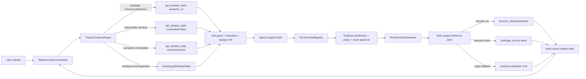

# Plan: CUA Semantic Fast Path for Low-Latency Computer Use

## Summary

Use the semantic capabilities already present in TroCode's installed `@trycua/cua-driver` 0.19.3 runtime before falling back to full-desktop vision. The trusted Electron main process will identify the current non-TroCode application/window, read browser or accessibility state without a screenshot when possible, give the model bounded opaque element references, execute an element-level action, and refresh the same structured surface.

This is an acceleration of the existing computer-use loop, not a second agent harness. OpenAI Agents SDK tool calls still enter `RuntimeToolRegistry`, `ToolExecutionBroker`, the pure policy evaluator, exact approval, `RuntimeToolDispatcher`, cancellation, lifecycle limits, and post-action verification. CUA remains an execution capability; it does not choose goals, approve actions, or expose raw handles to the renderer or model.

The final fallback ladder is:

1. Typed browser state and browser actions for an already-bindable Chromium/Electron tab.
2. Window-scoped accessibility state and element-token actions.
3. Window-scoped screenshot plus structured elements when semantics are incomplete.
4. The current full-desktop screenshot and coordinate path when the target is ambiguous, canvas-only, multi-application, or unsupported.

Attaching to an existing logged-in Chromium profile is a separate, exact `system_permission` action. It is never attempted implicitly. A trusted CUA authorization host may honor only the one already-approved TroCode action and must deny every unarmed or mismatched callback.

## User Story

As a TroCode user looking at code in Chrome, Replit, Jupyter, LeetCode, VS Code, or another desktop application, I want TroCode to understand the current app and visible editor immediately and operate the intended control without repeatedly taking a full screenshot and visually locating pixels, so that debugging and routine actions complete materially faster without weakening consent or correctness.

## Problem -> Solution

TroCode currently starts a CUA session with desktop capture, calls `getDesktopState`, sends a high-detail screenshot to the model, performs coordinate actions, and captures another full-desktop screenshot after every mutation. This pays capture, image-encoding, image-token, model-vision, cursor-travel, and 120 ms UI-hide costs even when CUA can already address the current browser tab or accessibility element directly.

Add a trusted semantic surface layer around CUA 0.19.3's existing `list_windows`, `get_accessibility_tree`, `get_window_state`, `get_browser_state`, typed browser actions, element-token actions, and `verify_state`. Keep raw CUA tools private; expose only two small strict model tools (`observe_surface` and `control_surface`) plus an explicitly approved `prepare_browser_access` boundary. Return the current screenshot tools only as a compatible fallback.

## Metadata

- **Complexity**: XL
- **Source PRD**: Today's customer discovery notes and the follow-up requirements in this task
- **PRD Phase**: Computer-use latency and grounding
- **Research date**: 2026-08-19
- **Installed CUA baseline**: `@trycua/cua-driver` 0.19.3; driver contract 0.6.0; capability version 1; tool-list schema version 1
- **Estimated files**: 24-31 files across CUA, agent contracts/tools/coordinator/policy, analytics, scripts, tests, and docs
- **Recommended delivery**: Four mergeable gates: capability/contracts, native-window fast path, typed-browser path, then benchmarked release
- **Confidence score**: 8/10. The repository and installed CUA surfaces are traced. Remaining uncertainty is real-world accessibility quality in each third-party editor and browser-profile authorization behavior across packaged macOS/Windows builds.
- **Navigation note**: `docs/CODEX-NAVIGATION-GUIDE.md`, referenced by the repository instructions, is absent at this baseline. Use the checked-in architecture/security/lifecycle files and mandatory reading below.
- **Worktree note**: The worktree was clean when this plan was written. Re-run `git status --short` before implementation and preserve later user-owned edits.

---

## Outcome and Performance Gates

“Faster” is not an acceptance criterion by itself. Record a baseline with the semantic feature disabled and compare the same scenario set with it enabled.

| Metric | Definition | Release gate |
|---|---|---|
| End-to-end action latency | Task submission to the first confirmed computer mutation for a supported single-surface request | Candidate p50 <= 70% of baseline and p95 <= 80% of baseline |
| Dispatch-and-verify latency | Receipt of a resolved computer action to a fresh post-action observation | Candidate p50 <= 70% of baseline |
| Full-desktop captures | Count of `desktop_vision` observations per scenario | At least 75% lower across supported browser/window scenarios |
| Image-bearing model turns | Agent requests containing a current screenshot | Zero for at least 80% of supported semantic scenarios; never higher than baseline |
| Extra grounding turns | Model calls used only to relocate the first target | No extra model call after the trusted initial semantic observation |
| Task success | Scenario reaches the expected verified state | No regression greater than 2 percentage points; candidate must be at least 95% on the release fixture set |
| Safety | Consequential actions, stale references, unknown outcomes, self-approval attempts | Zero bypasses, zero automatic unknown-outcome retries, zero CUA authorization grants without an armed exact TroCode approval |

Benchmark statistics must be generated from content-free events only: route, operation class, duration, screenshot-present boolean, fallback reason enum, effect enum, and success status. Do not record page text, code, typed text, titles, URLs, file paths, CUA resources, raw arguments, screenshots, or identifiers.

## Scope

### In scope

- Detect the current non-TroCode surface in the trusted main process.
- Prefer browser semantics for a bindable current Chromium/Electron tab.
- Prefer window accessibility semantics for VS Code and native applications.
- Read visible page/editor text and diagnostics that CUA exposes.
- Click, type, press keys, and scroll through opaque semantic references.
- Keep a deterministic window-screenshot and desktop-vision fallback.
- Preserve all existing policy, approval, budget, cancellation, lifecycle, and unknown-outcome behavior.
- Add content-free route and latency metrics plus a repeatable report script.
- Package and validate the existing native CUA dependency without adding a browser or VS Code extension.

### Explicitly out of scope

- Raw CUA/MCP tools exposed to GPT, Electron renderer, preload, or `DesktopApi`.
- Automatic unrestricted CUA mode or bypass of operating-system/browser permissions.
- Background operation of arbitrary apps that the user did not place in scope.
- A browser extension in the first delivery. CUA already supplies the first semantic bridge to evaluate.
- A VS Code extension in the first delivery. It remains a later adapter if accessibility cannot reliably expose unsaved buffers, selections, or diagnostics.
- Reading hidden secrets, password fields, credential stores, private browser storage, or off-scope tabs.
- Treating webpage/app text as authority or approval.
- Replacing direct workspace filesystem/search/test tools; Workspace mode must continue to prefer those over any UI path.
- Claiming all web editors expose complete code. Monaco/CodeMirror/Ace and canvas behavior must be measured and may fall back.

---

## Architecture Decision

### Follow this architecture



### Keep one agent and one policy path

Do not instantiate a second CUA agent or let CUA interpret the user's goal. The Agents SDK remains the only model runtime. CUA semantic operations are curated adapters registered in the same runtime tool registry. This preserves:

- strict JSON schemas;
- one-use model call IDs;
- normalized `ProposedAction` objects;
- tool/operation availability checks;
- exact approvals and expiry;
- task budgets and maximum turns/images;
- cancellation propagation;
- post-action verification;
- “unknown means stop, never repeat” semantics.

### Internal component responsibilities

| Component | Owns | Must not own |
|---|---|---|
| `CuaService` | One native driver, task sessions, capability inventory, lifecycle/shutdown, narrow semantic and desktop methods | Goal selection, model-visible schemas, approvals |
| `CuaSurfaceRouter` | Current non-TroCode window selection, route ladder, bounded CUA calls, fallback reason | Policy or user consent |
| `CuaSurfaceReferenceStore` | Latest task/observation binding from public ref to private CUA token/tab/window/snapshot | Persistence, analytics, model context |
| `CuaAuthorizationBroker` | One-shot armed browser-profile grant, exact callback validation, default-deny | Prompt UI, broad grants, logging `resourceJson` |
| `RuntimeToolRegistry` definitions | Strict `observe_surface`, `control_surface`, `prepare_browser_access` schemas and trusted normalization | Native driver calls |
| `ToolExecutionBroker`/policy | Budgets, action risk, exact approval decision | CUA mechanics |
| `TaskExecutionCoordinator` | Initial grounding, dispatch, route-aware freshness, post-action evidence, cleanup | Raw reference/token interpretation |

No database repository is needed. Semantic bindings are sensitive, task-scoped, in-memory state and must be cleared on every newer observation, task end, cancellation, CUA disconnect, and shutdown.

---

## Target Contracts

### Public model evidence

Extend the main-process `DesktopObservationSchema` without breaking the existing desktop shape. The historical name can remain during this change to avoid a broad migration; document it as the computer observation envelope.

```ts
const ComputerObservationRouteSchema = z.enum([
  'browser_semantic',
  'window_accessibility',
  'window_vision',
  'desktop_vision',
]);

const SurfaceBoundsSchema = z.object({
  x: z.number().int().min(-100_000).max(100_000),
  y: z.number().int().min(-100_000).max(100_000),
  width: z.number().int().positive().max(100_000),
  height: z.number().int().positive().max(100_000),
});

const SurfaceDescriptorSchema = z.object({
  kind: z.enum(['browser', 'code_editor', 'native_app', 'desktop']),
  application: z.string().trim().min(1).max(120),
  title: z.string().max(500).optional(),
  url: z.string().url().max(8_000).optional(),
  bounds: SurfaceBoundsSchema.optional(),
});

const SurfaceElementSchema = z.object({
  ref: z.string().regex(/^e[1-9][0-9]{0,3}$/u),
  role: z.string().max(120),
  name: z.string().max(2_000),
  value: z.string().max(8_000).optional(),
  href: z.string().max(8_000).optional(),
  bounds: SurfaceBoundsSchema.optional(),
  disabled: z.boolean().optional(),
  selected: z.boolean().optional(),
});
```

Add `route`, `surface`, and a maximum of 400 `elements` to the observation. Keep `text` and `structuredState` bounded. Semantic observations normally omit `screenshot` and `coordinateSpace`; `window_vision` and `desktop_vision` may include them.

The model may receive app name, visible title, current URL, visible text, semantic roles, labels, values, and screen bounds because those are task evidence. These fields remain private content: do not log or send them to analytics.

### Private trusted binding

Never place these fields in model output, history, renderer state, logs, or analytics:

```ts
interface CuaSurfaceBinding {
  taskId: string;
  observationId: string;
  route: 'browser_semantic' | 'window_accessibility';
  processId: number;
  windowId: string;
  targetId?: string;
  tabId?: string;
  snapshotId: string;
  stateVersion?: string;
  rawReferences: Map<string, CuaRawReference>;
  surfaceIdentityHash: string;
}
```

The public `e1`, `e2`, ... refs are regenerated for every observation. A reference is valid only for the matching task and latest observation. The reference store resolves it to a CUA `element_token` or browser ref immediately before dispatch.

### Model tools

Expose a minimal semantic tool surface:

1. `observe_surface`
   - Input: bounded reason and optional bounded query/null.
   - No `ProposedAction`; it is read-only and budgeted.
   - Output: the normalized observation. It may internally fall back through the route ladder without an extra model turn.

2. `control_surface`
   - Input: latest observation UUID, public ref/null, one strict command variant, description, target/null, and declared consequence.
   - Commands in the first release: `click_element`, `type_text`, `press_key`, `scroll`.
   - Trusted normalization looks up role/name/value/href/bounds and includes only bounded semantic risk cues in `ProposedAction.parameters`.
   - Invocation kind: `surface`; tool ID: `computer.control`.

3. `prepare_browser_access`
   - Input: latest browser observation UUID and a clear reason.
   - Normalizes to `action: 'system_permission'`, tool ID `browser.prepare`, operation `attach_existing_profile`.
   - It is offered only when CUA advertises `browser_prepare` and the current browser reported that deeper access is available but requires explicit attachment.

Keep `observe_desktop`, `control_desktop`, and `show_guidance` available. System instructions must prefer semantic surface tools, use desktop tools only for a returned fallback observation, and continue to use coordinate observations for visible walkthrough markers until guidance learns element refs.

### Tool results

Extend internal `ToolExecutionResult` with bounded structured evidence rather than serializing arbitrary JSON into `summary`:

```ts
interface ToolExecutionResult {
  status: 'confirmed' | 'unknown' | 'failed' | 'denied' | 'not_executed';
  summary: string;
  data?: Record<string, unknown>;
  observation?: DesktopObservation;
  imageDataUrl?: string;
}
```

`resultOutput` serializes `data` with a size cap and attaches `observation.screenshot` only when present. The coordinator accepts a post-action semantic observation returned by the adapter and does not take an additional desktop screenshot.

---

## Trusted Surface Resolution

### Current surface selection

The model must not guess which browser or window is active. The main process resolves it locally:

1. Call `list_apps`/`list_windows` or the lightweight accessibility discovery call.
2. Exclude the current Electron process, TroCode product/bundle identifiers, and known companion/guidance/control windows.
3. Consider only on-screen windows on the current desktop/space.
4. Prefer the highest z-index recently active non-TroCode window.
5. Retain the previous valid task-bound surface when TroCode temporarily receives focus for its input/approval UI.
6. If two candidates are indistinguishable, return an ambiguous fallback reason and capture the desktop; never guess an irreversible target.

The 120 ms `prepareDesktop` hide/settle path is required only for a screenshot route. Semantic discovery must not hide TroCode just to inspect another window.

### Route matrix

| Condition | Read path | Mutation path | Screenshot |
|---|---|---|---|
| Current supported browser has an existing bindable endpoint | `get_browser_state` with `semantic_v2` | `browser_click`, `browser_type`, `browser_pointer` | Off by default |
| Current VS Code/native window exposes useful AX state | `get_window_state(include_screenshot:false)` | Element-token click/type or key/window action | None |
| Window semantics are empty, truncated, degraded, or target is canvas-like | `get_window_state(include_screenshot:true)` | Prefer token; coordinates limited to that window | One window image |
| No exact window, multi-app task, unsupported adapter, or explicit whole-desktop request | Existing `getDesktopState` | Existing coordinate CUA path | Full desktop |
| Browser needs logged-in-profile attachment | Immediate AX/window fallback; optionally offer `prepare_browser_access` | Only after exact approval and one-shot CUA host grant | No implicit attach |

### Bounded observations

- Maximum 400 public semantic elements.
- Maximum CUA `max_elements` 500 to leave normalization headroom.
- Maximum tree depth 12 unless a targeted query justifies less.
- Existing 100,000-character text and 500,000-character structured-state limits remain hard ceilings; prefer much smaller normalized JSON.
- Drop hidden, empty, redundant layout-only, secret/password, and unsupported elements before assigning public refs.
- Prefer role/name/value/href/state to raw tree dumps.
- If CUA reports truncation, mark `degraded: true` and include a bounded reason, so the model may query or escalate.

---

## Browser Authorization Boundary

Use the installed SDK's configured driver constructor, never unrestricted mode:

- Construct standard-mode `ConfiguredDriverOptions` with bounded session/idle TTLs and `unrestrictedAcknowledged: false`.
- Use `CuaDriver.createConfiguredWithHostIntegrations` so TroCode can supply both a trusted authorization host and CUA's content-free activity observer.
- Routine standard-mode operations bypass the host callback.
- `prepare_browser_access` first passes through TroCode policy and exact approval as `system_permission`.
- Immediately before the approved dispatcher call, arm `CuaAuthorizationBroker` with task, session, operation, expected surface identity hash, expiry, and one-use nonce.
- The CUA callback parses `resourceJson` with a narrow schema, compares it with the armed target, checks expiry/session/operation, consumes the arm once, and returns the callback's exact `requestDigest` with `Allow`.
- Any absent, expired, ambiguous, repeated, or mismatched arm returns `Deny`; cancellation returns `Cancel`.
- Never log or forward `resourceJson`, `humanSummary`, transport session, raw resource IDs, or request digest.
- Disarm in `finally`, including driver errors and aborts.

Do not automatically call `browser_prepare` just to gain speed. The semantic router should use window accessibility immediately when no safe browser binding exists. Deep browser access is an optional user-approved optimization for workflows that need it.

---

## Freshness, Approval, and Outcome Semantics

### Routine semantic actions

- Require the latest observation ID and public ref.
- Resolve the ref only in the task's current private binding.
- Dispatch once.
- A CUA stale/ref-not-found refusal means `not_executed`, not `unknown`.
- Refresh the same surface and let the model propose a new routine action; never replay the old native call.

### Consequential semantic actions

Approval may leave the UI stale. Do not execute an old raw token blindly and do not re-use the desktop screenshot comparison for a screenshot-free surface.

1. The approved action digest covers task, tool/operation, declared consequence, observation ID, public ref, normalized surface identity, and the target's semantic fingerprint (role/name/value/href/states/bounds as available).
2. After approval, capture a fresh semantic snapshot of the exact same private surface.
3. Rebind only if exactly one element has the same stable semantic fingerprint and the same surface identity. This refresh intentionally replaces the raw CUA token/ref.
4. If the surface or target is missing, duplicated, changed, or more sensitive, discard the approval and return `not_executed`. A materially new action requires a new proposal and approval.
5. Execute the rebound target once and observe again.

Desktop-vision approvals continue using `approvalObservationMatches` and screenshot fingerprint comparison.

### CUA effect mapping

Centralize mapping from CUA `ToolResult`, structured refusal, and action effect:

| CUA condition | TroCode status | Retry rule |
|---|---|---|
| Confirmed effect and fresh post-state | `confirmed` | Continue |
| Stale token/ref, target missing, authorization refused before mutation | `not_executed` | Re-observe; a new model proposal is allowed |
| Explicit CUA failure before mutation | `failed` | Report/fallback if safe |
| Partial delivery, completion uncertain, timeout after admission, verification unavailable after possible mutation | `unknown` | Stop; never automatically retry |
| Confirmed action but structured refresh fails | Preserve confirmed effect in diagnostics, block further actions, report that fresh state is unavailable | Do not repeat the action |

The semantic path must not convert every native error to a generic failure. Tests must prove the no-retry boundary.

---

## UX Design

### Before

```text
User: "Why does this LeetCode code fail?"
  -> TroCode hides its UI and waits 120 ms
  -> full desktop screenshot
  -> high-detail image sent to model
  -> model visually finds editor/run button
  -> cursor travels to coordinates and clicks
  -> another full desktop screenshot
  -> model visually reads the result
```

### After

```text
User: "Why does this LeetCode code fail?"
  -> host selects current Chrome window, tab, and semantic state locally
  -> initial model input contains visible code/tests and refs, usually no image
  -> model chooses e17 (Run)
  -> existing policy/approval broker evaluates the exact action
  -> CUA clicks the exact tab/ref and returns fresh semantic test output
  -> desktop vision is used only if the editor/result is not semantically exposed
```

### Visible product behavior

- Existing activity UI says `Reading current Chrome tab`, `Reading active VS Code window`, `Using window view`, or `Using desktop view`. These are host-generated bounded summaries, not new authority.
- Do not show raw adapter, process, window, tab, snapshot, token, or capability identifiers.
- A browser-profile boundary uses the existing approval card with a concrete target and explanation such as “Allow TroCode to attach to the current Chrome profile for this task.”
- If the target is ambiguous, ask one concise question or visibly fall back; never silently control a different window.
- No new renderer IPC is required for semantic access. The model and CUA stay in the trusted main process.

---

## Delivery Gates

### Gate 1: Capability contract and safe fallback

- Pin CUA exactly to 0.19.3.
- Parse metadata and a curated tool inventory at connection.
- Add contracts, reference store, result mapping, and test fakes.
- No user-visible routing change until inventory and fallback tests pass.

### Gate 2: Native/window semantic fast path

- Resolve the current non-TroCode window.
- Add screenshot-free `get_window_state`, opaque refs, semantic click/type/key/scroll, and fresh structured verification.
- Prefer this path for VS Code/native apps.
- Always use this path when the required CUA capability group is present.

### Gate 3: Typed browser fast path

- Add exact browser binding, `semantic_v2`, typed browser actions, and stale-ref behavior.
- Add optional approved existing-profile preparation through the authorization host.
- Retain AX fallback for Safari/Firefox/unbound browsers.

### Gate 4: Performance proof and release

- Record identical baseline/candidate scenarios in packaged builds on supported OSes.
- Meet the latency, success, capture, and safety gates.
- Always attempt semantic routing when the required CUA capabilities are present; use deterministic fallback otherwise.
- Keep route/fallback counters to identify regressions without collecting content.

---

## Mandatory Reading

| Priority | File | Lines | Why |
|---|---|---:|---|
| P0 | `src/main/cua/cua-service.ts` | 1-141, 156-327, 329-596 | Current single-driver lifecycle, desktop capture, coordinate actions, effect mapping, content-free logging, shutdown |
| P0 | `src/main/agent/execution-coordinator.ts` | 57-167, 285-351, 866-907, 1306-1500, 1543-1627 | Current initial capture, model output, exact freshness, dispatch, mandatory post-action screenshot, cleanup |
| P0 | `src/main/agent/runtime-tool-registry.ts` | 27-58, 654-788, 931-1036 | Strict tools, trusted normalization, current desktop tools, one-use call IDs, availability |
| P0 | `src/main/agent/tool-execution-broker.ts` | 1-104 | Budget, policy, approval, unknown-outcome boundary |
| P0 | `src/main/agent/runtime-tool-dispatcher.ts` | 1-62 | Exact adapter routing and cancellation |
| P0 | `src/main/agent/execution-contracts.ts` | 1-140 | Current observation/command schemas and bounds |
| P0 | `src/main/agent/agent-contracts.ts` | 1-51 | Model tool/output and resolved invocation contracts |
| P0 | `src/main/agent/action-risk-classifier.ts` | 1-90 | Pure monotonic risk classifier currently keyed to desktop control |
| P0 | `src/main/agent/policy.ts` | 97-145 | Registry support, public URL rule, self-approval denial, exact approval decision |
| P0 | `src/main/agent/action-approval.ts` | all | Normalized exact action digest |
| P0 | `src/main/agent/approval-observation.ts` | all | Existing desktop screenshot revalidation to preserve only for vision routes |
| P1 | `src/main/agent/openai-agents-runtime.ts` | 41-59, 121-185, 188-214 | Current screenshot instructions, initial evidence, strict Agents SDK tool wrapping |
| P1 | `src/main/inference/context-window-policy.ts` | all | Image and request-history bounds |
| P1 | `src/index.ts` | 165-290, 350-407 | Service construction, desktop preparation delay, analytics lifecycle |
| P1 | `src/main/analytics/analytics-service.ts` | 44-47, 157-285, 349-407 | Existing content-free event patterns and best-effort capture |
| P1 | `src/main/cua/cua-service.test.ts` | all | Fake CUA module/driver construction and exact native-call assertions |
| P1 | `src/main/agent/runtime-tool-registry.test.ts` | all | Exact model tool list, strict schema, normalization, latest-observation tests |
| P1 | `src/main/agent/execution-coordinator.test.ts` | 729-1212 and initial-observation cases | Observe/action/verify loop, stale approval, unknown outcome, post-action timeout |
| P1 | `src/main/agent/action-risk-classifier.test.ts` | all | Routine/strict/sensitive cue cases to duplicate for semantic tools |
| P1 | `src/main/analytics/analytics-service.test.ts` | 195-266 | Privacy assertions for content-free analytics |
| P1 | `scripts/check-agent-runtime-versions.mjs` | all | Existing exact dependency compatibility gate |
| P1 | `forge.config.ts` | 87-123 | Native CUA package staging outside ASAR |
| P1 | `package.json` | 8-29, 90-100 | Validation scripts and current caret CUA declaration |
| P2 | `docs/computer-use-lifecycle.md` | all | Current screenshot loop and host/model invariants |
| P2 | `docs/security.md` | all | Screenshot/URL privacy, approvals, no unknown retry |
| P2 | `docs/architecture.md` | all | Main/renderer trust boundaries and runtime composition |
| P2 | `README.md` | around current limitations | Accessibility-first targeting is currently declared unimplemented |
| P0 dependency | `node_modules/@trycua/cua-driver/README.md` | 36-102 | Installed in-process driver, typed results, configured authorization host/activity observer |
| P0 dependency | `node_modules/@trycua/cua-driver/dist/native/cua_driver_sdk.d.ts` | 20-145, 2020-2181, 2507-2512 | Installed 0.19.3 authorization/configuration/callTool/listTools/metadata API |

## External Documentation

Use primary CUA sources and the installed 0.19.3 declaration together. The installed inventory is authoritative for implementation because the online documentation may describe a newer additive per-call `target` contract.

| Source | Use in this implementation | Key constraint |
|---|---|---|
| [CUA extension-free browser use](https://github.com/trycua/cua/blob/main/blog/extension-free-browser-use.md) | Browser flow: session -> window -> exact browser binding -> semantic state -> typed action -> fresh state | Refs are short-lived and invalidated by navigation/new snapshots/session end |
| [CUA driver contracts](https://cua.ai/docs/reference/cua-driver/contracts) | Window vs desktop targets, structured refusals, token behavior | Prefer element tokens; stale is a refresh signal, not evidence of execution |
| [CUA MCP tools](https://cua.ai/docs/reference/cua-driver/mcp-tools) | Typed browser tool set and window state capabilities | Prefer typed browser tools over legacy `page` |
| [CUA known limits](https://cua.ai/docs/reference/cua-driver/limits) | Browser/OS fallback design and coordinate caveats | Chromium/Electron has the richest semantic path; Safari/Firefox may use native accessibility; screen-absolute element frames differ from window screenshot pixels |
| [CUA SDK reference](https://cua.ai/docs/reference/cua-driver/sdk-reference) | Trusted authorization host and activity observer integration | Host callback is trusted code; return the exact request digest and never disclose the resource to the model |

Do not copy online examples that use a request shape absent from 0.19.3. Add a deliberate dependency-upgrade PR later if TroCode wants the newer per-call target contract.

---

## Unified Discovery Table

| Category | File:Lines | Pattern | Key evidence |
|---|---|---|---|
| Similar implementation | `src/main/cua/cua-service.ts:156-327` | One lazy native driver and task-scoped sessions | Semantic calls belong behind this facade, not in coordinator/model code |
| Service pattern | `src/main/cua/cua-service.ts:231-268, 570-596` | Explicit connect/start/end/shutdown with bounded errors | Preserve one driver owner and deterministic cleanup |
| State ownership | `src/main/cua/cua-service.ts:156-162` | In-memory task session set | Reference bindings should use the same task-scoped ephemeral model |
| Naming | `src/main/agent/runtime-tool-registry.ts:703-928` | Dotted internal tool ID and snake_case model name | Use `computer.observe`/`observe_surface`, `computer.control`/`control_surface`, `browser.prepare`/`prepare_browser_access` |
| Schema boundary | `src/main/agent/execution-contracts.ts:10-95` | Zod schema first, inferred TypeScript type | Parse every CUA `structuredJson`/`rawJson` and every new tool input |
| Strict model tools | `src/main/agent/runtime-tool-registry.ts:620-652, 981-989` | Recursive strict schema assertion | Every object has `additionalProperties:false`; nullable fields are still required |
| Trusted normalization | `src/main/agent/runtime-tool-registry.ts:745-786` | Resolve latest observation before producing `ProposedAction` | Convert public ref to bounded target risk cues; never trust model consequence alone |
| Policy | `src/main/agent/policy.ts:97-145` | Pure registry/risk/approval decision | Semantic actions take the same path and cannot approve themselves |
| Risk | `src/main/agent/action-risk-classifier.ts:20-90` | Untrusted visible cues may raise risk, never lower it | Include semantic role/name/href/value in the bounded monotonic classifier |
| Dispatcher | `src/main/agent/runtime-tool-dispatcher.ts:8-54` | One exact adapter per runtime tool ID | Register semantic adapters; no raw `callTool(name)` model dispatch |
| Error handling | `src/main/agent/execution-coordinator.ts:1363-1500` | Convert tool errors to bounded results and block on unknown/verification failure | Preserve no automatic retry after possible execution |
| Observation flow | `src/main/agent/execution-coordinator.ts:866-907, 1543-1577` | Trusted initial observation before first model sample | Replace the default capture with route-aware observation, not an extra model turn |
| Model evidence | `src/main/agent/openai-agents-runtime.ts:121-147` | JSON text plus image only when available | Semantic observation naturally avoids an image part |
| Logging | `src/main/cua/cua-service.ts:120-140, 257-266, 291-299` | Namespaced event and small JSON diagnostic | Add route/duration/fallback enums only; omit titles/URLs/text/IDs |
| Analytics | `src/main/analytics/analytics-service.ts:157-285` | Counts/enums and best-effort non-blocking capture | Performance metrics must remain content-free |
| Test structure | `src/main/cua/cua-service.test.ts` | Inject fake module/driver with `Reflect.set` and assert exact calls | Add fake `listToolsJson`, `callTool`, metadata, authorization callback, activity observer |
| Routing | `src/main/cua/cua-service.ts` | Main-process CUA lifecycle | Start every task in hardcoded Auto scope; do not expose a routing option |
| Dependency guard | `scripts/check-agent-runtime-versions.mjs:4-22` | Exact declaration and lockfile equality | Add CUA 0.19.3 and remove the caret |
| Packaging | `forge.config.ts:87-123` | Stage CUA and platform native package outside ASAR | No new native package; verify configured constructor in packaged app |
| Architecture | `docs/computer-use-lifecycle.md` and `docs/security.md` | Model proposes, host approves/executes/verifies | Semantic references improve grounding without changing authority |

---

## Patterns to Mirror

### SINGLE_DRIVER_FACADE

SOURCE: `src/main/cua/cua-service.ts:156-162, 570-596`

```ts
export class CuaService {
  private cuaModule: CuaModule | null = null;
  private driver: Driver | null = null;
  private readonly activeSessions = new Set<string>();
}
```

Keep CUA native ownership here. Helper classes receive a narrow `callTool` function or pure parsed values; they do not independently create/connect/destroy native drivers.

### ZOD_AT_NATIVE_BOUNDARY

SOURCE: `src/main/cua/cua-service.ts:16-22, 57-79, 307-326`

```ts
const metadata = DesktopStateMetadataSchema.safeParse(JSON.parse(structuredJson));
return DesktopObservationSchema.parse({ /* bounded normalized fields */ });
```

Every curated CUA result must parse through a dedicated schema. Never spread arbitrary `structuredJson` or `rawJson` into model evidence or action parameters.

### STRICT_TOOL_AND_TRUSTED_NORMALIZATION

SOURCE: `src/main/agent/runtime-tool-registry.ts:703-788`

```ts
const observation = requireObservation(context, input.observationId);
const action = ProposedActionSchema.parse({
  action: trustedActionForCommand(input.command),
  toolId: 'computer.control',
  operation: input.command.kind,
  parameters: trustedSemanticParameters(observation, input.ref),
});
```

The model supplies an intention and public ref. Trusted code derives the real target metadata, operation, and action identity.

### EXACT_DISPATCH

SOURCE: `src/main/agent/runtime-tool-dispatcher.ts:21-54`

```ts
const adapter = this.adapters.get(invocation.toolId);
if (!adapter) throw new Error(`No runtime adapter is registered for ${invocation.toolId}.`);
return adapter.dispatch(invocation, signal);
```

Semantic execution is a registered adapter. Never accept a model-provided arbitrary CUA method/tool name.

### MONOTONIC_RISK

SOURCE: `src/main/agent/action-risk-classifier.ts:20-90`

```ts
const visibleRisk = [role, ariaLabel, visibleText, href, value].join(' ');
if (SENSITIVE_CUE_PATTERN.test(visibleRisk)) return sensitive;
```

Visible semantic data may upgrade a benign declared action to sensitive. It must never downgrade `send`, `submit`, `delete`, `write_file`, `system_permission`, or another host-confirmed consequence.

### CONTENT_FREE_DIAGNOSTICS

SOURCE: `src/main/cua/cua-service.ts:120-140`

```ts
console.info('[cua] semantic.operation', JSON.stringify({
  route,
  operation,
  durationBucket,
  screenshotAttached,
  fallbackReason,
  effect,
}));
```

Do not include task text, app title, URL, process/window/tab/snapshot IDs, element labels, typed input, code, screenshots, raw resource identities, or CUA authorization digests.

### FAKE_NATIVE_DRIVER_TEST

SOURCE: `src/main/cua/cua-service.test.ts`

Use an injected fake whose methods record exact names/JSON arguments and return typed fixture results. Assert route choice, abort propagation, bounded parsing, stale mapping, cleanup, and default-deny authorization without requiring OS permissions.

---

## Implementation Tasks

### Task 1: Pin and fingerprint the supported CUA contract

**FILES**

- UPDATE `package.json`
- UPDATE `package-lock.json`
- UPDATE `scripts/check-agent-runtime-versions.mjs`
- UPDATE `src/main/cua/cua-service.ts`
- UPDATE `src/main/cua/cua-service.test.ts`

**ACTION**

- Change `@trycua/cua-driver` from `^0.19.3` to exact `0.19.3` and update the lockfile through npm.
- Add it to `EXPECTED` in the runtime version checker.
- During driver initialization, parse `metadata()` and `listToolsJson()` into a small capability record. Do not retain or log the complete tool schema.
- Detect these independent groups: window discovery/state, element actions, browser state/actions, browser prepare, and verification.
- Keep CUA status `ready` when optional semantic groups are absent; report semantic availability to trusted wiring and fall back.
- Add a compact test fixture containing only required tool names and the argument/result fragments TroCode consumes.

**MIRROR**

- `scripts/check-agent-runtime-versions.mjs:4-22` exact dependency check.
- `src/main/cua/cua-service.ts:570-574` current metadata read.

**IMPORTS**

- Existing `zod`; no new package.

**GOTCHA**

- Online docs may show a newer per-call `target` object. The runtime `listToolsJson()` returned by installed 0.19.3 is the source of truth. Do not mix schemas or upgrade CUA inside this feature.
- Do not make a missing browser tool break native-window semantics.

**VALIDATE**

```bash
npm run agent:runtime-versions
npx vitest run src/main/cua/cua-service.test.ts
```

### Task 2: Add bounded semantic observation and action contracts

**FILES**

- CREATE `src/main/cua/cua-semantic-contracts.ts`
- CREATE `src/main/cua/cua-semantic-contracts.test.ts`
- UPDATE `src/main/agent/execution-contracts.ts`
- UPDATE `src/main/agent/execution-contracts.test.ts`
- UPDATE `src/main/agent/agent-contracts.ts`

**ACTION**

- Define Zod schemas for curated CUA window list/state, browser state, tool result, structured refusal, action effect, and authorization resource.
- Extend `DesktopObservationSchema` with route, surface, and bounded semantic elements while remaining backward compatible with current screenshot observations.
- Define `SurfaceCommandSchema` and `SurfaceActionOutcomeSchema` for click/type/key/scroll and post-state.
- Add `kind: 'surface'` to `ResolvedToolInvocation`.
- Add bounded `data` and `observation` fields to `ToolExecutionResult`; reject oversize data before it reaches the model.
- Define a pure normalizer that filters secret/password elements, removes raw identifiers/tokens, assigns observation-local refs, and calculates surface/element fingerprints.

**MIRROR**

- `src/main/agent/execution-contracts.ts:10-95` schema-first contracts and current size limits.
- `src/main/cua/cua-service.ts:57-79` safe JSON parse behavior.

**IMPORTS**

- `z` from `zod`.
- `createHash` only in trusted normalization code.

**GOTCHA**

- Bounds from accessibility state are screen-absolute; window screenshot coordinates are image-relative. Preserve coordinate-space metadata and never reuse one as the other.
- A password role/value must be redacted even when CUA returns it.
- Raw PID/window/tab/target/snapshot/token values must remain absent from public schemas.

**VALIDATE**

```bash
npx vitest run src/main/cua/cua-semantic-contracts.test.ts src/main/agent/execution-contracts.test.ts
npm run typecheck
```

### Task 3: Add task-scoped reference and authorization brokers

**FILES**

- CREATE `src/main/cua/cua-surface-reference-store.ts`
- CREATE `src/main/cua/cua-surface-reference-store.test.ts`
- CREATE `src/main/cua/cua-authorization-broker.ts`
- CREATE `src/main/cua/cua-authorization-broker.test.ts`
- UPDATE `src/main/cua/cua-service.ts`

**ACTION**

- Store exactly one latest semantic binding per task and observation.
- Map public `eN` refs to private window/browser tokens and semantic fingerprints.
- Invalidate on newer observation, mismatched observation ID, task end, cancel, disconnect, and shutdown.
- Add unique-match rebinding for post-approval fresh observations.
- Implement the installed `DriverAuthorizationHost` interface with default deny and one-use armed grants.
- Parse and compare a narrow `resourceJson` identity against the already-approved surface; return the callback's exact request digest only on a full match.
- Construct CUA with standard configured authorization, bounded TTLs, authorization host, and content-free activity observer. Keep unrestricted mode disabled.

**MIRROR**

- `src/main/cua/cua-service.ts:161, 242-268, 537-596` task session ownership/cleanup.
- `src/main/agent/action-approval.ts` one exact normalized digest.

**IMPORTS**

- Installed CUA `ConfiguredDriverOptions`, `RuntimeAuthorizationOptions`, `SessionPermissionMode`, `DriverAuthorizationAction`, and host/observer types.

**GOTCHA**

- The CUA callback occurs inside the native call. TroCode approval must finish before arming the broker; the callback cannot independently prompt or ask the model.
- Never log `resourceJson`, `humanSummary`, sessions, nonce, digest, or resource IDs.
- Consume an allow exactly once and disarm in `finally`.

**VALIDATE**

```bash
npx vitest run src/main/cua/cua-surface-reference-store.test.ts src/main/cua/cua-authorization-broker.test.ts src/main/cua/cua-service.test.ts
```

### Task 4: Implement native-window semantic routing and actions

**FILES**

- CREATE `src/main/cua/cua-surface-router.ts`
- CREATE `src/main/cua/cua-surface-router.test.ts`
- UPDATE `src/main/cua/cua-service.ts`
- UPDATE `src/main/cua/cua-service.test.ts`

**ACTION**

- Add `observeCurrentSurface(taskId, options, signal)` and `executeSurfaceCommand(taskId, input, signal)` narrow service methods.
- Discover candidate apps/windows, exclude TroCode, and choose the exact current non-TroCode window with deterministic pure ranking.
- Start with `get_window_state` and `include_screenshot:false` using bounded depth/elements.
- Normalize and store refs. Escalate to a window screenshot only for empty/degraded/truncated semantics or explicit canvas evidence.
- Execute click/type through the private element token where possible; use key/scroll window operations only on the bound exact window.
- After an admitted mutation, fetch fresh state for the same private window and return it in the action result.
- Map stale/refused/failed/unknown/confirmed effects centrally.
- Propagate `AbortSignal` to every CUA call.

**MIRROR**

- `src/main/cua/cua-service.ts:270-327` observation construction.
- `src/main/cua/cua-service.ts:329-527` action effect and abort behavior.

**IMPORTS**

- Contracts/reference store from Tasks 2-3.

**GOTCHA**

- TroCode may be the frontmost app because the user just typed a request. Rank the top non-TroCode on-screen window and retain the task's last bound surface; do not simply trust `active=true`.
- Do not invoke `prepareDesktop` or its 120 ms settle delay for screenshot-free semantics.
- If CUA can confirm an action but the post-state refresh fails, block subsequent execution without replaying the action.

**VALIDATE**

```bash
npx vitest run src/main/cua/cua-surface-router.test.ts src/main/cua/cua-service.test.ts
```

### Task 5: Add typed-browser routing and approved profile attachment

**FILES**

- UPDATE `src/main/cua/cua-surface-router.ts`
- UPDATE `src/main/cua/cua-surface-router.test.ts`
- UPDATE `src/main/cua/cua-service.ts`
- UPDATE `src/main/cua/cua-service.test.ts`

**ACTION**

- For an exact supported browser window, call `get_browser_state` with the installed 0.19.3 arguments and `semantic_v2`; bind to exact native PID/window and returned target/tab.
- Prefer browser state over generic AX only when the binding is exact and current.
- Normalize browser refs into public refs; keep target/tab/ref/snapshot private.
- Dispatch typed `browser_click`, `browser_type`, and browser pointer/scroll operations with the exact private target and tab.
- Treat navigation/new snapshot/session end as ref invalidation.
- If no endpoint is available, immediately use AX/window routing. Return a bounded flag that deeper browser access may be requested; do not prepare automatically.
- Implement the approved `browser_prepare` existing-profile operation through the one-shot authorization broker.
- Add fixtures for Chrome/Edge/Electron success, Firefox/Safari AX fallback, stale browser ref, navigation invalidation, dialog/refusal, and mismatched tab/window.

**MIRROR**

- Same exact-window selection from Task 4.
- Installed CUA tool inventory, not the legacy `page` tool.

**IMPORTS**

- No browser extension or CDP package; use the installed CUA driver only.

**GOTCHA**

- `browser_prepare(existing_profile)` is a permission boundary, not an invisible performance trick.
- Typed browser mutation support is richest on Chromium/Electron. Safari/Firefox must remain functional through AX/window/vision fallback.
- Never send a CUA browser target/ref directly to the model.

**VALIDATE**

```bash
npx vitest run src/main/cua/cua-surface-router.test.ts src/main/cua/cua-service.test.ts
```

### Task 6: Register curated semantic tools in the existing agent harness

**FILES**

- CREATE `src/main/agent/cua-semantic-agent-tools.ts`
- CREATE `src/main/agent/cua-semantic-agent-tools.test.ts`
- UPDATE `src/main/agent/runtime-tool-registry.ts`
- UPDATE `src/main/agent/runtime-tool-registry.test.ts`
- UPDATE `src/main/agent/runtime-tool-dispatcher.ts`
- UPDATE `src/main/agent/runtime-tool-dispatcher.test.ts`
- UPDATE `src/main/agent/openai-agents-runtime.ts`
- UPDATE `src/main/agent/openai-agents-runtime.test.ts`
- UPDATE `src/main/agent/agent-eval.test.ts`

**ACTION**

- Extract/export the minimum registry helper needed to compose default, workspace, and CUA semantic definitions without duplicating strict-schema logic.
- Add strict `observe_surface`, `control_surface`, and conditional `prepare_browser_access` definitions.
- Use dynamic `available()` checks based on the parsed CUA capability record and feature switch.
- Require the latest semantic observation and public ref in trusted normalization.
- Populate semantic role/name/value/href/bounds, declared consequence, surface kind, and fingerprints from trusted observation/reference data.
- Register exact dispatcher adapters for `computer.observe`, `computer.control`, and `browser.prepare`.
- Update system instructions: use initial semantic evidence directly, prefer surface tools, use desktop tools only for a vision fallback, and never call browser preparation without a real need.
- Keep Workspace instructions unchanged and dominant for saved projects.

**MIRROR**

- `src/main/agent/runtime-tool-registry.ts:620-652` strict schema assertion.
- `src/main/agent/runtime-tool-registry.ts:745-786` latest observation and action normalization.
- `src/main/agent/openai-agents-runtime.ts:150-185` Agents SDK wrapping.

**IMPORTS**

- New execution contracts/types only; no direct CUA imports in agent tool definitions.

**GOTCHA**

- Do not pass CUA's ~large dynamic tool inventory to the model. It increases prompt cost, widens authority, and breaks the registry's allowlist.
- `prepare_browser_access` must normalize to `system_permission` regardless of a model-supplied benign label.
- Walkthrough mode still needs coordinate-capable screenshot evidence for the guidance marker in this release.

**VALIDATE**

```bash
npx vitest run src/main/agent/cua-semantic-agent-tools.test.ts src/main/agent/runtime-tool-registry.test.ts src/main/agent/runtime-tool-dispatcher.test.ts src/main/agent/openai-agents-runtime.test.ts src/main/agent/agent-eval.test.ts
```

### Task 7: Route initial grounding, approvals, actions, and verification

**FILES**

- UPDATE `src/main/agent/execution-coordinator.ts`
- UPDATE `src/main/agent/execution-coordinator.test.ts`
- UPDATE `src/main/agent/approval-observation.ts`
- UPDATE `src/main/agent/approval-observation.test.ts`
- UPDATE `src/main/agent/walkthrough-policy.ts`
- UPDATE `src/main/agent/walkthrough-policy.test.ts`

**ACTION**

- Extend the coordinator's CUA dependency interface with narrow capability/observe/execute/prepare methods.
- For a visible non-workspace task, attempt semantic current-surface observation before the first model sample. Let the CUA service internally fall back to window/desktop vision; do not sample the model between ladder steps.
- Count an image only when the returned observation actually contains one.
- Add the `surface` invocation branch and route it through the existing broker/policy/dispatcher.
- Use an adapter-provided post-action observation and skip the unconditional full-desktop capture.
- Add route-aware approval revalidation: fresh unique semantic rebinding for semantic routes, existing screenshot comparison for desktop vision.
- Preserve unknown-outcome terminal blocking, action-at-most-once, abort propagation, presentation cleanup, and session cleanup.
- Allow `observe_surface` wherever walkthrough policy allows observation, but keep `show_guidance` dependent on screenshot/coordinate evidence.

**MIRROR**

- `src/main/agent/execution-coordinator.ts:866-907` trusted initial observation.
- `src/main/agent/execution-coordinator.ts:1306-1353` approval freshness.
- `src/main/agent/execution-coordinator.ts:1363-1500` dispatch and verification stop conditions.

**IMPORTS**

- Semantic invocation/result contracts; no raw CUA SDK types.

**GOTCHA**

- A semantic action result must not trigger a second generic screenshot capture.
- A screenshot-free observation must not consume `maxImages`; it still consumes the existing observation/tool budget.
- When approval rebinding is missing/ambiguous, return `not_executed` and require a new proposal/approval instead of using coordinates.
- Do not change task lifecycle transition functions into async/native code.

**VALIDATE**

```bash
npx vitest run src/main/agent/execution-coordinator.test.ts src/main/agent/approval-observation.test.ts src/main/agent/walkthrough-policy.test.ts
```

### Task 8: Extend policy and exact risk classification without weakening it

**FILES**

- UPDATE `src/main/agent/action-risk-classifier.ts`
- UPDATE `src/main/agent/action-risk-classifier.test.ts`
- UPDATE `src/main/agent/policy.ts`
- UPDATE `src/main/agent/policy.test.ts`
- UPDATE `src/main/agent/action-approval.test.ts`
- UPDATE `src/main/agent/tool-execution-broker.test.ts`

**ACTION**

- Replace desktop-only checks with a small trusted set of computer mutation tool IDs: `desktop.control` and `computer.control`.
- Feed bounded semantic role/name/value/href/state into the existing risk text.
- Keep declared consequential actions always-confirmed.
- Force `browser.prepare/attach_existing_profile` to `system_permission` and exact approval.
- Deny semantic operations targeting TroCode approval/UI surfaces using trusted application identity plus current textual safeguards.
- Add tests for deceptive labels, model consequence mismatch, strict autonomy, stale/opaque semantic refs, browser permission, self-approval, and exact digest changes.

**MIRROR**

- `src/main/agent/action-risk-classifier.ts:50-90` pure monotonic classifier.
- `src/main/agent/policy.ts:97-145` registry-first decision.

**IMPORTS**

- No CUA SDK types; policy consumes normalized host contracts only.

**GOTCHA**

- Semantic precision may reduce ambiguity but never reduces the user's configured approval level or host always-confirm list.
- A button labeled “Send”, “Submit”, “Delete”, “Buy”, or “Install” raises risk even if the model declares a click.

**VALIDATE**

```bash
npx vitest run src/main/agent/action-risk-classifier.test.ts src/main/agent/policy.test.ts src/main/agent/action-approval.test.ts src/main/agent/tool-execution-broker.test.ts
```

### Task 9: Wire automatic routing, content-free metrics, and the benchmark report

**FILES**

- UPDATE `.env.example`
- UPDATE `src/index.ts`
- UPDATE `src/main/analytics/analytics-service.ts`
- UPDATE `src/main/analytics/analytics-service.test.ts`
- CREATE `scripts/cua-fast-path-report.mjs`
- CREATE `scripts/cua-fast-path-report.test.mjs`
- UPDATE `package.json`
- CREATE `docs/testing/cua-semantic-fast-path.tdd.md`

**ACTION**

- Use the semantic path whenever the required CUA capabilities are present; unsupported surfaces retain deterministic vision fallback.
- Compose one shared registry, broker, dispatcher, and CUA service in `src/index.ts`; do not create a second agent runtime.
- Publish host-generated activity summaries for route changes without identifiers or content.
- Time discovery, observation, dispatch, and verification with a monotonic clock.
- Add analytics events containing only route, operation class, duration bucket/milliseconds, screenshot boolean, fallback enum, effect enum, status, and aggregate count.
- Use CUA's activity observer only for its documented content-free lifecycle events.
- Add `npm run cua:report -- --baseline <log> --candidate <log>` to parse content-free local logs, compute p50/p95, capture/image rates, success/unknown rates, and fail when release thresholds are missed.
- Document the exact repeatable scenario order, build hash, OS, CUA version, warm-up count, run count (minimum 20 per scenario/route), and result table in the TDD evidence file.

**MIRROR**

- `src/main/analytics/analytics-service.ts:157-285, 349-407` non-blocking safe capture.
- `src/main/analytics/analytics-service.test.ts:195-266` prove content is absent.

**IMPORTS**

- Node built-ins only for report parsing/statistics.

**GOTCHA**

- Do not compare one cold baseline run against a warmed candidate. Alternate configurations or use matched warm-ups.
- Do not emit raw milliseconds with task/surface IDs if they can reconstruct a trace; local logs may use a random benchmark-run ID only when explicitly enabled.
- Analytics failure must never block execution.

**VALIDATE**

```bash
node --test scripts/cua-fast-path-report.test.mjs
npx vitest run src/main/analytics/analytics-service.test.ts
npm run cua:report -- --baseline artifacts/cua-baseline.log --candidate artifacts/cua-candidate.log
```

### Task 10: Document, package, and complete cross-platform validation

**FILES**

- UPDATE `docs/computer-use-lifecycle.md`
- UPDATE `docs/security.md`
- UPDATE `docs/architecture.md`
- UPDATE `README.md`
- UPDATE `forge.config.ts` only if packaged verification reveals missing configured-driver native assets
- UPDATE the focused tests above as defects are found

**ACTION**

- Document the route ladder, reference lifetime, authorization host, semantic approval rebind, effect mapping, and fallback rules.
- Replace README's “accessibility-first targeting not implemented” item with an accurate support/limits statement only after Gate 4 passes.
- Verify dev and packaged builds on macOS; verify Windows package/build and run the supported scenario subset before release. Linux remains capability/fallback-tested according to CUA support and CI availability.
- Confirm the configured constructor and callback bridge work from the staged native package outside ASAR.
- Run full lint/type/test/package checks and inspect `git diff` for raw-content logging or renderer exposure.

**MIRROR**

- Existing lifecycle/security documentation tone and explicit invariants.
- `forge.config.ts:87-123` current native staging.

**IMPORTS**

- None unless packaging demonstrates a CUA-declared native optional package is missing; do not add speculative dependencies.

**GOTCHA**

- Packaging is a required gate because native callbacks/tool inventory may work in development and fail when staged outside ASAR.
- Never “fix” a package failure by enabling Node integration or exposing raw IPC/CUA to the renderer.

**VALIDATE**

```bash
npm run check
npm run package
git diff --check
git status --short
```

---

## Test Strategy

### Unit tests

| Area | Required cases |
|---|---|
| Capability parser | Complete inventory, missing browser group, missing AX group, unsupported contract, malformed JSON, no raw schema logging |
| Surface ranking | TroCode frontmost, previous target retained, off-screen/minimized ignored, two ambiguous windows, different spaces, exact browser/native preference |
| Normalization | Public refs stable only within observation, 400-element cap, truncation/degraded, password redaction, raw ID/token absence, bounds space |
| Reference store | Latest-only, wrong task/observation/ref, stale token, unique approval rebind, duplicate target refusal, end/cancel/shutdown cleanup |
| Authorization broker | Default deny, exact allow, wrong resource/session/operation, expired, repeated callback, cancellation, disarm on throw, no sensitive logging |
| Effect mapping | Confirmed, refused-before-action, stale, failure, partial, timeout/unknown, confirmed-with-refresh-failure |
| Registry/tools | Strict schemas, dynamic availability, latest observation, trusted risk cues, model consequence mismatch, browser prepare always permission |
| Coordinator | Initial semantic evidence no image, window-image fallback, desktop fallback, no duplicate screenshot, image budget, approval rebind, unknown stop, abort |
| Privacy metrics | No code/text/title/URL/path/identifier/args in logs or analytics; only allowlisted scalar properties |
| Report script | Percentiles, paired scenario grouping, missing samples, threshold pass/fail, malformed/sensitive fields rejected |

### Integration tests with fake CUA

Run the full trusted route with a fake 0.19.3 driver:

1. Initial `observe_surface` chooses exact browser/window.
2. Model returns `control_surface` with `eN`.
3. Registry produces an exact normalized `ProposedAction`.
4. Broker evaluates policy/approval/budget.
5. Dispatcher resolves the private token and admits one native call.
6. Adapter returns a fresh semantic observation.
7. Coordinator resumes the same Agents SDK session without an image.

Repeat for AX, browser, window-image fallback, desktop fallback, stale/not-executed, consequential rebind, authorization refusal, and unknown outcome.

### Packaged manual benchmark scenarios

Use non-destructive controlled accounts/fixtures. Minimum 20 measured repetitions per configuration after warm-up.

| Scenario | Expected semantic path | Verified outcome |
|---|---|---|
| Chrome/LeetCode-like editor: read code, click Run, read visible failure | Browser semantic | Correct editor/test text and exact run control; no full screenshot when exposed |
| Chrome/Replit-like editor: select code control and read console | Browser semantic or window vision | Correct target and visible output; fallback reason recorded if editor is opaque |
| Chrome/Jupyter-like notebook: run one controlled cell | Browser semantic | Exact cell/run target and fresh output; no duplicate action |
| VS Code saved file: read active code/diagnostics, invoke benign UI control | Window accessibility | Correct active window and element token; no full-desktop screenshot |
| VS Code unsaved Monaco state | AX then window vision as needed | Honest coverage/fallback; never substitute stale saved disk content |
| Safari/Firefox web editor | AX/window fallback | Correct outcome with typed-browser path explicitly not claimed |
| Canvas-only local fixture | Window or desktop vision | Safe escalation and correct coordinate space |
| Two similar browser windows | Ambiguous fallback/question | No action in the wrong window |
| Approval delayed while target changes | Fresh semantic rebind | Approval discarded; no old/moved target execution |
| CUA action timeout after possible admission | Unknown | Task blocks; action not replayed |
| Existing-profile prepare | Authorization host | One concrete approval, one exact grant, all mismatches denied |

### Regression suite

- Existing desktop spreadsheet/paste, drag, guidance, browser navigation, workspace, approval, cancellation, and unknown-outcome tests remain green.
- Existing renderer sandbox and IPC tests remain unchanged because semantic CUA is not exposed there.
- History parsing remains compatible because new observation fields are main-runtime evidence, not required persisted task fields.

---

## Validation Commands

### Fast inner loop

```bash
npm run agent:runtime-versions
npx vitest run src/main/cua src/main/agent/runtime-tool-registry.test.ts src/main/agent/runtime-tool-dispatcher.test.ts src/main/agent/action-risk-classifier.test.ts src/main/agent/policy.test.ts
npm run typecheck
```

### Coordinator and privacy gate

```bash
npx vitest run src/main/agent/execution-coordinator.test.ts src/main/agent/openai-agents-runtime.test.ts src/main/analytics/analytics-service.test.ts
node --test scripts/cua-fast-path-report.test.mjs
```

### Required repository gate

```bash
npm run check
npm run package
git diff --check
```

### Performance gate

```bash
npm run cua:report -- --baseline artifacts/cua-baseline.log --candidate artifacts/cua-candidate.log
```

The actual benchmark operator performs the same documented scenario sequence in each run. Do not automate consequential clicks in real accounts.

---

## Acceptance Criteria

### Functional

- [ ] TroCode locally identifies the current non-TroCode window and exact browser tab when CUA can bind it.
- [ ] Supported browser and AX scenarios can be observed without a full-desktop screenshot.
- [ ] The model sees bounded semantic evidence and public refs, never raw CUA handles/tokens/IDs.
- [ ] `control_surface` clicks/types/keys/scrolls the exact bound surface and returns fresh structured state.
- [ ] Unsupported/opaque/ambiguous targets fall back through window vision to existing desktop vision without an extra model grounding turn.
- [ ] Workspace mode continues to prefer filesystem/search/test/terminal tools for saved projects.
- [ ] Browser profile attachment is never implicit and requires exact `system_permission` approval.

### Safety

- [ ] Every semantic mutation travels through registry, broker, policy, exact approval where required, dispatcher, cancellation, and verification.
- [ ] Semantic visible cues can raise risk and never lower declared or host-mandated consequence.
- [ ] Consequential approval is rebound only to one identical fresh semantic target; changed/ambiguous targets are not executed.
- [ ] CUA authorization host defaults to deny, grants once, returns the exact callback digest, and never logs/forwards resource data.
- [ ] Stale/refused-before-execution maps to `not_executed`; possible execution maps to `unknown`; unknown is never automatically retried.
- [ ] TroCode cannot use semantic tools to approve its own UI.
- [ ] Every private binding is cleared on newer observation, task end, cancellation, disconnect, and shutdown.

### Performance and quality

- [ ] End-to-end p50 is at most 70% of baseline and p95 at most 80% on the supported release scenario set.
- [ ] Full-desktop captures fall by at least 75% on supported semantic scenarios.
- [ ] At least 80% of supported semantic scenario turns are image-free.
- [ ] Scenario success is at least 95% and no more than 2 percentage points below baseline.
- [ ] Unknown outcomes and wrong-target actions do not increase.
- [ ] Benchmark evidence records build/OS/CUA version, warm-ups, repetitions, and content-free results.

### Repository quality

- [ ] `@trycua/cua-driver` is exactly pinned to 0.19.3 and checked against the lockfile.
- [ ] All CUA structured output is Zod-parsed at the boundary.
- [ ] No raw CUA tool inventory is exposed to GPT or renderer.
- [ ] Analytics/log tests prove private content is absent.
- [ ] `npm run check` passes.
- [ ] `npm run package` passes and configured host callbacks work in the packaged app.
- [ ] Architecture, security, lifecycle, limitations, and benchmark docs are current.

---

## File Change Summary

### Create

- `src/main/cua/cua-semantic-contracts.ts`
- `src/main/cua/cua-semantic-contracts.test.ts`
- `src/main/cua/cua-surface-reference-store.ts`
- `src/main/cua/cua-surface-reference-store.test.ts`
- `src/main/cua/cua-authorization-broker.ts`
- `src/main/cua/cua-authorization-broker.test.ts`
- `src/main/cua/cua-surface-router.ts`
- `src/main/cua/cua-surface-router.test.ts`
- `src/main/agent/cua-semantic-agent-tools.ts`
- `src/main/agent/cua-semantic-agent-tools.test.ts`
- `scripts/cua-fast-path-report.mjs`
- `scripts/cua-fast-path-report.test.mjs`
- `docs/testing/cua-semantic-fast-path.tdd.md`

### Update

- `package.json`, `package-lock.json`, `.env.example`
- `scripts/check-agent-runtime-versions.mjs`
- `src/main/cua/cua-service.ts`, `src/main/cua/cua-service.test.ts`
- `src/main/agent/execution-contracts.ts`, `src/main/agent/execution-contracts.test.ts`
- `src/main/agent/agent-contracts.ts`
- `src/main/agent/runtime-tool-registry.ts`, `src/main/agent/runtime-tool-registry.test.ts`
- `src/main/agent/runtime-tool-dispatcher.ts`, `src/main/agent/runtime-tool-dispatcher.test.ts`
- `src/main/agent/openai-agents-runtime.ts`, `src/main/agent/openai-agents-runtime.test.ts`
- `src/main/agent/execution-coordinator.ts`, `src/main/agent/execution-coordinator.test.ts`
- `src/main/agent/approval-observation.ts`, `src/main/agent/approval-observation.test.ts`
- `src/main/agent/action-risk-classifier.ts`, `src/main/agent/action-risk-classifier.test.ts`
- `src/main/agent/policy.ts`, `src/main/agent/policy.test.ts`
- `src/main/agent/action-approval.test.ts`
- `src/main/agent/tool-execution-broker.test.ts`
- `src/main/agent/walkthrough-policy.ts`, `src/main/agent/walkthrough-policy.test.ts`
- `src/main/agent/agent-eval.test.ts`
- `src/main/analytics/analytics-service.ts`, `src/main/analytics/analytics-service.test.ts`
- `src/index.ts`
- `docs/computer-use-lifecycle.md`, `docs/security.md`, `docs/architecture.md`, `README.md`
- `forge.config.ts` only if packaged evidence requires it

### Delete

- None. The desktop screenshot/coordinate path remains the required fallback.

---

## Alternatives Considered

### Expose the complete CUA tool inventory directly to GPT

Rejected. It enlarges the prompt and authority surface, bypasses TroCode's curated operation registry, couples behavior to dynamic driver schemas, risks leaking handles/resources, and makes policy/approval normalization harder to prove.

### Build browser and VS Code extensions first

Deferred. Extensions can eventually provide stronger guarantees for unsaved Monaco buffers, selections, diagnostics, or unsupported browsers, but CUA 0.19.3 already contains browser and accessibility semantics. Measure that capability before adding two install/permission/update surfaces.

### Keep screenshots and only reduce resolution

Rejected as the main strategy. It may reduce image tokens but retains capture/encode/vision/coordinate ambiguity, and it does not let the host know the exact app/window/tab/ref.

### Let CUA choose and execute the whole goal

Rejected. CUA is an execution capability, not TroCode's goal compiler or approval authority. The existing Agents SDK harness and pure host policy are architectural invariants.

### Automatically attach the existing browser profile

Rejected. It crosses a sensitive profile boundary. Use already-bindable endpoints or AX first; offer attachment only as an exact, user-approved optimization.

### Remove the desktop path after semantic launch

Rejected. Canvas apps, games, inaccessible editors, multi-app workflows, unsupported browsers, and ambiguous surfaces still require visual fallback.

---

## Risks and Mitigations

| Risk | Mitigation |
|---|---|
| Third-party editor semantics are incomplete | Route ladder, bounded degradation signal, window screenshot fallback, scenario matrix |
| Current active app is TroCode after request submission | Exclude own process/windows and retain/rank the top non-TroCode surface |
| Raw semantic ref becomes stale | Latest-only task store, CUA refusal mapping, no native replay, fresh re-observation |
| Approval targets a changed control | Fresh same-surface snapshot and unique semantic fingerprint rebind; otherwise discard approval |
| Browser profile attachment widens access | Separate `system_permission`, one-shot trusted authorization callback, default deny, AX fallback |
| Online docs drift from 0.19.3 | Exact package pin, metadata/inventory tests, installed schema authoritative |
| Semantic tool output bloats model context | Normalize, filter, max 400 refs, text/JSON caps, targeted query support |
| Privacy leakage in diagnostics | Allowlisted content-free metrics plus negative tests |
| Faster path increases wrong-target confidence | Exact private surface binding, ambiguity fallback, monotonic risk, post-state verification |
| Packaged native callback failure | Required packaged validation and deterministic accessibility/vision fallback |
| Performance goal met only in microbenchmarks | Measure full task-to-action latency and success on repeated real packaged scenarios |

---

## Final Implementation Principle

The speedup comes from reducing unnecessary perception work, not from removing checks:

```text
same agent + same policy + same approval + same verification
                     /
structured browser/window state first
                     \
window image -> desktop image only when needed
```

CUA 0.19.3 already supplies the local semantic primitives. TroCode's work is to bind them narrowly into its trusted harness, keep every model-facing reference opaque and bounded, prove route/effect/freshness behavior, and turn the fast path on only after matched packaged benchmarks show a material latency gain without a correctness or safety regression.
