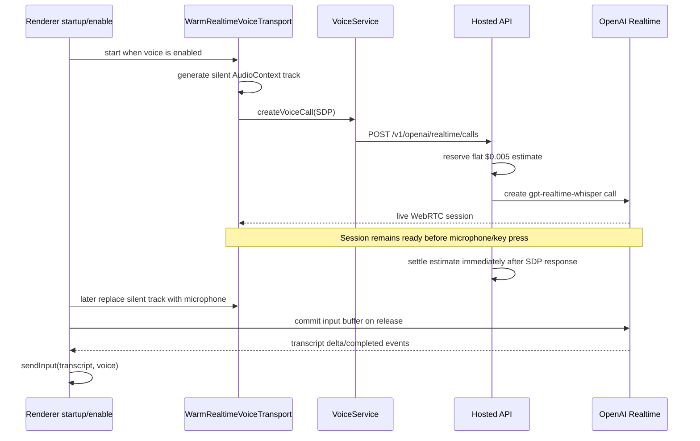

# Plan: VAD-Segmented Whisper Transcription

## Summary

Replace TroCode's warm OpenAI Realtime transcription connection with a bounded, upload-based voice-input pipeline using `whisper-1`. The renderer will capture microphone PCM only while the push-to-talk shortcut is held, detect speech and utterance boundaries locally, trim non-speech, encode independent mono 16 kHz PCM WAV segments, and upload completed segments through TroCode's existing sandboxed renderer -> preload -> authenticated main process -> hosted API trust path.

The target is a Wispr-like perceived interaction without paying for an always-open realtime stream:

- No OpenAI connection or paid audio request exists while voice input is idle.
- A natural 700 ms pause finalizes a segment and starts its transcription while the user may continue speaking.
- Continuous speech is cut at a 12 second hard boundary with 300 ms overlap, then deduplicated when transcripts are assembled.
- At most two segment uploads run concurrently.
- Completed segment text appears provisionally in sequence while the shortcut remains held.
- TroCode does **not** submit the transcript to the task/agent runtime until the shortcut is released and every expected segment has succeeded.
- A failed, cancelled, incomplete, or no-speech turn never starts a task automatically.
- Raw audio and transcript content are never written to TroCode's usage ledger or analytics.

This is a transport and metering migration, not a new voice agent. The final transcript continues to enter the same `sendInput(transcript, 'voice')` path as typed input, so the Agents SDK runtime, task lifecycle, policy decisions, approvals, and CUA boundaries remain unchanged.

## User Story

As a TroCode customer, I want push-to-talk to feel immediate and show my words as I speak in phrases, without my account paying for a live realtime connection while I am not talking, and without a partial transcript accidentally starting an agent task.

## Problem -> Solution

TroCode currently opens a microphone-free WebRTC connection whenever voice is enabled, attaches a generated silent audio track, and keeps one connection prepared for the next turn. OpenAI prices `gpt-realtime-whisper` by realtime audio duration, while TroCode's backend records a flat estimate as soon as SDP negotiation succeeds and cannot later reconcile the actual session duration. This creates both a provider-cost risk and inaccurate internal metering -> Remove WebRTC from the transcription path, create paid requests only for locally bounded speech audio, and settle each request from the provider's returned duration usage.

Changing only from Realtime to one upload after key release would reduce model price but increase perceived latency for long dictation -> Detect utterance pauses locally, upload completed phrases early, display only the ordered completed prefix, and wait for release before task submission.

Naively splitting an encoded `MediaRecorder` stream can produce dependent or undecodable chunks and cannot reliably trim leading/trailing silence -> Capture PCM through an `AudioWorklet`, keep segmentation and VAD state in pure TypeScript, and encode every finalized segment as an independent PCM WAV file.

## Metadata

- **Complexity**: XL
- **Source PRD**: N/A
- **PRD Phase**: Standalone voice-cost and latency migration
- **Repository baseline**: `5551984340e6a177649beb52a7635a0f45b84cd1`
- **Research date**: 2026-08-18
- **Estimated files**: 29-36 files across renderer, shared/preload/IPC, main voice service, hosted API, migration, tests, and docs
- **Recommended delivery**: Four deployable gates: hosted endpoint and ledger, desktop capture/IPC cutover, production canary and reconciliation, then legacy Realtime removal
- **Primary model**: `whisper-1`; do not silently substitute the newer documentation default because this project's cost decision is based on Whisper's duration price
- **Confidence score**: 8/10; the repository/provider boundaries are well traced, with remaining uncertainty concentrated in packaged AudioWorklet behavior and attribution of the separately observed Realtime 2.1 usage rows
- **Navigation note**: `docs/CODEX-NAVIGATION-GUIDE.md`, referenced by the repository instructions, is absent at this baseline. Use the checked-in architecture, security, inference-cost, current voice files, and historical TDD evidence listed below.
- **Dirty-worktree note**: At planning time, user-owned edits already exist in `services/api/src/server.mjs`, `services/api/test/server.test.mjs`, `src/main/voice/voice-service.ts`, `src/main/voice/voice-service.test.ts`, and membership files. Additional edits appeared while the plan was being finalized in `src/index.ts`, `src/shared/contracts.ts`, presentation/guidance files, `src/main/voice/companion-narration-service.ts`, and new `speech-chunks` files. Preserve the Responses `tool_choice` normalization, broader hosted voice error parsing, and concurrent narration/presentation work; refresh `git diff` before every overlapping implementation task and never replace these files wholesale.

---

## Architecture Decision

### Follow this architecture

```mermaid
flowchart LR
    USER["User holds push-to-talk"] --> MIC["getUserMedia"]
    MIC --> WORKLET["AudioWorklet: 20 ms PCM frames"]
    WORKLET --> VAD["Pure VAD + segment state"]
    VAD --> WAV["16 kHz mono PCM WAV encoder"]
    WAV --> QUEUE["Bounded upload queue: concurrency 2"]

    QUEUE --> API["window.tro.transcribeVoiceSegment"]
    API --> PRELOAD["Preload Zod parse"]
    PRELOAD --> IPC["Membership-gated IPC"]
    IPC --> VOICE["VoiceService"]

    VOICE -->|"hosted session token"| HOSTED["POST /v1/openai/audio/transcriptions"]
    VOICE -->|"local dev API key"| OPENAI
    HOSTED --> AUTH["Auth + access + rate + WAV validation"]
    AUTH --> BUDGET["Reserve parsed audio duration"]
    BUDGET --> OPENAI["OpenAI /v1/audio/transcriptions"]
    OPENAI --> USAGE["Parse text + usage.seconds"]
    USAGE --> LEDGER["Settle sanitized usage"]
    USAGE --> ASSEMBLER["Ordered transcript assembler"]

    ASSEMBLER --> LIVE["Provisional transcript UI"]
    USER --> RELEASE["Shortcut release"]
    RELEASE --> FINAL["Wait for every expected segment"]
    FINAL -->|"all succeeded"| TASK["Existing sendInput text path"]
    FINAL -->|"any failed/cancelled"| EDIT["Keep text editable; no task dispatch"]
```



### Component responsibilities

| Component | Kind | Owns | Must not own |
|---|---|---|---|
| `voice-capture-processor.worklet.js` | Web Audio adapter | Copy/aggregate microphone samples into 20 ms mono frames and post them to the renderer | VAD policy, network calls, transcript text, credentials |
| `VoiceSegmenter` in `voice-segmentation.ts` | Pure state machine | Noise floor, pre-roll, speech/silence timing, natural/hard/release boundaries, 60-second cap | Browser APIs, React, WAV bytes, IPC |
| `encodePcm16Wav` | Pure codec function | Resampling, clamping, RIFF/WAVE headers, PCM16 encoding | Segmentation or upload policy |
| `SegmentUploadQueue` | Stateful renderer helper | Concurrency of two, per-turn request IDs, ordered result bookkeeping | Provider credentials, task submission, retries |
| `OrderedTranscriptAssembler` | Pure/state value | Sequence ordering and exact normalized overlap removal | Starting tasks or displaying errors |
| `usePushToTalk` | React orchestration hook | Hotkey lifecycle, microphone resource cleanup, statuses, provisional UI, release gate | WebRTC, provider event parsing, pricing |
| `DesktopApi.transcribeVoiceSegment` | Narrow renderer capability | One bounded validated segment request/response | Raw IPC, arbitrary fetch, provider keys |
| `VoiceService` | Main-process adapter | Credential source, selected language, hosted/local routing, provider-error normalization | Microphone capture, transcript assembly, task decisions |
| `OpenAiTranscriptionService` | Hosted application service | WAV validation, provider multipart request, budget lifecycle, usage parsing, sanitized result | Authentication/session lookup, renderer state, transcript persistence |
| `BudgetService` | Existing hosted service | Duration price math plus reserve/settle/release/uncertain transitions | Audio content or provider transport |
| `PostgresUsageRepository` | Existing adapter | Sanitized latency, billed audio duration, amount, model, lane | Audio bytes or transcript text |

### Why PCM + AudioWorklet instead of `MediaRecorder` chunks

Use the worklet only as a narrow browser adapter. Keep all policy in testable TypeScript.

- A finalized PCM segment can always be encoded as an independent WAV file; it does not depend on a previous WebM initialization chunk.
- The application can retain 300 ms of pre-roll, trim long leading/trailing silence, and add overlap only at forced continuous-speech cuts.
- Duration and byte size are deterministic, so the hosted service can independently validate them before reserving spend.
- The emitted worklet asset is loaded from the application's own origin, preserving the current strict `script-src 'self'` CSP.
- No new runtime dependency or native module is required.

Do **not** move VAD into the worklet. The worklet should emit frames and silence its output; policy belongs in `voice-segmentation.ts`, where Vitest can exercise it deterministically.

---

## Current and Target Voice Lifecycles

### Current lifecycle and cost hazard



The repository does not contain `gpt-realtime-2.1`; it currently hardcodes `gpt-realtime-whisper`. If the OpenAI organization export shows `gpt-realtime-2.1` or `gpt-realtime-2.1-mini`, verify the deployed `/healthz` commit and any other project/API key consumers before attributing those rows to this checkout.

### Target segmented lifecycle

```mermaid
sequenceDiagram
    actor User
    participant Hook as usePushToTalk
    participant Capture as VoiceCapturePipeline
    participant IPC as DesktopApi/Main
    participant API as Hosted API
    participant Budget
    participant OAI as OpenAI Audio Transcriptions

    User->>Hook: press shortcut
    Hook->>Capture: start microphone + local PCM capture
    Note over Hook,OAI: No provider connection existed before key-down
    loop speech frames
        Capture->>Capture: adaptive energy VAD
        alt 700 ms silence after speech
            Capture->>IPC: independent WAV segment
            IPC->>API: authenticated bounded request
            API->>Budget: reserve from parsed WAV duration
            Budget-->>API: allowed
            API->>OAI: whisper-1 multipart upload
            OAI-->>API: verbose_json text + duration usage
            API->>Budget: settle actual billed seconds
            API-->>Hook: sequence + transcript
            Hook->>Hook: show ordered provisional prefix
        else 12 s continuous speech
            Capture->>Capture: hard split + 300 ms overlap
        end
    end
    User->>Hook: release shortcut
    Hook->>Capture: finalize last speech segment
    Hook->>Hook: wait for all expected sequences
    alt every segment succeeded and transcript is nonempty
        Hook->>Hook: submit once through existing voice text path
    else failed/cancelled/no speech
        Hook->>Hook: show error/editable prefix; do not submit
    end
```

### Turn state and release invariant

The renderer turn states are:

```text
idle
  -> requesting_permission
  -> listening (zero or more uploads may be in flight)
  -> processing (shortcut released; waiting for final uploads)
  -> idle (submit once or report one error)
```

Remove the provider-specific `connecting` state. Local capture may begin immediately after microphone permission. While a segment upload is in flight and the shortcut is still held, the user remains in `listening`; completed ordered text can appear below that label.

The hard invariant is:

```ts
const maySubmit =
  turn.released &&
  !turn.cancelled &&
  turn.expectedSegmentCount > 0 &&
  turn.results.size === turn.expectedSegmentCount &&
  [...turn.results.values()].every((result) => result.ok) &&
  assembledTranscript.trim().length >= 2;
```

No segment callback may call `onTranscriptSubmit` directly.

---

## Segmentation and Assembly Specification

### Initial constants

Keep these values together as an immutable exported policy so they can be benchmarked and changed without editing the hook:

```ts
export const DEFAULT_VOICE_SEGMENTATION_POLICY = Object.freeze({
  frameMs: 20,
  speechStartFrames: 3,
  absoluteStartRms: 0.015,
  absoluteContinueRms: 0.010,
  startNoiseMultiplier: 3.0,
  continueNoiseMultiplier: 1.8,
  initialNoiseFloorRms: 0.005,
  maximumNoiseFloorRms: 0.025,
  noiseFloorAlpha: 0.05,
  minimumSpeechMs: 300,
  preRollMs: 300,
  trailingSpeechPaddingMs: 200,
  silenceBoundaryMs: 700,
  hardSegmentMs: 12_000,
  hardBoundaryOverlapMs: 300,
  maximumUtteranceMs: 60_000,
  maximumSegments: 32,
  outputSampleRate: 16_000,
  uploadConcurrency: 2,
});
```

These are starting values, not hidden provider configuration. Record boundary type and timings as sanitized diagnostics so staging data can tune them.

### Adaptive energy VAD

For every 20 ms mono PCM frame:

1. Calculate RMS energy.
2. Maintain an exponentially weighted noise floor only while the state is non-speech: `floor = (1 - alpha) * floor + alpha * rms`, starting at `0.005`, with `alpha = 0.05` and a `0.025` maximum.
3. Start speech after three consecutive frames exceed `max(0.015, floor * 3.0)`. Continue speech while frames exceed `max(0.010, floor * 1.8)`. These initial hysteresis values must remain policy fields and be tuned only from captured non-content metrics and the fixture corpus.
4. Before speech starts, retain only the last 300 ms of frames.
5. After at least 300 ms of classified speech, finalize on 700 ms of silence, retaining only 200 ms after the last speech frame.
6. If continuous speech reaches 12 seconds, finalize immediately and copy the last 300 ms into the next segment. Mark that next segment as overlapping so transcript assembly may remove duplicated words.
7. On shortcut release, finalize a segment only if it contains at least 300 ms of classified speech; otherwise discard it.
8. At 60 seconds, stop microphone capture and show a bounded “release to submit” message. Do not auto-submit while the shortcut is still held.

Keep frame time authoritative. Do not use wall-clock timers to infer audio duration, because a suspended renderer or overloaded event loop can make wall time diverge from captured PCM.

### WAV encoding

`encodePcm16Wav` must:

- Downmix to mono in the worklet or use the first mono input channel.
- Resample from the `AudioContext.sampleRate` to exactly 16,000 Hz with continuous linear interpolation.
- Clamp float samples to `[-1, 1]`, convert to signed little-endian PCM16, and write canonical `RIFF`, `WAVE`, `fmt `, and `data` chunks.
- Return `{ bytes, durationMs, sampleRate: 16_000 }`.
- Reject empty or over-limit input before allocating the output buffer.

A 12.3 second segment is approximately 394 KB before base64 and approximately 526 KB after base64, comfortably below a 750 KB shared-contract limit. Use a 1 MB hosted JSON body cap to include metadata without accepting arbitrary audio uploads.

### Ordered assembly and overlap removal

Store results by integer sequence, never completion order. The provisional transcript is the longest contiguous successful prefix beginning at sequence zero. A sequence two result must not appear before sequence one.

For segments marked with a hard-boundary overlap:

1. Tokenize the previous suffix and current prefix by Unicode whitespace.
2. Normalize only for comparison: Unicode NFKC, lowercase, strip edge punctuation.
3. Find the longest exact suffix/prefix match from 12 tokens down to 2 tokens.
4. Remove the matched current prefix, but preserve the original spelling/punctuation of retained tokens.
5. If no two-token match exists, concatenate without destructive fuzzy editing. Duplicate words are safer than deleting a real command phrase.

Natural silence boundaries do not receive overlap and do not run deduplication.

### Upload queue and failure rules

- Generate one UUID request ID per segment and one UUID utterance ID per push-to-talk turn.
- Dispatch at most two segment calls concurrently.
- Never retry automatically after the main process has dispatched a request. A timeout or broken response is an ambiguous paid outcome.
- A duplicate request ID receives `409` from the budget reservation layer; it is not replayed.
- Cancelling stops capture and suppresses all late UI/task results. Already-dispatched provider requests may still be billed; state this in diagnostics, but do not persist audio.
- If any expected segment fails, preserve the successful ordered prefix in the input box, show one actionable error, and require the user to edit/send or record again.
- Do not fall back automatically to Realtime, browser SpeechRecognition, or a second transcription model.

---

## API, IPC, and Persistence Contracts

### Shared renderer/main contract

Replace `CreateVoiceCallRequestSchema` and `VoiceCallAnswerSchema` with bounded schemas similar to:

```ts
const PcmWavBase64Schema = z
  .string()
  .min(60)
  .max(750_000)
  .regex(/^[A-Za-z0-9+/]+={0,2}$/u)
  .refine((value) => value.length % 4 === 0, 'Invalid base64 length.');

export const TranscribeVoiceSegmentRequestSchema = z.object({
  audioBase64: PcmWavBase64Schema,
  durationMs: z.number().int().min(300).max(15_000),
  requestId: z.string().uuid(),
  sequence: z.number().int().min(0).max(31),
  utteranceId: z.string().uuid(),
});

export const VoiceSegmentTranscriptionSchema = z.object({
  audioDurationMs: z.number().int().positive().max(15_000),
  billedSeconds: z.number().finite().nonnegative().max(16),
  model: z.literal('whisper-1'),
  sequence: z.number().int().min(0).max(31),
  text: z.string().trim().max(8_000),
  utteranceId: z.string().uuid(),
});
```

The main process must echo `utteranceId` and `sequence` from the validated request after parsing the provider response. The hosted API needs `utteranceId` only as the budget `taskId`, so every segment in one voice turn shares a task tranche instead of accumulating forever under the current all-zero voice sentinel. It does not need `sequence`, and neither value is transcript content.

### Hosted HTTP request

`VoiceService` calls:

```http
POST /v1/openai/audio/transcriptions
Authorization: Bearer <TroCode session token>
Content-Type: application/json
X-Trocode-Request-Id: <segment UUID>

{
  "audioBase64": "...",
  "clientDurationMs": 12340,
  "language": "en",
  "utteranceId": "<turn UUID>"
}
```

The hosted service must not trust `clientDurationMs`. Decode and parse the WAV header before budget reservation. Require PCM format 1, mono, 16 kHz, 16-bit samples, a bounded `data` chunk, duration between 300 ms and 15 seconds, and no bytes beyond the configured maximum. Compare client duration with parsed duration only for diagnostics and reject a difference greater than one 20 ms frame plus rounding tolerance.

### OpenAI multipart request

Build this server-side or in the main process for local-development mode:

```ts
const form = new FormData();
form.set('file', new Blob([audio], { type: 'audio/wav' }), 'segment.wav');
form.set('model', 'whisper-1');
form.set('language', language);
form.set('response_format', 'verbose_json');
form.set('temperature', '0');
```

Do not request word timestamps; official documentation says they add latency. Segment timestamps are not necessary because TroCode already owns segment boundaries. `stream: true` must not be sent because it is ignored by `whisper-1`.

### Provider response and cost settlement

Parse a `verbose_json` success only when:

- `text` is a string and is trimmed/bounded before returning.
- `duration` is finite and positive.
- `usage.type === 'duration'`.
- `usage.seconds` is a bounded finite nonnegative number.

Use provider `usage.seconds` as returned, after bounded finite-number validation, for actual spend. Do not truncate fractional seconds. Keep request latency and audio duration as separate fields:

```ts
await budgetService.settle({
  actualMicroUsd: budgetService.transcriptionActualMicroUsd(billedSeconds),
  durationMs: Date.now() - startedAt,       // request latency
  requestId,
  usage: {
    audioDurationMs: Math.round(providerDuration * 1_000),
    cacheWriteTokens: 0,
    cachedInputTokens: 0,
    inputTokens: 0,
    model: 'whisper-1',
    outputTokens: 0,
    reasoningTokens: 0,
    source: 'actual',
  },
  userId,
});
```

Add `audio_duration_ms` to `model_usage_events`; do not overload `duration_ms`, which already represents provider-request latency for Responses calls.

### Database compatibility

Add `services/api/migrations/004_audio_transcription_usage.sql` rather than editing migration 003.

- Add `audio_duration_ms BIGINT NOT NULL DEFAULT 0 CHECK (audio_duration_ms >= 0)`.
- Replace both lane constraints with a set that accepts existing `realtime_transcription` history and new `transcription` rows: `responses`, `realtime_transcription`, `transcription`, `speech`.
- Keep old rows intact and do not rewrite historical model or amount fields.
- Update `PostgresUsageRepository.settle` to insert `usage.audioDurationMs ?? 0`.
- Update the migration-order test from three to four migrations.

Use the existing PostgreSQL-generated constraint names and an additive migration shape:

```sql
ALTER TABLE model_budget_reservations
  DROP CONSTRAINT IF EXISTS model_budget_reservations_lane_check;
ALTER TABLE model_budget_reservations
  ADD CONSTRAINT model_budget_reservations_lane_check
  CHECK (lane IN ('responses', 'realtime_transcription', 'transcription', 'speech'));

ALTER TABLE model_usage_events
  DROP CONSTRAINT IF EXISTS model_usage_events_lane_check;
ALTER TABLE model_usage_events
  ADD CONSTRAINT model_usage_events_lane_check
  CHECK (lane IN ('responses', 'realtime_transcription', 'transcription', 'speech'));
ALTER TABLE model_usage_events
  ADD COLUMN IF NOT EXISTS audio_duration_ms BIGINT NOT NULL DEFAULT 0
  CHECK (audio_duration_ms >= 0);
```

### Credentials and validation

- Hosted builds continue to use the signed-in TroCode session token in the main process; the hosted API owns the OpenAI API key.
- Local-development mode may continue to use `OPENAI_API_KEY` or the encrypted voice credential store.
- Replace the paid Realtime client-secret validation with a non-inference `GET /v1/models/whisper-1` access check before persisting a manually entered local API key.
- Never expose a provider API key, arbitrary provider URL, raw fetch, or raw IPC to the renderer.

---

## Cost Model and Expected Savings

Official OpenAI model pages list:

- `whisper-1`: `$0.006` per audio minute.
- `gpt-realtime-whisper`: `$0.017` per realtime audio minute.

The model-rate reduction for the same billed audio duration is:

```text
1 - (0.006 / 0.017) = 64.7% saved
```

Realtime Whisper is approximately 2.83x the per-minute price of Whisper file transcription. This figure does not include any separate agent/Responses model calls, TTS, infrastructure, or provider pricing not represented by these two model pages.

### Segmented versus non-segmented Whisper

Segmentation itself is a latency technique, not guaranteed cost savings. Cost changes only with total billed audio duration:

| 60-second recording shape | Approx. billed audio | Whisper cost | Difference from one 60 s upload |
|---|---:|---:|---:|
| One non-segmented upload | 60.0 s | `$0.00600` | baseline |
| Five continuous-speech segments with four 300 ms overlaps | 61.2 s | `$0.00612` | `+2%` |
| 45 s speech, 15 s pauses trimmed, four hard overlaps | 46.2 s | `$0.00462` | `-23%` |

Natural silence boundaries add no overlap. Only forced continuous-speech boundaries add up to 300 ms. Acceptance tests must prove that 60 seconds of continuous speech produces no more than 61.5 seconds of encoded audio.

At 1,000 users speaking 10 billed minutes/day:

```text
gpt-realtime-whisper: 1,000 * 10 * $0.017 = $170/day
whisper-1:            1,000 * 10 * $0.006 =  $60/day
base model saving:                              $110/day
```

If VAD removes 25% silence while overlap adds 2% of the original duration, the approximate Whisper bill becomes `$46.20/day`, but silence mix must be measured rather than promised.

Configure the hosted cost guard with `TROCODE_TRANSCRIPTION_MICRO_USD_PER_MINUTE=6000`. Implement integer-safe ceiling math for reservation and settlement; never use floating-point dollars in persistence.

---

## UX Design

### Before

```text
Voice enabled
  -> hidden warm WebRTC call and silent sender

Hold shortcut
  Starting microphone -> Connecting -> Listening
  live provider deltas appear

Release
  commit Realtime buffer -> wait for completion -> task starts
```

Problems visible or material to the user:

- Voice can incur provider usage before the user presses the shortcut.
- “Connecting” represents WebRTC/provider setup rather than useful capture.
- Internal budget shows a flat estimate unrelated to actual audio duration.
- A connection failure can prevent capture even though the microphone is locally available.

### After

```text
Voice enabled
  -> no network or paid audio session

Hold shortcut
  Starting microphone -> Listening
  "open YouTube"             (first completed phrase)
  "open YouTube and search"  (ordered provisional prefix)

Release
  Transcribing / Finishing your request…
  -> all segments complete -> task starts once
  -> any segment failed -> editable transcript remains; no task starts
```

### Interaction details

| Situation | UI behavior | Task behavior |
|---|---|---|
| Voice is enabled but idle | Existing ready affordance; no hidden connection state | No provider call |
| Permission prompt | “Starting microphone” / existing permission guidance | None |
| Speaking with no pause | “Listening”; local meter remains active | Hard segment uploads at 12 s, no submit |
| Natural pause | Completed ordered phrase appears while listening | Segment upload only |
| Shortcut release with uploads pending | “Finishing your request…” | Wait |
| All segments succeed | Final transcript appears | Submit once through `sendInput(..., 'voice')` |
| No speech | Existing shortcut-specific retry guidance | No submit/no paid request |
| One segment fails | Keep successful ordered prefix editable; show “A part of this recording could not be transcribed. Review it or record again.” | No submit and no automatic retry |
| Escape/cancel | Close microphone immediately; discard UI turn; ignore late results | No submit; already dispatched segment cost may remain |
| 60 s limit | Stop capture; show “Voice input reached 60 seconds. Release the shortcut to finish.” | Do not submit until release |

Keep `VoiceIsland` and the input box driven from the same provisional transcript. Do not show raw segment numbers, billing seconds, or provider model names in the normal voice UI.

---

## Product Boundary

### In scope

- Replace `gpt-realtime-whisper` WebRTC transcription with `whisper-1` file transcription.
- Local PCM capture, energy VAD, silence trimming, natural/hard segmentation, WAV encoding, bounded concurrency, ordered assembly, overlap dedupe, cancellation, and resource cleanup.
- New narrow shared/preload/IPC/main/hosted transcription contracts.
- Accurate provider-duration cost reservation/settlement and sanitized audio-duration ledger data.
- Update voice status, diagnostics, CSP, architecture/security/cost docs, and tests.
- Preserve both English and Vietnamese language hints from `AppPreferencesService`.
- Preserve local API-key development and hosted customer login behavior.

### Preserve exactly

- Sandboxed renderer: `sandbox: true`, `contextIsolation: true`, `nodeIntegration: false`.
- Zod parsing in preload and IPC/model boundaries.
- Membership checks before every hosted voice effect.
- Main-process credential ownership.
- System audio ducking while the shortcut is held and guaranteed restoration on disable/sign-out/error.
- Local and global push-to-talk shortcuts and Escape cancellation.
- Final transcript enters the existing typed task path; voice does not become a second agent runtime.
- Consequential-action approval and unknown-outcome no-retry invariants.
- Analytics records only the existing count-only completed voice event, never transcript content.
- User-owned current worktree changes described in Metadata.

### Not building

- A conversational full-duplex voice agent, synthesized OpenAI voice, barge-in, or spoken model responses.
- A direct renderer -> OpenAI request.
- A customer-supplied API key in hosted production.
- Speaker diarization, meetings, subtitles, translation, word timestamps, or recordings longer than 60 seconds.
- Automatic language detection beyond the existing `en`/`vi` preference.
- A model fallback from `whisper-1` to Realtime or `gpt-transcribe`.
- Fuzzy/LLM transcript deduplication.
- Audio persistence, replay, history, or analytics.
- Changing Agents SDK, Codex workspace runtime, task compilation, policy, or CUA.

---

## Mandatory Reading

Read these files before implementation. Line numbers refer to the planning baseline and may drift.

| File | Relevant lines | Why |
|---|---:|---|
| `AGENTS.md` | entire file | Renderer sandbox, narrow `DesktopApi`, boundary parsing, pure/testable policy, verification commands |
| `docs/architecture.md` | 113-160 | Existing readiness/trust/data ownership and voice-as-transcription architecture |
| `docs/inference-cost-lifecycle.md` | 22-50 | Typed and voice inputs share a task path; current Realtime estimation limitation |
| `docs/security.md` | 35-80, 120+ | Membership, sensitive data, and unknown-outcome rules |
| `src/renderer/use-push-to-talk.ts` | 241-650, 701-914 | Current lifecycle, release gate, microphone cleanup, diagnostics, and warm-start effect |
| `src/renderer/realtime-voice-transport.ts` | 78-108, 157-218 | Silent placeholder track and WebRTC transport being removed |
| `src/renderer/warm-realtime-voice-transport.ts` | 22-64, 115-170 | Idle connection lifecycle being removed |
| `src/renderer/App.tsx` | 89-94, 1504-1531 | Voice model status and final `sendInput(transcript, 'voice')` integration |
| `src/renderer/VoiceIsland.tsx` | 7-36, 47-83 | Existing voice phases and accessible live region |
| `src/shared/contracts.ts` | 690-747, 877-913, 950-1040 | Voice status/activity, Realtime contracts, diagnostics, inferred types |
| `src/shared/desktop-api.ts` | 38-132 | Channel names and narrow renderer surface |
| `src/preload.ts` | 239-271 | Parse-before-invoke/parse-after-response convention |
| `src/main/ipc/register-ipc.ts` | 413-453 | Auth/membership gates and voice handler registration |
| `src/main/voice/voice-service.ts` | 14-121, 209-448 | Credential precedence, language lookup, hosted/local routing, errors, timeouts |
| `services/api/src/server.mjs` | 123-175, 256-319, 511-590 | Bounded body parsing, auth/access, health version, current Realtime route |
| `services/api/src/openai-responses-service.mjs` | 100-221 | Reserve -> dispatch -> release/uncertain/settle provider-service pattern |
| `services/api/src/budget-service.mjs` | 16-104 | Integer config and budget lifecycle |
| `services/api/src/usage-repository.mjs` | 126-225 | Transactional settlement and sanitized ledger fields |
| `services/api/migrations/003_model_usage_budgets.sql` | 1-56 | Existing immutable tables/lane constraints; add a new migration |
| `webpack.renderer.config.ts` | 6-25 | Asset rule and strict-CSP bundle pattern for the worklet |
| `src/index.html` | 7-13 | Remove renderer access to `api.openai.com` after WebRTC deletion |
| `docs/testing/realtime-voice-input-buffer.tdd.md` | entire file | Historical first/last-buffer, release, microphone, and diagnostic failures that must not regress |

---

## External Documentation

Use only current first-party OpenAI documentation for provider behavior and pricing:

1. [Whisper model](https://developers.openai.com/api/docs/models/whisper-1)
   - `whisper-1` supports `/v1/audio/transcriptions` and is listed at `$0.006` per transcription minute.
2. [GPT-Realtime-Whisper model](https://developers.openai.com/api/docs/models/gpt-realtime-whisper)
   - It is intended for low-latency transcript deltas, priced by realtime audio duration at `$0.017` per minute.
3. [Create transcription API reference](https://developers.openai.com/api/reference/resources/audio/subresources/transcriptions/methods/create)
   - Accepts `wav` and `webm` among supported inputs; filenames/content types should identify format.
   - Supplying ISO-639-1 `language` improves accuracy and latency.
   - `prompt` may continue a prior segment, but is not required for the first implementation.
   - `verbose_json` returns duration data; duration-billed responses may contain `usage.seconds`.
   - Streaming is not supported for `whisper-1` and is ignored.
   - Word timestamps add latency; do not request them.
4. [File transcription guide](https://developers.openai.com/api/docs/guides/speech-to-text)
   - File transcription is for completed or bounded audio. This design converts the live microphone into completed bounded segments before each request.
   - The guide currently recommends `gpt-transcribe` generally. Keep `whisper-1` here because the user explicitly chose the Whisper cost architecture; treat a future model migration as a separate priced and benchmarked decision.

Re-verify these pages immediately before implementation. Provider pricing and supported fields are operational configuration, not permanent code truth.

---

## Current Code Evidence

### Voice enablement opens a warm provider connection

`src/renderer/use-push-to-talk.ts:905-914`:

```ts
useEffect(() => {
  enabledRef.current = enabled;
  if (enabled && platform !== 'unsupported') {
    warmTransport.start();
    return;
  }

  warmTransport.stop();
  stopVoice();
}, [enabled, platform, stopVoice, warmTransport]);
```

`src/renderer/warm-realtime-voice-transport.ts:60-64` immediately calls `replenish`, which calls `openRealtimeVoiceTransport` before key-down.

### The warm connection carries a generated silent audio track

`src/renderer/realtime-voice-transport.ts:78-108` creates an `AudioContext`, constant zero source, media-stream destination, and live audio track. `openRealtimeVoiceTransport` attaches this track when no microphone track is supplied.

OpenAI's model page says `gpt-realtime-whisper` is priced by realtime audio duration. It is therefore a strong operational hypothesis that the silent warm sender contributes to the organization usage; prove it with the rollout reconciliation test rather than relying only on code inspection.

### The backend settles a flat estimate before actual session duration is known

`services/api/src/server.mjs:533-574` reserves `budgetService.realtimeCallEstimateMicroUsd()` and settles the same amount as `estimated` immediately after the SDP response. The WebRTC media then flows between renderer and provider, so this HTTP handler does not observe final audio duration.

`services/api/src/config.mjs:76-80` defaults the estimate to 5,000 micro-USD (`$0.005`) per call, unrelated to a particular turn's seconds.

### Final transcript already uses the safe text/task path

`src/renderer/App.tsx:1513-1531` calls the hook and maps only the final transcript to:

```ts
onTranscriptSubmit: (transcript) => void sendInput(transcript, 'voice')
```

Preserve this boundary. Do not call `TaskApplicationService` from the capture or segment code.

### Strong boundary validation already exists

`src/preload.ts:255-267` parses a renderer request before invoking IPC and parses the main-process response before returning it. `src/main/ipc/register-ipc.ts:432-435` performs membership authorization before calling `VoiceService`. Mirror both patterns for `transcribeVoiceSegment`.

### Cost persistence is already transactional and sanitized

`services/api/src/openai-responses-service.mjs:108-195` implements reserve -> mark dispatched -> release/uncertain/settle. `services/api/src/usage-repository.mjs:126-194` serializes settlement under a per-user advisory lock and writes no prompt/output. Extend these seams instead of creating a second voice-specific budget database.

### Current historical voice tests encode useful failure lessons

The current hook and transport tests cover key-up during connection, minimum capture time, microphone packet flow, cancellation, one-submit semantics, and cleanup. Delete WebRTC-specific assertions only after equivalent capture/segment/release assertions exist.

---

## Patterns to Mirror

These are current repository patterns, not proposed abstractions. Keep new code visually and behaviorally consistent with them.

### Boundary parsing pattern

```ts
// SOURCE: src/preload.ts:255-267
async recordVoiceTranscript(input) {
  const request = RecordVoiceTranscriptRequestSchema.parse(input);
  await ipcRenderer.invoke(IPC_CHANNELS.recordVoiceTranscript, request);
},

async createVoiceCall(input) {
  const request = CreateVoiceCallRequestSchema.parse(input);
  const response: unknown = await ipcRenderer.invoke(
    IPC_CHANNELS.createVoiceCall,
    request,
  );
  return VoiceCallAnswerSchema.parse(response);
},
```

Mirror the second method's parse -> invoke -> parse structure for `transcribeVoiceSegment`.

### IPC authorization pattern

```ts
// SOURCE: src/main/ipc/register-ipc.ts:423-435
ipcMain.handle(
  IPC_CHANNELS.recordVoiceTranscript,
  async (event, input: unknown) => {
    await assertMembershipAuthorizedSender(event, mainWindow, services);
    const request = RecordVoiceTranscriptRequestSchema.parse(input);
    await services.recordVoiceTranscript(request);
  },
);

ipcMain.handle(IPC_CHANNELS.createVoiceCall, async (event, input: unknown) => {
  await assertMembershipAuthorizedSender(event, mainWindow, services);
  return services.voiceService.createCall(input);
});
```

The segment handler must use `assertMembershipAuthorizedSender`; trusted-sender-only is insufficient for a paid effect.

### Provider service and unknown-outcome pattern

```js
// SOURCE: services/api/src/openai-responses-service.mjs:108-141
const estimate = this.catalog.estimateResponsesReservation(input.body);
await this.budgetService.reserve({
  catalogVersion: this.catalog.version,
  lane: 'responses',
  model: input.body.model,
  requestId: input.requestId,
  reservedMicroUsd: estimate.microUsd,
  taskId: input.taskId,
  userId: input.userId,
});
await this.budgetService.markDispatched(input.userId, input.requestId);

let response;
try {
  response = await this.fetchImpl(OPENAI_RESPONSES_URL, {
    // bounded provider request
  });
} catch {
  await this.budgetService.markUncertain(input.userId, input.requestId);
  throw new ResponsesServiceError(
    502,
    'The model provider is temporarily unavailable. This call was not retried.',
    'ambiguous_dispatch',
  );
}
```

Voice must reserve before dispatch, mark dispatch immediately before fetch, and use uncertain/no-retry semantics after that boundary.

### Known pre-inference rejection pattern

```js
// SOURCE: services/api/src/openai-responses-service.mjs:155-170
if (!response.ok) {
  if (isRejectedBeforeInference(response.status)) {
    await this.budgetService.release(
      input.userId,
      input.requestId,
      'rejected_before_inference',
    );
  } else {
    await this.budgetService.markUncertain(input.userId, input.requestId);
  }
  return {
    body,
    contentType: response.headers.get('content-type') || JSON_CONTENT_TYPE,
    headers: {},
    status: response.status,
  };
}
```

Use the same status classification for transcription. Do not release a provider 5xx or a request whose response completion is unknown.

### Transactional data-access pattern

```js
// SOURCE: services/api/src/usage-repository.mjs:126-150
async settle(input) {
  const client = await this.pool.connect();
  try {
    await client.query('BEGIN');
    await client.query('SELECT pg_advisory_xact_lock(hashtextextended($1, 0))', [
      input.userId,
    ]);
    const current = await client.query(
      `SELECT request_id, reserved_micro_usd, actual_micro_usd, status
       FROM model_budget_reservations
       WHERE user_id = $1 AND request_id = $2 FOR UPDATE`,
      [input.userId, input.requestId],
    );
    // validate current state, insert one usage event, settle reservation
```

Extend this transaction with `audio_duration_ms`; do not add a second non-transactional voice ledger.

### Sanitized structured logging pattern

```js
// SOURCE: services/api/src/openai-responses-service.mjs:196-211
console.info(
  JSON.stringify({
    durationMs: Date.now() - startedAt,
    event: 'inference.settled',
    lane: 'responses',
    microUsd: actualMicroUsd,
    model: usage.model,
    requestId: input.requestId,
    responseId: usage.responseId,
    taskId: input.taskId,
    usageSource: usage.source,
  }),
);
```

The transcription log may add encoded/audio duration, byte count, boundary, sequence, and billed seconds. It must omit audio, base64, transcript, prompts, and provider error bodies.

### Provider error normalization pattern

```ts
// SOURCE: src/main/voice/voice-service.ts:26-42
const OpenAIErrorResponseSchema = z.object({
  error: z
    .union([
      z.string().min(1).max(2_000),
      z.object({ message: z.string().min(1).max(2_000) }),
    ])
    .optional(),
});

function apiErrorMessage(responseBody: unknown): string | undefined {
  const apiError = OpenAIErrorResponseSchema.safeParse(responseBody);
  if (!apiError.success) return undefined;
  if (typeof apiError.data.error === 'string') return apiError.data.error;
  return apiError.data.error?.message;
}
```

This is part of the current dirty worktree. Preserve it when replacing Realtime transport methods.

### Test setup pattern

```ts
// SOURCE: src/main/voice/voice-service.test.ts:20-30
function memoryStore(initial: string | null = null): {
  store: VoiceCredentialStore;
  read: ReturnType<typeof vi.fn>;
  write: ReturnType<typeof vi.fn>;
} {
  let value = initial;
  const read = vi.fn(async () => value);
  const write = vi.fn(async (nextValue: string) => {
    value = nextValue;
  });
  return { store: { read, write }, read, write };
}
```

Continue dependency injection with fake fetch/stores/capture adapters. Tests must not require a real microphone, OpenAI key, session, or database.

---

## Unified Discovery Table

| Category | Current evidence | Target reuse/change |
|---|---|---|
| Entry points | `App.tsx` -> `usePushToTalk`; global shortcut events from `DesktopApi` | Preserve both local/global shortcuts and final `sendInput` call |
| Business logic | Hook owns provider transport and release state; `push-to-talk.ts` owns pure shortcut helpers | Move VAD, WAV, assembly, and boundary decisions into pure modules; keep hook orchestration only |
| Data layer | Hosted budget reservations/events in Postgres; voice content excluded | Extend one usage row per segment with `audio_duration_ms`; no new content table |
| Types/contracts | Zod shared contracts -> typed preload -> membership-gated IPC | Replace SDP request/answer with bounded base64 WAV request/result |
| UI | Input + `VoiceIsland` show provider deltas and phases | Show ordered completed segments; simplify phases; preserve accessibility/live region |
| Tests | Vitest renderer/main; Node hosted API; build/package required | Add deterministic PCM/VAD fixtures, service lifecycle tests, migration test, manual production reconciliation |
| Configuration | Flat Realtime call estimate, daily/monthly/task budgets | Duration price per minute and parsed-WAV reservation; preserve common caps |
| Observability | Sanitized renderer/main diagnostics and provider usage rows | Add boundary, encoded duration/bytes, latency, billed seconds, request disposition; never audio/text |

### Five traces

1. **Entry -> execution -> persistence**: shortcut -> hook -> worklet/segmenter -> `DesktopApi` -> preload -> IPC membership gate -> `VoiceService` -> hosted API -> `OpenAiTranscriptionService` -> budget reservation -> OpenAI -> usage settlement.
2. **Shared abstraction**: new `transcribeVoiceSegment` follows the existing `DesktopApi`/preload/IPC pattern; hosted transport follows `OpenAiResponsesService`; final text follows existing `sendInput`.
3. **Test trace**: pure frame fixtures cover boundaries; hook mocks capture/upload; main tests hosted/local routing; server/service tests cover authentication, validation, cost state, and no retry.
4. **UI trace**: segment result -> ordered assembler -> `onTranscriptChange` -> `App` input and companion activity -> release/all-success -> `onTranscriptSubmit` once.
5. **Data trace**: parsed WAV milliseconds -> reserved micro-USD -> provider `usage.seconds` -> actual micro-USD -> reservation settlement + sanitized `audio_duration_ms`; raw bytes and text leave memory after the turn.

---

## Proposed Files

### Create

| File | Purpose |
|---|---|
| `src/renderer/voice-capture-processor.worklet.js` | Minimal own-origin PCM frame adapter |
| `src/renderer/voice-capture.ts` | AudioContext/worklet lifecycle, microphone cleanup, and capture adapter |
| `src/renderer/voice-capture.test.ts` | Mock Web Audio lifecycle, cleanup, and frame-forwarding tests |
| `src/renderer/voice-segmentation.ts` | Pure VAD/segment policy, resampling/WAV encoding, transcript assembly, bounded queue primitives |
| `src/renderer/voice-segmentation.test.ts` | PCM fixtures for silence, speech, noise, hard cuts, overlap, WAV, ordering, dedupe, and concurrency |
| `services/api/src/openai-transcription-service.mjs` | Provider multipart request, WAV parser, budget lifecycle, usage parsing, sanitized result |
| `services/api/test/openai-transcription-service.test.mjs` | Provider/budget/error/usage/WAV tests |
| `services/api/migrations/004_audio_transcription_usage.sql` | Add audio duration and new-compatible lane constraints |
| `services/api/test/usage-repository.test.mjs` | Settlement assertion for audio duration and sanitized fields |
| `docs/testing/vad-segmented-whisper-transcription.tdd.md` | Red/green evidence, fixture inventory, benchmark and manual verification results |

### Modify

| File | Change |
|---|---|
| `src/shared/contracts.ts` | `whisper-1` status, segment request/result, updated diagnostic steps/types |
| `src/shared/contracts.test.ts` | Base64, duration, ID, sequence, response, status, diagnostic bounds |
| `src/shared/desktop-api.ts` | Replace `createVoiceCall` channel/method with `transcribeVoiceSegment` |
| `src/preload.ts` | Parse request and response on the new narrow method |
| `src/main/ipc/register-ipc.ts` | Membership-gated segment handler and updated sanitized diagnostics |
| `src/main/ipc/register-ipc.test.ts` | Routing, auth/membership denial, malformed/oversized input, no legacy renderer capability |
| `src/main/voice/voice-service.ts` | Replace Realtime/client-secret/SDP flow with hosted/local multipart transcription |
| `src/main/voice/voice-service.test.ts` | Hosted/local routing, language, request ID, multipart, access validation, errors/timeouts |
| `src/index.ts` | Compose unchanged `VoiceService`; update any diagnostic wording |
| `src/renderer/use-push-to-talk.ts` | Orchestrate capture, queue, provisional prefix, release gate, cancel/limits; remove WebRTC warming |
| `src/renderer/use-push-to-talk.test.ts` | Replace transport mocks with capture/segment/upload lifecycle tests |
| `src/renderer/push-to-talk.ts` | Retain platform/shortcut/error helpers; remove Realtime and unused browser SpeechRecognition parsing |
| `src/renderer/push-to-talk.test.ts` | Retain shortcut tests; replace provider-event assertions with upload error guidance |
| `src/renderer/App.tsx` | Empty voice model status becomes `whisper-1`; retain transcript/send callbacks |
| `src/renderer/VoiceIsland.tsx` | Remove `connecting` copy if phase is removed; preserve accessible status behavior |
| `src/shared/global.d.ts` | Remove unused browser SpeechRecognition declarations |
| `src/shared/assets.d.ts` | Add a worklet asset declaration only if the selected Webpack URL form requires it |
| `webpack.renderer.config.ts` | Emit `.worklet.js` as an own-origin asset without eval/blob CSP changes |
| `src/index.html` | Remove renderer `https://api.openai.com` `connect-src` after direct WebRTC is gone |
| `services/api/src/main.mjs` | Compose/inject `OpenAiTranscriptionService` |
| `services/api/src/server.mjs` | Add authenticated bounded route; preserve current user-owned Responses changes; later remove legacy route |
| `services/api/test/server.test.mjs` | New endpoint auth/access/body/rate/request-ID cases; preserve current user-owned Responses tests |
| `services/api/src/config.mjs` | Add transcription per-minute micro-USD; retire flat Realtime estimate after compatibility window |
| `services/api/test/config.test.mjs` | Default and invalid price configuration |
| `services/api/src/budget-service.mjs` | Integer-safe transcription estimate/actual helpers |
| `services/api/test/budget-service.test.mjs` | Duration price rounding and unchanged cap behavior |
| `services/api/src/usage-repository.mjs` | Insert `audio_duration_ms`; preserve transaction/idempotency semantics |
| `services/api/test/migrate.test.mjs` | Expect and identify migration 004 |
| `test/fixtures/inference-cost/call-shapes.json` | Add Realtime -> Whisper and segmented-silence scenarios with documented assumptions |
| `README.md` | Replace Realtime claims with segmented Whisper behavior and privacy/cost notes |
| `docs/architecture.md` | New bounded capture/proxy flow and trust ownership |
| `docs/inference-cost-lifecycle.md` | Actual duration settlement and segment cost math |
| `docs/security.md` | Ephemeral audio handling, max sizes, validation, and no content persistence |

### Delete after desktop cutover parity

| File | Reason |
|---|---|
| `src/renderer/realtime-voice-transport.ts` | No WebRTC transcription transport |
| `src/renderer/realtime-voice-transport.test.ts` | Replaced by capture/segmentation tests |
| `src/renderer/warm-realtime-voice-transport.ts` | No idle paid transport |
| `src/renderer/warm-realtime-voice-transport.test.ts` | Warm-connection behavior is intentionally removed |

Keep `docs/testing/realtime-voice-input-buffer.tdd.md` as historical evidence; do not pretend those failures never occurred.

---

## Implementation Tasks

### Task 1: Lock contracts and pure audio policy with failing tests

**Files**: `src/shared/contracts.ts`, `src/shared/contracts.test.ts`, `src/renderer/voice-segmentation.ts`, `src/renderer/voice-segmentation.test.ts`

- **ACTION**: Define the bounded data model and build the deterministic functional core before touching browser/provider orchestration.
- **IMPLEMENT**: Complete the following red/green steps in order.

1. Add failing contract tests for valid/invalid UUIDs, maximum sequence, exact `audio/wav` representation, base64 character/length/divisibility bounds, duration limits, empty transcript response, and `whisper-1` status.
2. Add deterministic helpers that generate PCM frames by milliseconds/sample rate; do not store binary fixtures unless a real provider regression requires them.
3. Implement `VoiceSegmenter` as a pure state machine accepting `{ samples, sampleRate }` frames plus explicit `finish()`.
4. Test:
   - no segment for silence or less than 300 ms speech;
   - 300 ms pre-roll retained;
   - 700 ms silence boundary with only 200 ms trailing padding;
   - background noise floor adaptation and speech hysteresis;
   - a continuous hard split at 12 seconds with exactly 300 ms overlap metadata;
   - a release-finalized segment;
   - 60-second and 32-segment caps;
   - no input frame mutation.
5. Implement/test `encodePcm16Wav`, parse the test output back, and assert RIFF sizes, mono/16 kHz/PCM16, clipping, resampling duration, and maximum bytes.
6. Implement/test ordered assembly: out-of-order completion, contiguous provisional prefix, punctuation-preserving join, hard-overlap exact dedupe, and no destructive fuzzy deletion.
7. Implement/test a queue primitive proving active uploads never exceed two and completion results remain sequence-addressable.

- **MIRROR**: Shared Zod schema/type exports in `src/shared/contracts.ts:877-913,950-1040`, immutable pure shortcut helpers in `src/renderer/push-to-talk.ts:77-118`, and Vitest table/edge assertions in `src/renderer/push-to-talk.test.ts:14-131`.
- **IMPORTS**: `z` from `zod` in shared contracts; `describe`, `expect`, `it`, and optionally `vi` from `vitest` in tests. The production segmentation module should require no third-party import.
- **GOTCHA**: Frame counts, not wall time, determine audio duration. Preserve original samples/text during normalization and do not let overlap dedupe delete a non-exact command phrase.
- **VALIDATE**: Run the shared/segmentation focused Vitest command, then `npm run typecheck`. Confirm these modules import no React, Electron, `window`, fetch, provider SDK, or task runtime.

### Task 2: Build the hosted Whisper service and accurate cost lifecycle

**Files**: `services/api/src/openai-transcription-service.mjs`, its tests, config/budget files/tests, migration 004, usage repository/tests, main composition

- **ACTION**: Add one provider service and extend the existing transactional budget/usage subsystem for duration-billed transcription.
- **IMPLEMENT**: Complete the following provider, price, migration, and persistence steps.

1. Start with failing tests for strict WAV parsing: bad base64, missing RIFF/WAVE/fmt/data, non-PCM, stereo, wrong sample rate/bit depth, inconsistent chunk sizes, too short, too long, extra oversized body, and client-duration mismatch.
2. Add integer price helpers:

```js
transcriptionEstimateMicroUsd(durationMs) {
  return Math.ceil(
    (durationMs * this.options.transcriptionMicroUsdPerMinute) / 60_000,
  );
}

transcriptionActualMicroUsd(seconds) {
  return Math.ceil(
    (seconds * this.options.transcriptionMicroUsdPerMinute) / 60,
  );
}
```

Validate `durationMs` as a safe bounded integer and provider `seconds` as a bounded finite nonnegative number before multiplication. Persist only integer micro-USD after `Math.ceil`. Add tests at 300 ms, 12 s, 60 s, fractional provider seconds, and rounding boundaries.
3. Add migration 004 and update the repository insert to keep latency and `audioDurationMs` distinct. Add a repository test that inspects parameter order and proves no `text`, `audio`, or base64 value is written.
4. Implement `OpenAiTranscriptionService` following `OpenAiResponsesService`:
   - parse authoritative WAV duration;
   - reserve with lane `transcription`, model `whisper-1`, catalog/version label, the validated utterance UUID as `taskId`, and request/user IDs;
   - mark dispatched immediately before fetch;
   - never retry;
   - release only known pre-inference 400/401/403/404/422 responses;
   - mark network, timeout-after-dispatch, overlarge/invalid success body, provider 5xx, and missing usage as uncertain; if text and duration are otherwise safe, return the transcript with sanitized `usageSource: 'missing'` rather than throwing away successful user work;
   - settle valid usage and return a sanitized local result.
5. Test the exact multipart fields, filename/content type, language, timeout, safety identifier, response parsing, provider error normalization, actual billed seconds, and logs without audio/text.
6. Compose the service in `services/api/src/main.mjs` and inject it into the handler; keep the handler responsible for auth/access/rate/body/request-ID validation, not provider budget mechanics.

- **MIRROR**: `OpenAiResponsesService` reserve/dispatch/settle and error-disposition flow in `services/api/src/openai-responses-service.mjs:100-221`, `BudgetService` validation in `services/api/src/budget-service.mjs:9-57`, and the advisory-lock transaction in `services/api/src/usage-repository.mjs:126-194`.
- **IMPORTS**: Node globals `Buffer`, `Blob`, `FormData`, `AbortSignal`, and `fetch` are available under the API's Node >=24 engine. Import `BudgetService` only in tests/composition as needed; add no OpenAI SDK or codec dependency to `services/api/package.json`.
- **GOTCHA**: The current all-zero `VOICE_TASK_ID` makes every voice call share one task budget indefinitely. Use the validated utterance UUID as `taskId`. Do not edit migration 003 or reuse request latency as audio duration.
- **VALIDATE**: Run the six focused API tests, then `npm --prefix services/api test`. Inspect test-captured SQL/logs to prove neither transcript nor audio/base64 is present.

### Task 3: Add the authenticated hosted endpoint without removing legacy clients

**Files**: `services/api/src/server.mjs`, `services/api/test/server.test.mjs`

- **ACTION**: Expose the provider service through the existing authenticated, origin-denying, membership-gated raw Node HTTP handler.
- **IMPLEMENT**: Add and test the endpoint in the following order.

1. Add `POST /v1/openai/audio/transcriptions` with:
   - browser-Origin rejection inherited from the handler;
   - valid TroCode session and active access code;
   - `limitVoice('transcription:<user>')` at a segmented-appropriate rate (start at 60/minute) and an explicit daily cap if production telemetry shows abuse risk;
   - required valid `X-Trocode-Request-Id` UUID;
   - `application/json` and 1 MB maximum;
   - exact `en`/`vi`, base64, client duration, and utterance UUID shapes;
   - delegation to `transcriptionService.execute`;
   - JSON response only, with security/no-store headers.
2. Test signed-out, inactive-member, malformed ID, unsupported language, invalid base64, too-large body, rate limit, provider rejection, duplicate request, and success.
3. Verify the endpoint never logs request bodies.
4. Preserve the current `/v1/openai/realtime/calls` route for installed old clients during the desktop rollout window. Do not let the new desktop fall back to it.
5. Preserve the current uncommitted Responses `tool_choice` normalization and tests while editing this file.

- **MIRROR**: `readJson`/bounded-body handling in `services/api/src/server.mjs:123-145`, session/access helpers at `256-269`, the Responses route at `428-491`, and the current voice membership/rate gate at `511-525`.
- **IMPORTS**: Import `TranscriptionServiceError` only if the handler needs explicit classification; otherwise rely on the service's bounded `{ status, ... }` result and the handler's existing `HttpError` path. Add no HTTP framework.
- **GOTCHA**: `services/api/src/server.mjs` and its test already contain uncommitted Responses changes. Patch the voice route narrowly. Module-level rate-limit buckets can leak across tests, so use unique users or an injectable/resettable limiter pattern consistent with current tests.
- **VALIDATE**: Run `node --test services/api/test/server.test.mjs`, deploy the backend gate, then verify `GET /healthz` returns the intended commit before releasing the desktop dependency.

### Task 4: Replace the main-process SDP service with bounded transcription

**Files**: shared API/preload, IPC, `VoiceService`, their tests, `src/index.ts`

- **ACTION**: Replace the renderer-visible SDP operation with one schema-bound segment operation while retaining hosted and local credential modes.
- **IMPLEMENT**: Perform the contract/preload/IPC/service cutover together so no layer temporarily exposes an unparsed payload.

1. Rename the channel and method to `transcribeVoiceSegment`; remove `createVoiceCall` from the renderer surface.
2. Preload parses both request and response. IPC repeats request parsing and calls `assertMembershipAuthorizedSender` before `VoiceService`.
3. `VoiceService.transcribeSegment`:
   - resolves hosted session token or local provider key through the existing credential precedence;
   - reads the existing primary language from preferences;
   - hosted mode sends JSON plus `X-Trocode-Request-Id` to the new TroCode endpoint;
   - local mode decodes bounded base64 and creates the exact OpenAI multipart request;
   - parses the sanitized hosted response or provider `verbose_json` through Zod;
   - echoes validated sequence/utterance IDs;
   - uses a 30-second timeout and never retries;
   - retains the current user-owned ability to parse either string or object hosted errors;
   - logs only request ID, sequence, bytes, duration, status, and latency.
4. Replace Realtime client-secret validation in `configure` with a non-inference `GET /v1/models/whisper-1` check before saving a local key.
5. Update diagnostic step enums to `microphone`, `audio_context`, `audio_worklet`, `audio_encode`, `segment_upload`, and `transcription_response`; keep messages bounded/redacted.
6. Test hosted and local modes, en/vi language, exact headers/form data, no stored key use in hosted mode, membership denial, malformed response, timeouts, and provider error causes.

- **MIRROR**: Preload parse/invoke/parse and membership IPC patterns in `Patterns to Mirror`, credential precedence at `src/main/voice/voice-service.ts:274-295`, bounded error parsing at `26-42`, and hosted/local URL selection at `362-400`.
- **IMPORTS**: Replace `CreateVoiceCallRequestSchema`, `VoiceCallAnswerSchema`, and types with the new segment request/result schemas/types in `voice-service.ts`, `desktop-api.ts`, `preload.ts`, and `register-ipc.ts`. Continue using `z` only where provider/internal response parsing needs it.
- **GOTCHA**: Preserve the current dirty-worktree `apiErrorMessage` behavior for hosted string errors. The hosted bearer is a TroCode session token, while the local bearer is an OpenAI key; never send either to the wrong URL or include it in diagnostics.
- **VALIDATE**: Run contract, `VoiceService`, and IPC tests plus `npm run typecheck`. Inspect `window.tro` in types/tests to confirm no SDP, raw fetch, or provider-token capability remains.

### Task 5: Implement local capture and integrate the release-safe hook

**Files**: worklet, capture adapter/tests, `use-push-to-talk.ts`/tests, `push-to-talk.ts`/tests, App/VoiceIsland/global declarations, Webpack/CSP

- **ACTION**: Build the browser resource adapter and replace the Realtime hook with the local segment/upload/release lifecycle.
- **IMPLEMENT**: Complete the worklet packaging spike first, then integrate capture and hook state under tests.

1. Add a `.worklet.js` asset rule and load it with an own-origin URL. Do not add `blob:` or `unsafe-eval` to CSP.
2. Implement the minimal worklet:
   - accept one input;
   - copy mono samples into 20 ms batches;
   - post transferable `Float32Array` buffers plus sample rate/frame index;
   - write zeros to output or use a processing-safe zero-gain graph so microphone audio is never played;
   - never inspect text or call network APIs.
3. Implement `VoiceCapturePipeline` resource ownership. `stop()` must be idempotent and stop tracks, disconnect nodes, remove handlers, and close the AudioContext on success, error, cancellation, disable, sign-out, blur, and component unmount.
4. Rewrite the hook around one `ActiveVoiceTurn` containing capture, queue, assembler, release/cancel flags, expected count, results, and attempt ID. Delete WebRTC, RTP stats, data-channel events, buffer commit/clear, warm transport, and connection timers.
5. Dispatch finalized segments early, but route every result through the active attempt ID and ordered assembler. Update provisional text only from the contiguous prefix.
6. On release, finalize capture, set expected count, switch to processing, and wait. Submit exactly once only under the release invariant. Do not submit partial success.
7. Preserve:
   - local and global key handling;
   - short-press/no-speech guidance;
   - system audio ducking while held;
   - Escape cancellation;
   - first permission and disabled/unavailable behavior;
   - `recordVoiceTranscript` analytics only after final task submission through the existing path.
8. Hook tests must prove:
   - zero provider calls while enabled/idle;
   - microphone starts only on a valid press;
   - release during permission acquisition cleans up and never uploads;
   - a completed phrase can update UI before release but cannot submit;
   - release waits for out-of-order results then submits one ordered transcript;
   - any failed segment prevents submission;
   - cancel ignores late results;
   - 60-second cap waits for physical release;
   - all resources clean up on every terminal path.
9. Update `VoiceIsland` copy and remove direct OpenAI from renderer `connect-src` after packaging proves the worklet loads.

- **MIRROR**: Existing attempt-ID/ref race guards and cleanup branches in `src/renderer/use-push-to-talk.ts:241-388`, valid-attempt helper at `103-125`, global/local shortcut handling at `127-147,916-978`, and accessible voice copy in `src/renderer/VoiceIsland.tsx:7-83`.
- **IMPORTS**: React `useCallback`, `useEffect`, `useRef`, `useState`; new capture/segmentation types; existing `VoiceDiagnostic` and `VoiceShortcutEvent`; no `RTCPeerConnection`, Realtime event parser, or warm transport imports. Use `new URL('./voice-capture-processor.worklet.js', import.meta.url)` with the Webpack asset rule.
- **GOTCHA**: React Strict Mode/unmount can run cleanup more than once; every resource close must be idempotent. A late promise from an old attempt must not update the current transcript or submit. Keep microphone audio inaudible and do not loosen CSP to make the worklet load.
- **VALIDATE**: Run capture/segmentation/hook/shortcut tests, `npm run typecheck`, `npm run package`, the packaged worklet smoke test, and the ten-minute idle-network observation.

### Task 6: Cut over docs, telemetry, and cost fixtures

**Files**: README, architecture/security/cost docs, cost fixture, new TDD evidence

- **ACTION**: Make the new privacy, pricing, runtime, and operational behavior explicit and measurable without logging content.
- **IMPLEMENT**: Update active documentation and add sanitized events/fixtures as follows.

1. Replace all active documentation that says push-to-talk uses Realtime or short-lived Realtime sessions.
2. Document that raw audio exists only in renderer/main/API memory for the request and is not persisted by TroCode.
3. Document per-segment duration settlement, the new environment variable, the 64.7% same-duration model saving, and the fact that segmentation alone may add up to approximately 2% overlap.
4. Add structured logs/counters for:
   - `voice.segment.finalized` boundary, duration, bytes;
   - `voice.segment.dispatched/completed/uncertain` request ID, sequence, latency;
   - provider billed seconds and actual micro-USD;
   - turn release-to-final latency, segment count, and disposition;
   - never audio samples, base64, transcript, prompt, or error bodies that may contain content.
5. Add cost-report fixture cases for same-duration Realtime -> Whisper and pause-trimmed segmentation. Label assumptions so fixtures are not mistaken for observed production invoices.
6. Record red/green commands, build output, manual device tests, benchmark environment, and provider reconciliation in the new TDD evidence file.

- **MIRROR**: Sanitized JSON logging in `Patterns to Mirror`, count-only voice analytics described in `README.md:312-317`, and TDD evidence structure in `docs/testing/realtime-voice-input-buffer.tdd.md`.
- **IMPORTS**: None beyond existing logging/analytics modules; do not add telemetry SDKs.
- **GOTCHA**: Request IDs, durations, boundaries, and byte counts are acceptable metadata; transcript text, PCM, base64, prompts, and provider error bodies are not. Label projected cost fixtures separately from observed invoices.
- **VALIDATE**: Run `npm run cost:report`, the dead-code/documentation search, and a manual privacy review of every new log/event payload.

### Task 7: Production canary, reconciliation, and legacy removal

**Files**: deployment configuration plus final cleanup from the proposed list

- **ACTION**: Prove the deployed cost/latency path with isolated usage, then retire Realtime compatibility deliberately.
- **IMPLEMENT**: Execute the deployment and reconciliation gates below; do not combine legacy deletion with the first backend deployment.

1. Deploy the hosted endpoint and migration first; confirm `/healthz.version` equals the intended commit.
2. Release the segmented desktop to an internal/canary cohort. Do not enable an automatic Realtime fallback.
3. Run three reconciliation experiments using a dedicated project/API key and no other consumers:
   - voice enabled, no key press for 10 minutes -> zero audio transcription/realtime duration;
   - a measured 60-second continuous fixture -> TroCode audio duration <=61.5 seconds and OpenAI usage within provider rounding;
   - a 60-second wall recording with 15 seconds of long pauses -> encoded/provider duration materially below 60 seconds.
4. Compare OpenAI organization usage grouped by project/key/model with TroCode's settled segment rows. Investigate any `gpt-realtime-2.1`, `gpt-realtime-2.1-mini`, or unexpected model before claiming this release fixed all voice cost.
5. Observe release-to-final latency, error rate, no-speech rate, segment count, and en/vi command accuracy. Tune policy constants only with recorded fixtures and a separate reviewed change.
6. After the supported desktop update window, remove `/v1/openai/realtime/calls`, `transcriptionSessionConfig`, `realtimeCallMicroUsd`, its environment variable, and remaining legacy tests. Return `410 Gone` for one server release only if old-client diagnosis is operationally useful; do not silently create a new Realtime call.
7. Delete the renderer transport/warm files and run the final repository search and complete verification suite.

- **MIRROR**: `/healthz` deployment identity at `services/api/src/server.mjs:315-319`, existing auto-update/package flow, and the repository's no-retry/uncertain usage conventions.
- **IMPORTS**: No production-code imports unless final legacy deletion makes them unused; remove those imports and files in the same cleanup patch.
- **GOTCHA**: A source-code model string does not identify every consumer of the user's OpenAI project/key. Do not declare success until usage is isolated by project/key/model and the deployed commit is known.
- **VALIDATE**: Complete the three canary experiments, provider/ledger reconciliation, focused and full test suites, `npm run check`, `npm run package`, and a final unexplained-match search. Production usage for the new path must be `whisper-1` only.

---

## Test Strategy

### Pure unit tests

- Deterministic PCM energy, noise, silence, speech, and mixed fixtures.
- VAD hysteresis, pre-roll, tail trim, natural boundary, hard boundary, release, min/max caps.
- WAV header, byte count, clipping, resampling, and duration round trip.
- Ordered prefix and exact overlap deduplication in English and Vietnamese examples.
- Queue concurrency and sequence bookkeeping.
- Integer duration cost math.

### Renderer integration tests

- Fake `getUserMedia`, AudioContext/worklet adapter, capture callbacks, and `window.tro.transcribeVoiceSegment`.
- Hotkey press/release/blur/Escape/disable/unmount races.
- Early provisional results without early task dispatch.
- Out-of-order, failed, empty, cancelled, and late results.
- System ducking activation/restoration.
- Zero idle network work.

### Desktop boundary tests

- Shared Zod limits in renderer and main.
- Preload request/response parsing.
- Trusted sender, signed-in user, and active membership requirements.
- Hosted session token versus local key routing.
- Provider-error parsing retains the current string/object compatibility.
- No raw provider capability exposed to `window.tro`.

### Hosted API tests

- Auth/access/rate/origin/content-type/body/request-ID gates.
- Strict PCM WAV parser and client-duration comparison.
- Exact OpenAI multipart form.
- Reserve before dispatch; actual settle; known rejection release; ambiguous failure uncertain; no retry.
- Duplicate request ID behavior.
- Audio duration database field and no content persistence/logging.
- Migration ordering and compatibility with historical `realtime_transcription` rows.

### Manual and benchmark tests

- macOS local and global shortcuts; Windows local and global shortcuts.
- First-run permission grant, previous denial, no microphone, unplugged microphone.
- Quiet room, fan/office noise, and system-audio ducking on/off.
- English and Vietnamese: short command, two phrases with pause, 30-second dictation, 60-second continuous speech.
- First and last words at natural and hard boundaries.
- Package build loads the worklet under strict CSP.
- Provider usage export reconciliation using an isolated project/key.

---

## Validation Commands

Run focused tests while implementing:

```bash
npm exec -- vitest run \
  src/shared/contracts.test.ts \
  src/renderer/voice-segmentation.test.ts \
  src/renderer/voice-capture.test.ts \
  src/renderer/push-to-talk.test.ts \
  src/renderer/use-push-to-talk.test.ts \
  src/main/voice/voice-service.test.ts \
  src/main/ipc/register-ipc.test.ts
```

```bash
node --test \
  services/api/test/openai-transcription-service.test.mjs \
  services/api/test/budget-service.test.mjs \
  services/api/test/usage-repository.test.mjs \
  services/api/test/server.test.mjs \
  services/api/test/config.test.mjs \
  services/api/test/migrate.test.mjs
```

Run static and dead-code searches:

```bash
rg -n "gpt-realtime-whisper|createVoiceCall|voice:create-call|realtime/calls|WarmRealtimeVoiceTransport|RTCPeerConnection" \
  src services/api/src services/api/test README.md docs
```

Historical TDD evidence and the temporary compatibility route may remain until Task 7; every other active match must be explained.

Run the required full gates before committing:

```bash
npm run check
npm run package
```

Because `npm run package` uses Doppler production configuration, use the repository's authorized environment. Do not weaken packaging or CSP tests when credentials are unavailable; report that external prerequisite explicitly.

---

## Acceptance Criteria

### Functionality

- Push-to-talk works through both current local and global shortcuts on supported macOS and Windows builds.
- The first captured PCM frame begins within 150 ms after an already-granted microphone promise resolves.
- A natural pause dispatches a finalized segment within 100 ms of the configured 700 ms silence boundary, excluding provider/network time.
- Ordered completed segment text can appear before release.
- No task/agent submission occurs before physical shortcut release.
- A successful multi-segment turn submits exactly one ordered final transcript through the existing voice text path.
- No-speech, partial failure, cancellation, permission failure, and timeout submit no task.
- English and Vietnamese language hints remain correct.
- First/last command words survive 19 of 20 curated boundary fixtures per language, with any miss documented before release.

### Latency

- For a 5-10 second staging command under <=100 ms network RTT, release-to-final transcript targets p50 <=2.0 seconds and p95 <=4.0 seconds.
- No artificial commit-flush, warm-connect, SDP, or data-channel timer remains.
- Provider latency is measured separately from capture/encode/queue latency.

### Cost and metering

- Ten minutes voice-enabled but idle creates zero OpenAI audio duration for the isolated canary key/project.
- `whisper-1` is the only model used by the new transcription endpoint.
- Same-duration model price is approximately 64.7% below `gpt-realtime-whisper` according to the cited official pages.
- A 60-second continuous fixture encodes no more than 61.5 seconds total across segments.
- VAD-trimmed fixtures are billed for encoded speech/padding/forced overlap, not full idle wall time.
- Each successful hosted segment has one reservation and one settled sanitized usage row with actual provider billed seconds and separate request latency.
- Known pre-inference provider rejection releases its reservation; ambiguous outcomes are marked uncertain and never retried automatically.

### Architecture and security

- Renderer remains sandboxed and receives only `transcribeVoiceSegment`, never raw IPC/fetch/provider credentials.
- Shared request/response data is parsed in preload and again at main/provider boundaries.
- Hosted API independently validates PCM WAV format and duration before reserving spend.
- Audio bytes/base64 and transcript text are absent from database rows, structured logs, analytics, and error reports.
- Worklet loads from the application origin under current strict CSP; no `unsafe-eval` or `blob:` script allowance is added.
- Renderer no longer needs `https://api.openai.com` in `connect-src`.
- Voice transcript still enters the existing task runtime and approval policy unchanged.

### Quality gates

- Focused tests, `npm run check`, and `npm run package` pass.
- No unexplained active Realtime/WebRTC/warm-voice code remains after the compatibility window.
- Production deployment commit is verified through `/healthz` before interpreting usage rows.
- OpenAI project/key/model usage and TroCode ledger amounts reconcile within documented provider second rounding.

---

## Completion Checklist

- [ ] All seven tasks and their exit gates are complete in order.
- [ ] Shared, preload, IPC, provider, and persistence boundaries parse bounded data.
- [ ] Pure VAD/WAV/assembly policy is independent of React, Electron, and network code.
- [ ] Error handling follows release-before-inference versus uncertain-after-dispatch semantics.
- [ ] Structured logging contains metadata only and passes a manual privacy review.
- [ ] No runtime dependency was added for VAD, codecs, or provider transport.
- [ ] Named segmentation policy constants are benchmarked and documented rather than scattered as magic values.
- [ ] Existing user-owned Responses and membership worktree changes are preserved.
- [ ] Focused tests, API suite, typecheck, lint, full `npm run check`, and `npm run package` pass.
- [ ] Packaged macOS and Windows worklet/hotkey smoke tests pass.
- [ ] Idle, continuous, and pause-trimmed provider reconciliation experiments are recorded.
- [ ] Active architecture/security/cost docs match the implemented behavior.
- [ ] Legacy Realtime compatibility has an explicit removal decision and no automatic fallback.
- [ ] The implementation report records any deviation from this plan and its measured reason.

---

## Risks and Mitigations

| Risk | Impact | Mitigation |
|---|---|---|
| Existing warm silent track is not the only source of the reported Realtime 2.1 spend | Cost remains high after this change | Isolate a project/key, verify `/healthz` commit, group organization usage by model/key/project, inventory all consumers |
| AudioWorklet asset fails in packaged Electron/CSP | Voice works in tests/dev but not release | Own-origin emitted asset, no blob/eval, package smoke test on macOS and Windows before canary |
| VAD clips initial consonants | Accuracy regression | 300 ms pre-roll, speech hysteresis, PCM boundary fixtures, en/vi manual corpus |
| VAD stays active in noisy rooms | Larger bills/no boundaries | Adaptive bounded noise floor, absolute threshold, continuation hysteresis, 12 s hard cut, record no-speech/boundary metrics |
| Hard overlap duplicates or deletes words | Incorrect commands | Exact >=2-token dedupe only; preserve text if uncertain; 300 ms cap; fixture commands at hard boundary |
| Concurrent results arrive out of order | Scrambled transcript | Integer sequences and contiguous-prefix assembler; never completion-order concatenation |
| One early segment is billed then user cancels | Small unavoidable cost despite no task | Explain semantics, stop future capture/uploads, ignore late results; no false promise of free cancellation after dispatch |
| Automatic retry duplicates billed transcription | Cost and duplicate task text | Stable request IDs, duplicate budget denial, no retry after dispatch, explicit re-record only |
| Base64 increases memory/body size | Renderer/main/API memory pressure | 16 kHz mono PCM16, 12 s segments, 750 KB contract, 1 MB HTTP cap, concurrency 2, release buffers promptly |
| Client lies about duration | Budget bypass | Server parses WAV bytes authoritatively and compares metadata only as diagnostics |
| Provider success omits usage | Inaccurate settlement | Mark reservation uncertain, return transcript only if safely parsed, alert/reconcile; no retry |
| Old installed clients keep using Realtime | Continued legacy spend | Backend-first migration, short update window, version/health monitoring, explicit legacy route removal/410 |
| User-owned worktree edits are overwritten | Lost unrelated fixes | Patch small regions, review `git diff` before each gate, preserve current Responses and hosted-error edits |

Top risk: the usage rows named `gpt-realtime-2.1`/mini do not match this checkout's `gpt-realtime-whisper` string. This plan will eliminate TroCode's demonstrated warm Realtime path, but only isolated provider reconciliation can prove which application/version/key produced every organization row.

---

## Alternatives Considered

### Keep Realtime and only close the warm session

This removes idle duration but retains the `$0.017/min` model price, WebRTC/data-channel complexity, duration-metering blind spot, and a provider connection on every turn. It is a useful emergency hotfix, not the target architecture.

### Record one file and upload only on release

This is the simplest and has the same base Whisper price, but a long dictation pays all provider latency after release and cannot show early completed phrases. It remains an acceptable fallback implementation only if the AudioWorklet packaging spike fails; document the latency regression and do not reintroduce Realtime.

### Use `MediaRecorder` and upload timeslice blobs

Container chunks may depend on the first initialization data, and precise pre-roll/silence trimming/forced overlap is awkward. Independent PCM WAV segments are more deterministic and testable for a bounded 60-second command product.

### Send one file with OpenAI `chunking_strategy: server_vad`

The current API reference exposes server-side chunking, but a complete file still must be uploaded before Whisper returns a final result, and `whisper-1` streaming is ignored. This does not meet the early-segment latency goal.

### Switch to `gpt-transcribe` or `gpt-4o-mini-transcribe`

The current guide recommends `gpt-transcribe`, and other models may provide better streaming/accuracy. Their billing and quality need a separate measured model-selection decision. Do not silently change the user's Whisper cost baseline inside this migration.

### Put the API key in the desktop renderer

Rejected. Customer-facing hosted builds must keep provider credentials on the server, and local builds already have a main-process encrypted/environment credential path.

### Submit each phrase as an agent steering message

Rejected. A phrase is provisional transcription, not user authorization to start or steer a task. Only the release-complete transcript enters task execution.

---

## Rollout and Rollback

### Rollout

1. Merge migration, transcription service, cost math, and hosted endpoint while retaining the legacy route.
2. Deploy backend; run health, auth, membership, validation, provider, and ledger smoke tests.
3. Merge/release desktop capture and new IPC after backend availability is confirmed.
4. Canary on isolated OpenAI project/key; reconcile idle, continuous, and pause-trimmed tests.
5. Expand cohort only after latency, accuracy, no-speech, failure, and cost gates pass.
6. Remove legacy Realtime endpoint/config/files after the supported update window and confirm zero legacy traffic.

### Rollback

- Roll back the desktop release as an explicit version rollback; do not automatically fall back per request after an ambiguous Whisper dispatch.
- Keep the new database column and lane values; the additive migration is safe and should not be reversed destructively.
- Keep the hosted transcription endpoint during rollback; unused endpoints do not create provider spend.
- The legacy route may remain temporarily for the prior desktop release, but its traffic must be monitored and capped. Remove it as soon as the desktop rollback issue is resolved.
- Never delete historical usage rows or rewrite uncertain reservations during rollback.

---

## Final Recommendation

Implement the full PCM/VAD segmented path, not merely a model-name swap. The largest guaranteed saving comes from moving equal audio duration from `$0.017/min` Realtime Whisper to `$0.006/min` Whisper (about 64.7%). Local silence trimming can reduce billed duration further, while segmentation keeps release latency competitive. The non-negotiable safety boundary is that provisional segment results remain UI-only until release and full success.

Deploy backend and ledger support first, then the desktop cutover, then verify with an isolated OpenAI project/key before removing legacy Realtime. This sequence stops new architecture from depending on an undeployed endpoint, preserves rollback, and produces evidence that the cost change exists on the actual deployed path rather than only in source code.
