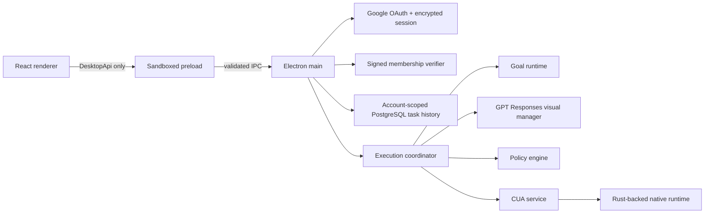

# Architecture

## Decision

TroCode uses Electron Forge, React, and TypeScript for the first desktop product.

CUA publishes a Node/TypeScript SDK backed by its Rust runtime. Hosting it in the Electron main process keeps the CUA native runtime under the same signed desktop identity that owns macOS Accessibility and Screen Recording grants. It also avoids a Python service, a Go service, or a reusable local daemon in the first release.

Crux influenced the separation of pure behavior from side effects, but it is not a dependency. The goal router, lifecycle transitions, and policy decisions remain pure and testable. Electron and CUA perform effects at the edge.

## Process boundary

### Renderer

The renderer owns presentation state. It gates the workspace behind Google
sign-in, a required post-login permission checklist, and production membership,
then can submit a
request, answer a pending clarification, decide an exact approval, queue
steering, cancel a task, subscribe to typed task updates, inspect CUA status,
and initiate permission onboarding. It has no direct system access and never
receives OAuth tokens.

### Preload

The preload exposes a fixed set of task and CUA operations through `contextBridge`. It parses inputs and outputs using shared Zod contracts. Raw `ipcRenderer` is never exposed.

### Main process

The main process verifies the sending `webContents`, enforces a signed-in
session on task, voice, and CUA IPC, and enforces active membership on task and
voice effects in packaged builds. It owns task state, hosts Responses planning,
Realtime transcription, optional ElevenLabs speech, and CUA sessions, serializes
execution, and controls application shutdown. Renderer
navigation and new-window creation are denied. OAuth tokens, the API key, and
raw screenshots remain main-process-only.

Every validated task update is queued to an optional PostgreSQL store under the
verified Google user ID. The latest snapshot is upserted while lifecycle events
are append-only and idempotent. History reads cross a narrow, authenticated IPC
method and are schema-validated again in preload. PostgreSQL credentials remain
main-process runtime configuration and are never exposed to the renderer.

### Membership verifier

After permissions are complete, packaged builds show a user-specific reference
code until a matching activation code is entered. Activation payloads contain
the reference, issue time, and expiry. They are signed offline with an Ed25519
private key held by the administrator and verified in the trusted main process
with the bundled public key. Accepted codes are stored with Electron
`safeStorage`. Development builds bypass membership; production configuration
fails closed. This offline design deliberately has no early-revocation path, so
short validity periods are appropriate until a cloud membership service is
introduced.

### Goal runtime

The current deterministic router establishes the contract before model integration. The runtime also owns task-scoped clarification and approval interactions, rejects stale or replayed responses, and resumes through observation rather than acting directly. A future model-backed compiler may improve classification, but its output must parse as `GoalSpec` and pass the same policy checks.

### Execution coordinator and planner

Starting a reviewed goal creates one `AbortController`, a host-owned planner
session, and one CUA session for that task. The planner sends bounded transcript,
observation, and screenshot input to the Responses API. For static worksheets,
the model returns semantic answer/explanation items once and the host assigns and
advances sequence state; for dynamic UI work, only one action is admitted before
the screen is observed again. Every decision is schema-parsed and policy-checked.
The main window hides before observation and returns
for interactions or terminal states, preventing its own approval UI from
covering the target application during revalidation. The model never receives
a CUA handle and cannot grant approvals or widen scope.

### CUA service

The CUA package is inspected during startup. On macOS, TroCode initializes the
driver automatically only when Accessibility and Screen Recording have already
been granted. After sign-in, a dedicated onboarding gate requests Microphone,
Accessibility, and Screen Recording, reports each grant independently, and
rechecks when the application regains focus. The workspace remains unavailable
until required permissions and the driver are ready. Internal methods
start/end task sessions, capture desktop state, and dispatch typed clicks, text,
keypresses, and scrolling. These methods are never exposed through `DesktopApi`.
Shutdown cancels task loops and ends their sessions before stopping native
admission and destroying the UniFFI handle.

Packaged builds keep a small CUA dependency island under
`app.asar.unpacked/cua-runtime`. CUA resolves its platform-specific `.node` and
shared-library files relative to its ESM entry point, so keeping the complete
island on the real filesystem avoids development-path leaks and ASAR loader
failures. Each macOS or Windows release must be built on its matching target.

## Future backend

The current direct PostgreSQL adapter provides task-trail durability for the
foundation. A production cloud backend should replace direct database access
when TroCode needs credential isolation, retention controls, encrypted task
synchronization, policy synchronization, or billing. It must not operate the
desktop directly; the desktop remains the authority for local approvals and
native actions.
