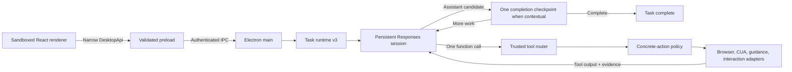

# Architecture

## Decision

TroCode uses Electron Forge, React, TypeScript, one OpenAI Responses agent loop,
and a trusted local tool router. The model receives only model-visible tool
specifications. Electron main owns their internal IDs, parsers, policy metadata,
adapters, cancellation, and budgets.

## Assistant-or-tool loop

A new request synchronously creates a host-owned `TaskContract` v3 containing
the original request, fixed exact-approval policy, tool-call limit, and time
limit. It contains no domain, behavior, capability grant, application allowlist,
or model-authored authority.

One in-memory Responses session receives the user message and the tool specs
currently installed by the registry. `tool_choice` is `auto`, parallel calls are
disabled, and server storage is disabled. A function call is schema-parsed,
normalized to a host-owned internal tool identity, policy-checked, executed once,
and returned to the same session. Model reasoning items that accompany a call are
retained only in this bounded main-process session so the following tool output
has correct continuity.

A self-contained assistant message with no tool or visible-context dependency
ends immediately. If a task used a tool or refers to visible context such as
“this assignment,” the first assistant candidate stays private and triggers one
trusted GPT completion checkpoint in the same session. GPT must compare every
requested outcome with the accumulated evidence and either call the next tool or
return the final answer. This is a completion invariant, not a capability router:
it grants no tool, scope, or approval.

Text-only work never creates a CUA session or a synthetic screenshot. Desktop
observation starts CUA lazily. Coordinate actions must reference the latest
observation ID, are mapped from normalized image coordinates, execute once, and
return a fresh screenshot before another model sample.

## Trust boundaries

- The renderer has no Node integration, raw IPC, CUA handle, API key, OAuth
  token, model response, screenshot bytes, or generic call-tool method.
- Preload and main parse every boundary with shared Zod contracts.
- The registry, not GPT, supplies internal tool ID and operation.
- Policy checks only a concrete normalized action: installed operation, public
  HTTPS target, and fixed host approval list.
- Exact approvals bind target, payload, command, coordinates, observation ID,
  and observation fingerprint. A changed screen invalidates a held desktop
  approval.
- Unknown action outcomes are returned with a fresh observation and their exact
  digest cannot be dispatched again.

## Readiness and permissions

Readiness is split into agent, voice, and desktop concerns. Authenticated users
with a configured model provider can use the text workspace without microphone,
Accessibility, or Screen Recording access. Push-to-talk requests microphone
access when invoked. A desktop observation that lacks OS permission pauses with
a typed Connect computer choice; only the user's click can initiate permission
onboarding or open System Settings.

## Persistence and analytics

PostgreSQL stores validated snapshots and lifecycle events. Persisted v1/v2
contracts remain readable as legacy history; new tasks emit v3 contracts and
tool-call progress. Screenshots, Responses items, pending raw tool arguments,
and reasoning never enter task history.

Analytics receives allowlisted counts and identifiers such as contract version,
phase, tool ID, operation, and transcript character count. It does not receive
task text, voice transcript text, screenshots, URLs, recipients, file paths, or
tool arguments.

## Native execution and packaging

CUA stays in Electron main under the signed application identity that owns
macOS Accessibility and Screen Recording grants. Packaged builds keep the CUA
dependency island under `app.asar.unpacked/cua-runtime` so platform libraries
resolve from a real filesystem. Each macOS or Windows release must be built on
its matching target.

The current PostgreSQL adapter is a desktop-foundation implementation. A future
cloud service may isolate credentials, retention, synchronization, or billing,
but it must not become an authority that bypasses local approvals and native
policy.
