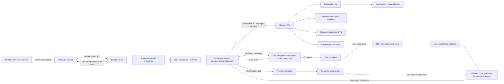

# Architecture

## Decision

TroCode uses Electron Forge, React, TypeScript, one OpenAI Responses agent loop,
and a trusted local tool router. The model receives only model-visible tool
specifications. Electron main owns their internal IDs, parsers, policy metadata,
adapters, cancellation, and budgets.

## Assistant-or-tool loop

A new request reads the local approval preference in trusted Electron main and
creates a host-owned `TaskContract` v5 containing
the original request, fixed exact-approval policy, tool-call limit, and time
limit plus model-sample, image, task-spend ceilings, and immutable approval
mode. It contains no domain,
behavior, capability grant, application allowlist,
or model-authored authority.

One in-memory Responses session receives the user message and the tool specs
currently installed by the registry. `tool_choice` is `auto`, parallel calls are
disabled, and server storage is disabled. A function call is schema-parsed,
normalized to a host-owned internal tool identity, policy-checked, executed once,
and returned to the same session. Model reasoning items that accompany a call are
retained only in this bounded main-process session so the following tool output
has correct continuity.

A self-contained assistant message with no tool or visible-context dependency
ends immediately. If a task refers to visible context or requires
outcome-critical tool verification, the first assistant candidate stays private and triggers one
trusted GPT completion checkpoint in the same session. GPT must compare every
requested outcome with the accumulated evidence and either call the next tool or
return the final answer. This is a completion invariant, not a capability router:
it grants no tool, scope, or approval.

Text-only work never creates a CUA session or a synthetic screenshot. Desktop
observation starts CUA lazily. Coordinate actions must reference the latest
observation ID, are mapped from normalized image coordinates, execute once, and
return a fresh screenshot before another model sample.

Grounded guidance is deliberately paced. Main presents one visible target,
issues a bounded narration handle, dispatches and records the guidance tool
once, then waits for both the minimum dwell and a terminal playback report
before sampling the model again. Back/forward replay uses bounded in-memory
presentation history and never replays the tool call, CUA dispatch, progress, or
task message.

ElevenLabs bytes remain outside the sandboxed renderer. Main issues an
ephemeral `trocode-audio://speech/<UUID>` descriptor; Electron's private
protocol consumes the ticket once and streams a bounded MP3 response. The
renderer can report only fixed playback phases/reasons through validated IPC.
Provider credentials, response bodies, and raw errors never cross that bridge.

## Trust boundaries

- The renderer has no Node integration, raw IPC, CUA handle, API key, OAuth
  token, model response, screenshot bytes, or generic call-tool method.
- Preload and main parse every boundary with shared Zod contracts.
- Playback reports are accepted only from the current guidance window's main
  frame. Private audio URLs contain only a random ticket ID and expire quickly.
- The registry, not GPT, supplies internal tool ID and operation.
- Policy checks only a concrete normalized action: installed operation, public
  HTTPS target, and fixed host approval list. Desktop mutation sensitivity is
  derived from the trusted operation rather than the model's consequence label.
- Ask-mode exact approvals bind target, payload, command, coordinates,
  observation ID, and observation fingerprint. Before dispatch, exact
  fingerprint equality is a fast path; otherwise a deterministic local
  validator compares the target crop, drag path, or whole-screen structural
  signature. Material changes and unavailable evidence fail closed.
- Full mode is explicit host preauthorization for action prompts only. It does
  not bypass availability, target, budget, grounding, cancellation,
  post-action verification, self-approval denial, or unknown-outcome rules.
- Unknown action outcomes are returned with a fresh observation. An unknown
  approved consequence blocks and cleans up the task; safe unknowns retain an
  exact digest that cannot be dispatched again.

## Readiness and permissions

Readiness is split into agent, voice, and desktop concerns. Authenticated users
with a configured model provider can use the text workspace without microphone,
Accessibility, or Screen Recording access. Push-to-talk requests microphone
access when invoked. A desktop observation that lacks OS permission pauses with
a typed Connect computer choice; only the user's click can initiate permission
onboarding or open System Settings.

## Hosted identity and provider access

Google OAuth and nonce verification remain in Electron main. In a production
build, the verified Google ID token is also sent once to the fixed
`TROCODE_API_BASE_URL`. The API independently verifies Google's RS256
signature, issuer, audience, timestamps, and verified-email claim, then returns
a random `tro_live_…` device credential. TroCode stores that credential with
Electron `safeStorage`; the API stores only its HMAC-SHA256 digest in
PostgreSQL. It is an opaque, revocable session—not a Tro JWT.

Responses, Realtime, and optional ElevenLabs requests use the opaque session
over HTTPS. Provider credentials exist only in Railway's runtime environment.
The API authenticates every provider request, applies IP/user rate limits,
restricts models to the configured allowlist, bounds request and response sizes,
and never stores Responses input or output. Native desktop policy and exact
action approvals remain in Electron main; the API does not grant computer-use
authority.

## Persistence and analytics

PostgreSQL stores validated snapshots and lifecycle events. Persisted v1-v4
contracts remain readable as Ask-mode legacy history; new tasks emit v5 contracts and
tool-call progress. Screenshots, Responses items, pending raw tool arguments,
and reasoning never enter task history.

Analytics receives allowlisted counts and identifiers such as contract version,
phase, tool ID, operation, and transcript character count. It does not receive
task text, voice transcript text, screenshots, URLs, recipients, file paths, or
tool arguments.

## Native execution and packaging

CUA stays in Electron main under the signed application identity that owns
macOS Accessibility and Screen Recording grants. Packaged builds keep the CUA
dependency island under `app.asar.unpacked/cua-runtime` so platform libraries
resolve from a real filesystem. Each macOS or Windows release must be built on
its matching target.

The local PostgreSQL task-history adapter remains a development foundation. The
hosted PostgreSQL database stores users, revocable device-session digests, cost
reservations, and sanitized immutable usage events. It does not receive task
history, prompts, model outputs, screenshots, or desktop action payloads.
