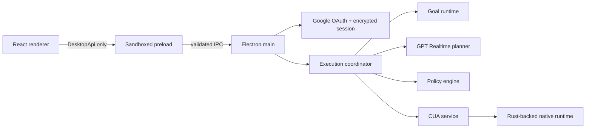

# Architecture

## Decision

TroCode uses Electron Forge, React, and TypeScript for the first desktop product.

CUA publishes a Node/TypeScript SDK backed by its Rust runtime. Hosting it in the Electron main process keeps the CUA native runtime under the same signed desktop identity that owns macOS Accessibility and Screen Recording grants. It also avoids a Python service, a Go service, or a reusable local daemon in the first release.

Crux influenced the separation of pure behavior from side effects, but it is not a dependency. The goal router, lifecycle transitions, and policy decisions remain pure and testable. Electron and CUA perform effects at the edge.

## Process boundary

### Renderer

The renderer owns presentation state. It gates the workspace behind Google
sign-in and a required post-login permission checklist, then can submit a
request, answer a pending clarification, decide an exact approval, queue
steering, cancel a task, subscribe to typed task updates, inspect CUA status,
and initiate permission onboarding. It has no direct system access and never
receives OAuth tokens.

### Preload

The preload exposes a fixed set of task and CUA operations through `contextBridge`. It parses inputs and outputs using shared Zod contracts. Raw `ipcRenderer` is never exposed.

### Main process

The main process verifies the sending `webContents`, enforces a signed-in
session on task, voice, and CUA IPC, owns task state, hosts GPT Realtime and CUA
sessions, serializes execution, and controls application shutdown. Renderer
navigation and new-window creation are denied. OAuth tokens, the API key, and
raw screenshots remain main-process-only.

### Goal runtime

The current deterministic router establishes the contract before model integration. The runtime also owns task-scoped clarification and approval interactions, rejects stale or replayed responses, and resumes through observation rather than acting directly. A future model-backed compiler may improve classification, but its output must parse as `GoalSpec` and pass the same policy checks.

### Execution coordinator and planner

Starting a reviewed goal creates one `AbortController`, one GPT Realtime
WebSocket, and one CUA session for that task. Every turn sends the latest
bounded observation and screenshot to a single function tool. The returned
decision is schema-parsed, policy-checked, and limited to one action before the
screen is observed again. The main window hides before observation and returns
for interactions or terminal states, preventing its own approval UI from
covering the target application during revalidation. The model never receives
a CUA handle and cannot grant approvals or widen scope.

### CUA service

The CUA package is inspected during startup. On macOS, TroCode initializes the
driver automatically only when Accessibility and Screen Recording have already
been granted. After sign-in, a dedicated onboarding gate requests Microphone,
Accessibility, and Screen Recording, reports each grant independently, and
rechecks when the application regains focus. The workspace remains unavailable
until required permissions and the driver are ready. Internal methods
start/end task sessions, capture desktop state, and dispatch typed clicks, text,
keypresses, and scrolling. These methods are never exposed through `DesktopApi`.
Shutdown cancels task loops and ends their sessions before stopping native
admission and destroying the UniFFI handle.

Packaged builds keep a small CUA dependency island under
`app.asar.unpacked/cua-runtime`. CUA resolves its platform-specific `.node` and
shared-library files relative to its ESM entry point, so keeping the complete
island on the real filesystem avoids development-path leaks and ASAR loader
failures. Each macOS or Windows release must be built on its matching target.

## Future backend

A cloud backend is optional and should not operate the desktop directly. It may provide authentication, model-provider credential isolation, policy synchronization, billing, and encrypted task synchronization. The desktop remains the authority for local approvals and native actions.
