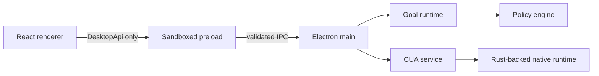

# Architecture

## Decision

TroCode uses Electron Forge, React, and TypeScript for the first desktop product.

CUA publishes a Node/TypeScript SDK backed by its Rust runtime. Hosting it in the Electron main process keeps the CUA native runtime under the same signed desktop identity that owns macOS Accessibility and Screen Recording grants. It also avoids a Python service, a Go service, or a reusable local daemon in the first release.

Crux influenced the separation of pure behavior from side effects, but it is not a dependency. The goal router, lifecycle transitions, and policy decisions remain pure and testable. Electron and CUA perform effects at the edge.

## Process boundary

### Renderer

The renderer owns presentation state. It can submit a request, cancel a task, subscribe to typed task events, inspect CUA status, and initiate permission onboarding. It has no direct system access.

### Preload

The preload exposes exactly five operations through `contextBridge`. It parses inputs and outputs using shared Zod contracts. Raw `ipcRenderer` is never exposed.

### Main process

The main process verifies the sending `webContents`, owns task state, hosts the CUA runtime, and controls application shutdown. Renderer navigation and new-window creation are denied.

### Goal runtime

The current deterministic router establishes the contract before model integration. A future model-backed compiler may improve classification, but its output must parse as `GoalSpec` and pass the same policy checks.

### CUA service

The CUA package is imported during startup. TroCode initializes the driver automatically when operating-system permissions are already granted. Permission prompts occur only after a user chooses **Connect computer** for first-run onboarding. Shutdown first stops native admission, then destroys the UniFFI handle.

Packaged builds keep a small CUA dependency island under
`app.asar.unpacked/cua-runtime`. CUA resolves its platform-specific `.node` and
shared-library files relative to its ESM entry point, so keeping the complete
island on the real filesystem avoids development-path leaks and ASAR loader
failures. Each macOS or Windows release must be built on its matching target.

## Future backend

A cloud backend is optional and should not operate the desktop directly. It may provide authentication, model-provider credential isolation, policy synchronization, billing, and encrypted task synchronization. The desktop remains the authority for local approvals and native actions.
