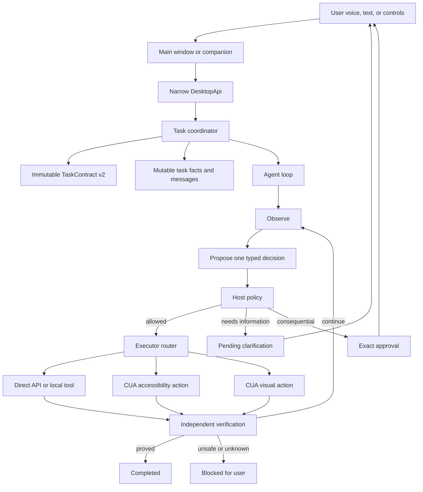

# Conversational task execution

Status: Approved design. The conversational contracts, runtime continuation,
validated IPC, GPT Realtime planning, task-scoped CUA execution, voice/text
routing, and interaction UI are implemented as a bounded vertical slice.
Global companion controls, accessibility-first targeting, direct connectors,
and app-specific independent verifiers remain phased work.

## Product outcome

TroCode should let a user give one goal, allow the agent to work across changing screens, and continue a short conversation inside that same task whenever information or approval is needed.

Example:

```text
User: "Go to Gmail and reply to Alex about tomorrow's meeting."
TroCode: opens Gmail, observes the result, and finds two matching threads
TroCode: "I found two messages from Alex. Which one do you mean?"
User: "The project update."
TroCode: resumes the same task, opens that thread, and drafts a reply
TroCode: shows the exact recipient, subject, and body before Send
User: presses Approve
TroCode: sends once and verifies the outcome
```

This is not a long prerecorded click script. It is a bounded loop that observes after each meaningful action and can pause safely.

## Product principles

1. **One goal, one task conversation.** A spoken answer must continue the active task instead of accidentally creating a new task.
2. **Observe after change.** A click, navigation, dialog, or user takeover invalidates the previous screen state.
3. **Ask only when needed.** The agent should resolve routine, reversible ambiguity itself and interrupt for missing intent, authority, or sensitive data.
4. **Answers and approvals are different.** Free-form speech can supply information or steering. A consequential action requires an exact, explicit approval.
5. **Local control stays visible.** The user can pause or cancel at any time and can see what the agent is doing.
6. **Use the safest executor.** Prefer a direct API when available, then accessibility elements, then visual coordinates as a last resort.
7. **Do not retry uncertain consequences.** If Send may have succeeded but verification is inconclusive, stop and ask the user instead of sending again.

## Current implementation boundary

The current implementation supports:

```text
voice or text -> compile TaskContract v2 -> automatically start when dependencies are ready
  -> start GPT Realtime + CUA task sessions
  -> fresh screenshot -> one typed model decision -> host policy
  -> one admitted action -> fresh screenshot -> verify or continue
```

The first slice uses desktop screenshots and coordinate actions when required.
It does not yet prefer stable accessibility element handles or use a Gmail API.
The main window yields the foreground before each observation and returns for a
question, exact approval, completion, or safe stop, so interacting with TroCode
does not leave its own approval screen covering the Gmail target. A visible
**Stop task** control is available in the window, and **Escape** is registered
by the trusted main process while any task is nonterminal so cancellation still
works when another application has focus.
The cursor companion follows the physical pointer while idle. After policy and
any exact approval admit a coordinate action, it glides to that action target
without moving the real pointer, then returns to pointer-following when TroCode
needs the user. It still has no task-state interaction surface or authority of
its own. Voice capture is attached to the focused renderer, so the existing
shortcut is unavailable while Gmail or another application has focus.

## System shape



The model proposes decisions. It does not call CUA directly, register tools,
approve an action, change host limits, or make a target admissible.

## Task lifecycle

Add `awaiting_input` for information requested after a goal has already been compiled. Keep it distinct from pre-goal `clarifying` and from `awaiting_approval`.

```mermaid
stateDiagram-v2
    [*] --> interpreting
    interpreting --> clarifying: goal is underspecified
    clarifying --> interpreting: user answers
    interpreting --> ready: valid TaskContract
    ready --> planning: dependencies ready; execution starts automatically
    planning --> observing
    observing --> acting: safe action admitted
    acting --> observing: screen may have changed
    observing --> verifying: goal may be complete
    verifying --> planning: route must change
    verifying --> completed: success proved
    planning --> awaiting_input: missing task fact
    observing --> awaiting_input: ambiguity needs user
    acting --> awaiting_input: action cannot continue safely
    awaiting_input --> observing: matching answer received
    planning --> awaiting_approval: exact action needs consent
    acting --> awaiting_approval: exact action needs consent
    awaiting_approval --> observing: approved or denied
    planning --> paused
    observing --> paused
    acting --> paused
    paused --> observing: resume always re-observes
```



`listening`, `speaking`, and `thinking` are presentation states, not task lifecycle phases.

Terminal states remain `completed`, `failed`, and `cancelled`. `blocked` is used when safe progress requires user recovery rather than a normal conversational answer.

## Shared contracts

All renderer, preload, IPC, model, and tool boundaries must parse these structures with shared schemas.

### Pending interaction

```ts
type PendingInteraction =
  | {
      id: string;
      taskId: string;
      kind: 'clarification';
      prompt: string;
      createdAt: string;
      choices?: Array<{ id: string; label: string }>;
    }
  | {
      id: string;
      taskId: string;
      kind: 'approval';
      prompt: string;
      createdAt: string;
      expiresAt: string;
      actionDigest: string;
      action: ProposedAction;
      consequence: string;
    };
```

`TaskSnapshot` gains `pendingInteraction`, a compact message timeline, and execution progress. It must not contain raw screenshots or secrets for presentation convenience.

### User responses

Clarification and approval use different methods and different discriminated unions:

```ts
type RespondToInteractionRequest = {
  taskId: string;
  interactionId: string;
  kind: 'answer';
  text: string;
};

type DecideApprovalRequest = {
  taskId: string;
  interactionId: string;
  kind: 'approval';
  decision: 'approve' | 'deny';
  actionDigest: string;
};
```

Steering is also separate:

```ts
type SteerTaskRequest = {
  taskId: string;
  instruction: string;
};
```

This prevents phrases such as "yes," "looks good," or a speech-recognition mistake from silently approving Send.

### Agent decisions

Each model turn returns one parsed decision, not arbitrary commands:

```ts
type AgentDecision =
  | { kind: 'action'; observationId: string; command: DesktopCommand; intent: string }
  | { kind: 'ask_user'; prompt: string; choices?: string[] }
  | { kind: 'complete'; summary: string }
  | { kind: 'blocked'; reason: string };
```

## Goal revisions and task facts

The compiled `TaskContract` remains immutable for one execution revision. Conversational answers normally update a separate `TaskFacts` record, such as the selected Gmail thread or the reply wording.

If steering changes the objective, grants a new capability, adds an application or domain, changes a recipient, or widens the consequence, the coordinator must:

1. stop before the next action;
2. compile a new immutable goal revision;
3. show the changed scope to the user; and
4. require review before execution resumes.

The agent may narrow its work without widening authority.

## Coordinator and mailbox

One main-process `TaskCoordinator` owns each running task:

- one serialized execution loop;
- one `AbortController`;
- one task-scoped mailbox for answers, approvals, steering, pause, and cancel;
- the immutable goal revision;
- compact facts, budgets, and the latest trusted observation;
- at most one pending interaction.

The coordinator processes input only at safe boundaries. Cancellation interrupts observations and cancellable actions immediately. Steering received during an atomic action is queued until the action returns, then forces a fresh observation.

When the coordinator requests input:

1. transition to `awaiting_input`;
2. publish a typed `PendingInteraction`;
3. stop admitting actions;
4. accept only a response with the matching task and interaction IDs;
5. invalidate the interaction after one response; and
6. transition to `observing`, never directly to `acting`.

Wrong, stale, duplicate, and replayed responses are rejected at the IPC boundary and recorded as safe task events.

## Observe-act-verify loop

One loop iteration is:

```text
check cancellation, steering, limits, and pending interactions
  -> capture the target application's current state
  -> summarize the state into a bounded observation
  -> ask for one typed decision when deterministic logic is insufficient
  -> validate the registered tool operation, target, and approval policy
  -> execute at most one admitted action or atomic action group
  -> capture fresh state
  -> verify the action and the overall goal
  -> continue, ask, block, fail, or complete
```

An action target should use a stable accessibility element reference when possible. Coordinates are valid only for the observation that produced them. If the window, layout, focus, or element state changes, the action is stale and must be replanned.

The execution router chooses, in order:

1. authenticated direct API or connector;
2. local file or terminal tool;
3. accessibility-element CUA action;
4. cropped visual observation plus pixel action.

For Gmail, an authenticated mail API is more reliable and cheaper than clicking. If the user explicitly wants visible browser operation or no connector is available, the same task can use CUA without changing its goal or approval rules.

## Approval safety

An approval authorizes exactly one normalized action payload. Its digest covers the action type and every consequential field, including the Gmail account, recipients, subject, body, attachments, and thread identifier.

Approval rules:

- show the full human-readable consequence before approval;
- require a button or equivalent secure UI gesture by default;
- never let ordinary dictated text approve an external consequence;
- expire approval after a timeout, task revision, screen mismatch, or payload change;
- consume approval once before dispatching the action;
- observe and verify after dispatch;
- if dispatch completion is unknown, block and do not retry automatically.

A later accessibility setting may allow an explicit voice approval phrase plus a second confirmation, but it should not be the default.

## Voice and companion experience

### Input routing

```text
No active task                 -> create a new goal
Task awaiting clarification   -> answer that interaction
Task running                   -> queue steering for the next safe boundary
Task awaiting approval        -> dictate edits or choose deny; approval still uses secure UI
Task completed or cancelled   -> create a new goal
```

The **Command + Control** hold-to-talk shortcut works both inside TroCode and
system-wide on macOS. A small bundled native helper observes the combined
session modifier state and forwards only press/release transitions to the
trusted Electron main process. Windows uses **Ctrl + Alt + Space** as its
system-wide hold shortcut.

Voice capture is never continuously open. The UI shows an unmistakable listening state, live transcript, stop control, and typed fallback. Transcription is abstracted behind a provider interface so the current browser recognition implementation can later be replaced without changing task contracts.

### Companion states

The companion becomes a status and interaction surface with a restricted preload, not a second privileged renderer:

```text
idle -> working -> needs_input -> listening -> working
                     |
                     -> awaiting_approval
                     -> error or blocked
```

It may show a concise caption, repeat/mute control, open-main-window control, and always-visible Stop action. It must not receive raw Electron IPC, raw CUA handles, screenshots, or the full `DesktopApi`.

Local text-to-speech can read concise questions without another model call. Sensitive email bodies, addresses, or document contents are not spoken aloud unless the user enables that behavior.

## Cost and latency controls

The system does not analyze a video stream. It observes after meaningful changes and when verification requires it.

- Prefer accessibility trees and structured API results over full screenshots.
- Crop screenshots to the target window or changed region.
- Keep a compact `TaskFacts` summary and the latest trusted observation instead of replaying the full trajectory.
- Truncate large tool output before it reaches the model.
- Use deterministic handlers for stable actions and validation.
- Batch only actions that are atomic, reversible, and safe without an intervening observation.
- Route routine decisions to a smaller model and escalate ambiguity or high-risk verification.
- Enforce per-goal `maxSteps` and `maxMinutes`; later add optional model-call, token, and spend budgets.
- Compact the task context before it approaches the model context limit.

## Restart and failure behavior

- Persist enough task metadata to explain an interrupted task, but do not automatically resume an in-flight consequential action.
- On restart, invalidate all approvals and accessibility element references.
- A task interrupted during a reversible observation or planning step may be offered for manual resume, beginning with a new observation.
- A task interrupted while an action outcome is unknown becomes `blocked` until the user confirms the external state.
- If voice recognition is unavailable, preserve typed interaction and all task controls.
- If CUA disconnects, keep the task and conversation intact, block action admission, and offer reconnection or a safer direct executor.

## Desktop API additions

Keep the preload narrow and schema-validated. The first additions should be:

```ts
startTask(request)
respondToInteraction(request)
decideApproval(request)
steerTask(request)
pauseTask(request)
resumeTask(request)
cancelTask(request)
subscribeToTaskEvents(listener)
```

Companion-window IPC should be a smaller, separate surface for presentation state, requesting microphone activation, opening the main window, and stopping the active task.

CUA remains main-process-only. Internal `CuaService` methods should cover session start/end, bounded observation, typed actions, and verification. They must never be forwarded directly to the renderer.

## Delivery plan

### Phase 1: conversational vertical slice

- Add shared pending-interaction, response, approval, steering, and event schemas.
- Add `awaiting_input` and pure lifecycle transitions.
- Add a serialized coordinator/mailbox using a simulated executor.
- Route voice and text to the active pending interaction.
- Render a task conversation and clarification card.
- Prove cancel, stale-response rejection, and safe resume with tests.

This phase makes the conversation model real without granting desktop action authority.

### Phase 2: global companion controls

- Publish task presentation state to the companion through restricted IPC.
- Add captions, local text-to-speech, mute/repeat, and Stop.
- Add the configurable global hold-to-talk shortcut and typed fallback.
- Test focus changes, microphone denial, shortcut collision, and accessibility.

### Phase 3: agent and policy loop — implemented vertical slice

- Add the model-provider interface, structured decision schema, bounded context manager, and tool router.
- Add exact single-use approval digests and approval UI.
- Queue steering at safe boundaries; immutable goal revisions for scope-changing
  steering remain a hardening step.
- Run deterministic simulations before connecting native actions.

### Phase 4: CUA execution — implemented vertical slice

- Add session, observation, action, and verification adapters behind `CuaService`.
- Prefer accessibility targets and detect stale observations. (Next hardening step.)
- Add Gmail end-to-end evaluations, including ambiguous threads and unknown Send completion.
- Enable actions gradually by capability and application allowlist.

## Acceptance criteria

The design is ready for broad use only when tests prove:

1. A spoken answer continues the same task and cannot create an accidental second task.
2. No action is emitted while a task awaits input or approval.
3. Wrong, stale, duplicate, and replayed interaction IDs are rejected.
4. Approval is bound to the exact action and is consumed once.
5. Pause, steering, user takeover, and resume always cause a fresh observation.
6. Cancellation unblocks pending model, voice, observation, and interaction waits.
7. Scope-widening steering creates a reviewed goal revision.
8. Voice unavailability always has a typed and keyboard-accessible fallback.
9. A consequential action with unknown completion is never retried automatically.
10. Restart cannot replay a pending approval or in-flight action.
11. The global talk control works while another application has focus.
12. Screenshot and message content do not leak into analytics or ordinary logs.

## Recommended product defaults

- Automatic execution begins as soon as the compiled goal and execution
  dependencies are ready; **Stop task** and **Escape** remain available.
- Clarifications can be answered by voice or text.
- Consequential approvals use a visible button, not casual speech.
- The companion speaks only short status and clarification prompts.
- The agent observes after every navigation, click, submit, or focus change.
- Direct integrations are preferred, while visible CUA remains available when needed.
- The global microphone shortcut is hold-to-talk, never always-on listening.
