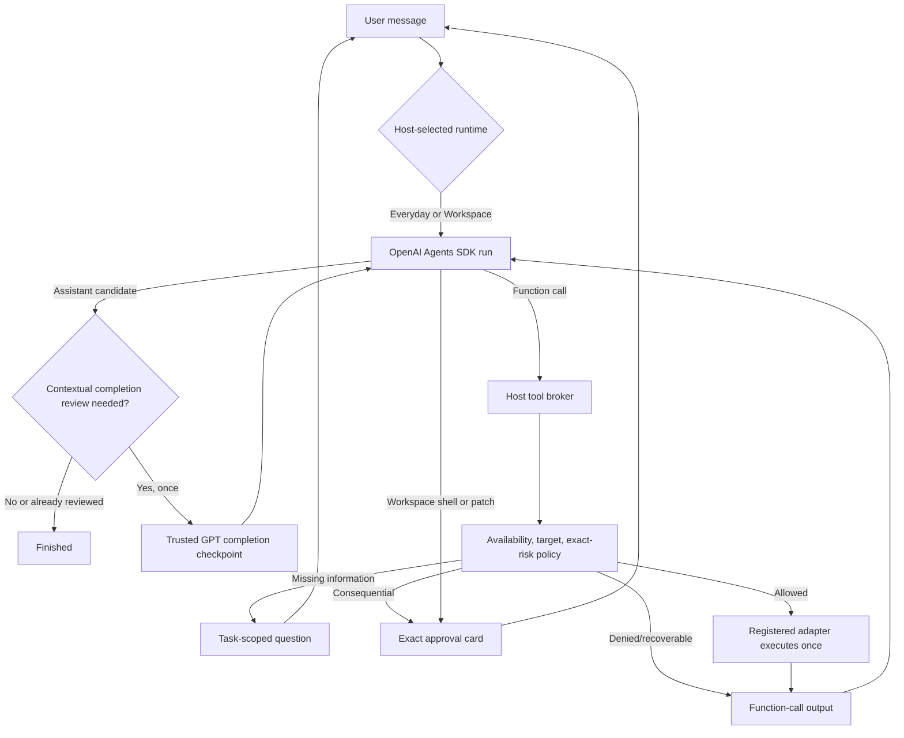

# Conversational task execution

TroCode keeps one bounded runtime conversation for each task. A user request is
not precompiled into answer/guide/act modes. Everyday and explicitly selected
Workspace tasks are OpenAI Agents SDK runs authenticated through the TroCode
backend. Tool results, clarification answers, approval decisions, and steering
continue the same run.

## Core loop

`show_guidance` adds one user-controlled pacing boundary to this loop. The host
shows and narrates one grounded target, appends the tool output exactly once,
then holds the next model sample until narration and the dwell interval finish
or the user presses Next. Back replays earlier saved presentations without a
model call or new task event. Pause stops both active audio and auto-advance.
The global controls are Command/Control+Alt+J/K/L and exist only during this
wait.

There is no special complete function. Self-contained math, explanations,
translation, writing, code, lyrics, chords, and plans can finish with zero tool
calls, zero reviews, and zero CUA starts.

For a task that used a tool or refers to visible context, the first assistant
message is a private completion candidate. TroCode inserts one trusted developer
checkpoint into the same Responses session. The checkpoint requires GPT to
re-read the original request as a checklist and either continue calling tools or
return the final answer. Navigation alone is not evidence that reading or editing
inside a destination happened, and an inbox row or preview is not evidence that
the full email was opened and read. The host performs at most one such review per
task so a faulty model cannot create an unbounded self-review loop.

## Clarification and steering

`request_user_input` creates an `awaiting_input` interaction bound to the active
runtime request. The user's answer becomes exactly one response, then the same
run or turn continues. Everyday steering is queued until the next safe model
boundary. Neither profile mutates an already dispatched atomic action.

## Exact approval

Send, submit, upload, download, delete, purchase, install, login, permission
changes, command execution, and file writes pause at a concrete escalation
boundary. Under the default Balanced preference, routine grounded clicks,
drags, text entry, keypresses, and scrolling continue automatically. Host-visible
sensitive cues can only raise risk. Strict mode also confirms routine desktop
mutations. The UI shows target, description, and exact bounded parameters. Typed
or spoken “yes” is not approval. A desktop grant is single-use, expires, and
matches a digest of tool, operation, consequence, target, payload, command,
coordinates, and desktop observation evidence.

Approval denial is returned to GPT as a denied tool output so the assistant can
continue usefully. For desktop work, approval is followed by a fresh screen
check; changed state invalidates the action instead of guessing.

Workspace command and patch responses are one-request decisions. Their approval
digest includes the bounded commands or diff, target, operation, and declared
consequence; there is no session-wide approval. Patch paths must remain within
the selected canonical root, and the command subprocess receives no provider
or TroCode secrets.

## Optional tools and permissions

Text input requires only auth, membership, language setup, and an agent
credential. Microphone and desktop permissions are independent. Push-to-talk
requests microphone access when used. Missing CUA permission pauses the held
observation with Connect computer and Continue without computer choices; only a
user click starts the OS permission flow.

The shared catalog contains desktop observation/control, public HTTPS
navigation, grounded visual guidance, and task interaction. Workspace adds
SDK shell and patch tools only for an explicitly selected folder. Future email,
calendar, image, audio, and music providers register a model
specification, strict parser, trusted internal identity, policy metadata, and
executor. Until such a provider exists, GPT must explain the limitation rather
than claim an artifact was generated.

## Evidence and privacy

Every desktop action is followed by a fresh screenshot before the next model
boundary. Screenshots and runtime items stay in bounded main-process memory and
are erased on cleanup. The renderer receives only coalesced text deltas and
bounded status/tool/plan summaries; raw reasoning, tool arguments, command
output, and diffs are dropped. Partial deltas do not enter task history or
analytics. Unknown effects are reported honestly and their exact action digest
cannot execute again.

The Agents SDK adapter uses one configured model without a classifier or fallback
call and applies a 4,000-token output cap. Each hosted sample reserves
server-priced micro-USD before dispatch and settles provider usage afterward.
Typed and finalized voice transcripts enter this same task path, so voice does
not create a second reasoning call.
