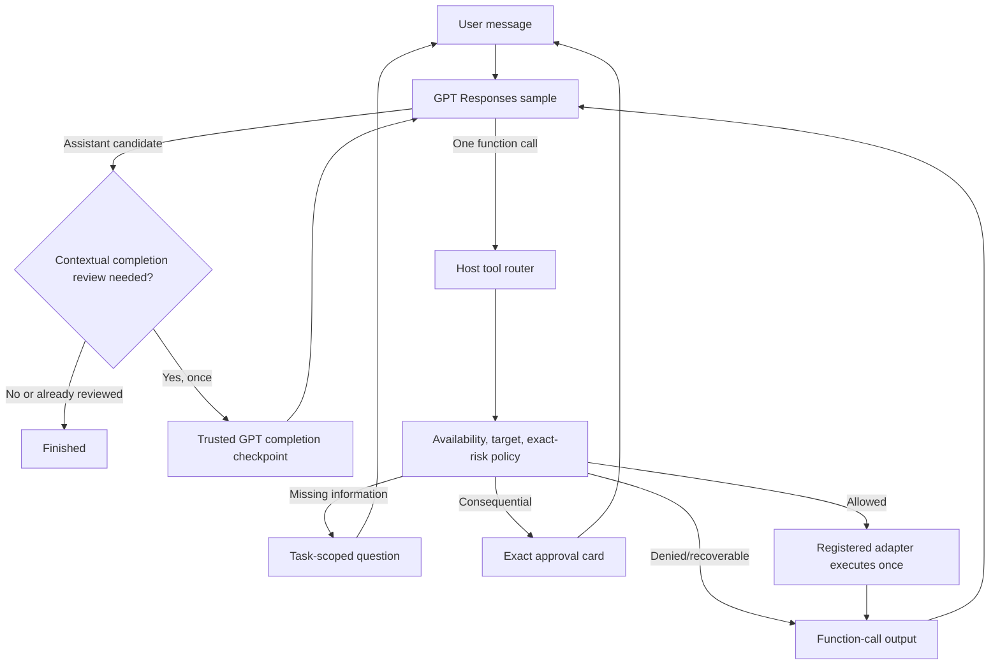

# Conversational task execution

TroCode keeps one bounded GPT conversation for each task. A user request is not
precompiled into answer/guide/act modes. The model can answer normally or call
one concrete host-advertised tool; a tool result, clarification answer,
approval decision, or steering message returns to the same session.

## Core loop

There is no special complete function. Self-contained math, explanations,
translation, writing, code, lyrics, chords, and plans can finish with zero tool
calls, zero reviews, and zero CUA starts.

For a task that used a tool or refers to visible context, the first assistant
message is a private completion candidate. TroCode inserts one trusted developer
checkpoint into the same Responses session. The checkpoint requires GPT to
re-read the original request as a checklist and either continue calling tools or
return the final answer. Navigation alone is not evidence that reading or editing
inside a destination happened, and an inbox row or preview is not evidence that
the full email was opened and read. The host performs at most one such review per
task so a faulty model cannot create an unbounded self-review loop.

## Clarification and steering

`request_user_input` creates an `awaiting_input` interaction bound to the model
function call ID. The user's answer becomes exactly one output for that call,
then sampling continues. Steering is queued until a safe boundary, appended as
a user message, and never interrupts an already dispatched atomic action.

## Exact approval

Send, submit, upload, download, delete, purchase, install, login, command
execution, and file writes always pause immediately before the concrete action.
Desktop clicks, drags, text entry, and keypresses also pause because the trusted
host cannot infer a control's real-world effect from a model-provided label.
The UI shows target, description, and exact bounded parameters. Typed or spoken
“yes” is not approval. A grant is single-use, expires, and matches a digest of
tool, operation, consequence, target, payload, command, coordinates, and desktop
observation evidence.

Approval denial is returned to GPT as a denied tool output so the assistant can
continue usefully. For desktop work, approval is followed by a fresh screen
check; changed state invalidates the action instead of guessing.

## Optional tools and permissions

Text input requires only auth, membership, language setup, and an agent
credential. Microphone and desktop permissions are independent. Push-to-talk
requests microphone access when used. Missing CUA permission pauses the held
observation with Connect computer and Continue without computer choices; only a
user click starts the OS permission flow.

The initial catalog contains desktop observation/control, public HTTPS
navigation, grounded visual guidance, and task interaction. Future filesystem,
terminal, email, calendar, image, audio, and music providers register a model
specification, strict parser, trusted internal identity, policy metadata, and
executor. Until such a provider exists, GPT must explain the limitation rather
than claim an artifact was generated.

## Evidence and privacy

Every desktop action is followed by a fresh screenshot before the next sample.
Screenshots and Responses items stay in bounded main-process memory and are
erased on cleanup. They are not sent through renderer IPC, task history, or
analytics. Unknown effects are reported honestly and their exact action digest
cannot execute again.
