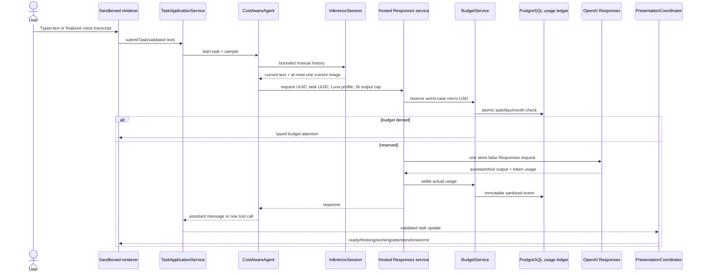
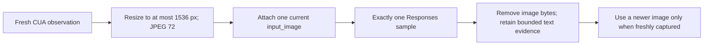

# Inference cost lifecycle

TroCode uses an object-oriented application shell with pure cost and lifecycle
policies. The desktop decides what it needs to ask; the hosted API is the only
authority that can price, reserve, dispatch, and settle a paid production call.

## Text to model to screen

Typed input and voice use the same task path. Voice is transcription only; it
does not ask a second reasoning model to reinterpret the transcript.

## Screen evidence lifecycle

Coordinates remain normalized and are mapped through the host's original
coordinate space. Resizing evidence does not change desktop authority.

## Why this costs less

| Cost driver | Previous TroCode path | Cost-aware path |
|---|---|---|
| Model | Luna, then broad Terra fallback | Luna default; Terra only named before dispatch |
| Output | 8,000 tokens every sample | 2,000 normal/visual; 4,000 long/quality only |
| Screenshots | Historical original images replayed | One resized current image, used once |
| Context | Up to 256 items/25 MB | 128 request items, 12 MB memory, image demotion |
| Completion review | Every tool task | Visible or outcome-critical tasks only |
| Ambiguous failure | Could issue a dearer second request | Reservation retained; no retry/fallback |
| Quota | Request counts only | Atomic $0.50 task, $2/day, $20/month defaults |

OpenClicky-style presentation evolves from a compact state projection while the
agent works, but presentation never becomes model context and never triggers a
model call. This preserves the useful visible lifecycle without paying an LLM
to choose windows or animation states.

## Reservation and settlement

Money is stored as integer micro-USD. Prices are versioned on every usage event.
A paid call must have a reservation before dispatch. Successful Responses calls
settle provider-reported input, cached input, cache-write, and output tokens.
Reasoning tokens are output detail and are never charged twice.

An explicit provider rejection before inference releases its reservation. A
timeout, connection loss after dispatch, 5xx, oversized response, malformed
success, or missing usage is `uncertain`: the conservative reservation remains
committed and the desktop does not resend it automatically.

Realtime transcription creation is labeled estimated because the current
WebRTC path does not return authoritative duration usage to the API. ElevenLabs
speech settles from actual character count. UI copy separates settled spend
from reserved or estimated spend.

## Rollout and privacy

`TROCODE_COST_GUARD_MODE=observe` persists usage and records would-deny facts
without blocking. Switch to `enforce` only after comparing ledger totals to
provider billing. `TROCODE_PAID_CALLS_ENABLED=false` is the kill switch. Rate
limits remain abuse protection; they are not spend quotas.

Run `npm run cost:report` for content-free fixture comparisons. Never put
prompts, outputs, screenshots, URLs, recipients, tool arguments, provider keys,
or reasoning text in cost fixtures, usage tables, or logs.
